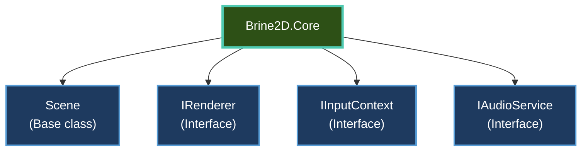

---
title: API Reference
description: Complete API documentation for all Brine2D packages
---

# API Reference

Complete API documentation for all Brine2D packages. Browse classes, interfaces, and methods organized by namespace.

---

## Package Overview

Brine2D is split into multiple packages for modularity:

| Package | Purpose | NuGet |
|---------|---------|-------|
| **[Brine2D.Core](core.md)** | Core abstractions and interfaces | [](https://www.nuget.org/packages/Brine2D/) |
| **[Brine2D.Engine](engine.md)** | Game loop and scene management | *Included in Brine2D* |
| **[Brine2D.SDL](../rendering/gpu-renderer.md)** | SDL3 rendering, input, audio | [](https://www.nuget.org/packages/Brine2D.SDL/) |
| **[Brine2D.ECS](ecs.md)** | Entity Component System | *Included in Brine2D* |

---

## Quick Links

### Most Used APIs

| API | Description | Package |
|-----|-------------|---------|
| **[Scene](core.md#scene)** | Base class for game scenes | Brine2D.Core |
| **[IRenderer](rendering.md#irenderer)** | Drawing and rendering | Brine2D.Core |
| **[IInputContext](input.md#iinputcontext)** | Input handling | Brine2D.Core |
| **[IAudioService](audio.md#iaudioservice)** | Sound and music | Brine2D.Core |
| **[IEntityWorld](ecs.md#ientityworld)** | Entity management | Brine2D.ECS |
| **[Entity](ecs.md#entity)** | Game object | Brine2D.ECS |
| **[Component](ecs.md#component)** | Component base class | Brine2D.ECS |

---

## Browse by Package

### [Brine2D.Core](core.md)

Core abstractions and base classes:



**Key namespaces:**
- `Brine2D.Core` - Scene, GameTime, Color
- `Brine2D.Rendering` - IRenderer, ITexture
- `Brine2D.Input` - IInputContext, Key, MouseButton
- `Brine2D.Audio` - IAudioService, ISoundEffect, IMusic

[:octicons-arrow-right-24: Browse Brine2D.Core API](core.md)

---

### [Brine2D.Engine](engine.md)

Game loop and scene management:

**Key classes:**
- `GameApplication` - Application entry point
- `GameApplicationBuilder` - Configuration builder
- `SceneManager` - Scene lifecycle management
- `GameTime` - Frame timing information

[:octicons-arrow-right-24: Browse Brine2D.Engine API](engine.md)

---

### [Brine2D.Rendering](rendering.md)

Rendering implementations and types:

**Key classes:**
- `SDL3GPURenderer` - GPU-accelerated renderer
- `SDL3Renderer` - Legacy SDL renderer
- `Texture` - Texture implementation
- `Camera2D` - 2D camera

[:octicons-arrow-right-24: Browse Brine2D.Rendering API](rendering.md)

---

### [Brine2D.Input](input.md)

Input handling:

**Key enums:**
- `Key` - Keyboard keys
- `MouseButton` - Mouse buttons
- `GamepadButton` - Gamepad buttons
- `GamepadAxis` - Gamepad analog axes

[:octicons-arrow-right-24: Browse Brine2D.Input API](input.md)

---

### [Brine2D.Audio](audio.md)

Audio playback:

**Key interfaces:**
- `IAudioService` - Audio manager
- `ISoundEffect` - Short sound
- `IMusic` - Long audio (streaming)

[:octicons-arrow-right-24: Browse Brine2D.Audio API](audio.md)

---

### [Brine2D.ECS](ecs.md)

Entity Component System:

**Key classes:**
- `IEntityWorld` - Entity container
- `Entity` - Game object
- `Component` - Component base
- `GameSystem` - System base (optional)

[:octicons-arrow-right-24: Browse Brine2D.ECS API](ecs.md)

---

## Common Patterns

### Scene Lifecycle

```csharp
public class GameScene : Scene
{
    // 1. Constructor - inject YOUR services
    public GameScene(IInputContext input, IAudioService audio)
    {
        // Framework properties NOT available yet
    }
    
    // 2. OnInitializeAsync - early setup
    protected override Task OnInitializeAsync(CancellationToken ct)
    {
        // Framework properties available: Logger, World, Renderer
        return Task.CompletedTask;
    }
    
    // 3. OnLoadAsync - load assets
    protected override async Task OnLoadAsync(CancellationToken ct)
    {
        _texture = await _assets.GetOrLoadTextureAsync("sprite.png", ct);
        return Task.CompletedTask;
    }
    
    // 4. OnUpdate - game logic
    protected override void OnUpdate(GameTime gameTime)
    {
        // Update game state
    }
    
    // 5. OnRender - drawing
    protected override void OnRender(GameTime gameTime)
    {
        // Draw sprites
    }
    
    // 6. OnUnloadAsync - cleanup
    protected override Task OnUnloadAsync(CancellationToken ct)
    {
        // Stop audio, release resources
        return Task.CompletedTask;
    }
}
```

[:octicons-arrow-right-24: Full API: Scene](core.md#scene)

---

### Rendering

```csharp
// Access via framework property (no injection!)
protected override void OnRender(GameTime gameTime)
{
    // Clear screen
    Renderer.ClearColor = Color.Black;
    
    // Draw texture
    Renderer.DrawTexture(_texture, x: 100, y: 100, width: 64, height: 64);
    
    // Draw shapes
    Renderer.DrawRectangleFilled(200, 200, 50, 50, Color.Red);
    Renderer.DrawCircle(300, 300, 25, Color.Blue);
    
    // Draw text
    Renderer.DrawText("Score: 100", 10, 10, Color.White);
}
```

[:octicons-arrow-right-24: Full API: IRenderer](rendering.md#irenderer)

---

### Input Handling

```csharp
// Inject IInputContext
public GameScene(IInputContext input)
{
    _input = input;
}

protected override void OnUpdate(GameTime gameTime)
{
    // Keyboard
    if (_input.IsKeyDown(Key.W)) { }
    if (_input.IsKeyPressed(Key.Space)) { }
    
    // Mouse
    var mouseX = _input.MouseX;
    var mouseY = _input.MouseY;
    if (_input.IsMouseButtonPressed(MouseButton.Left)) { }
    
    // Gamepad
    if (_input.IsGamepadButtonDown(0, GamepadButton.A)) { }
    float leftX = _input.GetGamepadAxis(0, GamepadAxis.LeftX);
}
```

[:octicons-arrow-right-24: Full API: IInputContext](input.md#iinputcontext)

---

### Entity Component System

```csharp
// Access via framework property (no injection!)
protected override Task OnLoadAsync(CancellationToken ct)
{
    // Create entity
    var player = World.CreateEntity("Player");
    
    // Add components
    var health = player.AddComponent<HealthComponent>();
    health.Current = 100;
    health.Max = 100;
    
    var transform = player.AddComponent<TransformComponent>();
    transform.Position = new Vector2(400, 300);
    
    return Task.CompletedTask;
}

// Query entities
var entities = World.Query<HealthComponent>().Execute();
foreach (var entity in entities)
{
    var health = entity.GetComponent<HealthComponent>();
}
```

[:octicons-arrow-right-24: Full API: IEntityWorld](ecs.md#ientityworld)

---

## Conventions

### Naming

| Type | Convention | Example |
|------|-----------|---------|
| **Interface** | `I` prefix | `IRenderer`, `IInputContext` |
| **Abstract class** | No prefix | `Scene`, `Component` |
| **Event** | `Event` suffix | `WindowResizedEvent` |
| **Component** | `Component` suffix | `HealthComponent`, `TransformComponent` |
| **System** | `System` suffix | `MovementSystem`, `RenderSystem` |

---

### Async Methods

All async methods follow .NET conventions:

```csharp
// Methods ending in Async return Task
Task OnLoadAsync(CancellationToken ct);
Task<ITexture> GetOrLoadTextureAsync(string path, TextureScaleMode scaleMode, CancellationToken ct);

// Accept CancellationToken as last parameter
Task DoWorkAsync(string param1, int param2, CancellationToken ct);
```

---

### Framework Properties

Three properties are set automatically by the framework:

| Property | Type | Available After |
|----------|------|-----------------|
| `Logger` | `ILogger` | Constructor |
| `World` | `IEntityWorld` | Constructor |
| `Renderer` | `IRenderer` | Constructor |

**Don't inject these** - they're provided by the framework.

---

## Version Compatibility

### v0.9.0 (Current)

**Breaking changes from v0.8.0:**

1. **Audio API:**
   - `PlaySound()` returns `nint` (was `int`)
   - `StopChannel()` → `StopTrack()`

2. **Package structure:**
   - Split into `Brine2D` + `Brine2D.SDL`
   - Namespace changes for implementations

[:octicons-arrow-right-24: Full changelog: v0.9.0](../whats-new/v0.9.0-beta.md)

---

## Generate API Docs

### Using DocFX

```bash
# Install DocFX
dotnet tool install -g docfx

# Generate XML documentation
dotnet build /p:GenerateDocumentationFile=true

# Create docfx.json
docfx init

# Build docs
docfx build
```

---

### Using xmldoc2md

```bash
# Install xmldoc2md
dotnet tool install -g xmldoc2md

# Generate markdown docs
xmldoc2md Brine2D.dll --output docs/api
```

---

## Related Resources

### Guides

- [Get Started](../getting-started/index.md) - Quick start guide
- [Tutorials](../tutorials/index.md) - Step-by-step tutorials
- [Fundamentals](../fundamentals/index.md) - Deep dive into architecture
- [Samples](../samples/index.md) - Working examples

### External

- [.NET API Browser](https://learn.microsoft.com/en-us/dotnet/api/) - .NET base class library
- [SDL3 Documentation](https://wiki.libsdl.org/SDL3/) - SDL3 API reference

---

## Contributing

Help improve the API documentation:

- 📝 [Report missing docs](https://github.com/CrazyPickleStudios/Brine2D/issues/new?labels=documentation)
- 🤝 [Submit corrections](https://github.com/CrazyPickleStudios/Brine2D/pulls)
- 💡 [Request examples](https://github.com/CrazyPickleStudios/Brine2D/discussions)

---

**Browse API by package:**

| Package | Link |
|---------|------|
| Brine2D.Core | [View API →](core.md) |
| Brine2D.Engine | [View API →](engine.md) |
| Brine2D.Rendering | [View API →](rendering.md) |
| Brine2D.Input | [View API →](input.md) |
| Brine2D.Audio | [View API →](audio.md) |
| Brine2D.ECS | [View API →](ecs.md) |