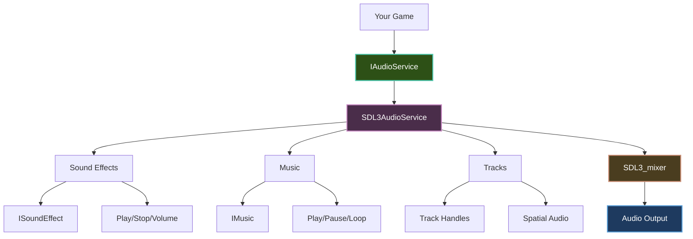
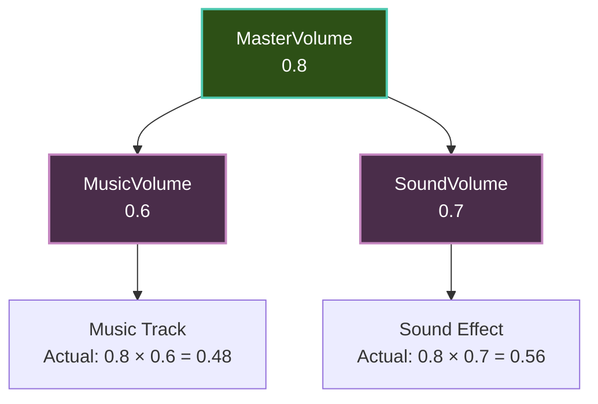

---
title: Audio Getting Started
description: Get started with audio in Brine2D - sound effects, music, and audio management
---

# Audio Getting Started

Learn how to add sound effects, music, and audio to your Brine2D games.

## Overview

Brine2D's audio system provides:

- **Sound Effects** - Short audio clips (explosions, jumps, shots)
- **Music** - Long-form background audio (looping tracks)
- **Volume Control** - Master, music, and sound volumes
- **Track Management** - Control individual playing sounds
- **Spatial Audio** - Stereo panning and positional sound

**Powered by:** SDL3_mixer (high-quality audio mixing)

**Supported formats:**
- WAV, MP3, OGG, FLAC (sound effects)
- MP3, OGG (music streaming)

---

## Audio Architecture



---

## Setup

### Step 1: Register Audio Service

In `Program.cs`:

```csharp
using Brine2D.Hosting;
using Brine2D.SDL;
using Microsoft.Extensions.DependencyInjection;

var builder = GameApplication.CreateBuilder(args);

// Typical approach - AddBrine2D includes audio automatically!
builder.Services.AddBrine2D(options =>
{
    options.Window.Title = "Audio Demo";
    options.Window.Width = 800;
    options.Window.Height = 600;
});
// Audio is already registered - no need for AddSDL3Audio()!

builder.AddScene<GameScene>();

var game = builder.Build();
await game.RunAsync<GameScene>();
```

**Note:** `AddBrine2D()` includes audio by default. Only register audio separately (`AddSDL3Audio()`) when using the power user approach with granular service registration.

---

### Step 2: Inject Audio Service

In your scene:

```csharp
using Brine2D.Audio;
using Brine2D.Core;
using Brine2D.Engine;
using Microsoft.Extensions.Logging;

public class GameScene : Scene
{
    private readonly IAudioService _audio;
    
    public GameScene(
        IAudioService audio,
        ILogger<GameScene> logger)
    {
        _audio = audio;
    }
}
```

---

## Loading Audio

### Load Sound Effects

Sound effects are short audio clips:

```csharp
using Brine2D.Audio;

public class GameScene : Scene
{
    private readonly IAudioService _audio;
    
    private ISoundEffect? _jumpSound;
    private ISoundEffect? _shootSound;
    private ISoundEffect? _explosionSound;
    
    protected override async Task OnLoadAsync(CancellationToken cancellationToken)
    {
        // Load sound effects
        _jumpSound = await _audio.LoadSoundAsync(
            "assets/sounds/jump.wav", 
            cancellationToken);
        
        _shootSound = await _audio.LoadSoundAsync(
            "assets/sounds/shoot.wav", 
            cancellationToken);
        
        _explosionSound = await _audio.LoadSoundAsync(
            "assets/sounds/explosion.wav", 
            cancellationToken);
        
        Logger.LogInformation("Sound effects loaded");
    }
}
```

**When to use:**
- Short duration (< 5 seconds)
- Played frequently (jumps, shots, hits)
- May play simultaneously
- Loaded entirely into memory

---

### Load Music

Music is for long-form audio:

```csharp
public class GameScene : Scene
{
    private readonly IAudioService _audio;
    
    private IMusic? _backgroundMusic;
    private IMusic? _bossMusic;
    
    protected override async Task OnLoadAsync(CancellationToken cancellationToken)
    {
        // Load music
        _backgroundMusic = await _audio.LoadMusicAsync(
            "assets/music/background.mp3", 
            cancellationToken);
        
        _bossMusic = await _audio.LoadMusicAsync(
            "assets/music/boss.ogg", 
            cancellationToken);
        
        Logger.LogInformation("Music loaded");
    }
}
```

**When to use:**
- Long duration (> 30 seconds)
- Background music
- Only one music track plays at a time
- Streamed from disk (low memory)

---

## Playing Audio

### Play Sound Effects

Simple playback (fire-and-forget):

```csharp
protected override void OnUpdate(GameTime gameTime)
{
    // Play sound on jump
    if (_input.IsKeyPressed(Key.Space))
    {
        _audio.PlaySound(_jumpSound);
    }
    
    // Play sound on shoot
    if (_input.IsKeyPressed(Key.X))
    {
        _audio.PlaySound(_shootSound);
    }
}
```

**With options:**

```csharp
// Play with custom volume
_audio.PlaySound(_explosionSound, volume: 0.5f);

// Play with looping (2 times total)
_audio.PlaySound(_engineSound, volume: 1.0f, loops: 1);

// Play with panning (-1.0 = left, 0 = center, 1.0 = right)
_audio.PlaySound(_voiceSound, volume: 0.8f, loops: 0, pan: -0.5f);
```

---

### Play Music

```csharp
protected override async Task OnLoadAsync(CancellationToken cancellationToken)
{
    _backgroundMusic = await _audio.LoadMusicAsync(
        "assets/music/background.mp3", 
        cancellationToken);
    
    // Start playing music (loop infinitely)
    _audio.PlayMusic(_backgroundMusic, loops: -1);
}
```

**Music control:**

```csharp
// Play music once
_audio.PlayMusic(_backgroundMusic, loops: 0);

// Loop music infinitely
_audio.PlayMusic(_backgroundMusic, loops: -1);

// Pause music
_audio.PauseMusic();

// Resume music
_audio.ResumeMusic();

// Stop music
_audio.StopMusic();
```

---

## Audio Tracks

Brine2D's audio system uses **track handles** to manage playing sounds.

### Basic Track Usage

Fire-and-forget (no tracking):

```csharp
// Simple playback - no handle returned
_audio.PlaySound(_jumpSound);
_audio.PlaySound(_explosionSound, volume: 0.5f);
```

With track handle (for control):

```csharp
// Get track handle for control
nint track = _audio.PlaySoundWithTrack(_shootSound, volume: 0.8f);

// Stop specific track later
_audio.StopTrack(track);
```

---

### Managing Multiple Sounds

```csharp
public class AudioController
{
    private readonly IAudioService _audio;
    private readonly List<nint> _activeTracks = new();

    public void PlayAndTrack(ISoundEffect sound, float volume = 1.0f)
    {
        // Play sound and store track handle
        nint track = _audio.PlaySoundWithTrack(sound, volume: volume);
        _activeTracks.Add(track);
    }

    public void StopAllTracked()
    {
        // Stop all tracked sounds
        foreach (var track in _activeTracks)
        {
            _audio.StopTrack(track);
        }
        _activeTracks.Clear();
    }

    public void StopEverything()
    {
        // Stop all sounds (even untracked ones)
        _audio.StopAllSounds();
        _activeTracks.Clear();
    }
}
```

---

### Track Lifecycle Events

Monitor when tracks finish playing:

```csharp
public class GameScene : Scene
{
    private readonly IAudioService _audio;

    protected override void OnInitialize()
    {
        // Subscribe to track stopped event
        _audio.OnTrackStopped += HandleTrackStopped;
    }

    private void HandleTrackStopped(nint track)
    {
        Logger.LogInformation("Track {Track} finished playing", track);
        
        // Note: This may be called from audio thread!
        // Be careful with thread safety
    }

    protected override void OnDispose()
    {
        // Unsubscribe from event
        _audio.OnTrackStopped -= HandleTrackStopped;
    }
}
```

---

### Looping Sounds

```csharp
public class EngineSound
{
    private readonly IAudioService _audio;
    private readonly ISoundEffect _engineSound;
    private nint _engineTrack;

    public void StartEngine()
    {
        // Loop infinitely (-1)
        _engineTrack = _audio.PlaySoundWithTrack(
            _engineSound, 
            volume: 0.5f, 
            loops: -1);
    }

    public void StopEngine()
    {
        if (_engineTrack != 0)
        {
            _audio.StopTrack(_engineTrack);
            _engineTrack = 0;
        }
    }

    public void UpdateEngineVolume(float volume)
    {
        // Update volume on playing track
        if (_engineTrack != 0)
        {
            _audio.UpdateTrackSpatialAudio(_engineTrack, volume, pan: 0f);
        }
    }
}
```

---

### Spatial Audio with Tracks

Update panning for positional audio:

```csharp
public class SpatialSoundPlayer
{
    private readonly IAudioService _audio;
    private readonly Dictionary<nint, Vector2> _trackPositions = new();

    public nint PlaySoundAt(ISoundEffect sound, Vector2 position, Vector2 listenerPos)
    {
        // Calculate pan based on position
        float pan = CalculatePan(position, listenerPos);
        float distance = Vector2.Distance(position, listenerPos);
        float volume = CalculateVolumeByDistance(distance);
        
        // Play with spatial audio
        nint track = _audio.PlaySoundWithTrack(sound, volume: volume, pan: pan);
        _trackPositions[track] = position;
        
        return track;
    }

    public void UpdateListener(Vector2 listenerPos)
    {
        // Update all playing tracks based on new listener position
        var tracksToRemove = new List<nint>();
        
        foreach (var (track, soundPos) in _trackPositions)
        {
            float pan = CalculatePan(soundPos, listenerPos);
            float distance = Vector2.Distance(soundPos, listenerPos);
            float volume = CalculateVolumeByDistance(distance);
            
            _audio.UpdateTrackSpatialAudio(track, volume, pan);
        }
    }

    private float CalculatePan(Vector2 soundPos, Vector2 listenerPos)
    {
        float diff = soundPos.X - listenerPos.X;
        return Math.Clamp(diff / 500f, -1f, 1f); // -1 (left) to 1 (right)
    }

    private float CalculateVolumeByDistance(float distance)
    {
        const float MaxDistance = 1000f;
        return Math.Max(0f, 1f - (distance / MaxDistance));
    }
}
```

---

### Track Management Patterns

Organize tracks by purpose:

```csharp
public class AudioManager
{
    private readonly IAudioService _audio;
    
    // Separate tracking for different audio types
    private nint _voiceTrack;
    private readonly List<nint> _ambientTracks = new();
    private readonly List<nint> _effectTracks = new();

    public void PlayVoice(ISoundEffect voice)
    {
        // Stop previous voice before playing new one
        if (_voiceTrack != 0)
        {
            _audio.StopTrack(_voiceTrack);
        }
        
        _voiceTrack = _audio.PlaySoundWithTrack(voice);
    }

    public void PlayAmbient(ISoundEffect ambient)
    {
        nint track = _audio.PlaySoundWithTrack(ambient, loops: -1);
        _ambientTracks.Add(track);
    }

    public void PlayEffect(ISoundEffect effect)
    {
        nint track = _audio.PlaySoundWithTrack(effect);
        _effectTracks.Add(track);
        
        // Auto-cleanup finished tracks
        CleanupFinishedTracks();
    }

    public void StopAllAmbient()
    {
        foreach (var track in _ambientTracks)
        {
            _audio.StopTrack(track);
        }
        _ambientTracks.Clear();
    }

    private void CleanupFinishedTracks()
    {
        // Use OnTrackStopped event to clean up
        // (tracks are removed from list when they finish)
    }
}
```

---

## Volume Control

### Master Volume

Controls all audio:

```csharp
// Set master volume (0.0 to 1.0)
_audio.MasterVolume = 0.8f;

// Mute all audio
_audio.MasterVolume = 0.0f;

// Get current volume
var volume = _audio.MasterVolume;
```

---

### Music Volume

Controls only music:

```csharp
// Set music volume
_audio.MusicVolume = 0.6f;

// Mute music only
_audio.MusicVolume = 0.0f;
```

---

### Sound Volume

Controls only sound effects:

```csharp
// Set sound effects volume
_audio.SoundVolume = 0.7f;

// Mute sound effects only
_audio.SoundVolume = 0.0f;
```

---

### Volume Hierarchy



**Formula:** `Actual Volume = MasterVolume × (MusicVolume or SoundVolume)`

---

## Complete Example

### Simple Audio Scene

```csharp
using Brine2D.Audio;
using Brine2D.Core;
using Brine2D.Engine;
using Brine2D.Input;
using Brine2D.Rendering;
using Microsoft.Extensions.Logging;

public class AudioDemoScene : Scene
{
    private readonly IAudioService _audio;
    private readonly IInputContext _input;
    private readonly IRenderer _renderer;
    
    private ISoundEffect? _jumpSound;
    private ISoundEffect? _hitSound;
    private ISoundEffect? _powerupSound;
    private IMusic? _backgroundMusic;
    
    private nint _loopingTrack;

    public AudioDemoScene(
        IAudioService audio,
        IInputContext input,
        IRenderer renderer,
        ILogger<AudioDemoScene> logger)
    {
        _audio = audio;
        _input = input;
        _renderer = renderer;
    }

    protected override void OnInitialize()
    {
        // Subscribe to track events
        _audio.OnTrackStopped += HandleTrackStopped;
    }

    protected override async Task OnLoadAsync(CancellationToken cancellationToken)
    {
        Logger.LogInformation("Loading audio...");
        
        // Load sound effects
        _jumpSound = await _audio.LoadSoundAsync(
            "assets/sounds/jump.wav", cancellationToken);
        _hitSound = await _audio.LoadSoundAsync(
            "assets/sounds/hit.wav", cancellationToken);
        _powerupSound = await _audio.LoadSoundAsync(
            "assets/sounds/powerup.wav", cancellationToken);
        
        // Load music
        _backgroundMusic = await _audio.LoadMusicAsync(
            "assets/music/background.mp3", cancellationToken);
        
        // Set volumes
        _audio.MasterVolume = 0.8f;
        _audio.MusicVolume = 0.6f;
        _audio.SoundVolume = 0.7f;
        
        // Start music
        _audio.PlayMusic(_backgroundMusic, loops: -1);
        
        Logger.LogInformation("Audio loaded successfully");
    }

    protected override void OnUpdate(GameTime gameTime)
    {
        // Play sounds on key press
        if (_input.IsKeyPressed(Key.Space))
        {
            _audio.PlaySound(_jumpSound);
        }
        
        if (_input.IsKeyPressed(Key.X))
        {
            _audio.PlaySound(_hitSound, volume: 0.5f);
        }
        
        if (_input.IsKeyPressed(Key.C))
        {
            _audio.PlaySound(_powerupSound);
        }
        
        // Start/stop looping sound
        if (_input.IsKeyPressed(Key.L))
        {
            if (_loopingTrack == 0)
            {
                _loopingTrack = _audio.PlaySoundWithTrack(_hitSound, loops: -1, volume: 0.3f);
                Logger.LogInformation("Started looping sound");
            }
            else
            {
                _audio.StopTrack(_loopingTrack);
                _loopingTrack = 0;
                Logger.LogInformation("Stopped looping sound");
            }
        }
        
        // Music controls
        if (_input.IsKeyPressed(Key.M))
        {
            if (_audio.MusicVolume > 0)
            {
                _audio.PauseMusic();
                Logger.LogInformation("Music paused");
            }
            else
            {
                _audio.ResumeMusic();
                Logger.LogInformation("Music resumed");
            }
        }
        
        // Volume controls
        if (_input.IsKeyDown(Key.Up))
        {
            _audio.MasterVolume = Math.Min(_audio.MasterVolume + 0.01f, 1.0f);
        }
        
        if (_input.IsKeyDown(Key.Down))
        {
            _audio.MasterVolume = Math.Max(_audio.MasterVolume - 0.01f, 0.0f);
        }
    }

    protected override void OnRender(GameTime gameTime)
    {
        _renderer.Clear(new Color(20, 20, 30));
        
        // Draw instructions
        _renderer.DrawText("Audio Demo", 10, 10, Color.White);
        _renderer.DrawText("Space: Jump Sound", 10, 40, Color.Gray);
        _renderer.DrawText("X: Hit Sound", 10, 60, Color.Gray);
        _renderer.DrawText("C: Powerup Sound", 10, 80, Color.Gray);
        _renderer.DrawText("L: Toggle Looping Sound", 10, 100, Color.Gray);
        _renderer.DrawText("M: Toggle Music", 10, 120, Color.Gray);
        _renderer.DrawText("Up/Down: Volume", 10, 140, Color.Gray);
        
        // Draw volume info
        _renderer.DrawText($"Master: {_audio.MasterVolume:P0}", 10, 180, Color.White);
        _renderer.DrawText($"Music: {_audio.MusicVolume:P0}", 10, 200, Color.White);
        _renderer.DrawText($"Sound: {_audio.SoundVolume:P0}", 10, 220, Color.White);
        _renderer.DrawText($"Looping: {(_loopingTrack != 0 ? "Yes" : "No")}", 10, 240, Color.White);
    }

    private void HandleTrackStopped(nint track)
    {
        Logger.LogInformation("Track {Track} stopped", track);
        
        if (track == _loopingTrack)
        {
            _loopingTrack = 0;
        }
    }

    protected override void OnDispose()
    {
        // Unsubscribe from event
        _audio.OnTrackStopped -= HandleTrackStopped;
        
        // Stop music and clean up
        _audio.StopMusic();
    }
}
```

---

## Audio Manager Pattern

For complex games, create an audio manager:

```csharp
public class AudioManager
{
    private readonly IAudioService _audio;
    private readonly Dictionary<string, ISoundEffect> _sounds = new();
    private readonly Dictionary<string, IMusic> _music = new();
    private readonly Dictionary<string, nint> _namedTracks = new();

    public AudioManager(IAudioService audio)
    {
        _audio = audio;
        _audio.OnTrackStopped += HandleTrackStopped;
    }

    public async Task LoadSoundAsync(string name, string path, CancellationToken ct)
    {
        var sound = await _audio.LoadSoundAsync(path, ct);
        _sounds[name] = sound;
    }

    public async Task LoadMusicAsync(string name, string path, CancellationToken ct)
    {
        var music = await _audio.LoadMusicAsync(path, ct);
        _music[name] = music;
    }

    public void PlaySound(string name, float volume = 1.0f, float pan = 0f)
    {
        if (_sounds.TryGetValue(name, out var sound))
        {
            _audio.PlaySound(sound, volume: volume, pan: pan);
        }
    }

    public void PlaySoundTracked(string trackName, string soundName, float volume = 1.0f, int loops = 0)
    {
        // Stop previous track with this name
        if (_namedTracks.TryGetValue(trackName, out var oldTrack))
        {
            _audio.StopTrack(oldTrack);
        }
        
        if (_sounds.TryGetValue(soundName, out var sound))
        {
            nint track = _audio.PlaySoundWithTrack(sound, volume: volume, loops: loops);
            _namedTracks[trackName] = track;
        }
    }

    public void StopTracked(string trackName)
    {
        if (_namedTracks.TryGetValue(trackName, out var track))
        {
            _audio.StopTrack(track);
            _namedTracks.Remove(trackName);
        }
    }

    public void PlayMusic(string name, int loops = -1)
    {
        if (_music.TryGetValue(name, out var music))
        {
            _audio.PlayMusic(music, loops);
        }
    }

    public void StopMusic()
    {
        _audio.StopMusic();
    }

    private void HandleTrackStopped(nint track)
    {
        // Clean up named tracks that have finished
        var toRemove = _namedTracks.Where(kvp => kvp.Value == track).Select(kvp => kvp.Key).ToList();
        foreach (var name in toRemove)
        {
            _namedTracks.Remove(name);
        }
    }

    public void Dispose()
    {
        _audio.OnTrackStopped -= HandleTrackStopped;
    }
}

// Usage in scene
public class GameScene : Scene
{
    private readonly AudioManager _audioManager;

    protected override async Task OnLoadAsync(CancellationToken ct)
    {
        // Load all audio
        await _audioManager.LoadSoundAsync("jump", "assets/sounds/jump.wav", ct);
        await _audioManager.LoadSoundAsync("shoot", "assets/sounds/shoot.wav", ct);
        await _audioManager.LoadMusicAsync("level1", "assets/music/level1.mp3", ct);
        
        // Play music
        _audioManager.PlayMusic("level1");
    }

    protected override void OnUpdate(GameTime gameTime)
    {
        if (_input.IsKeyPressed(Key.Space))
        {
            _audioManager.PlaySound("jump");
        }
        
        // Play tracked looping engine sound
        if (_input.IsKeyPressed(Key.E))
        {
            _audioManager.PlaySoundTracked("engine", "engine", volume: 0.5f, loops: -1);
        }
        
        // Stop engine
        if (_input.IsKeyPressed(Key.Q))
        {
            _audioManager.StopTracked("engine");
        }
    }
}
```

---

## Audio Events

### Collision Sound Example

```csharp
public class GameScene : Scene
{
    private readonly IAudioService _audio;
    private ISoundEffect? _collisionSound;

    protected override void OnUpdate(GameTime gameTime)
    {
        CheckCollisions();
    }

    private void CheckCollisions()
    {
        // Check player vs enemy collision
        if (PlayerCollidesWithEnemy())
        {
            _audio.PlaySound(_collisionSound);
            HandleCollision();
        }
    }
}
```

---

### State-Based Music

Switch music based on game state:

```csharp
public class GameScene : Scene
{
    private IMusic? _normalMusic;
    private IMusic? _bossMusic;
    private IMusic? _victoryMusic;
    
    private GameState _currentState;

    private void ChangeGameState(GameState newState)
    {
        _currentState = newState;
        
        // Change music based on state
        switch (newState)
        {
            case GameState.Normal:
                _audio.StopMusic();
                _audio.PlayMusic(_normalMusic, loops: -1);
                break;
                
            case GameState.Boss:
                _audio.StopMusic();
                _audio.PlayMusic(_bossMusic, loops: -1);
                break;
                
            case GameState.Victory:
                _audio.StopMusic();
                _audio.PlayMusic(_victoryMusic, loops: 0);
                break;
        }
    }
}

public enum GameState
{
    Normal,
    Boss,
    Victory
}
```

---

## Audio Fading

Fade music in/out:

```csharp
public class AudioFader
{
    private readonly IAudioService _audio;
    private float _targetVolume;
    private float _fadeSpeed;
    private bool _fading;

    public AudioFader(IAudioService audio)
    {
        _audio = audio;
    }

    public void FadeOut(float duration)
    {
        _targetVolume = 0.0f;
        _fadeSpeed = _audio.MusicVolume / duration;
        _fading = true;
    }

    public void FadeIn(float targetVolume, float duration)
    {
        _audio.MusicVolume = 0.0f;
        _targetVolume = targetVolume;
        _fadeSpeed = targetVolume / duration;
        _fading = true;
    }

    public void Update(GameTime gameTime)
    {
        if (!_fading) return;
        
        var deltaTime = (float)gameTime.DeltaTime;
        var change = _fadeSpeed * deltaTime;
        
        if (_targetVolume > _audio.MusicVolume)
        {
            // Fade in
            _audio.MusicVolume = Math.Min(_audio.MusicVolume + change, _targetVolume);
            if (_audio.MusicVolume >= _targetVolume)
            {
                _fading = false;
            }
        }
        else
        {
            // Fade out
            _audio.MusicVolume = Math.Max(_audio.MusicVolume - change, _targetVolume);
            
            if (_audio.MusicVolume <= $targetVolume)
            {
                _fading = false;
                if (_targetVolume == 0.0f)
                {
                    _audio.StopMusic();
                }
            }
        }
    }
}

// Usage
var fader = new AudioFader(_audio);

// Fade out over 2 seconds
fader.FadeOut(duration: 2.0f);

// Fade in to 80% over 1 second
fader.FadeIn(targetVolume: 0.8f, duration: 1.0f);
```

---

## Asset Organization

Organize audio files:

```
assets/
├── sounds/
│   ├── player/
│   │   ├── jump.wav
│   │   ├── land.wav
│   │   ├── hurt.wav
│   │   └── death.wav
│   ├── weapons/
│   │   ├── pistol.wav
│   │   ├── rifle.wav
│   │   └── reload.wav
│   ├── enemies/
│   │   ├── grunt_attack.wav
│   │   └── boss_roar.wav
│   ├── ui/
│   │   ├── button_click.wav
│   │   ├── menu_open.wav
│   │   └── error.wav
│   └── ambient/
│       ├── wind.wav
│       ├── water.wav
│       └── fire.wav
└── music/
    ├── menu.mp3
    ├── level1.mp3
    ├── level2.mp3
    ├── boss.mp3
    └── victory.mp3
```

---

## Performance Tips

### Preload Common Sounds

```csharp
protected override async Task OnLoadAsync(CancellationToken ct)
{
    // Load frequently used sounds during loading screen
    var commonSounds = new[]
    {
        ("jump", "assets/sounds/jump.wav"),
        ("shoot", "assets/sounds/shoot.wav"),
        ("hit", "assets/sounds/hit.wav")
    };
    
    foreach (var (name, path) in commonSounds)
    {
        await _audioManager.LoadSoundAsync(name, path, ct);
    }
}
```

---

### Lazy Load Music

```csharp
public class MusicManager
{
    private readonly IAudioService _audio;
    private readonly Dictionary<string, string> _musicPaths = new();
    private IMusic? _currentMusic;
    private string? _currentMusicName;

    public async Task PlayMusicAsync(string name, CancellationToken ct)
    {
        // Only load if not already playing
        if (_currentMusicName == name) return;
        
        if (_musicPaths.TryGetValue(name, out var path))
        {
            _audio.StopMusic();
            _currentMusic = await _audio.LoadMusicAsync(path, ct);
            _audio.PlayMusic(_currentMusic, loops: -1);
            _currentMusicName = name;
        }
    }
}
```

---

### Limit Simultaneous Sounds

```csharp
public class SoundLimiter
{
    private readonly Dictionary<string, float> _lastPlayTime = new();
    private readonly float _minInterval = 0.1f; // 100ms between same sounds
    
    public bool CanPlaySound(string soundName, GameTime gameTime)
    {
        if (_lastPlayTime.TryGetValue(soundName, out var lastTime))
        {
            var timeSince = gameTime.TotalTime - lastTime;
            if (timeSince < _minInterval)
            {
                return false; // Too soon
            }
        }
        
        _lastPlayTime[soundName] = (float)gameTime.TotalTime;
        return true;
    }
}

// Usage
if (_soundLimiter.CanPlaySound("explosion", gameTime))
{
    _audio.PlaySound(_explosionSound);
}
```

---

## Best Practices

### DO

1. **Load audio in OnLoadAsync**
   ```csharp
   // ✅ Good - async loading
   protected override async Task OnLoadAsync(CancellationToken ct)
   {
       _jumpSound = await _audio.LoadSoundAsync("assets/sounds/jump.wav", ct);
   }
   ```

2. **Use appropriate format**
   ```csharp
   // ✅ Sound effects - WAV (uncompressed, fast)
   "assets/sounds/jump.wav"
   
   // ✅ Music - MP3/OGG (compressed, streaming)
   "assets/music/background.mp3"
   ```

3. **Check for null**
   ```csharp
   // ✅ Good - null check
   if (_jumpSound != null)
   {
       _audio.PlaySound(_jumpSound);
   }
   ```

4. **Set reasonable volumes**
   ```csharp
   // ✅ Good - 0.7 is a good default
   _audio.PlaySound(_explosionSound, volume: 0.7f);
   ```

5. **Stop music on scene exit**
   ```csharp
   // ✅ Good - cleanup
   protected override void OnDispose()
   {
       _audio.StopMusic();
       _audio.OnTrackStopped -= HandleTrackStopped;
   }
   ```

6. **Use track handles for control**
   ```csharp
   // ✅ Good - get handle for looping sounds
   nint track = _audio.PlaySoundWithTrack(_engineSound, loops: -1);
   
   // Can stop later
   _audio.StopTrack(track);
   ```

### DON'T

1. **Don't load in Update**
   ```csharp
   // ❌ Bad - loads every frame!
   protected override void OnUpdate(GameTime gameTime)
   {
       var sound = await _audio.LoadSoundAsync(...); // NO!
   }
   ```

2. **Don't use music for short sounds**
   ```csharp
   // ❌ Bad - music is for long audio
   var jumpMusic = await _audio.LoadMusicAsync("assets/sounds/jump.wav", ct);
   
   // ✅ Good - use sound for short clips
   var jumpSound = await _audio.LoadSoundAsync("assets/sounds/jump.wav", ct);
   ```

3. **Don't play too many sounds simultaneously**
   ```csharp
   // ❌ Bad - plays 1000 sounds!
   for (int i = 0; i < 1000; i++)
   {
       _audio.PlaySound(_explosionSound);
   }
   
   // ✅ Good - limit simultaneous sounds
   if (_soundCounter < 5)
   {
       _audio.PlaySound(_explosionSound);
       _soundCounter++;
   }
   ```

4. **Don't forget to copy assets**
   ```xml
   <!-- ✅ Add to .csproj -->
   <ItemGroup>
     <None Update="assets\**\*">
       <CopyToOutputDirectory>PreserveNewest</CopyToOutputDirectory>
     </None>
   </ItemGroup>
   ```

5. **Don't forget to unsubscribe from events**
   ```csharp
   // ❌ Bad - memory leak!
   protected override void OnInitialize()
   {
       _audio.OnTrackStopped += HandleTrackStopped;
   }
   
   // ✅ Good - cleanup
   protected override void OnDispose()
   {
       _audio.OnTrackStopped -= HandleTrackStopped;
   }
   ```

---

## Troubleshooting

### Problem: No audio plays

**Symptom:** Game runs but no sound.

**Solutions:**

1. **Check audio service is registered:**
   ```csharp
   // Must have in Program.cs
   ```

2. **Verify files exist:**
   ```sh
   ls assets/sounds/
   # Should show: jump.wav, shoot.wav, etc.
   ```

3. **Check volume levels:**
   ```csharp
   Logger.LogDebug("Master: {Master}, Music: {Music}, Sound: {Sound}",
       _audio.MasterVolume, _audio.MusicVolume, _audio.SoundVolume);
   ```

4. **Test with known-good file:**
   ```csharp
   // Try a simple WAV file
   var testSound = await _audio.LoadSoundAsync("assets/sounds/test.wav", ct);
   _audio.PlaySound(testSound);
   ```

---

### Problem: Music doesn't loop

**Symptom:** Music plays once then stops.

**Solution:** Use loops parameter:

```csharp
// ❌ Wrong - plays once
_audio.PlayMusic(_backgroundMusic);

// ✅ Correct - loops infinitely
_audio.PlayMusic(_backgroundMusic, loops: -1);
```

---

### Problem: Sound cuts off

**Symptom:** Sound starts but stops immediately.

**Solutions:**

1. **Check file length:**
   - Sound effects should be < 5 seconds
   - Use music for longer audio

2. **Don't immediately stop track:**
   ```csharp
   // ❌ Bad - stops immediately!
   nint track = _audio.PlaySoundWithTrack(_sound);
   _audio.StopTrack(track);
   
   // ✅ Good - let it play
   _audio.PlaySound(_sound);
   ```

3. **Check if track handle is valid:**
   ```csharp
   // Store track handle
   nint track = _audio.PlaySoundWithTrack(_sound);
   
   // Check before stopping
   if (track != 0)
   {
       _audio.StopTrack(track);
   }
   ```

---

### Problem: Audio pops/clicks

**Symptom:** Audio has clicking or popping sounds.

**Solutions:**

1. **Use proper sample rate:**
   - 44100 Hz is standard
   - 22050 Hz for lower quality
   - Avoid mixing rates

2. **Normalize audio files:**
   - Use audio editing software
   - Remove DC offset
   - Normalize volume

3. **Fade in/out:**
   - Use fades to prevent clicks
   - Especially at start/end of loops

---

### Problem: Performance issues

**Symptom:** Game lags when playing sounds.

**Solutions:**

1. **Preload sounds:**
   ```csharp
   // Load during loading screen, not gameplay
   protected override async Task OnLoadAsync(CancellationToken ct)
   {
       await LoadAllSoundsAsync(ct);
   }
   ```

2. **Use appropriate formats:**
   ```csharp
   // ✅ WAV for sounds (fast, no decompression)
   // ✅ MP3/OGG for music (streamed)
   ```

3. **Limit simultaneous sounds:**
   ```csharp
   // Limit to 8-16 simultaneous sound effects
   ```

---

## Summary

**Audio types:**

| Type | Format | Duration | Use Case | Memory |
|------|--------|----------|----------|--------|
| **Sound Effect** | WAV | < 5s | Jumps, shots, hits | Loaded fully |
| **Music** | MP3/OGG | > 30s | Background tracks | Streamed |

**Volume hierarchy:**

| Volume | Controls | Range |
|--------|----------|-------|
| **MasterVolume** | All audio | 0.0 - 1.0 |
| **MusicVolume** | Music only | 0.0 - 1.0 |
| **SoundVolume** | Sound effects only | 0.0 - 1.0 |

**Key methods:**

| Method | Purpose |
|--------|---------|
| `LoadSoundAsync()` | Load sound effect |
| `LoadMusicAsync()` | Load music track |
| `PlaySound()` | Play sound (fire-and-forget) |
| `PlaySoundWithTrack()` | Play sound and get track handle |
| `StopTrack()` | Stop specific track |
| `StopAllSounds()` | Stop all sound effects |
| `PlayMusic()` | Play music |
| `StopMusic()` | Stop music |
| `PauseMusic()` / `ResumeMusic()` | Pause/resume music |
| `UpdateTrackSpatialAudio()` | Update track volume/pan |

---

## Next Steps

- **[Sound Effects](sound-effects.md)** - Advanced sound effect techniques
- **[Music Playback](music.md)** - Music management and streaming
- **[Spatial Audio](spatial-audio.md)** - 3D positional audio
- **[First Game](../../getting-started/first-game.md)** - Build a complete game with audio

---

## Quick Reference

```csharp
// Setup (Program.cs)
// Inject service
public GameScene(IAudioService audio, ...) : base(...)
{
    _audio = audio;
}

// Load audio
protected override async Task OnLoadAsync(CancellationToken ct)
{
    // Sound effects
    _jumpSound = await _audio.LoadSoundAsync("assets/sounds/jump.wav", ct);
    
    // Music
    _music = await _audio.LoadMusicAsync("assets/music/background.mp3", ct);
}

// Play audio (fire-and-forget)
_audio.PlaySound(_jumpSound);
_audio.PlaySound(_explosionSound, volume: 0.5f, pan: -0.5f);

// Play with track handle (for control)
nint track = _audio.PlaySoundWithTrack(_engineSound, volume: 0.8f, loops: -1);
_audio.StopTrack(track);
_audio.UpdateTrackSpatialAudio(track, volume: 0.6f, pan: 0.5f);

// Play music
_audio.PlayMusic(_music, loops: -1);

// Volume control
_audio.MasterVolume = 0.8f;
_audio.MusicVolume = 0.6f;
_audio.SoundVolume = 0.7f;

// Music control
_audio.PauseMusic();
_audio.ResumeMusic();
_audio.StopMusic();

// Track events
_audio.OnTrackStopped += (track) => 
{
    Logger.LogInformation("Track {Track} stopped", track);
};

// Cleanup
protected override void OnDispose()
{
    _audio.StopMusic();
    _audio.OnTrackStopped -= HandleTrackStopped;
}
```

---

Ready to dive deeper into sound effects? Check out [Sound Effects](sound-effects.md)!