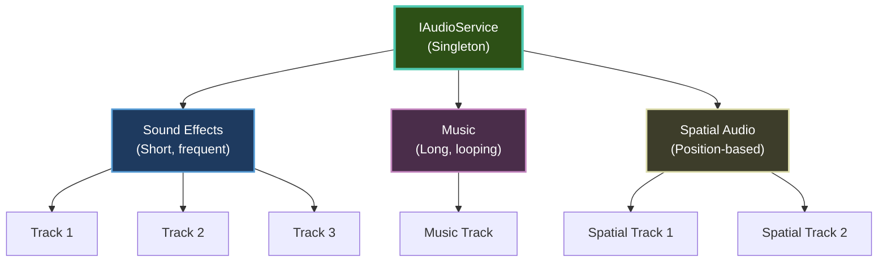

# Audio

Learn how to add sound effects, background music, and immersive spatial audio to your Brine2D games.

---

## Quick Start

```csharp
using Brine2D.Audio;

public class AudioScene : Scene
{
    private readonly IAudioService _audio;
    private ISoundEffect? _jumpSound;
    private IMusic? _backgroundMusic;
    
    // Inject IAudioService
    public AudioScene(IAudioService audio)
    {
        _audio = audio;
    }
    
    protected override async Task OnLoadAsync(CancellationToken ct)
    {
        // Load sound effect
        _jumpSound = await _audio.LoadSoundAsync("assets/jump.wav", ct);
        
        // Load music
        _backgroundMusic = await _audio.LoadMusicAsync("assets/music.ogg", ct);
        
        // Play music (looping)
        _audio.PlayMusic(_backgroundMusic, loops: -1);
    }
    
    protected override void OnUpdate(GameTime gameTime)
    {
        if (_input.IsKeyPressed(Key.Space))
        {
            // Play sound effect
            _audio.PlaySound(_jumpSound);
        }
    }
}
```

---

## Topics

### Getting Started

| Guide | Description | Difficulty |
|-------|-------------|------------|
| **[Getting Started](getting-started.md)** | Audio basics and setup | ⭐ Beginner |
| **[Sound Effects](sound-effects.md)** | Play sounds (jump, shoot, etc.) | ⭐ Beginner |
| **[Music Playback](music.md)** | Background music and looping | ⭐ Beginner |

### Advanced

| Guide | Description | Difficulty |
|-------|-------------|------------|
| **[Spatial Audio](spatial-audio.md)** | 2D positional audio with distance/panning | ⭐⭐⭐ Advanced |

---

## Key Concepts

### Track-Based Audio (v0.9.0+)

Brine2D uses a **track-based audio system** for precise control:

```csharp
// Play sound and get track handle
nint track = _audio.PlaySoundWithTrack(_shootSound, volume: 0.8f);

// Control specific track
_audio.UpdateTrackSpatialAudio(track, volume: 0.6f, pan: 0.5f);
_audio.StopTrack(track);

// Track finished event
_audio.OnTrackStopped += (stoppedTrack) =>
{
    Logger.LogInformation("Track {Track} finished", stoppedTrack);
};
```

**Benefits:**
- Precise control over individual sounds
- Update volume/pan in real-time
- Track lifecycle events

[:octicons-arrow-right-24: Migration from v0.8.0](../whats-new/v0.9.0-beta.md#audio-api-changes)

---

### Audio Architecture



---

## Common Tasks

### Play Sound Effect

```csharp
private readonly IAudioService _audio;
private ISoundEffect? _explosionSound;

protected override async Task OnLoadAsync(CancellationToken ct)
{
    _explosionSound = await _audio.LoadSoundAsync("assets/explosion.wav", ct);
}

protected override void OnUpdate(GameTime gameTime)
{
    if (enemyKilled)
    {
        // Simple playback
        _audio.PlaySound(_explosionSound);
        
        // With volume control
        _audio.PlaySound(_explosionSound, volume: 0.7f);
    }
}
```

[:octicons-arrow-right-24: Full guide: Sound Effects](sound-effects.md)

---

### Play Background Music

```csharp
private IMusic? _music;

protected override async Task OnLoadAsync(CancellationToken ct)
{
    _music = await _audio.LoadMusicAsync("assets/background.ogg", ct);
    
    // Play looping music
    _audio.PlayMusic(_music, loops: -1);  // -1 = infinite loop
}

protected override void OnUpdate(GameTime gameTime)
{
    // Pause/resume
    if (_input.IsKeyPressed(Key.P))
    {
        if (_audio.IsMusicPlaying())
        {
            _audio.PauseMusic();
        }
        else
        {
            _audio.ResumeMusic();
        }
    }
}
```

[:octicons-arrow-right-24: Full guide: Music Playback](music.md)

---

### Spatial Audio (2D Positional)

```csharp
// Create audio listener (player)
var player = World.CreateEntity("Player");
var listener = player.AddComponent<AudioListenerComponent>();

// Create spatial audio source (enemy)
var enemy = World.CreateEntity("Enemy");
var audioSource = enemy.AddComponent<AudioSourceComponent>();
audioSource.SoundEffect = _enemySound;
audioSource.EnableSpatialAudio = true;

// Configure distance attenuation
audioSource.MinDistance = 100f;  // Full volume within 100 pixels
audioSource.MaxDistance = 500f;  // Silent beyond 500 pixels
audioSource.RolloffFactor = 1.0f;  // Linear falloff

// Configure stereo panning
audioSource.SpatialBlend = 1.0f;  // Full stereo (0.0 = mono)

// Play
audioSource.Loop = true;
audioSource.PlayOnEnable = true;
```

[:octicons-arrow-right-24: Full guide: Spatial Audio](spatial-audio.md)

---

### Volume Control

```csharp
// Master volume (affects all audio)
_audio.SetMasterVolume(0.8f);  // 80%

// Sound effects volume
_audio.SetSoundVolume(0.6f);  // 60%

// Music volume
_audio.SetMusicVolume(0.5f);  // 50%

// Per-sound volume
_audio.PlaySound(_jumpSound, volume: 0.9f);

// Update track volume in real-time
nint track = _audio.PlaySoundWithTrack(_engineSound);
_audio.UpdateTrackSpatialAudio(track, volume: 0.7f, pan: 0.0f);
```

---

## Supported Formats

| Format | Sound Effects | Music | Recommended For |
|--------|--------------|-------|-----------------|
| **WAV** | ✅ Yes | ✅ Yes | Sound effects (uncompressed) |
| **OGG** | ✅ Yes | ✅ Yes | Music (compressed, high quality) |
| **MP3** | ✅ Yes | ✅ Yes | Music (compressed, smaller file) |
| **FLAC** | ✅ Yes | ✅ Yes | Music (lossless) |

**Recommendations:**
- **Sound effects:** WAV (fast loading, no decompression overhead)
- **Music:** OGG (good compression, no licensing issues unlike MP3)

---

## Best Practices

### ✅ DO

1. **Load sounds in OnLoadAsync()** - Keep OnUpdate() fast
2. **Use appropriate formats** - WAV for SFX, OGG for music
3. **Control volume** - Don't max out everything
4. **Unload sounds** - Free memory when scene ends
5. **Use tracks for control** - Get track handle for precise control

```csharp
// ✅ Good pattern
protected override async Task OnLoadAsync(CancellationToken ct)
{
    _sounds = await LoadSoundsAsync(ct);
    _music = await _audio.LoadMusicAsync("music.ogg", ct);
}

protected override void OnUpdate(GameTime gameTime)
{
    // Quick playback
    _audio.PlaySound(_jumpSound);
}

protected override Task OnUnloadAsync(CancellationToken ct)
{
    // Clean up
    _audio.StopAllSounds();
    _audio.StopMusic();
    return Task.CompletedTask;
}
```

---

### ❌ DON'T

1. **Don't load sounds in OnUpdate()** - Causes lag
2. **Don't play too many sounds** - Overwhelms player
3. **Don't forget to stop music** - Plays between scenes
4. **Don't use MP3 for SFX** - Decoding overhead
5. **Don't max out volume** - Causes clipping/distortion

```csharp
// ❌ Bad pattern
protected override void OnUpdate(GameTime gameTime)
{
    // Don't load in update!
    var sound = await _audio.LoadSoundAsync("jump.wav");  // NO!
    _audio.PlaySound(sound);
    
    // Don't play too many at once
    for (int i = 0; i < 100; i++)
    {
        _audio.PlaySound(_explosionSound);  // Overwhelming!
    }
}
```

---

## Performance Tips

### Limit Concurrent Sounds

```csharp
private int _activeSoundCount = 0;
private const int MaxConcurrentSounds = 16;

protected override void OnUpdate(GameTime gameTime)
{
    if (shouldPlaySound && _activeSoundCount < MaxConcurrentSounds)
    {
        nint track = _audio.PlaySoundWithTrack(_sound);
        _activeSoundCount++;
        
        _audio.OnTrackStopped += (stoppedTrack) =>
        {
            if (stoppedTrack == track)
            {
                _activeSoundCount--;
            }
        };
    }
}
```

---

### Preload Common Sounds

```csharp
// Load frequently used sounds at startup
protected override async Task OnLoadAsync(CancellationToken ct)
{
    // Preload common sounds
    _commonSounds = new Dictionary<string, ISoundEffect>
    {
        ["jump"] = await _audio.LoadSoundAsync("jump.wav", ct),
        ["shoot"] = await _audio.LoadSoundAsync("shoot.wav", ct),
        ["hit"] = await _audio.LoadSoundAsync("hit.wav", ct),
    };
}
```

---

## Troubleshooting

### No Sound Playing

**Symptom:** Audio calls succeed but nothing plays

**Solutions:**

1. **Check master volume:**

```csharp
_audio.SetMasterVolume(1.0f);  // Make sure not muted
```

2. **Verify sound loaded:**

```csharp
if (_jumpSound == null)
{
    Logger.LogWarning("Jump sound not loaded!");
}
```

3. **Check file exists:**
   - Verify path: `assets/jump.wav`
   - Check file is copied to output

---

### Music Continues Between Scenes

**Symptom:** Music from previous scene still playing

**Solution:** Stop music in OnUnloadAsync()

```csharp
protected override Task OnUnloadAsync(CancellationToken ct)
{
    _audio.StopMusic();
    return Task.CompletedTask;
}
```

---

### Spatial Audio Not Working

**Symptom:** Spatial audio sounds like regular audio

**Solutions:**

1. **Check EnableSpatialAudio is true:**

```csharp
audioSource.EnableSpatialAudio = true;  // Must be true!
```

2. **Verify listener exists:**

```csharp
var listener = World.GetEntitiesWithComponent<AudioListenerComponent>();
if (!listener.Any())
{
    Logger.LogWarning("No audio listener found!");
}
```

3. **Check distances:**

```csharp
// Make sure source is within range
float distance = Vector2.Distance(source.Position, listener.Position);
if (distance > audioSource.MaxDistance)
{
    Logger.LogDebug("Source too far from listener");
}
```

---

## Related Topics

- [Getting Started](getting-started.md) - Audio basics
- [Sound Effects](sound-effects.md) - Play sounds
- [Music Playback](music.md) - Background music
- [Spatial Audio](spatial-audio.md) - Positional audio
- [What's New v0.9.0](../whats-new/v0.9.0-beta.md#track-based-audio) - Track-based audio changes

---

**Ready to add sound?** Start with [Getting Started](getting-started.md)!