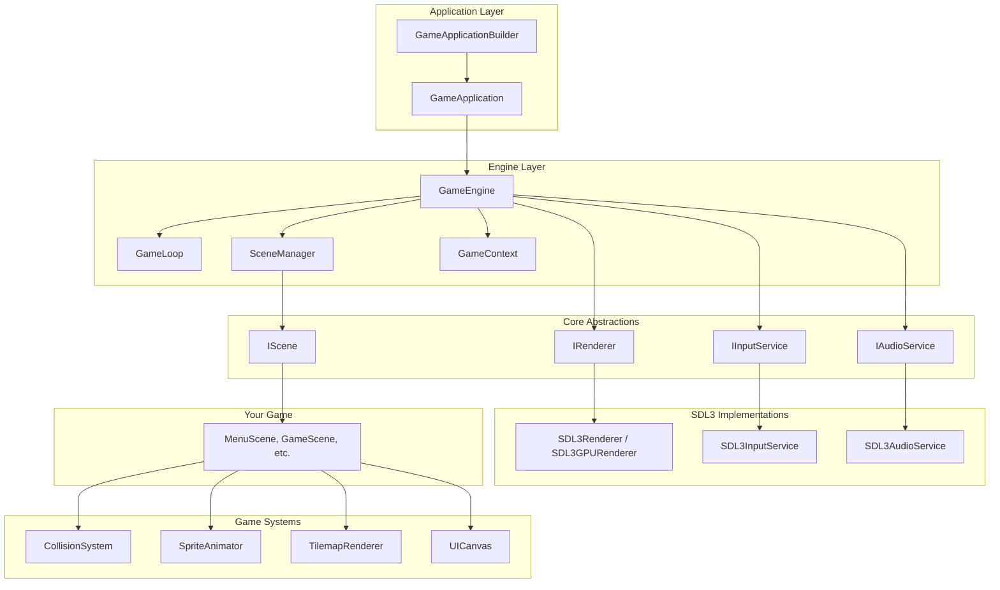
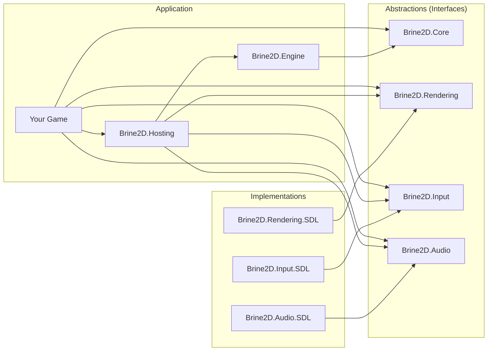
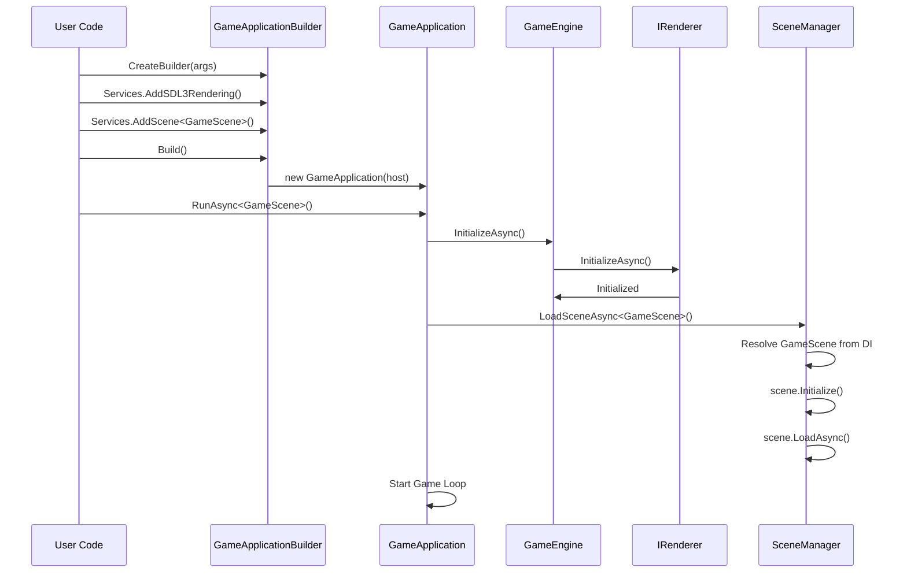
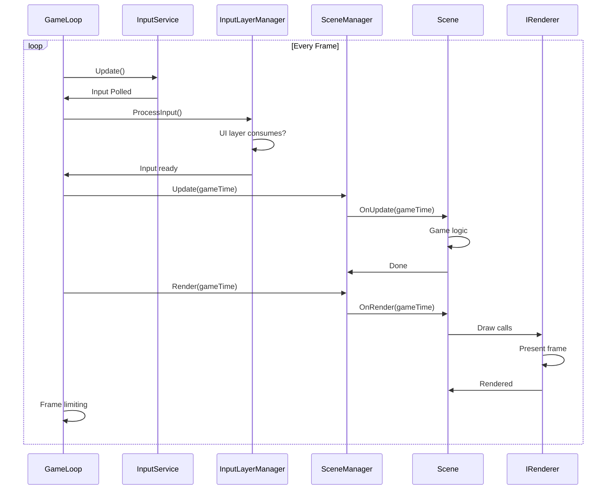

# Architecture

Brine2D follows a **layered, modular architecture** inspired by ASP.NET Core. This design promotes separation of concerns, testability, and extensibility.

## Architectural Overview



---

## Module Structure

Brine2D is organized into distinct modules, each with a specific responsibility:

### Core Modules

| Module | Purpose | Key Types |
|--------|---------|-----------|
| **Brine2D.Core** | Core abstractions and interfaces | `IScene`, `GameTime`, `CollisionSystem` |
| **Brine2D.Engine** | Game loop and scene management | `GameEngine`, `GameLoop`, `SceneManager` |
| **Brine2D.Hosting** | Application hosting (ASP.NET-like) | `GameApplication`, `GameApplicationBuilder` |

### Rendering Modules

| Module | Purpose | Key Types |
|--------|---------|-----------|
| **Brine2D.Rendering** | Rendering abstractions | `IRenderer`, `ICamera`, `Color` |
| **Brine2D.Rendering.SDL** | SDL3 rendering implementation | `SDL3Renderer`, `SDL3GPURenderer`, `SDL3TextureLoader` |

### Input Modules

| Module | Purpose | Key Types |
|--------|---------|-----------|
| **Brine2D.Input** | Input abstractions | `IInputService`, `Keys`, `MouseButton`, `InputLayerManager` |
| **Brine2D.Input.SDL** | SDL3 input implementation | `SDL3InputService` |

### Audio Modules

| Module | Purpose | Key Types |
|--------|---------|-----------|
| **Brine2D.Audio** | Audio abstractions | `IAudioService`, `ISoundEffect`, `IMusic` |
| **Brine2D.Audio.SDL** | SDL3_mixer implementation | `SDL3AudioService` |

### Feature Modules

| Module | Purpose | Key Types |
|--------|---------|-----------|
| **Brine2D.UI** | Immediate-mode UI system | `UICanvas`, `UIButton`, `UISlider`, `UITextInput` |

---

## Dependency Flow



**Key Principle:** Abstractions (interfaces) never depend on implementations. Implementations depend on abstractions. This enables **pluggable backends** (SDL3, MonoGame, custom implementations).

---

## Layer Responsibilities

### 1. Application Layer (`Brine2D.Hosting`)

**Responsibility:** Bootstrap and host the game application

**Key Classes:**
- `GameApplication` - Main application host
- `GameApplicationBuilder` - Fluent API for configuration

**Pattern:** Builder Pattern (like ASP.NET's `WebApplicationBuilder`)

```csharp
var builder = GameApplication.CreateBuilder(args);

// Configure services
builder.Services.AddSDL3Rendering();
builder.Services.AddSDL3Input();
builder.Services.AddScene<GameScene>();

// Build and run
var game = builder.Build();
await game.RunAsync<GameScene>();
```

---

### 2. Engine Layer (`Brine2D.Engine`)

**Responsibility:** Coordinate game systems and manage the game loop

**Key Classes:**
- `GameEngine` - Initializes and coordinates subsystems
- `GameLoop` - Manages update/render cycles
- `SceneManager` - Loads and manages scenes
- `GameContext` - Shared game state

**Pattern:** Mediator Pattern (coordinates subsystems)

```csharp
public class GameEngine : IGameEngine
{
    public async Task InitializeAsync(CancellationToken cancellationToken)
    {
        // Initialize renderer
        var renderer = _serviceProvider.GetService<IRenderer>();
        await renderer?.InitializeAsync(cancellationToken);
        
        // Initialize other subsystems...
    }
}
```

---

### 3. Core Layer (`Brine2D.Core`)

**Responsibility:** Define core abstractions and shared types

**Key Interfaces:**
- `IScene` - Game scene abstraction
- `IGameLoop` - Game loop contract
- `IGameContext` - Shared game state
- `ISceneManager` - Scene management

**Pattern:** Interface Segregation (small, focused interfaces)

```csharp
public interface IScene
{
    void Initialize();
    Task LoadAsync(CancellationToken cancellationToken);
    void Update(GameTime gameTime);
    void Render(GameTime gameTime);
    Task UnloadAsync(CancellationToken cancellationToken);
}
```

---

### 4. Rendering Layer

#### Abstractions (`Brine2D.Rendering`)

**Key Interfaces:**
- `IRenderer` - Rendering operations
- `ITextureLoader` - Texture management
- `ICamera` - Camera abstraction
- `IFontLoader` - Font loading

**Key Types:**
- `Color` - RGBA color struct
- `Camera2D` - 2D camera with zoom/rotation
- `RenderingOptions` - Configuration options

#### Implementation (`Brine2D.Rendering.SDL`)

**Key Classes:**
- `SDL3Renderer` - Legacy SDL3 renderer
- `SDL3GPURenderer` - Modern GPU renderer
- `SDL3TextureLoader` - SDL3 texture loading
- `SDL3FontLoader` - SDL3_ttf font loading

**Pattern:** Strategy Pattern (swappable renderers)

```csharp
// Choose renderer at startup
builder.Services.AddSDL3Rendering(options =>
{
    options.Backend = GraphicsBackend.GPU; // or LegacyRenderer
});
```

---

### 5. Input Layer

#### Abstractions (`Brine2D.Input`)

**Key Interfaces:**
- `IInputService` - Input polling
- `IInputLayer` - Layer-based input routing

**Key Types:**
- `Keys` - Keyboard key enum
- `MouseButton` - Mouse button enum
- `GamepadButton` - Gamepad button enum
- `InputLayerManager` - Prioritized input processing

#### Implementation (`Brine2D.Input.SDL`)

**Key Classes:**
- `SDL3InputService` - SDL3 input polling

**Pattern:** Observer Pattern (input events) + Priority Chain (input layers)

```csharp
// Input layers (like middleware)
_inputLayerManager.RegisterLayer(_uiCanvas);    // Priority 1000 (high)
_inputLayerManager.RegisterLayer(_gameLayer);   // Priority 0 (low)

// UI consumes input first, game gets remainder
_inputLayerManager.ProcessInput();
```

---

### 6. Audio Layer

#### Abstractions (`Brine2D.Audio`)

**Key Interfaces:**
- `IAudioService` - Audio playback
- `ISoundEffect` - Short sounds
- `IMusic` - Background music

#### Implementation (`Brine2D.Audio.SDL`)

**Key Classes:**
- `SDL3AudioService` - SDL3_mixer implementation

**Pattern:** Facade Pattern (simplifies SDL3_mixer)

```csharp
// Simple API for audio
await _audio.LoadSoundAsync("jump.wav");
_audio.PlaySound(jumpSound);

await _audio.LoadMusicAsync("background.mp3");
_audio.PlayMusic(music, loops: -1);
```

---

### 7. Game Systems Layer

**UI System** (`Brine2D.UI`):
- `UICanvas` - Container for UI components
- `UIButton`, `UISlider`, `UITextInput`, etc. - Components
- Input layer integration

**Collision System** (`Brine2D.Core.Collision`):
- `CollisionSystem` - Manages collision shapes
- `BoxCollider`, `CircleCollider` - Collision shapes
- Optional spatial partitioning

**Animation System** (`Brine2D.Core.Animation`):
- `SpriteAnimator` - Plays animations
- `AnimationClip` - Frame sequences
- `SpriteFrame` - Individual frames

**Tilemap System** (`Brine2D.Core.Tilemap`):
- `Tilemap` - Tile-based level data
- `TilemapRenderer` - Renders tilemaps
- `TmjLoader` - Loads Tiled JSON format

---

## Design Patterns Used

| Pattern | Where Used | Purpose |
|---------|------------|---------|
| **Builder** | `GameApplicationBuilder` | Fluent API for configuration |
| **Dependency Injection** | Everywhere | Loose coupling, testability |
| **Strategy** | `IRenderer` implementations | Swappable rendering backends |
| **Facade** | Audio, Input services | Simplify complex SDL3 APIs |
| **Observer** | Input events, animations | Event-driven behavior |
| **Component** | UI system | Composable UI elements |
| **Mediator** | `GameEngine` | Coordinate subsystems |
| **Template Method** | `Scene` base class | Lifecycle hooks |
| **Chain of Responsibility** | Input layers | Prioritized input handling |

---

## Data Flow

### Initialization Flow



### Game Loop Flow



---

## Extension Points

Brine2D is designed to be extended in several ways:

### 1. Custom Scenes

```csharp
public class MyScene : Scene
{
    // Override lifecycle methods
    protected override void OnInitialize() { }
    protected override Task OnLoadAsync(CancellationToken ct) { }
    protected override void OnUpdate(GameTime gt) { }
    protected override void OnRender(GameTime gt) { }
}
```

### 2. Custom Systems

```csharp
// Create your own system
public class ParticleSystem
{
    public void Update(float deltaTime) { }
    public void Render(IRenderer renderer) { }
}

// Register with DI
builder.Services.AddSingleton<ParticleSystem>();

// Inject into scene
public class GameScene : Scene
{
    private readonly ParticleSystem _particles;
    
    public GameScene(ParticleSystem particles, ...) { }
}
```

### 3. Custom Renderers

```csharp
// Implement IRenderer
public class CustomRenderer : IRenderer
{
    // Implement all methods...
}

// Register
builder.Services.AddSingleton<IRenderer, CustomRenderer>();
```

### 4. Custom Input Layers

```csharp
// Implement IInputLayer
public class DebugInputLayer : IInputLayer
{
    public int Priority => 500; // Between UI and game
    
    public bool ProcessKeyboardInput(IInputService input)
    {
        if (input.IsKeyPressed(Keys.F1))
        {
            ToggleDebugMode();
            return true; // Consume input
        }
        return false;
    }
}

// Register
_inputLayerManager.RegisterLayer(debugLayer);
```

---

## Performance Considerations

### Memory Management

- **Object pooling** - Reuse objects instead of allocating
- **Scoped lifetimes** - `CollisionSystem`, `UICanvas` are scoped per scene
- **Singleton services** - `IRenderer`, `IInputService` are singletons
- **Struct types** - `Color`, `GameTime`, `Vector2` are value types

### Frame Budget

At 60 FPS, each frame has ~16.67ms:

| Phase | Typical Budget |
|-------|----------------|
| Input | <1ms |
| Update | ~10ms |
| Render | ~5ms |
| Frame limiting | ~1-2ms |

### Optimization Techniques

- **Spatial partitioning** - `CollisionSystem` supports grid partitioning
- **Culling** - Only render visible objects (camera frustum)
- **Batching** - Group draw calls by texture
- **Async loading** - Load assets without blocking

---

## Configuration

Configuration flows through `IOptions<T>` pattern (ASP.NET style):

```csharp
// gamesettings.json
{
  "Rendering": {
    "WindowTitle": "My Game",
    "WindowWidth": 1280,
    "WindowHeight": 720,
    "VSync": true,
    "Backend": "GPU"
  }
}

// Bind to options
builder.Services.AddSDL3Rendering(options =>
{
    builder.Configuration.GetSection("Rendering").Bind(options);
});

// Access in code
public class MyScene : Scene
{
    private readonly RenderingOptions _options;
    
    public MyScene(IOptions<RenderingOptions> options, ...)
    {
        _options = options.Value;
    }
}
```

---

## Thread Safety

- **Main thread only** - SDL3 requires all operations on the main thread
- **Async loading** - Use `Task.Run()` for CPU-bound work, return to main thread for SDL calls
- **No parallelism** - Game loop is single-threaded by design

```csharp
protected override async Task OnLoadAsync(CancellationToken ct)
{
    // CPU-bound work (parsing JSON)
    var data = await Task.Run(() => LoadHeavyData(), ct);
    
    // SDL work (texture creation) - back on main thread
    _texture = await _textureLoader.LoadTextureAsync("sprite.png", ct);
}
```

---

## Next Steps

- **[Dependency Injection](dependency-injection.md)** - Master the DI container
- **[Builder Pattern](builder-pattern.md)** - Learn `GameApplicationBuilder`
- **[Scene Management](scenes.md)** - Organize your game
- **[Game Loop](game-loop.md)** - Understand frame processing

---

## Summary

Brine2D's architecture is:
- ✅ **Modular** - Clear separation of concerns
- ✅ **Extensible** - Plugin your own implementations
- ✅ **Testable** - Dependency injection everywhere
- ✅ **Familiar** - ASP.NET patterns throughout
- ✅ **Performant** - Designed for real-time games

Ready to dive deeper? Explore [Dependency Injection](dependency-injection.md) next! 🚀