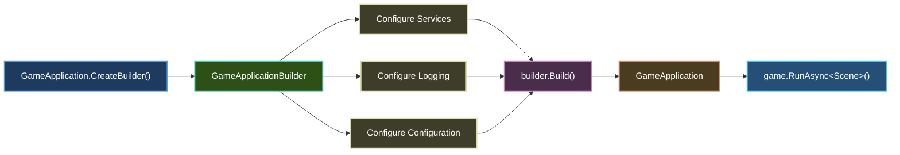

# Builder Pattern

The **Builder Pattern** in Brine2D provides a fluent, ASP.NET-style API for configuring your game. If you've used `WebApplicationBuilder`, you'll feel right at home!

## Overview



---

## Basic Usage

### Minimal Setup

```csharp
using Brine2D.Hosting;

// Step 1: Create builder
var builder = GameApplication.CreateBuilder(args);

// Step 2: Configure services
builder.Services.AddSDL3Rendering();
builder.Services.AddSDL3Input();
builder.Services.AddScene<GameScene>();

// Step 3: Build application
var game = builder.Build();

// Step 4: Run
await game.RunAsync<GameScene>();
```

**That's it!** Four simple steps to a working game.

---

## GameApplicationBuilder

The builder wraps `HostApplicationBuilder` (from `Microsoft.Extensions.Hosting`) and adds game-specific defaults.

### Constructor (Internal)

```csharp
internal GameApplicationBuilder(string[] args)
{
    _hostBuilder = Host.CreateApplicationBuilder(args);

    // 1. Configure default settings
    Configuration.AddJsonFile("gamesettings.json", optional: true, reloadOnChange: true);
    Configuration.AddJsonFile($"gamesettings.{Environment}.json", optional: true, reloadOnChange: true);

    // 2. Add core engine services
    Services.AddBrineEngine();

    // 3. Add default logging
    Logging.AddConsole();
    Logging.SetMinimumLevel(LogLevel.Information);
}
```

**What it does:**
1. ✅ Loads `gamesettings.json` automatically
2. ✅ Registers core engine services (GameLoop, SceneManager, etc.)
3. ✅ Sets up console logging
4. ✅ Supports environment-specific configs

---

## Builder Properties

### 1. Services (IServiceCollection)

**Purpose:** Register services for dependency injection

```csharp
public IServiceCollection Services => _hostBuilder.Services;
```

**Usage:**

```csharp
// Register singleton services
builder.Services.AddSDL3Rendering();
builder.Services.AddSDL3Input();
builder.Services.AddSDL3Audio();

// Register scoped services (per-scene)
builder.Services.AddCollisionSystem();
builder.Services.AddUICanvas();

// Register transient services (scenes)
builder.Services.AddScene<MenuScene>();
builder.Services.AddScene<GameScene>();
```

**See also:** [Dependency Injection](dependency-injection.md)

---

### 2. Configuration (ConfigurationManager)

**Purpose:** Access configuration from JSON files, environment variables, command-line args

```csharp
public ConfigurationManager Configuration => _hostBuilder.Configuration;
```

**Usage:**

```csharp
// Read configuration values
var windowTitle = builder.Configuration["Rendering:WindowTitle"];
var windowWidth = builder.Configuration.GetValue<int>("Rendering:WindowWidth");

// Bind configuration to options
builder.Services.Configure<RenderingOptions>(
    builder.Configuration.GetSection("Rendering"));

// Add custom configuration sources
builder.Configuration.AddJsonFile("custom-settings.json");
builder.Configuration.AddEnvironmentVariables("MYGAME_");
```

**Configuration hierarchy:**
1. `gamesettings.json` (base settings)
2. `gamesettings.{Environment}.json` (environment-specific)
3. Environment variables
4. Command-line arguments (highest priority)

---

### 3. Logging (ILoggingBuilder)

**Purpose:** Configure logging providers and levels

```csharp
public ILoggingBuilder Logging => _hostBuilder.Logging;
```

**Usage:**

```csharp
// Set minimum log level
builder.Logging.SetMinimumLevel(LogLevel.Debug);

// Clear default providers
builder.Logging.ClearProviders();

// Add specific providers
builder.Logging.AddConsole();
builder.Logging.AddDebug();

// Filter by category
builder.Logging.AddFilter("Brine2D", LogLevel.Trace);
builder.Logging.AddFilter("Microsoft", LogLevel.Warning);
```

**Log levels:**

| Level | When to Use |
|-------|-------------|
| `Trace` | Extremely detailed (every frame) |
| `Debug` | Debugging during development |
| `Information` | **Default** - general info |
| `Warning` | Potential issues |
| `Error` | Errors that need attention |
| `Critical` | Fatal errors |

---

### 4. Environment (IHostEnvironment)

**Purpose:** Detect runtime environment (Development, Production, etc.)

```csharp
public IHostEnvironment Environment => _hostBuilder.Environment;
```

**Usage:**

```csharp
if (builder.Environment.IsDevelopment())
{
    // Enable debug features
    builder.Logging.SetMinimumLevel(LogLevel.Debug);
    builder.Services.AddDeveloperTools();
}

if (builder.Environment.IsProduction())
{
    // Optimize for release
    builder.Logging.SetMinimumLevel(LogLevel.Warning);
}

// Get environment name
var envName = builder.Environment.EnvironmentName; // "Development", "Production", etc.
```

**Set environment:**

```bash
# Command line
DOTNET_ENVIRONMENT=Development dotnet run

# Or in launchSettings.json (Visual Studio)
"environmentVariables": {
  "DOTNET_ENVIRONMENT": "Development"
}
```

---

## Build Method

**Purpose:** Creates the final `GameApplication` instance

```csharp
public GameApplication Build()
{
    var host = _hostBuilder.Build();
    return new GameApplication(host);
}
```

**What it does:**
1. Finalizes service registrations
2. Builds the DI container
3. Creates the `IHost` instance
4. Wraps it in `GameApplication`

**After `Build()`, you cannot modify the builder!**

```csharp
var game = builder.Build();

// ❌ Too late! Container is sealed
builder.Services.AddScene<NewScene>(); // Throws exception
```

---

## Common Configuration Patterns

### Pattern 1: Service Registration

```csharp
var builder = GameApplication.CreateBuilder(args);

// Chain service registrations
builder.Services
    .AddInputLayerManager()
    .AddSDL3Input();

builder.Services.AddSDL3Audio();

builder.Services.AddSDL3Rendering(options =>
{
    options.WindowTitle = "My Game";
    options.WindowWidth = 1920;
    options.WindowHeight = 1080;
    options.VSync = true;
});

// Scoped services
builder.Services.AddCollisionSystem();
builder.Services.AddUICanvas();

// Scenes
builder.Services.AddScene<MenuScene>();
builder.Services.AddScene<GameScene>();
builder.Services.AddScene<PauseScene>();
```

---

### Pattern 2: Configuration Binding

```csharp
// gamesettings.json
{
  "Rendering": {
    "WindowTitle": "My Game",
    "WindowWidth": 1280,
    "WindowHeight": 720,
    "VSync": true,
    "Backend": "GPU"
  }
}

// Program.cs
builder.Services.AddSDL3Rendering(options =>
{
    // Bind from config section
    builder.Configuration.GetSection("Rendering").Bind(options);
    
    // Override specific values
    options.WindowTitle = "My Awesome Game"; // Overrides JSON value
});
```

---

### Pattern 3: Environment-Specific Configuration

```csharp
var builder = GameApplication.CreateBuilder(args);

if (builder.Environment.IsDevelopment())
{
    // Development-only services
    builder.Services.AddSingleton<IDebugOverlay, DebugOverlay>();
    
    // Verbose logging
    builder.Logging.SetMinimumLevel(LogLevel.Debug);
    
    // Enable hot reload (if supported)
    builder.Configuration.AddJsonFile("gamesettings.Development.json", 
        optional: true, 
        reloadOnChange: true);
}
else
{
    // Production optimizations
    builder.Logging.SetMinimumLevel(LogLevel.Warning);
    
    // Disable debug features
    builder.Services.Configure<RenderingOptions>(o => o.VSync = true);
}
```

**File structure:**

```
MyGame/
├── gamesettings.json                 # Base config (all environments)
├── gamesettings.Development.json     # Dev overrides
├── gamesettings.Production.json      # Prod overrides
└── Program.cs
```

---

### Pattern 4: Custom Extension Methods

Create your own fluent API:

```csharp
// MyGameExtensions.cs
public static class MyGameExtensions
{
    public static IServiceCollection AddMyGame(
        this IServiceCollection services,
        IConfiguration configuration)
    {
        // Register all game-specific services
        services.AddInputLayerManager().AddSDL3Input();
        services.AddSDL3Audio();
        
        services.AddSDL3Rendering(options =>
        {
            configuration.GetSection("Rendering").Bind(options);
        });
        
        services.AddCollisionSystem();
        services.AddUICanvas();
        
        // Custom systems
        services.AddSingleton<IEnemyFactory, EnemyFactory>();
        services.AddScoped<ILevelManager, LevelManager>();
        
        return services;
    }
}

// Program.cs - Now super clean!
var builder = GameApplication.CreateBuilder(args);
builder.Services.AddMyGame(builder.Configuration);
builder.Services.AddScene<GameScene>();

var game = builder.Build();
await game.RunAsync<GameScene>();
```

---

## Complete Example

Here's a real-world configuration:

```csharp
using Brine2D.Audio.SDL;
using Brine2D.Core.Collision;
using Brine2D.Core.Tilemap;
using Brine2D.Hosting;
using Brine2D.Input;
using Brine2D.Input.SDL;
using Brine2D.Rendering.SDL;
using Brine2D.UI;
using Microsoft.Extensions.DependencyInjection;
using Microsoft.Extensions.Logging;
using MyGame;

// ========================================
// STEP 1: Create Builder
// ========================================
var builder = GameApplication.CreateBuilder(args);

// ========================================
// STEP 2: Configure Logging
// ========================================
builder.Logging.ClearProviders();
builder.Logging.AddConsole();

if (builder.Environment.IsDevelopment())
{
    builder.Logging.SetMinimumLevel(LogLevel.Debug);
    builder.Logging.AddFilter("Brine2D", LogLevel.Trace);
}
else
{
    builder.Logging.SetMinimumLevel(LogLevel.Information);
}

// ========================================
// STEP 3: Configure Services
// ========================================

// Input
builder.Services
    .AddInputLayerManager()
    .AddSDL3Input();

// Audio
builder.Services.AddSDL3Audio();

// Rendering
builder.Services.AddSDL3Rendering(options =>
{
    // Bind from gamesettings.json
    builder.Configuration.GetSection("Rendering").Bind(options);
    
    // Override if needed
    if (builder.Environment.IsDevelopment())
    {
        options.WindowTitle += " [DEV]";
    }
});

// Game Systems (Scoped)
builder.Services.AddCollisionSystem();
builder.Services.AddUICanvas();
builder.Services.AddTilemapServices();
builder.Services.AddTilemapRenderer();

// Custom Systems
builder.Services.AddSingleton<IEnemyFactory, EnemyFactory>();
builder.Services.AddScoped<ILevelManager, LevelManager>();
builder.Services.AddTransient<IParticleSystem, ParticleSystem>();

// Scenes
builder.Services.AddScene<MenuScene>();
builder.Services.AddScene<GameScene>();
builder.Services.AddScene<PauseScene>();
builder.Services.AddScene<GameOverScene>();

// ========================================
// STEP 4: Build Application
// ========================================
var game = builder.Build();

// ========================================
// STEP 5: Run
// ========================================
await game.RunAsync<MenuScene>();
```

```json gamesettings.json
{
  "Logging": {
    "LogLevel": {
      "Default": "Information",
      "Brine2D": "Debug",
      "Microsoft": "Warning"
    }
  },
  "Rendering": {
    "WindowTitle": "My Awesome Game",
    "WindowWidth": 1920,
    "WindowHeight": 1080,
    "VSync": true,
    "Fullscreen": false,
    "Backend": "GPU",
    "PreferredGPUDriver": "vulkan"
  },
  "Audio": {
    "MasterVolume": 0.8,
    "MusicVolume": 0.6,
    "SoundVolume": 1.0
  }
}
```

---

## ASP.NET Comparison

| ASP.NET | Brine2D | Purpose |
|---------|---------|---------|
| `WebApplication.CreateBuilder()` | `GameApplication.CreateBuilder()` | Create builder |
| `builder.Services` | `builder.Services` | Register services |
| `builder.Configuration` | `builder.Configuration` | Access configuration |
| `builder.Logging` | `builder.Logging` | Configure logging |
| `builder.Environment` | `builder.Environment` | Detect environment |
| `appsettings.json` | `gamesettings.json` | Configuration file |
| `builder.Build()` | `builder.Build()` | Create application |
| `app.Run()` | `game.RunAsync<Scene>()` | Start application |

**Nearly identical API!**

---

## Advanced Scenarios

### Custom Configuration Sources

```csharp
builder.Configuration.AddJsonFile("levels.json");
builder.Configuration.AddXmlFile("achievements.xml");
builder.Configuration.AddIniFile("controls.ini");

// Environment variables with prefix
builder.Configuration.AddEnvironmentVariables("MYGAME_");

// Command-line arguments
// Example: dotnet run --WindowWidth=1920 --WindowHeight=1080
builder.Configuration.AddCommandLine(args);
```

**Priority** (highest to lowest):
1. Command-line arguments
2. Environment variables
3. JSON files (last added wins)

---

### Multiple Configuration Files

```csharp
builder.Configuration
    .AddJsonFile("gamesettings.json", optional: false, reloadOnChange: true)
    .AddJsonFile($"gamesettings.{builder.Environment.EnvironmentName}.json", optional: true, reloadOnChange: true)
    .AddJsonFile("player-prefs.json", optional: true, reloadOnChange: true)
    .AddJsonFile("achievements.json", optional: true, reloadOnChange: true);
```

---

### Conditional Service Registration

```csharp
// Platform-specific services
if (OperatingSystem.IsWindows())
{
    builder.Services.AddSingleton<IPlatformService, WindowsPlatformService>();
}
else if (OperatingSystem.IsLinux())
{
    builder.Services.AddSingleton<IPlatformService, LinuxPlatformService>();
}

// GPU backend selection
var backend = builder.Configuration["Rendering:Backend"];
if (backend == "GPU")
{
    builder.Services.AddSDL3GPURendering();
}
else
{
    builder.Services.AddSDL3LegacyRendering();
}
```

---

### Validation

Validate configuration at startup:

```csharp
var renderingOptions = new RenderingOptions();
builder.Configuration.GetSection("Rendering").Bind(renderingOptions);

if (renderingOptions.WindowWidth < 640)
    throw new InvalidOperationException("Window width must be at least 640");

if (renderingOptions.WindowHeight < 480)
    throw new InvalidOperationException("Window height must be at least 480");
```

---

## Best Practices

### DO

1. **Use environment-specific configs**
   ```csharp
   gamesettings.Development.json
   gamesettings.Production.json
   ```

2. **Group related services in extension methods**
   ```csharp
   builder.Services.AddMyGameSystems(builder.Configuration);
   ```

3. **Bind configuration to options classes**
   ```csharp
   builder.Services.Configure<RenderingOptions>(
       builder.Configuration.GetSection("Rendering"));
   ```

4. **Use fluent API for readability**
   ```csharp
   builder.Services
       .AddInputLayerManager()
       .AddSDL3Input();
   ```

### DON'T

1. **Don't modify builder after Build()**
   ```csharp
   var game = builder.Build();
   builder.Services.AddScene<NewScene>(); // ❌ Throws!
   ```

2. **Don't register services in scenes**
   ```csharp
   // ❌ Wrong place!
   protected override void OnInitialize()
   {
       builder.Services.AddSingleton<IService, Service>();
   }
   ```

3. **Don't hard-code configuration**
   ```csharp
   // ❌ Bad
   options.WindowWidth = 1280;
   
   // ✅ Good
   builder.Configuration.GetSection("Rendering").Bind(options);
   ```

---

## Troubleshooting

### "Service not found" error

```
System.InvalidOperationException: No service for type 'IRenderer' has been registered.
```

**Solution:** Register the service before `Build()`:

```csharp
builder.Services.AddSDL3Rendering(); // Must be before Build()
var game = builder.Build();
```

---

### Configuration not loading

**Problem:** `gamesettings.json` not found

**Solution:** Ensure it's copied to output:

```xml
<ItemGroup>
  <None Update="gamesettings.json">
    <CopyToOutputDirectory>PreserveNewest</CopyToOutputDirectory>
  </None>
</ItemGroup>
```

---

### Environment not detected

**Problem:** Always runs in Production mode

**Solution:** Set `DOTNET_ENVIRONMENT` variable:

```bash
# PowerShell
$env:DOTNET_ENVIRONMENT="Development"

# Bash
export DOTNET_ENVIRONMENT=Development

# Or in launchSettings.json
"environmentVariables": {
  "DOTNET_ENVIRONMENT": "Development"
}
```

---

## Summary

| Concept | Description |
|---------|-------------|
| **CreateBuilder()** | Factory method to create builder |
| **Services** | Register services for DI |
| **Configuration** | Access JSON/env/args config |
| **Logging** | Configure log providers and levels |
| **Environment** | Detect Development/Production |
| **Build()** | Finalize and create GameApplication |

---

## Next Steps

- **[Dependency Injection](dependency-injection.md)** - Master service registration
- **[Configuration](configuration.md)** - Deep dive into configuration
- **[Scene Management](scenes.md)** - Learn scene lifecycle
- **[Logging](../guides/logging.md)** - Advanced logging techniques

---

The builder pattern makes configuration clean, discoverable, and maintainable!