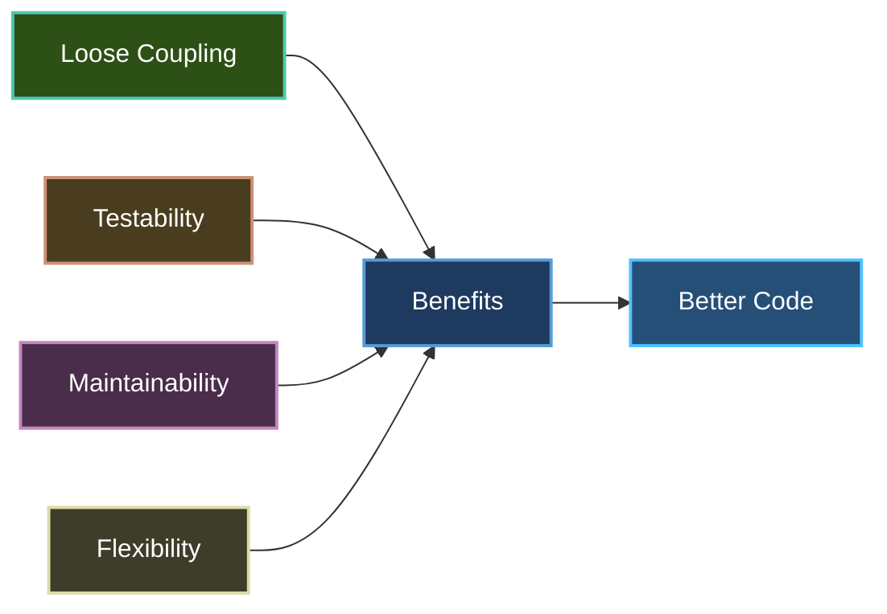
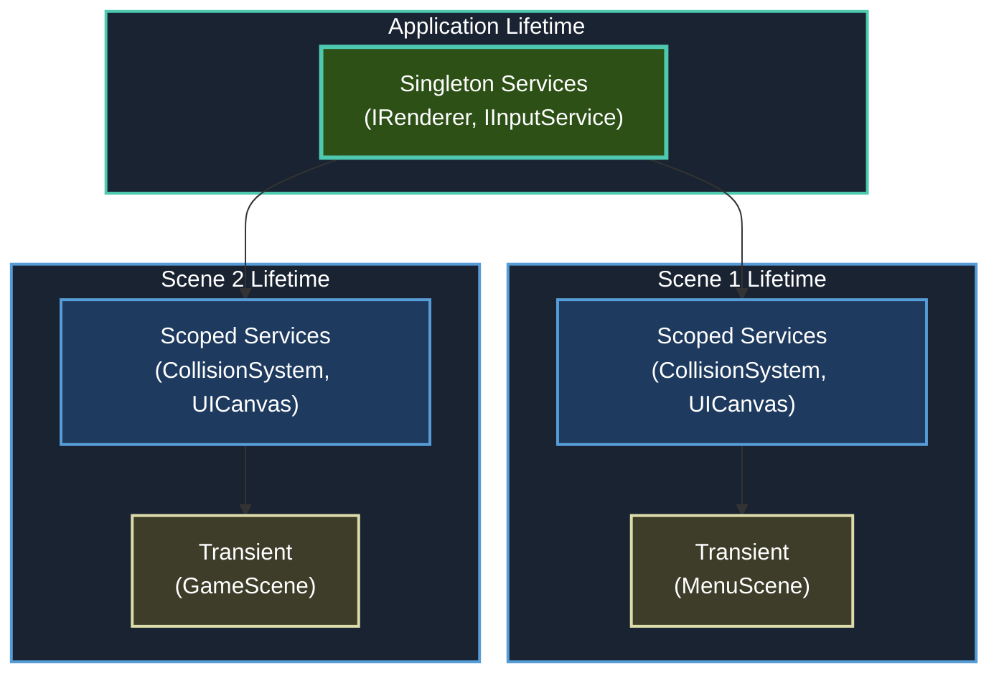

# Dependency Injection

Brine2D uses **Microsoft.Extensions.DependencyInjection** - the same DI container as ASP.NET Core. If you've built web apps with ASP.NET, this will feel like home.

## Why Dependency Injection?



**Benefits:**

- ✅ **Testability** - Easily mock dependencies in tests
- ✅ **Loose Coupling** - Classes don't create their dependencies
- ✅ **Flexibility** - Swap implementations without changing code
- ✅ **Maintainability** - Clear dependency relationships

---

## Basic Concepts

### Services and Lifetimes

Brine2D supports three service lifetimes:

| Lifetime | Description | When to Use | Example |
|----------|-------------|-------------|---------|
| **Singleton** | One instance for entire app | Expensive to create, stateless | `IRenderer`, `IInputService`, `IAudioService` |
| **Scoped** | One instance per scene/scope | Scene-specific state | `CollisionSystem`, `UICanvas` |
| **Transient** | New instance every time | Lightweight, no state | Scenes, temporary objects |



---

## Registration Patterns

### 1. Engine Services (Singleton)

Core engine services live for the entire application:

```csharp
// In GameApplicationBuilder (automatic)
services.TryAddSingleton<IGameEngine, GameEngine>();
services.TryAddSingleton<IGameLoop, GameLoop>();
services.TryAddSingleton<IGameContext, GameContext>();
services.TryAddSingleton<ISceneManager, SceneManager>();
```

**Why Singleton?**
- Created once at startup
- Shared across all scenes
- Manage global game state

---

### 2. Rendering Services (Singleton)

Rendering is expensive to initialize and provides both GPU and legacy renderer options:

```csharp
// In your Program.cs
builder.Services.AddSDL3Rendering(options =>
{
    options.WindowTitle = "My Game";
    options.WindowWidth = 1280;
    options.WindowHeight = 720;
    options.Backend = GraphicsBackend.GPU;  // GPU, LegacyRenderer, or Auto
});

// What it registers (internally):
services.TryAddSingleton<IFontLoader, SDL3FontLoader>();
services.TryAddSingleton<IRenderer>(/* backend-specific implementation */);
services.TryAddSingleton<ITextureContext>(/* from renderer */);
services.TryAddSingleton<ITextureLoader, SDL3TextureLoader>();
```

**Implementation:**

```csharp
public static IServiceCollection AddSDL3Rendering(
    this IServiceCollection services,
    Action<RenderingOptions>? configureOptions = null)
{
    if (configureOptions != null)
    {
        services.Configure(configureOptions);
    }

    services.TryAddSingleton<IFontLoader, SDL3FontLoader>();

    // Choose renderer based on backend configuration
    services.TryAddSingleton<IRenderer>(provider =>
    {
        var options = provider.GetRequiredService<IOptions<RenderingOptions>>();
        var loggerFactory = provider.GetRequiredService<ILoggerFactory>();
        var fontLoader = provider.GetService<IFontLoader>();
        var eventBus = provider.GetService<EventBus>();  // Optional EventBus for window events

        return options.Value.Backend switch
        {
            GraphicsBackend.GPU => new SDL3GPURenderer(
                provider.GetRequiredService<ILogger<SDL3GPURenderer>>(),
                loggerFactory,
                options,
                fontLoader,
                eventBus),
            GraphicsBackend.LegacyRenderer => new SDL3Renderer(
                provider.GetRequiredService<ILogger<SDL3Renderer>>(),
                loggerFactory,
                options,
                fontLoader,
                eventBus),
            GraphicsBackend.Auto => new SDL3GPURenderer(
                provider.GetRequiredService<ILogger<SDL3GPURenderer>>(),
                loggerFactory,
                options,
                fontLoader,
                eventBus),  // Defaults to GPU
            _ => throw new NotSupportedException($"Backend {options.Value.Backend} not supported")
        };
    });

    services.TryAddSingleton<ITextureContext>(provider => 
        (ITextureContext)provider.GetRequiredService<IRenderer>());
    services.TryAddSingleton<ITextureLoader, SDL3TextureLoader>();

    return services;
}
```

**What's new in v0.7.0:**
- Renderer selection based on `GraphicsBackend` enum (`GPU`, `LegacyRenderer`, `Auto`)
- Both renderers accept optional `EventBus` for window events like `WindowResizedEvent`
- GPU renderer is the new default - modern shader-based rendering with Vulkan/Metal/D3D11/D3D12 support
- Legacy renderer remains available for compatibility with older systems
- Configure preferred GPU driver via `options.PreferredGPUDriver` (optional)

**Why Singleton?**
- Window and graphics device initialization is expensive
- Shared rendering context across all scenes
- Manages global rendering state and frame buffers

---

### 3. Input Services (Singleton)

Input state is global:

```csharp
// In your Program.cs
builder.Services.AddInputLayerManager().AddSDL3Input();

// What it registers:
services.AddSingleton<InputLayerManager>();
services.TryAddSingleton<IInputService, SDL3InputService>();
```

**Chaining pattern** (like ASP.NET middleware):

```csharp
builder.Services
    .AddInputLayerManager()  // Returns IServiceCollection
    .AddSDL3Input();          // Chains off the return value
```

---

### 4. Audio Services (Singleton)

Audio mixer is shared:

```csharp
builder.Services.AddSDL3Audio();

// Registers:
services.TryAddSingleton<IAudioService, SDL3AudioService>();
```

---

### 5. Game Systems (Scoped)

Scene-specific systems:

```csharp
// Collision system - one per scene
builder.Services.AddCollisionSystem();
// Registers: services.AddScoped<CollisionSystem>();

// UI canvas - one per scene
builder.Services.AddUICanvas();
// Registers: services.AddScoped<UICanvas>();
```

**Why Scoped?**
- Each scene gets its own instance
- Scene changes = new instances
- Prevents state leaking between scenes

---

### 6. Scenes (Transient)

Scenes are created fresh each time:

```csharp
builder.Services.AddScene<MenuScene>();
builder.Services.AddScene<GameScene>();
builder.Services.AddScene<PauseScene>();

// Implementation:
public static IServiceCollection AddScene<TScene>(this IServiceCollection services)
    where TScene : class, IScene
{
    services.TryAddTransient<TScene>();
    return services;
}
```

**Why Transient?**
- Scenes shouldn't persist state across loads
- Each load is a fresh start
- Clean slate for each scene transition

---

## Constructor Injection

### Basic Pattern

```csharp
public class GameScene : Scene
{
    private readonly IRenderer _renderer;
    private readonly IInputService _input;
    private readonly IGameContext _gameContext;
    
    // Constructor injection - DI fills these automatically
    public GameScene(
        IRenderer renderer,
        IInputService input,
        IGameContext gameContext,
        ILogger<GameScene> logger
    ) : base(logger)
    {
        _renderer = renderer;
        _input = input;
        _gameContext = gameContext;
    }
}
```

**DI Container resolves:**
1. `GameScene` requested
2. Looks at constructor parameters
3. Resolves `IRenderer` → `SDL3GPURenderer` or `SDL3Renderer` based on backend (singleton)
4. Resolves `IInputService` → `SDL3InputService` (singleton)
5. Resolves `IGameContext` → `GameContext` (singleton)
6. Resolves `ILogger<GameScene>` → logging framework
7. Creates `GameScene` with all dependencies

---

### Advanced Injection

```csharp
public class CollisionDemoScene : Scene
{
    private readonly IRenderer _renderer;
    private readonly IInputService _input;
    private readonly ITextureLoader _textureLoader;
    private readonly ILoggerFactory _loggerFactory;
    private readonly CollisionSystem _collisionSystem;
    private readonly UICanvas _uiCanvas;
    private readonly InputLayerManager _inputLayerManager;
    private readonly IFontLoader _fontLoader;
    
    public CollisionDemoScene(
        IRenderer renderer,
        IInputService input,
        ITextureLoader textureLoader,
        ILoggerFactory loggerFactory,
        CollisionSystem collisionSystem,
        UICanvas uiCanvas,
        InputLayerManager inputLayerManager,
        IFontLoader fontLoader,
        ILogger<CollisionDemoScene> logger
    ) : base(logger)
    {
        _renderer = renderer;
        _input = input;
        _textureLoader = textureLoader;
        _loggerFactory = loggerFactory;
        _collisionSystem = collisionSystem;
        _uiCanvas = uiCanvas;
        _inputLayerManager = inputLayerManager;
        _fontLoader = fontLoader;
    }
}
```

**Mixing lifetimes:**
- Singletons: `IRenderer`, `IInputService`, `ITextureLoader`, `InputLayerManager`, `IFontLoader`
- Scoped: `CollisionSystem`, `UICanvas`
- Scene-specific: `ILogger<CollisionDemoScene>`

---

## Extension Method Pattern

Brine2D uses **extension methods** for service registration (ASP.NET style):

### Creating Your Own

```csharp
// 1. Define interface
public interface IParticleSystem
{
    void Update(float deltaTime);
    void Render(IRenderer renderer);
}

// 2. Implement
public class ParticleSystem : IParticleSystem
{
    private readonly ILogger<ParticleSystem> _logger;
    
    public ParticleSystem(ILogger<ParticleSystem> logger)
    {
        _logger = logger;
    }
    
    public void Update(float deltaTime) { }
    public void Render(IRenderer renderer) { }
}

// 3. Create extension method
public static class ParticleServiceCollectionExtensions
{
    public static IServiceCollection AddParticleSystem(
        this IServiceCollection services)
    {
        services.AddSingleton<IParticleSystem, ParticleSystem>();
        return services;
    }
}

// 4. Use in Program.cs
builder.Services.AddParticleSystem();
```

---

## Configuration Binding

Bind configuration options (like ASP.NET):

### 1. Define Options Class

```csharp
public class ParticleOptions
{
    public int MaxParticles { get; set; } = 1000;
    public float DefaultLifetime { get; set; } = 5.0f;
    public bool EnableGPUAcceleration { get; set; } = true;
}
```

### 2. Add to gamesettings.json

```json
{
  "Particles": {
    "MaxParticles": 5000,
    "DefaultLifetime": 3.0,
    "EnableGPUAcceleration": true
  }
}
```

### 3. Register with Configuration

```csharp
public static IServiceCollection AddParticleSystem(
    this IServiceCollection services,
    Action<ParticleOptions>? configureOptions = null)
{
    // Allow configuration via delegate
    if (configureOptions != null)
    {
        services.Configure(configureOptions);
    }
    
    services.AddSingleton<IParticleSystem, ParticleSystem>();
    return services;
}
```

### 4. Use Options

```csharp
public class ParticleSystem : IParticleSystem
{
    private readonly ParticleOptions _options;
    
    public ParticleSystem(IOptions<ParticleOptions> options)
    {
        _options = options.Value;
    }
}
```

### 5. Register in Program.cs

```csharp
// Option 1: Bind from config
builder.Services.AddParticleSystem();
builder.Configuration.GetSection("Particles").Bind(
    builder.Services.BuildServiceProvider()
        .GetRequiredService<IOptions<ParticleOptions>>().Value);

// Option 2: Configure inline
builder.Services.AddParticleSystem(options =>
{
    options.MaxParticles = 5000;
    options.DefaultLifetime = 3.0f;
});

// Option 3: Bind from config section (best practice)
builder.Services.Configure<ParticleOptions>(
    builder.Configuration.GetSection("Particles"));
```

---

## Service Resolution

### Manual Resolution (Rare)

Sometimes you need to manually resolve services:

```csharp
public class GameEngine : IGameEngine
{
    private readonly IServiceProvider _serviceProvider;
    
    public GameEngine(IServiceProvider serviceProvider)
    {
        _serviceProvider = serviceProvider;
    }
    
    public async Task InitializeAsync(CancellationToken ct)
    {
        // Resolve optional dependency
        var renderer = _serviceProvider.GetService<IRenderer>();
        if (renderer != null)
        {
            await renderer.InitializeAsync(ct);
        }
    }
}
```

**Methods:**
- `GetService<T>()` - Returns null if not found
- `GetRequiredService<T>()` - Throws if not found
- `GetServices<T>()` - Gets all registered implementations

---

## Scoping and Scene Transitions

### How Scoping Works

```csharp
public class SceneManager : ISceneManager
{
    private readonly IServiceProvider _serviceProvider;
    
    public async Task LoadSceneAsync<TScene>(CancellationToken ct)
        where TScene : IScene
    {
        // Unload current scene (disposes scoped services)
        if (CurrentScene != null)
        {
            await CurrentScene.UnloadAsync(ct);
        }
        
        // Create NEW scene (creates NEW scoped services)
        var scene = _serviceProvider.GetRequiredService<TScene>();
        
        scene.Initialize();
        await scene.LoadAsync(ct);
        
        CurrentScene = scene;
    }
}
```

**Scoped lifecycle:**
1. **Scene loads** → Scoped services created
2. **Scene runs** → Services used
3. **Scene unloads** → Scoped services disposed
4. **New scene loads** → New scoped services created

---

## Common Patterns

### Factory Pattern

```csharp
// Register factory
builder.Services.AddSingleton<IEnemyFactory, EnemyFactory>();

public interface IEnemyFactory
{
    Enemy CreateEnemy(EnemyType type);
}

public class EnemyFactory : IEnemyFactory
{
    private readonly ITextureLoader _textureLoader;
    private readonly ILoggerFactory _loggerFactory;
    
    public EnemyFactory(
        ITextureLoader textureLoader,
        ILoggerFactory loggerFactory)
    {
        _textureLoader = textureLoader;
        _loggerFactory = loggerFactory;
    }
    
    public Enemy CreateEnemy(EnemyType type)
    {
        return type switch
        {
            EnemyType.Zombie => new Zombie(_textureLoader, _loggerFactory),
            EnemyType.Spider => new Spider(_textureLoader, _loggerFactory),
            _ => throw new ArgumentException("Unknown enemy type")
        };
    }
}
```

### Optional Dependencies

```csharp
public class GameScene : Scene
{
    private readonly IRenderer _renderer;
    private readonly IAudioService? _audio;
    private readonly EventBus? _eventBus;
    
    public GameScene(
        IRenderer renderer,
        IAudioService? audio,      // Optional
        EventBus? eventBus,        // Optional - for custom events
        ILogger<GameScene> logger
    ) : base(logger)
    {
        _renderer = renderer;
        _audio = audio;
        _eventBus = eventBus;
    }
    
    protected override void OnLoad()
    {
        // Subscribe to custom events
        _eventBus?.Subscribe<PlayerScoredEvent>(OnPlayerScored);
    }
    
    protected override void OnUnload()
    {
        // Clean up event subscriptions
        _eventBus?.Unsubscribe<PlayerScoredEvent>(OnPlayerScored);
    }
    
    private void OnPlayerScored(PlayerScoredEvent evt)
    {
        _audio?.PlaySound("score.wav");
    }
    
    protected override void PlaySound()
    {
        _audio?.PlaySound(soundEffect);
    }
}
```

**EventBus in v0.7.0:**
- `EventBus` moved from `Brine2D.ECS` to `Brine2D.Core` namespace
- Now available globally without ECS dependencies
- Used internally by renderers for window events (`WindowResizedEvent`)
- Optional service - register with `builder.Services.AddSingleton<EventBus>()`

---

## Testing with DI

DI makes testing easy:

```csharp
public class GameSceneTests
{
    [Fact]
    public void Update_WhenEscapePressed_RequestsExit()
    {
        // Arrange - mock dependencies
        var mockRenderer = new Mock<IRenderer>();
        var mockInput = new Mock<IInputService>();
        var mockContext = new Mock<IGameContext>();
        var mockLogger = new Mock<ILogger<GameScene>>();
        
        mockInput.Setup(i => i.IsKeyPressed(Keys.Escape))
            .Returns(true);
        
        var scene = new GameScene(
            mockRenderer.Object,
            mockInput.Object,
            mockContext.Object,
            mockLogger.Object);
        
        // Act
        scene.Update(new GameTime(TimeSpan.Zero, TimeSpan.Zero));
        
        // Assert
        mockContext.Verify(c => c.RequestExit(), Times.Once);
    }
}
```

---

## Best Practices

### DO

1. **Inject interfaces, not implementations**
   ```csharp
   public GameScene(IRenderer renderer) // ✅ Good
   ```

2. **Use constructor injection**
   ```csharp
   public GameScene(IRenderer renderer, IInputService input) // ✅ Good
   ```

3. **Register services in extension methods**
   ```csharp
   builder.Services.AddMySystem(); // ✅ Good
   ```

4. **Use appropriate lifetimes**
   - Singleton for expensive/global services
   - Scoped for scene-specific state
   - Transient for lightweight/stateless objects

5. **Store dependencies in readonly fields**
   ```csharp
   private readonly IRenderer _renderer; // ✅ Good
   ```

### DON'T

1. **Don't create dependencies manually**
   ```csharp
   var renderer = new SDL3Renderer(); // ❌ Bad - use DI
   ```

2. **Don't use service locator anti-pattern**
   ```csharp
   var renderer = ServiceProvider.GetService<IRenderer>(); // ❌ Bad
   ```

3. **Don't inject `IServiceProvider` into scenes**
   ```csharp
   public GameScene(IServiceProvider provider) // ❌ Bad - inject specific services
   ```

4. **Don't make everything singleton**
   - Singletons hold state forever
   - Can cause memory leaks
   - Harder to test

---

## Complete Example

Here's a full DI setup:

```csharp Program.cs
using Brine2D.Audio.SDL;
using Brine2D.Core;
using Brine2D.Core.Collision;
using Brine2D.Hosting;
using Brine2D.Input;
using Brine2D.Input.SDL;
using Brine2D.Rendering.SDL;
using Brine2D.UI;
using MyGame;

var builder = GameApplication.CreateBuilder(args);

// Optional: Register EventBus for custom event handling
builder.Services.AddSingleton<EventBus>();

// Singleton services (global, expensive)
builder.Services
    .AddInputLayerManager()
    .AddSDL3Input();

builder.Services.AddSDL3Audio();

builder.Services.AddSDL3Rendering(options =>
{
    builder.Configuration.GetSection("Rendering").Bind(options);
});

// Scoped services (per-scene)
builder.Services.AddCollisionSystem();
builder.Services.AddUICanvas();

// Transient services (scenes)
builder.Services.AddScene<MenuScene>();
builder.Services.AddScene<GameScene>();
builder.Services.AddScene<PauseScene>();

// Custom services
builder.Services.AddMyGameSystems();

var game = builder.Build();
await game.RunAsync<MenuScene>();
```

```csharp MyGameSystemsExtensions.cs
using Microsoft.Extensions.DependencyInjection;

public static class MyGameSystemsExtensions
{
    public static IServiceCollection AddMyGameSystems(
        this IServiceCollection services)
    {
        services.AddSingleton<IEnemyFactory, EnemyFactory>();
        services.AddScoped<ILevelManager, LevelManager>();
        services.AddTransient<IParticleEmitter, ParticleEmitter>();
        
        return services;
    }
}
```

---

## Troubleshooting

### "Service not found" Error

```
System.InvalidOperationException: No service for type 'IRenderer' has been registered.
```

**Solution:** Make sure you registered the service:

```csharp
builder.Services.AddSDL3Rendering(); // Missing this!
```

### "Circular Dependency" Error

```
System.InvalidOperationException: A circular dependency was detected.
```

**Solution:** Refactor to break the cycle:

```csharp
// BAD:
A depends on B
B depends on A

// GOOD:
A depends on IInterface
B depends on IInterface
C implements IInterface
```

### Wrong Lifetime

```
// Symptom: State persists between scenes when it shouldn't
```

**Solution:** Change from Singleton to Scoped:

```csharp
services.AddSingleton<CollisionSystem>(); // ❌ Wrong
services.AddScoped<CollisionSystem>();    // ✅ Correct
```

---

## Summary

| Concept | Description |
|---------|-------------|
| **Service Lifetimes** | Singleton (app), Scoped (scene), Transient (always new) |
| **Constructor Injection** | Dependencies passed to constructor automatically |
| **Extension Methods** | `AddXXX()` pattern for clean registration |
| **Configuration Binding** | `IOptions<T>` pattern for settings |
| **Testability** | Easy to mock dependencies in unit tests |

---

## Next Steps

- **[Builder Pattern](builder-pattern.md)** - Master `GameApplicationBuilder`
- **[Scene Management](scenes.md)** - Understand scene scoping
- **[Configuration](configuration.md)** - Deep dive into options pattern
- **[Testing](../guides/testing.md)** - Write testable game code

---

Ready to build your own services? Start with [Builder Pattern](builder-pattern.md)!