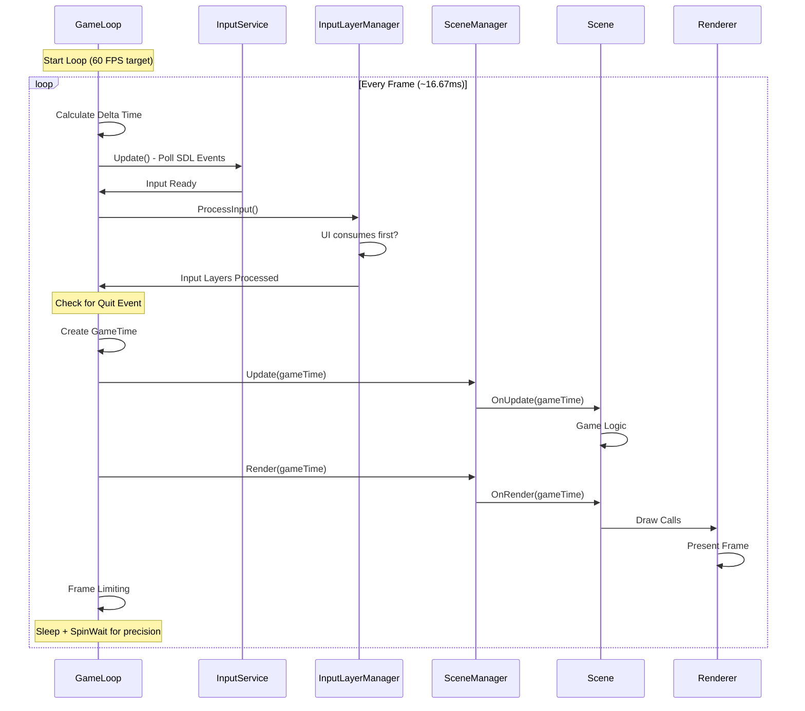
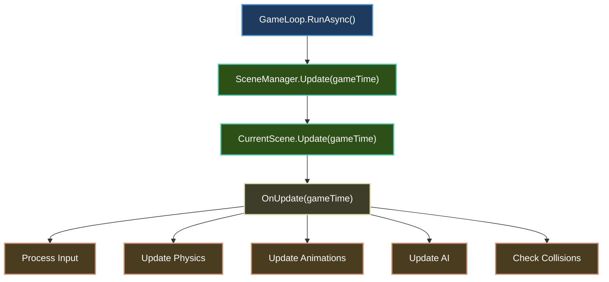
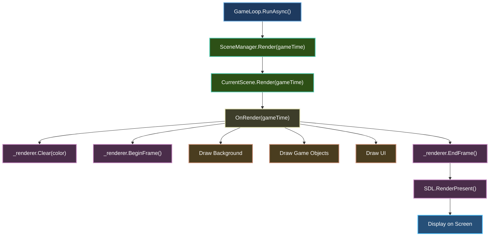
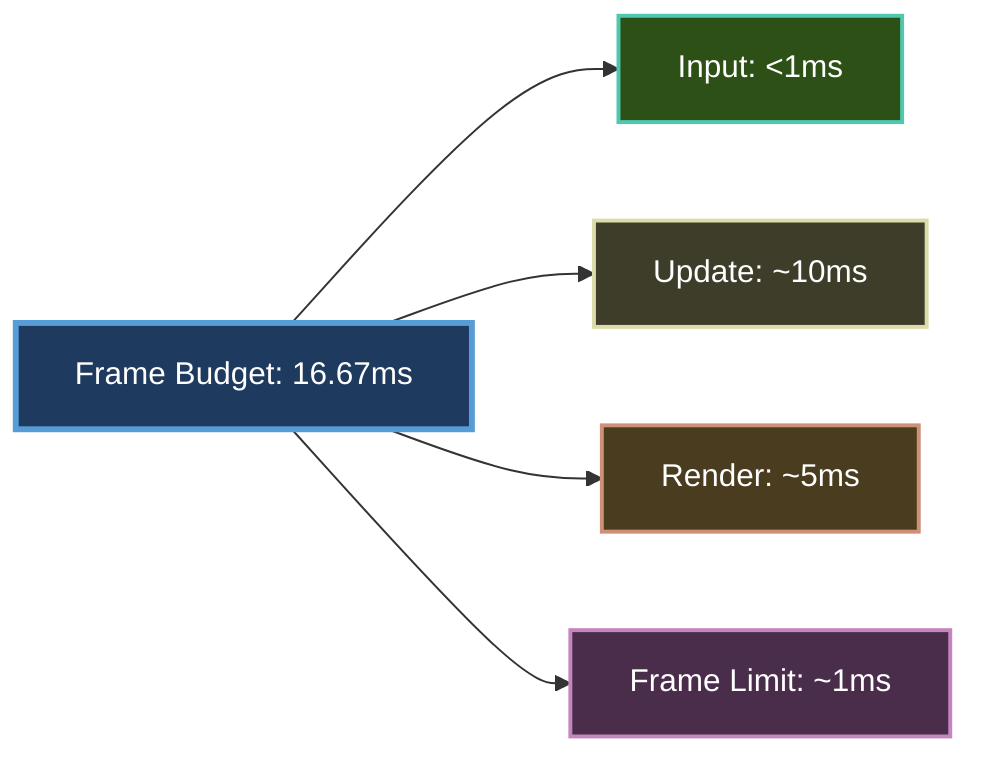
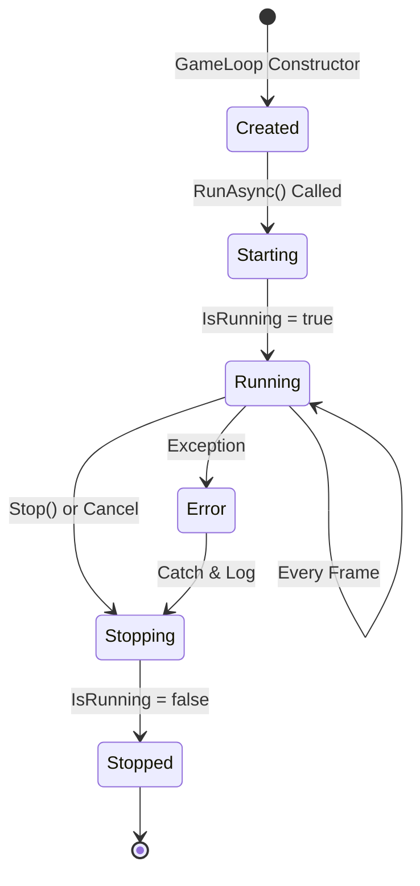

# Game Loop

The **game loop** is the heart of every game engine. It's the endless cycle that keeps your game running, processing input, updating game logic, and rendering graphics at a consistent rate.

## Game Loop Overview



---

## Game Loop Phases

### Phase 1: Input Processing

**Purpose:** Poll hardware devices and prepare input state

```csharp
// Update input (polls SDL events)
_inputService.Update();

// Process input layers (like middleware)
_inputLayerManager.ProcessInput();

// Check for quit event from window close
if (_inputService.IsQuitRequested)
{
    _gameContext.RequestExit();
}
```

**What happens:**
1. SDL events are polled (keyboard, mouse, gamepad, window events)
2. Input layers process in priority order (UI first, then game)
3. Quit events are detected (window close, Alt+F4, etc.)

---

### Phase 2: Time Calculation

**Purpose:** Track elapsed time for frame-rate independent gameplay

```csharp
var currentTime = _stopwatch.Elapsed;
var elapsedTime = currentTime - lastFrameTime;
lastFrameTime = currentTime;
totalTime += elapsedTime;

var gameTime = new GameTime(totalTime, elapsedTime);
```

**GameTime Structure:**

```csharp
public readonly struct GameTime
{
    public TimeSpan TotalTime { get; init; }    // Total elapsed since start
    public TimeSpan ElapsedTime { get; init; }  // Time since last frame
    public double DeltaTime => ElapsedTime.TotalSeconds;  // Seconds as double
    public double TotalSeconds => TotalTime.TotalSeconds; // Total as seconds
}
```

**Usage in scenes:**

```csharp
protected override void OnUpdate(GameTime gameTime)
{
    var deltaTime = (float)gameTime.DeltaTime;  // ~0.0166 at 60 FPS
    
    // Frame-rate independent movement
    position += velocity * speed * deltaTime;
    
    // Animation timing
    _animator.Update(deltaTime);
}
```

---

### Phase 3: Update Logic

**Purpose:** Execute game logic, physics, AI, etc.

```csharp
// Update game context time
if (_gameContext is GameContext context)
{
    context.GameTime = gameTime;
}

// Update current scene
_sceneManager.Update(gameTime);
```

**Scene Update Flow:**



---

### Phase 4: Rendering

**Purpose:** Draw all visual elements to the screen

```csharp
// Render current scene
_sceneManager.Render(gameTime);
```

**Rendering Flow:**



---

### Phase 5: Frame Limiting

**Purpose:** Maintain consistent frame rate (default 60 FPS)

```csharp
var targetFrameTime = TimeSpan.FromSeconds(1.0 / TargetFramesPerSecond);

// Frame limiting
var frameTime = _stopwatch.Elapsed - currentTime;
if (frameTime < targetFrameTime)
{
    var sleepTime = targetFrameTime - frameTime;
    
    // Sleep for most of the time (OS scheduler)
    if (sleepTime > TimeSpan.FromMilliseconds(1))
    {
        Thread.Sleep(sleepTime - TimeSpan.FromMilliseconds(1));
    }
    
    // Spin for precision timing on the last millisecond
    while (_stopwatch.Elapsed - currentTime < targetFrameTime)
    {
        Thread.SpinWait(100);
    }
}
```

**Why two-phase timing?**
1. **`Thread.Sleep()`** - Efficient but imprecise (~15ms resolution on Windows)
2. **`Thread.SpinWait()`** - Precise but burns CPU (~1ms precision)

**Hybrid approach:**
- Sleep for most of the time (save CPU)
- Spin-wait for the last millisecond (precision)

---

## Frame Timing

### Target Frame Rate

Default: **60 FPS** (16.67ms per frame)

```csharp
public int TargetFramesPerSecond { get; set; } = 60;
```

**Frame budgets:**

| FPS | Frame Time | Use Case |
|-----|------------|----------|
| 30 | 33.33ms | Low-power devices, slow games |
| 60 | 16.67ms | **Standard** (smooth gameplay) |
| 120 | 8.33ms | High-refresh displays |
| 144 | 6.94ms | Competitive gaming |
| Uncapped | Variable | Benchmarking, menu screens |

---

### Frame Budget Breakdown

At 60 FPS (16.67ms per frame):



| Phase | Time Budget | What Can Go Wrong |
|-------|-------------|-------------------|
| **Input** | <1ms | Rare, unless reading massive controller DB |
| **Update** | ~10ms | Complex physics, AI, too many entities |
| **Render** | ~5ms | Draw calls, texture uploads, shader compilation |
| **Frame Limiting** | ~1ms | Precision timing overhead |

---

## Delta Time

**Frame-rate independent gameplay** requires delta time:

### Without Delta Time (Bad)

```csharp
// BAD: Speed depends on frame rate
position += velocity;  // Faster at 120 FPS, slower at 30 FPS
```

### With Delta Time (Good)

```csharp
// GOOD: Speed is consistent at any frame rate
var deltaTime = (float)gameTime.DeltaTime;
position += velocity * speed * deltaTime;
```

**Example:**

| FPS | Delta Time | Movement per Frame | Movement per Second |
|-----|------------|--------------------|--------------------|
| 30 | 0.0333s | 200 * 0.0333 = 6.67 | 200 pixels |
| 60 | 0.0166s | 200 * 0.0166 = 3.33 | 200 pixels |
| 120 | 0.0083s | 200 * 0.0083 = 1.67 | 200 pixels |

Speed is **always 200 pixels/second** regardless of frame rate! ✅

---

## Game Loop Lifecycle



### Startup Sequence

```csharp
var gameLoop = Services.GetRequiredService<IGameLoop>();

// Start the loop
await gameLoop.RunAsync(cancellationToken);
```

**Initialization flow:**

1. `GameApplication.RunAsync<TScene>()` called
2. `GameEngine.InitializeAsync()` - Initialize subsystems
3. `SceneManager.LoadSceneAsync<TScene>()` - Load first scene
4. `GameLoop.RunAsync()` - **Start main loop**

---

### Shutdown Sequence

```csharp
// Graceful shutdown
_gameContext.RequestExit();

// Or force stop
gameLoop.Stop();
```

**Cleanup:**
1. Loop detects `_gameContext.IsRunning == false`
2. Loop breaks out
3. `finally` block executes
4. `_stopwatch.Stop()`
5. `IsRunning = false`
6. Scene unloads (resources cleaned up)

---

## Thread Safety

**Important:** The game loop is **single-threaded** by design.

### SDL3 Requirement

SDL3 **must** run on the main thread:

```csharp
public Task RunAsync<TScene>(CancellationToken ct) where TScene : IScene
{
    // Block synchronously to keep SDL on the same thread
    _host.StartAsync(ct).GetAwaiter().GetResult();
    
    // Initialize game engine (SDL initialization)
    engine.InitializeAsync(ct).GetAwaiter().GetResult();
    
    // Start game loop - MUST stay on this thread
    gameLoop.RunAsync(ct).GetAwaiter().GetResult();
}
```

**Why synchronous?**
- SDL3 window/rendering must stay on main thread
- Async/await can resume on different threads
- `.GetAwaiter().GetResult()` blocks on current thread

---

### Async Loading

You can still use async for loading:

```csharp
protected override async Task OnLoadAsync(CancellationToken ct)
{
    // CPU-bound work (parsing JSON) - can run on thread pool
    var data = await Task.Run(() => LoadHeavyData(), ct);
    
    // SDL work (texture creation) - back on main thread
    _texture = await _textureLoader.LoadTextureAsync("sprite.png", ct);
}
```

**Rule:** SDL calls happen on main thread, but prep work can be parallel.

---

## Customizing the Game Loop

### Change Target FPS

```csharp
var gameLoop = Services.GetRequiredService<IGameLoop>();
gameLoop.TargetFramesPerSecond = 120; // High refresh rate

await gameLoop.RunAsync();
```

### Uncapped Frame Rate

```csharp
gameLoop.TargetFramesPerSecond = 0; // No limiting (vsync only)
```

**Use cases:**
- Benchmarking
- Menu screens (don't need 60 FPS)
- High-refresh displays (120Hz, 144Hz)

---

### Custom Game Loop

You can implement your own:

```csharp
public class MyCustomGameLoop : IGameLoop
{
    public bool IsRunning { get; private set; }
    public int TargetFramesPerSecond { get; set; } = 60;
    
    public async Task RunAsync(CancellationToken ct)
    {
        IsRunning = true;
        
        while (IsRunning && !ct.IsCancellationRequested)
        {
            // Your custom loop logic
            
            // 1. Input
            // 2. Update
            // 3. Render
            // 4. Frame limit
        }
        
        await Task.CompletedTask;
    }
    
    public void Stop() => IsRunning = false;
}

// Register
builder.Services.AddSingleton<IGameLoop, MyCustomGameLoop>();
```

---

## Performance Monitoring

### Measuring Frame Time

```csharp
protected override void OnUpdate(GameTime gameTime)
{
    var deltaTime = gameTime.DeltaTime;
    var fps = 1.0 / deltaTime;
    
    Logger.LogDebug("Frame time: {Ms}ms, FPS: {Fps}", 
        deltaTime * 1000, fps);
}
```

### Profiling Phases

```csharp
var stopwatch = Stopwatch.StartNew();

// Measure update time
var updateStart = stopwatch.Elapsed;
_sceneManager.Update(gameTime);
var updateTime = stopwatch.Elapsed - updateStart;

// Measure render time
var renderStart = stopwatch.Elapsed;
_sceneManager.Render(gameTime);
var renderTime = stopwatch.Elapsed - renderStart;

_logger.LogDebug("Update: {U}ms, Render: {R}ms", 
    updateTime.TotalMilliseconds,
    renderTime.TotalMilliseconds);
```

---

## Common Patterns

### Fixed Time Step (Physics)

For deterministic physics:

```csharp
private double _accumulator;
private const double FixedTimeStep = 1.0 / 60.0; // 60 Hz physics

protected override void OnUpdate(GameTime gameTime)
{
    _accumulator += gameTime.DeltaTime;
    
    // Run physics at fixed 60 Hz
    while (_accumulator >= FixedTimeStep)
    {
        UpdatePhysics(FixedTimeStep);
        _accumulator -= FixedTimeStep;
    }
    
    // Render uses variable delta time
    UpdateAnimations((float)gameTime.DeltaTime);
}
```

**Why?**
- Physics needs consistent timestep for stability
- Rendering can vary without issues

---

### Interpolation

Smooth rendering between physics steps:

```csharp
var alpha = _accumulator / FixedTimeStep;
var renderPosition = Vector2.Lerp(_previousPosition, _currentPosition, (float)alpha);
```

---

## Best Practices

### ✅ DO

1. **Always use delta time** for movement/animation
   ```csharp
   position += velocity * deltaTime;  // ✅ Good
   ```

2. **Keep Update and Render separate**
   ```csharp
   OnUpdate(gameTime) { /* Logic only */ }
   OnRender(gameTime) { /* Drawing only */ }
   ```

3. **Profile performance** regularly
   ```csharp
   var fps = 1.0 / gameTime.DeltaTime;
   ```

4. **Exit gracefully**
   ```csharp
   _gameContext.RequestExit(); // ✅ Clean shutdown
   ```

### ❌ DON'T

1. **Don't use fixed values**
   ```csharp
   position += velocity; // ❌ Bad - frame-rate dependent
   ```

2. **Don't do expensive work in Update**
   ```csharp
   // ❌ Bad - loads every frame!
   OnUpdate(gameTime)
   {
       var texture = LoadTexture("sprite.png");
   }
   
   // ✅ Good - load once
   OnLoadAsync(ct)
   {
       _texture = await LoadTextureAsync("sprite.png", ct);
   }
   ```

3. **Don't render in Update**
   ```csharp
   OnUpdate(gameTime)
   {
       _renderer.DrawRectangle(...); // ❌ Wrong phase!
   }
   ```

4. **Don't block the main thread**
   ```csharp
   Thread.Sleep(1000); // ❌ Freezes entire game!
   ```

---

## Troubleshooting

### Low Frame Rate

**Symptom:** Game runs below target FPS

**Causes:**
- Too many draw calls
- Complex physics calculations
- Unoptimized collision detection
- Large Update logic

**Solutions:**
1. Profile with `Stopwatch` to find bottleneck
2. Reduce entity count
3. Use spatial partitioning for collisions
4. Batch draw calls

---

### Stuttering

**Symptom:** Inconsistent frame times

**Causes:**
- Garbage collection spikes
- Asset loading during gameplay
- VSync disabled
- Background processes

**Solutions:**
1. Enable VSync
2. Pre-load assets
3. Object pooling (reduce GC)
4. Close background apps

---

### Input Lag

**Symptom:** Delayed response to inputs

**Causes:**
- Triple buffering
- High frame time
- Input polling after rendering

**Solutions:**
1. Disable triple buffering
2. Optimize Update phase
3. Input is polled first (✅ Brine2D does this)

---

## Summary

| Concept | Key Point |
|---------|-----------|
| **Loop Structure** | Input → Update → Render → Limit |
| **Frame Rate** | Default 60 FPS (16.67ms/frame) |
| **Delta Time** | Essential for frame-rate independence |
| **Threading** | Single-threaded (SDL3 requirement) |
| **Phase Budget** | Input (1ms), Update (10ms), Render (5ms) |
| **Precision** | Sleep + SpinWait hybrid timing |

---

## Next Steps

- **[Scene Management](scenes.md)** - Understand scene lifecycle
- **[Input System](../guides/input.md)** - Master input handling
- **[Rendering](../guides/rendering/index.md)** - Optimize draw calls
- **[Performance](../guides/performance.md)** - Profile and optimize

---

Master the game loop and you master game development! 🎮🚀