# Samples

Learn by example! The Brine2D samples demonstrate real-world usage of the engine's features. Each sample is a complete, runnable project that showcases specific functionality.

## FeatureDemos

**Location:** `samples/FeatureDemos/`  
**Difficulty:** Beginner to Advanced  
**Topics Covered:** ECS Queries, Particles, Texture Atlasing, Spatial Audio, Collision, Scene Transitions, UI, Manual Control

The FeatureDemos project is an interactive showcase of Brine2D's major features. Run the project to see a **menu-driven demo selector** where you can explore each feature independently.

```mermaid
graph TD
    A["FeatureDemos Project"] --> B["MainMenuScene"]
    B --> C["Query System Demo"]
    B --> D["Particle System Demo"]
    B --> E["Texture Atlas Demo"]
    B --> F["Spatial Audio Demo"]
    B --> G["Collision Demo"]
    B --> H["Scene Transitions Demo"]
    B --> I["UI Components Demo"]
    B --> J["Manual Control Demo"]
    
    C --> K["Fluent Query API"]
    C --> L["Cached Queries"]
    C --> M["Complex Filters"]
    
    D --> N["Textures & Rotation"]
    D --> O["Trails & Blend Modes"]
    D --> P["7 Emitter Shapes"]
    
    E --> Q["Runtime Packing"]
    E --> R["Bin Packing Algorithm"]
    E --> S["Draw Call Reduction"]
    
    F --> T["Distance Attenuation"]
    F --> U["Stereo Panning"]
    F --> V["Real-Time Visualization"]
    
    G --> W["AABB Colliders"]
    G --> X["Circle Colliders"]
    G --> Y["Physics Response"]
    
    H --> Z["FadeTransition"]
    H --> AA["Loading Screens"]
    H --> AB["Scene Chaining"]
    
    I --> AC["Complete UI Library"]
    I --> AD["Tooltips & Dialogs"]
    I --> AE["Input Layers"]
    
    J --> AF["Lifecycle Hooks"]
    J --> AG["Manual Pipelines"]
    J --> AH["Power User Features"]

    style A fill:#1e3a5f,stroke:#569cd6,stroke-width:2px,color:#fff
    style B fill:#2d5016,stroke:#4ec9b0,stroke-width:2px,color:#fff
    style C fill:#4a2d4a,stroke:#c586c0,stroke-width:2px,color:#fff
    style D fill:#4a2d4a,stroke:#c586c0,stroke-width:2px,color:#fff
    style E fill:#4a2d4a,stroke:#c586c0,stroke-width:2px,color:#fff
    style F fill:#4a2d4a,stroke:#c586c0,stroke-width:2px,color:#fff
    style G fill:#4a2d4a,stroke:#c586c0,stroke-width:2px,color:#fff
    style H fill:#4a2d4a,stroke:#c586c0,stroke-width:2px,color:#fff
    style I fill:#4a2d4a,stroke:#c586c0,stroke-width:2px,color:#fff
    style J fill:#4a2d4a,stroke:#c586c0,stroke-width:2px,color:#fff
```



### Demo Scenes

| Demo | Description | Key Features | Category |
|------|-------------|--------------|----------|
| **Query System** | Advanced entity queries | Fluent API, cached queries, complex filters | ECS |
| **Particle System** | Advanced particle effects | Textures, rotation, trails, blend modes, 7 shapes | ECS |
| **Texture Atlas** | Runtime sprite packing | Bin packing, draw call reduction, performance | Rendering |
| **Spatial Audio** | 2D positional audio | Distance attenuation, stereo panning, visualization | Audio |
| **Collision Detection** | Physics and collision | AABB/circle colliders, bounce, slide, push | Collision |
| **Scene Transitions** | Smooth scene changes | FadeTransition, loading screens, async loading | Transitions |
| **UI Components** | Complete UI showcase | All 15+ components, tooltips, dialogs, tabs | UI |
| **Manual Control** | Power user features | Opt-out of automatic execution, custom pipelines | Advanced |

---

## Running the Demos

### Prerequisites

- .NET 10 SDK
- Visual Studio 2022 or VS Code
- SDL3 (auto-installed via NuGet)

### Option 1: Run from Visual Studio

1. Open `Brine2D.sln` in Visual Studio
2. Set `FeatureDemos` as startup project
3. Press **F5** to run
4. Select a demo from the menu

### Option 2: Run from Command Line

```bash
cd samples/FeatureDemos
dotnet run
```

### Navigation

- **Use number keys (1-8)** to select a demo
- **ESC** returns to menu from any demo
- **F1-F5** toggle debug options in some demos

---

## Demo Deep Dive

### 1. Query System Demo

**What it demonstrates:**
- Fluent query API for complex entity searches
- Cached queries for performance
- Multiple filter conditions (`With`, `Without`, `Where`)
- Real-time entity statistics

**Controls:**
- **SPACE** - Spawn entities
- **C** - Clear entities
- **ESC** - Return to menu

**Key Code:**

```csharp
// Find low-health enemies near the player
var weakEnemies = _world.Query()
    .With<HealthComponent>()
    .With<TransformComponent>()
    .Without<DeadComponent>()
    .WithTag("Enemy")
    .Where(e => 
    {
        var health = e.GetComponent<HealthComponent>();
        var transform = e.GetComponent<TransformComponent>();
        var distance = Vector2.Distance(transform.Position, playerPos);
        
        return health.CurrentHealth < 50 && distance < 200f;
    })
    .Execute();

// Cached queries (no allocation!)
var movingEntities = _world.CreateCachedQuery<TransformComponent, VelocityComponent>();
foreach (var (transform, velocity) in movingEntities)
{
    transform.Position += velocity.Velocity * deltaTime;
}
```

---

### 2. Particle System Demo

**What it demonstrates:**
- **NEW:** Particle textures with custom sprites
- **NEW:** Rotation (start, end, rotation speed)
- **NEW:** Trail effects with configurable length
- **NEW:** Blend modes (additive, alpha, none)
- **NEW:** 7 emitter shapes (point, circle, ring, box, cone, line, burst)
- Object pooling for 10,000+ particles at 60 FPS
- Performance monitoring

**Controls:**
- **1-7** - Change emitter shape
- **T** - Toggle particle textures
- **R** - Toggle rotation
- **L** - Toggle trails
- **B** - Cycle blend modes
- **SPACE** - Toggle emission
- **ESC** - Return to menu

**Key Code:**

```csharp
// Create advanced particle emitter
var emitter = entity.AddComponent<ParticleEmitterComponent>();

// NEW: Particle textures
emitter.TexturePath = "assets/particles/fire.png";
emitter.TextureScaleMode = TextureScaleMode.Nearest;

// NEW: Rotation
emitter.StartRotation = 0f;
emitter.EndRotation = MathF.PI * 2;
emitter.RotationSpeed = 2f;

// NEW: Trails
emitter.TrailEnabled = true;
emitter.TrailLength = 10;
emitter.TrailColor = new Color(255, 100, 0, 128);

// NEW: Blend modes
emitter.BlendMode = BlendMode.Additive; // Fire/explosions

// NEW: Emitter shapes
emitter.EmitterShape = EmitterShape.Cone;
emitter.ConeAngle = MathF.PI / 4;

// Standard properties
emitter.EmissionRate = 100f;
emitter.MaxParticles = 500;
emitter.ParticleLifetime = 2f;
emitter.StartColor = new Color(255, 200, 0, 255);
emitter.EndColor = new Color(255, 50, 0, 0);
```

---

### 3. Texture Atlas Demo (NEW)

**What it demonstrates:**
- Runtime texture packing with intelligent bin packing
- Massive draw call reduction (90-99%)
- Before/after performance comparison
- Visual atlas preview
- Real-time draw call monitoring

**Controls:**
- **SPACE** - Toggle atlas usage
- **1-3** - Change sprite count (100/500/1000)
- **F3** - Toggle performance overlay
- **A** - Show atlas texture
- **ESC** - Return to menu

**Performance Impact:**

| Sprite Count | Without Atlas | With Atlas | Draw Call Reduction |
|--------------|--------------|------------|---------------------|
| 100 sprites | 10-15 calls | 1 call | **90-93%** |
| 500 sprites | 40-50 calls | 1-2 calls | **96-98%** |
| 1000 sprites | 80-100 calls | 1-2 calls | **98-99%** |

**Key Code:**

```csharp
// Load individual textures
var textures = new List<ITexture>();
for (int i = 0; i < 10; i++)
{
    textures.Add(await _textureLoader.LoadTextureAsync($"assets/sprite{i}.png"));
}

// Build atlas at runtime
var atlas = await AtlasBuilder.BuildAtlasAsync(
    _renderer,
    _textureLoader,
    textures,
    padding: 2,      // Prevent texture bleeding
    maxSize: 2048    // Max atlas dimension
);

// Draw using atlas (automatic batching)
var region = atlas.GetRegion(textures[0]);
_renderer.DrawTexture(
    atlas.AtlasTexture,
    region.SourceRect.X, region.SourceRect.Y,
    region.SourceRect.Width, region.SourceRect.Height,
    x, y, width, height
);

// Result: All sprites drawn in 1-2 draw calls!
Logger.LogInfo($"Draw calls reduced from {textures.Count} to {atlas.RegionCount}");
```

**Visual Feedback:**
- Shows before/after FPS comparison
- Real-time draw call counter
- Visual atlas texture preview
- Bin packing efficiency percentage

---

### 4. Spatial Audio Demo (NEW)

**What it demonstrates:**
- 2D spatial audio with distance-based volume attenuation
- Stereo panning based on horizontal position
- Multiple falloff curves (linear, quadratic, custom)
- Real-time audio visualization
- ECS integration with audio sources and listeners

**Controls:**
- **WASD** - Move player (audio listener)
- **1-3** - Toggle sound sources
- **SPACE** - Trigger one-shot explosion sound
- **+/-** - Adjust master volume
- **ESC** - Return to menu

**Audio Sources:**
- **Left (Beep)** - Continuous looping sound, linear falloff
- **Right (Explosion)** - One-shot triggered sound, quadratic falloff
- **Top (Ambient)** - Background ambience, partial stereo

**Visual Feedback:**
- Distance circles (min/max audio range)
- Connection lines showing distance
- Real-time volume/pan values
- Color-coded audio sources

**Key Code:**

```csharp
// Create audio listener (player)
var player = _world.CreateEntity("Player");
var listener = player.AddComponent<AudioListenerComponent>();
listener.GlobalSpatialVolume = 1.0f;

// Create spatial audio source
var enemy = _world.CreateEntity("Enemy");
var audioSource = enemy.AddComponent<AudioSourceComponent>();
audioSource.SoundEffect = enemySound;
audioSource.EnableSpatialAudio = true;

// Configure distance attenuation
audioSource.MinDistance = 100f;  // Full volume within 100 pixels
audioSource.MaxDistance = 500f;  // Silent beyond 500 pixels
audioSource.RolloffFactor = 1.0f;  // 1.0 = linear, 2.0 = quadratic

// Configure stereo panning
audioSource.SpatialBlend = 1.0f;  // 0.0 = mono, 1.0 = full stereo

// Start playing
audioSource.Loop = true;
audioSource.LoopCount = -1;
audioSource.PlayOnEnable = true;

// AudioSystem automatically updates spatial audio every frame!
// Volume and panning adjust as entities move
```

**Distance Attenuation:**
```
Linear (RolloffFactor = 1.0):
Volume = 1.0 at MinDistance, 0.0 at MaxDistance

Quadratic (RolloffFactor = 2.0):
Drops quickly near source, gradually far away
```

**Stereo Panning:**
```
SpatialBlend = 0.0: Mono (center)
SpatialBlend = 0.5: Partial stereo
SpatialBlend = 1.0: Full stereo (clear left/right)
```

---

### 5. Collision Detection Demo

**What it demonstrates:**
- AABB (box) and circle colliders
- Collision detection with `CollisionSystem`
- Physics response: bounce, slide, push
- Dynamic vs static objects
- Trigger colliders (collectibles)
- Debug visualization

**Controls:**
- **WASD** - Move player
- **R** - Kick ball (when nearby)
- **F1** - Toggle collider visualization
- **F2** - Toggle velocity vectors
- **SPACE** - Reset scene
- **ESC** - Return to menu

**Key Code:**

```csharp
// Player slides along walls
var newPosition = _playerPosition + moveVector;
_playerCollider.Position = newPosition;

var collisions = _collisionSystem.GetCollisions(_playerCollider);
if (collisions.Any(c => _walls.Contains(c)))
{
    // Try sliding along X axis
    var slideX = _playerPosition + new Vector2(moveVector.X, 0);
    _playerCollider.Position = slideX;
    
    if (!_collisionSystem.GetCollisions(_playerCollider).Any())
    {
        _playerPosition = slideX;
    }
}

// Ball bounces with physics
_ballVelocity = CollisionResponse.Bounce(_ballVelocity, penetration, 0.7f);
```

---

### 6. Scene Transitions Demo

**What it demonstrates:**
- `FadeTransition` between scenes
- Custom loading screens with progress bars
- Async scene loading
- Scene chaining (A → B → C → A)
- Transition customization (duration, color)

**Controls:**
- **ENTER** - Go to next scene
- **Number keys** - Jump to specific scene
- **ESC** - Return to menu

**Key Code:**

```csharp
// Fade transition
await _sceneManager.LoadSceneAsync<SceneB>(
    new FadeTransition(duration: 0.5f, color: Color.Black)
);

// Custom loading screen
public class CustomLoadingScreen : LoadingScene
{
    protected override void OnRender(GameTime gameTime)
    {
        _renderer.DrawText($"Loading... {Progress:P0}", 500, 300, Color.White);
        _renderer.DrawRectangleFilled(400, 350, Progress * 400, 20, Color.Green);
    }
}

await _sceneManager.LoadSceneAsync<GameScene>(
    loadingScreen: new CustomLoadingScreen(),
    transition: new FadeTransition(0.5f, Color.Black)
);
```

---

### 7. UI Components Demo

**What it demonstrates:**
- **Complete UI library** - All 15+ components
- Buttons, labels, text inputs
- Sliders, checkboxes, radio buttons
- Progress bars, dropdowns
- Tab containers, scroll views
- Dialogs with multiple buttons
- Tooltips on hover
- Input layer management

**Controls:**
- **Mouse** - Interact with all UI elements
- **TAB** - Navigate between inputs
- **ESC** - Return to menu

**Components Showcased:**

| Component | Demo Feature |
|-----------|--------------|
| `UILabel` | Title, status messages |
| `UIButton` | Click counter, actions |
| `UITextInput` | Name entry with placeholder |
| `UISlider` | Volume control (0-100) |
| `UIProgressBar` | Health bar with +/- buttons |
| `UIDropdown` | Graphics quality selector |
| `UICheckbox` | Sound/VSync toggles |
| `UIRadioButton` | Difficulty selection |
| `UITabContainer` | Settings organization |
| `UIScrollView` | 25-item scrollable list |
| `UIDialog` | Confirmation popups |
| `UITooltip` | Hover help text |
| `UIPanel` | Visual grouping |

**Key Code:**

```csharp
// Button with event
var button = new UIButton("Click Me!", pos, size);
button.OnClick += () => Logger.LogInformation("Clicked!");
_uiCanvas.Add(button);

// Slider with value display
var slider = new UISlider(pos, size)
{
    MinValue = 0f,
    MaxValue = 100f,
    Value = 75f,
    ShowValue = true,
    Tooltip = new UITooltip("Adjust volume")
};
slider.OnValueChanged += (value) => Logger.LogDebug("Volume: {Volume}", value);
_uiCanvas.Add(slider);

// Dialog with multiple buttons
var dialog = new UIDialog("Confirm", "Are you sure?", new Vector2(400, 250));
dialog.AddButton("Yes", () => dialog.Visible = false);
dialog.AddButton("No", () => dialog.Visible = false);
_uiCanvas.Add(dialog);
```

---

### 8. Manual Control Demo

**What it demonstrates:**
- Opt-out of automatic execution
- Manual pipeline control
- Manual frame management
- When and why to use manual control
- Power user scenarios (fixed timestep, conditional execution)

**Controls:**
- **ESC** - Return to menu

**Key Code:**

```csharp
public class ManualControlScene : Scene
{
    public override bool EnableLifecycleHooks => false; // Disable automatic execution
    public override bool EnableAutomaticFrameManagement => false; // Full manual control
    
    protected override void OnUpdate(GameTime gameTime)
    {
        // You control when systems run
        _updatePipeline.Execute(gameTime);
        _world.Update(gameTime);
    }
    
    protected override void OnRender(GameTime gameTime)
    {
        // You control frame management
        _renderer.Clear(Color.Black);
        _renderer.BeginFrame();
        
        _renderPipeline.Execute(_renderer);
        
        _renderer.EndFrame();
    }
}
```

See [Lifecycle Hooks Guide](../guides/scenes/lifecycle-hooks.md) for full documentation.

---

## Project Structure

```
FeatureDemos/
├── Scenes/
│   ├── MainMenuScene.cs               # Interactive demo selector
│   ├── DemoSceneBase.cs               # Shared base class
│   ├── ECS/
│   │   ├── QueryDemoScene.cs          # Query system showcase
│   │   └── ParticleDemoScene.cs       # Particle effects (enhanced v0.8.0)
│   ├── Rendering/
│   │   └── TextureAtlasDemoScene.cs   # NEW: Texture atlas demo
│   ├── Audio/
│   │   └── SpatialAudioDemoScene.cs   # NEW: Spatial audio demo
│   ├── Collision/
│   │   └── CollisionDemoScene.cs      # Physics demo
│   ├── Transitions/
│   │   ├── TransitionDemoScene.cs     # Transition showcase
│   │   ├── SceneA.cs                  # Chain scene A
│   │   ├── SceneB.cs                  # Chain scene B
│   │   └── SceneC.cs                  # Chain scene C
│   ├── UI/
│   │   └── UIDemoScene.cs             # Complete UI showcase
│   └── Advanced/
│       └── ManualControlScene.cs      # Power user demo
├── Program.cs                          # Entry point
├── gamesettings.json                   # Configuration
└── FeatureDemos.csproj                 # Project file
```

---

## Configuration

```json
{
  "Logging": {
    "LogLevel": {
      "Default": "Information",
      "Brine2D": "Debug"
    }
  },
  "Rendering": {
    "WindowTitle": "Brine2D Feature Demos",
    "WindowWidth": 1280,
    "WindowHeight": 720,
    "VSync": true,
    "Backend": "GPU"
  }
}
```

---

## Dependency Injection Setup

FeatureDemos demonstrates complete service configuration:

```csharp
var builder = GameApplication.CreateBuilder(args);

// Core services
builder.Services.AddSDL3Rendering(options =>
{
    builder.Configuration.GetSection("Rendering").Bind(options);
});
builder.Services.AddInputLayerManager().AddSDL3Input();
builder.Services.AddSDL3Audio();

// ECS and systems
builder.Services.AddCollisionSystem();
builder.Services.AddUICanvas();

// Register all demo scenes
builder.Services.AddScene<MainMenuScene>();
builder.Services.AddScene<QueryDemoScene>();
builder.Services.AddScene<ParticleDemoScene>();
builder.Services.AddScene<TextureAtlasDemoScene>();  // NEW
builder.Services.AddScene<SpatialAudioDemoScene>();  // NEW
builder.Services.AddScene<CollisionDemoScene>();
builder.Services.AddScene<TransitionDemoScene>();
builder.Services.AddScene<UIDemoScene>();
builder.Services.AddScene<ManualControlScene>();

var game = builder.Build();
await game.RunAsync<MainMenuScene>();
```

---

## Learning Path

We recommend exploring the demos in this order:

1. **Query System** - Understand ECS queries (if using ECS)
2. **Texture Atlas** - Learn performance optimization with sprite packing
3. **Particle System** - Master advanced visual effects
4. **Spatial Audio** - Add immersive positional sound
5. **Collision Detection** - Learn physics and collision response
6. **UI Components** - Master the UI framework
7. **Scene Transitions** - Build polished scene changes
8. **Manual Control** - Advanced power user techniques

---

## Using Demos as Templates

The demo code is production-ready and designed to be copied:

1. **Copy a scene class** - Use as a starting point
2. **Modify for your game** - Change colors, sizes, behaviors
3. **Extract patterns** - Query builders, UI layouts, collision response, audio setups
4. **Build on top** - Extend with your own features

---

## Troubleshooting

### Menu doesn't appear?
- Check that `MainMenuScene` is registered
- Verify `game.RunAsync<MainMenuScene>()` is called

### Demos run slowly?
- Press **F3** to check FPS and draw calls
- Ensure VSync is enabled in `gamesettings.json`
- Verify GPU backend is being used (not Legacy)

### Texture Atlas Demo shows no improvement?
- Make sure multiple unique textures are being used
- Check that sprites aren't all using the same texture
- Verify atlas is actually being created (check logs)

### Spatial Audio Demo is silent?
- Ensure sound files exist in `assets/sounds/` folder
- Check master volume (use +/- keys)
- Verify audio source `IsEnabled = true`
- Move player close to sound sources

### Particles don't show textures?
- Check that `TexturePath` is set on emitter
- Verify texture files exist in `assets/particles/`
- Ensure `TextureScaleMode` is set appropriately

---

## Performance Tips

### Texture Atlas Demo
- Keep atlas size ≤ 2048x2048 for compatibility
- Use 2-4px padding between sprites
- Pack sprites that render together

### Spatial Audio Demo
- Disable spatial audio for UI/music sounds
- Use appropriate `MaxDistance` values
- Limit concurrent spatial audio sources to < 50

### Particle System Demo
- Keep `MaxParticles` ≤ 500 per emitter
- Use trails sparingly (they multiply particle count)
- Pack particle textures into an atlas

---

## See Also

- **[Guides](../guides/index.md)** - Detailed feature documentation
- **[Tutorials](../tutorials/index.md)** - Step-by-step learning
- **[API Reference](../api/index.md)** - Complete API docs
- **[What's New](../whats-new/v0.8.0-beta.md)** - v0.8.0-beta features

---

Ready to explore? Run the demos and start building your own games with Brine2D!