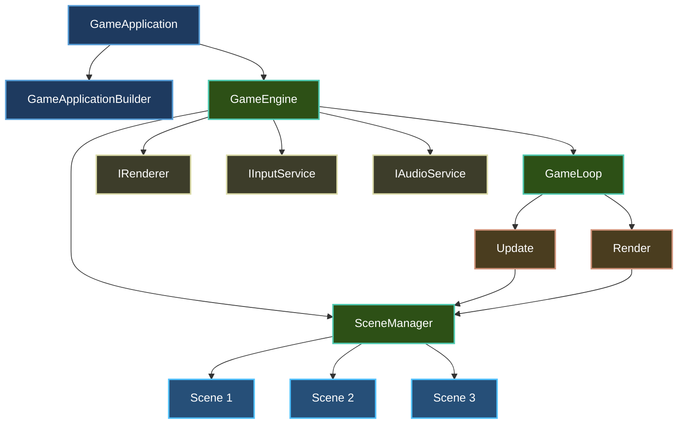
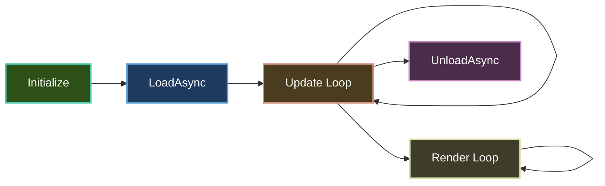
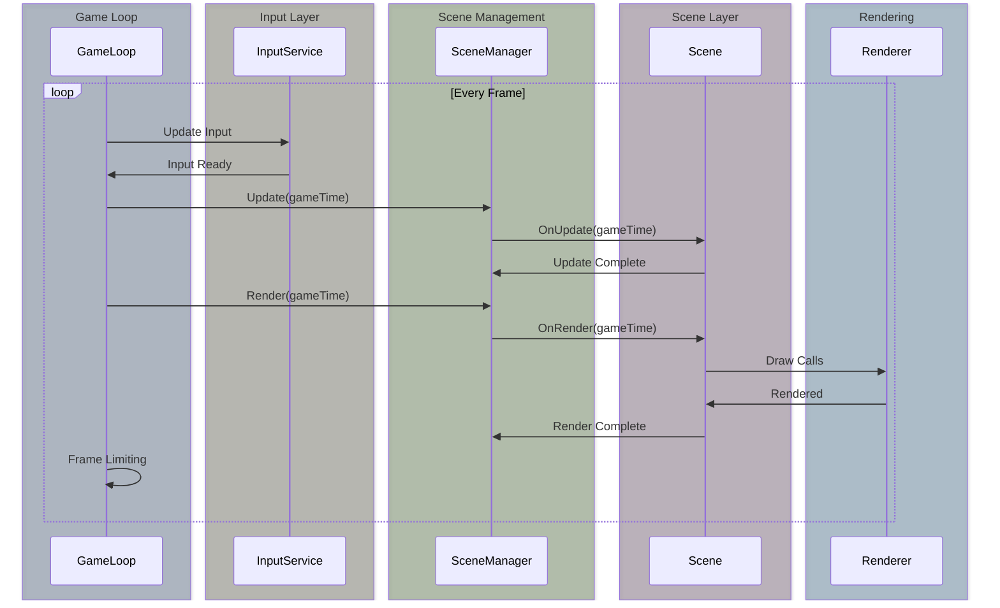

# Concepts

Understanding Brine2D's core concepts will help you build games efficiently and maintainably. If you're coming from ASP.NET, many of these patterns will feel familiar.

## Architecture Overview

Brine2D follows a modular, ASP.NET-inspired architecture:



---

## Core Concepts

### 1. GameApplicationBuilder (The Builder Pattern)

**Like:** ASP.NET's `WebApplicationBuilder`  
**Purpose:** Configure and build your game application with dependency injection

```csharp
var builder = GameApplication.CreateBuilder(args);

// Configure services (just like ASP.NET!)
builder.Services.AddSDL3Rendering(options =>
{
    options.WindowTitle = "My Game";
    options.WindowWidth = 1280;
    options.WindowHeight = 720;
});

builder.Services.AddSDL3Input();
builder.Services.AddSDL3Audio();

// Register scenes
builder.Services.AddScene<MenuScene>();
builder.Services.AddScene<GameScene>();

// Build and run
var game = builder.Build();
await game.RunAsync<MenuScene>();
```

**Key Methods:**

- `Services` - Access the `IServiceCollection` for DI
- `Configuration` - Access game configuration (`gamesettings.json`)
- `Logging` - Configure logging levels and providers
- `Build()` - Creates the `GameApplication`

**Learn more:** [Builder Pattern](builder-pattern.md)

---

### 2. Scenes (Like ASP.NET Controllers)

**Like:** ASP.NET Controllers  
**Purpose:** Organize your game into reusable, manageable units

```csharp
public class GameScene : Scene
{
    private readonly IRenderer _renderer;
    private readonly IInputService _input;
    
    // Constructor injection (just like ASP.NET!)
    public GameScene(
        IRenderer renderer,
        IInputService input,
        ILogger<GameScene> logger
    ) : base(logger)
    {
        _renderer = renderer;
        _input = input;
    }
    
    protected override void OnInitialize()
    {
        // Setup scene (called once)
    }
    
    protected override async Task OnLoadAsync(CancellationToken cancellationToken)
    {
        // Load assets asynchronously
    }
    
    protected override void OnUpdate(GameTime gameTime)
    {
        // Update game logic every frame
    }
    
    protected override void OnRender(GameTime gameTime)
    {
        // Render graphics every frame
    }
    
    protected override Task OnUnloadAsync(CancellationToken cancellationToken)
    {
        // Clean up resources
    }
}
```

**Scene Lifecycle:**



**Learn more:** [Scene Management](scenes.md)

---

### 3. Entity Component System

**Like:** Composition over inheritance  
**Purpose:** Build flexible, performant game entities

```csharp
// Create entities with components
var player = world.CreateEntity("Player");
player.Tags.Add("Player");

player.AddComponent<TransformComponent>().Position = new Vector2(400, 300);
player.AddComponent<VelocityComponent>();
player.AddComponent<PlayerControllerComponent>();
player.AddComponent<HealthComponent>().Max = 100;

// Components can have logic
public class LifetimeComponent : Component
{
    public float Lifetime { get; set; }
    
    protected internal override void OnUpdate(GameTime gameTime)
    {
        Lifetime -= (float)gameTime.DeltaTime;
        if (Lifetime <= 0) Entity?.Destroy();
    }
}

// Systems for performance (optional)
public class VelocitySystem : IUpdateSystem
{
    public int UpdateOrder => 100;
    
    public void Update(GameTime gameTime)
    {
        var entities = _world.GetEntitiesWithComponents<TransformComponent, VelocityComponent>();
        // Batch process all moving entities efficiently
    }
}
```

**Key Benefits:**
- Composition over inheritance
- Components can contain logic OR be data-only
- Optional systems for performance optimization
- Flexible entity creation through prefabs

**Learn more:** [Entity Component System](entity-component-system.md)

---

### 4. Dependency Injection

**Like:** ASP.NET's DI container  
**Purpose:** Manage dependencies and promote testability

```csharp
// Register services in Program.cs
builder.Services.AddSDL3Rendering();
builder.Services.AddSDL3Input();
builder.Services.AddCollisionSystem();
builder.Services.AddUICanvas();

// Inject into scenes
public class GameScene : Scene
{
    private readonly IRenderer _renderer;
    private readonly IInputService _input;
    private readonly CollisionSystem _collision;
    private readonly UICanvas _ui;
    
    public GameScene(
        IRenderer renderer,
        IInputService input,
        CollisionSystem collision,
        UICanvas ui,
        ILogger<GameScene> logger
    ) : base(logger)
    {
        _renderer = renderer;
        _input = input;
        _collision = collision;
        _ui = ui;
    }
}
```

**Service Lifetimes:**

| Lifetime | Description | Example |
|----------|-------------|---------|
| **Singleton** | One instance for the entire application | `IRenderer`, `IInputService` |
| **Scoped** | One instance per scene | `CollisionSystem`, `UICanvas` |
| **Transient** | New instance every time | Scenes, temporary objects |

**Learn more:** [Dependency Injection](dependency-injection.md)

---

### 5. Game Loop (Like ASP.NET Middleware)

**Like:** ASP.NET Middleware Pipeline  
**Purpose:** Orchestrates update and render cycles

```csharp
while (IsRunning)
{
    // 1. Input
    _inputService.Update();
    _inputLayerManager.ProcessInput();
    
    // 2. Update (Game Logic)
    var gameTime = new GameTime(totalTime, deltaTime);
    _sceneManager.Update(gameTime);
    
    // 3. Render (Graphics)
    _sceneManager.Render(gameTime);
    
    // 4. Frame Limiting
    Thread.Sleep(targetFrameTime - elapsedTime);
}
```

**Game Loop Phases:**



**Learn more:** [Game Loop](game-loop.md)

---

### 6. Configuration (Like appsettings.json)

**Like:** ASP.NET's `appsettings.json`  
**Purpose:** Configure your game without recompiling

```json
{
  "Logging": {
    "LogLevel": {
      "Default": "Information",
      "Brine2D": "Debug"
    }
  },
  "Rendering": {
    "WindowTitle": "My Game",
    "WindowWidth": 1280,
    "WindowHeight": 720,
    "VSync": true,
    "Backend": "GPU"
  }
}
```

**Binding Configuration to Options:**

```csharp
// In Program.cs
builder.Services.AddSDL3Rendering(options =>
{
    // Bind from gamesettings.json
    builder.Configuration.GetSection("Rendering").Bind(options);
});

// Access in scene via IOptions<T>
public class GameScene : Scene
{
    private readonly RenderingOptions _renderingOptions;
    
    public GameScene(
        IOptions<RenderingOptions> renderingOptions,
        ILogger<GameScene> logger
    ) : base(logger)
    {
        _renderingOptions = renderingOptions.Value;
    }
}
```

---

### 7. GameTime and Delta Time

**Purpose:** Track elapsed time for frame-rate independent gameplay

```csharp
public class GameTime
{
    public TimeSpan TotalGameTime { get; }  // Total elapsed time
    public TimeSpan DeltaTime { get; }      // Time since last frame
}
```

**Using Delta Time:**

```csharp
protected override void OnUpdate(GameTime gameTime)
{
    var deltaTime = (float)gameTime.DeltaTime;
    
    // Frame-rate independent movement
    var speed = 200f; // pixels per second
    position += velocity * speed * deltaTime;
    
    // At 60 FPS: deltaTime ≈ 0.0166s
    // At 30 FPS: deltaTime ≈ 0.0333s
    // Movement is consistent!
}
```

---

### 8. Service Registration (Extension Methods)

**Like:** ASP.NET's service registration pattern  
**Purpose:** Clean, discoverable API for adding features

```csharp
// Each module provides extension methods
public static class SDL3RenderingServiceCollectionExtensions
{
    public static IServiceCollection AddSDL3Rendering(
        this IServiceCollection services,
        Action<RenderingOptions>? configureOptions = null)
    {
        services.TryAddSingleton<IRenderer, SDL3Renderer>();
        services.TryAddSingleton<ITextureLoader, SDL3TextureLoader>();
        
        if (configureOptions != null)
        {
            services.Configure(configureOptions);
        }
        
        return services;
    }
}
```

**Common Patterns:**

| Method | Purpose |
|--------|---------|
| `AddSDL3Rendering()` | Adds rendering system |
| `AddSDL3Input()` | Adds input system |
| `AddSDL3Audio()` | Adds audio system |
| `AddObjectECS()` | Adds ECS framework |
| `AddCollisionSystem()` | Adds collision detection |
| `AddUICanvas()` | Adds UI framework |
| `AddScene<T>()` | Registers a scene |

---

## ASP.NET vs Brine2D Comparison

| ASP.NET Concept | Brine2D Equivalent | Purpose |
|-----------------|-------------------|---------|
| `WebApplicationBuilder` | `GameApplicationBuilder` | Configure and build app |
| Controller | `Scene` | Handle logic and routing |
| Middleware | `GameLoop` / `System` | Process requests (frames) |
| `appsettings.json` | `gamesettings.json` | Configuration |
| `ILogger<T>` | `ILogger<T>` | Logging |
| `IServiceCollection` | `IServiceCollection` | Dependency injection |
| Route | Scene transition | Navigate between pages/screens |
| Request Pipeline | Game Loop | Process each frame |
| Entity Framework | ECS | Data composition |

---

## Key Principles

### 1. **Separation of Concerns**
Each system (rendering, input, audio, ECS) is independent and testable.

### 2. **Dependency Injection**
Services are injected, not created directly. This promotes testability and flexibility.

### 3. **Configuration over Code**
Use `gamesettings.json` for settings that might change.

### 4. **Lifecycle Management**
Scenes and components have clear lifecycle methods.

### 5. **Frame-Rate Independence**
Always use delta time for movement and animation.

### 6. **Composition Over Inheritance**
Build complex entities by composing simple components.

---

## Concept Roadmap


**Recommended Reading Order:**
1. [Architecture](architecture.md) - Understand the big picture
2. [Dependency Injection](dependency-injection.md) - Learn DI patterns
3. [Builder Pattern](builder-pattern.md) - Master the builder
4. [Scene Management](scenes.md) - Organize your game
5. [Entity Component System](entity-component-system.md) - Build flexible entities
6. [Game Loop](game-loop.md) - Understand frame processing

---

## Next Steps

- **[Architecture](architecture.md)** - Deep dive into Brine2D's architecture
- **[Entity Component System](entity-component-system.md)** - Learn ECS patterns
- **[Tutorials](../tutorials/index.md)** - Hands-on learning
- **[Samples](../samples/index.md)** - See concepts in action
- **[API Reference](../api/index.md)** - Detailed API docs

---

Ready to dive deeper? Start with [Architecture](architecture.md) to understand how all these concepts work together!