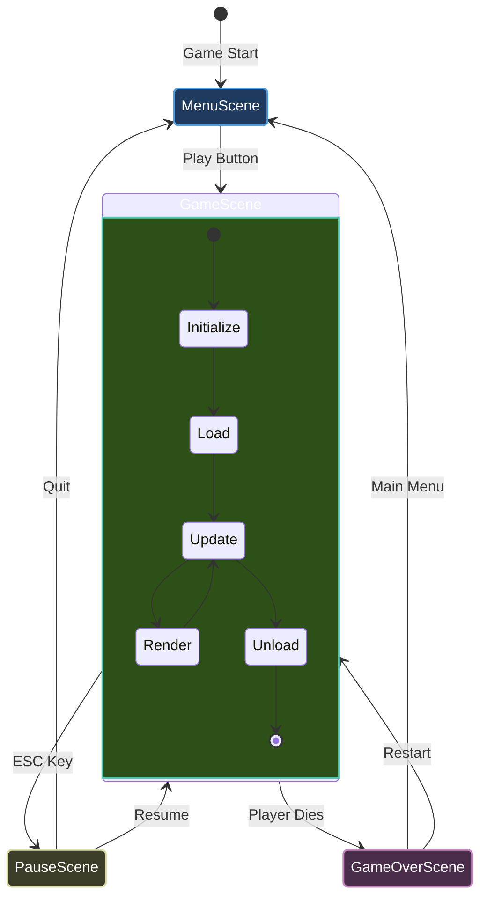
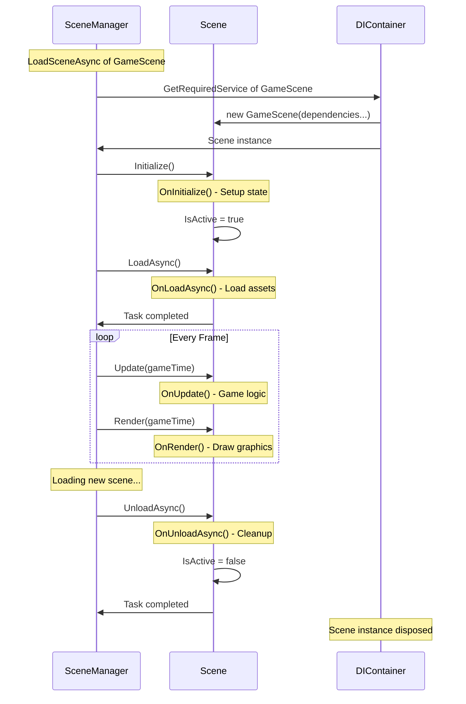

# Scene Management

**Scenes** are the building blocks of your game. Think of them like **ASP.NET Controllers** - each scene handles a specific part of your game (menu, gameplay, pause screen, etc.).

## What is a Scene?

A scene represents a distinct state or screen in your game. Common examples:

| Scene | Purpose |
|-------|---------|
| `MenuScene` | Title screen, options |
| `GameScene` | Main gameplay |
| `PauseScene` | Pause menu overlay |
| `GameOverScene` | End game screen |
| `LoadingScene` | Asset loading screen |



---

## Scene Lifecycle

Every scene goes through a **5-phase lifecycle**:



### Phase 1: Constructor (Dependency Injection)

**Purpose:** Receive dependencies via constructor injection

```csharp
public class GameScene : Scene
{
    private readonly IRenderer _renderer;
    private readonly IInputService _input;
    private readonly IGameContext _gameContext;
    
    // Constructor injection (DI)
    public GameScene(
        IRenderer renderer,
        IInputService input,
        IGameContext gameContext,
        ILogger<GameScene> logger
    ) : base(logger)
    {
        _renderer = renderer;
        _input = input;
        _gameContext = gameContext;
    }
}
```

**✅ DO:** Store dependencies in readonly fields  
**❌ DON'T:** Initialize game state here (use `OnInitialize` instead)

---

### Phase 2: Initialize

**Purpose:** Set up initial scene state (synchronous)

```csharp
protected override void OnInitialize()
{
    Logger.LogInformation("Game scene initialized!");
    
    // Setup camera
    _camera = new Camera2D(1280, 720);
    _renderer.Camera = _camera;
    
    // Initialize game objects
    _player = new Player { Position = new Vector2(400, 300) };
    _enemies = new List<Enemy>();
    
    // Register collision shapes
    _collisionSystem.AddShape(_playerCollider);
}
```

**When:** Called once when scene is created  
**Use for:** 
- Creating game objects
- Setting up systems
- Initializing non-async resources

**❌ DON'T:** Load assets here (use `OnLoadAsync`)

---

### Phase 3: Load (Async)

**Purpose:** Load assets and resources asynchronously

```csharp
protected override async Task OnLoadAsync(CancellationToken cancellationToken)
{
    Logger.LogInformation("Loading assets...");
    
    // Load textures
    _playerTexture = await _textureLoader.LoadTextureAsync(
        "assets/player.png",
        TextureScaleMode.Nearest,
        cancellationToken);
    
    // Load sprites
    _enemyTexture = await _textureLoader.LoadTextureAsync(
        "assets/enemy.png",
        TextureScaleMode.Nearest,
        cancellationToken);
    
    // Load audio
    _bgMusic = await _audio.LoadMusicAsync(
        "assets/music.mp3",
        cancellationToken);
    
    _audio.PlayMusic(_bgMusic);
    
    Logger.LogInformation("Assets loaded!");
}
```

**When:** Called once after `Initialize`  
**Use for:**
- Loading textures/sprites
- Loading audio
- Loading fonts
- Reading level data
- Any I/O operations

**✅ DO:** Use `cancellationToken` for long operations  
**✅ DO:** Load assets in parallel when possible

```csharp
// Parallel loading
var loadTasks = new[]
{
    _textureLoader.LoadTextureAsync("player.png", cancellationToken),
    _textureLoader.LoadTextureAsync("enemy.png", cancellationToken),
    _audio.LoadMusicAsync("music.mp3", cancellationToken)
};

await Task.WhenAll(loadTasks);
```

---

### Phase 4: Update (Every Frame)

**Purpose:** Update game logic

```csharp
protected override void OnUpdate(GameTime gameTime)
{
    var deltaTime = (float)gameTime.DeltaTime;
    
    // Input handling
    if (_input.IsKeyPressed(Keys.Escape))
    {
        _gameContext.RequestExit();
    }
    
    // Player movement
    var movement = Vector2.Zero;
    if (_input.IsKeyDown(Keys.W)) movement.Y -= 1;
    if (_input.IsKeyDown(Keys.S)) movement.Y += 1;
    if (_input.IsKeyDown(Keys.A)) movement.X -= 1;
    if (_input.IsKeyDown(Keys.D)) movement.X += 1;
    
    if (movement != Vector2.Zero)
    {
        movement = Vector2.Normalize(movement);
        _playerPosition += movement * _speed * deltaTime;
    }
    
    // Update animations
    _animator?.Update(deltaTime);
    
    // Update physics
    foreach (var enemy in _enemies)
    {
        enemy.Update(deltaTime);
    }
    
    // Check collisions
    CheckCollisions();
}
```

**When:** Called every frame (~60 times per second)  
**Use for:**
- Input processing
- Physics updates
- AI logic
- Animation updates
- Collision detection

**⚠️ Important:** Always use `deltaTime` for frame-rate independence!

---

### Phase 5: Render (Every Frame)

**Purpose:** Draw graphics to screen

```csharp
protected override void OnRender(GameTime gameTime)
{
    _renderer.Clear(new Color(40, 40, 40));
    _renderer.BeginFrame();
    
    // Draw background
    DrawBackground();
    
    // Draw game objects
    DrawPlayer();
    DrawEnemies();
    DrawProjectiles();
    
    // Draw UI
    DrawUI();
    
    _renderer.EndFrame();
}

private void DrawPlayer()
{
    if (_playerTexture != null)
    {
        _renderer.DrawTexture(
            _playerTexture,
            _playerPosition.X,
            _playerPosition.Y);
    }
}
```

**When:** Called every frame after `Update`  
**Use for:**
- Drawing sprites
- Drawing UI
- Debug visualization

**❌ DON'T:** Update game logic here (use `OnUpdate`)

---

### Phase 6: Unload (Async)

**Purpose:** Clean up resources

```csharp
protected override Task OnUnloadAsync(CancellationToken cancellationToken)
{
    Logger.LogInformation("Unloading scene...");
    
    // Stop audio
    _audio.StopMusic();
    
    // Unload textures
    if (_playerTexture != null)
    {
        _textureLoader.UnloadTexture(_playerTexture);
    }
    
    if (_enemyTexture != null)
    {
        _textureLoader.UnloadTexture(_enemyTexture);
    }
    
    // Clean up collision system
    _collisionSystem.Clear();
    
    Logger.LogInformation("Scene unloaded");
    return Task.CompletedTask;
}
```

**When:** Called when switching to another scene  
**Use for:**
- Unloading assets
- Stopping audio
- Clearing collections
- Disposing resources

**⚠️ Scoped services** (like `CollisionSystem`, `UICanvas`) are automatically disposed after this!

---

## Scene Registration

### Step 1: Register Scene

```csharp Program.cs
var builder = GameApplication.CreateBuilder(args);

// Register scenes
builder.Services.AddScene<MenuScene>();
builder.Services.AddScene<GameScene>();
builder.Services.AddScene<PauseScene>();
builder.Services.AddScene<GameOverScene>();

var game = builder.Build();
```

**What it does:**
- Registers scene as **transient** (new instance each time)
- Makes scene available for DI resolution

---

### Step 2: Set Initial Scene

```csharp
// Run with MenuScene as starting scene
await game.RunAsync<MenuScene>();
```

---

## Scene Transitions

### Method 1: Via SceneManager (Injected)

```csharp
public class MenuScene : Scene
{
    private readonly ISceneManager _sceneManager;
    
    public MenuScene(
        ISceneManager sceneManager,
        ILogger<MenuScene> logger
    ) : base(logger)
    {
        _sceneManager = sceneManager;
    }
    
    protected override void OnUpdate(GameTime gameTime)
    {
        if (_input.IsKeyPressed(Keys.Enter))
        {
            // Transition to GameScene
            _ = _sceneManager.LoadSceneAsync<GameScene>();
        }
    }
}
```

---

### Method 2: Via Game Context (Common Pattern)

```csharp
public class GameScene : Scene
{
    private readonly IGameContext _gameContext;
    
    protected override void OnUpdate(GameTime gameTime)
    {
        if (_playerHealth <= 0)
        {
            // Request scene transition
            _gameContext.RequestExit(); // Or custom transition logic
        }
    }
}
```

---

## Complete Scene Example

Here's a full scene with all lifecycle phases:

```csharp GameScene.cs
using Brine2D.Core;
using Brine2D.Input;
using Brine2D.Rendering;
using Microsoft.Extensions.Logging;
using System.Numerics;

public class GameScene : Scene
{
    // ============================================
    // STEP 1: Dependencies (Constructor)
    // ============================================
    private readonly IRenderer _renderer;
    private readonly IInputService _input;
    private readonly IGameContext _gameContext;
    private readonly ITextureLoader _textureLoader;
    
    public GameScene(
        IRenderer renderer,
        IInputService input,
        IGameContext gameContext,
        ITextureLoader textureLoader,
        ILogger<GameScene> logger
    ) : base(logger)
    {
        _renderer = renderer;
        _input = input;
        _gameContext = gameContext;
        _textureLoader = textureLoader;
    }
    
    // ============================================
    // STEP 2: Scene State
    // ============================================
    private ITexture? _playerTexture;
    private Vector2 _playerPosition;
    private float _playerSpeed = 200f;
    
    // ============================================
    // STEP 3: Initialize
    // ============================================
    protected override void OnInitialize()
    {
        Logger.LogInformation("Game scene initialized!");
        
        // Set initial position
        _playerPosition = new Vector2(400, 300);
    }
    
    // ============================================
    // STEP 4: Load Assets
    // ============================================
    protected override async Task OnLoadAsync(CancellationToken cancellationToken)
    {
        Logger.LogInformation("Loading game assets...");
        
        _playerTexture = await _textureLoader.LoadTextureAsync(
            "assets/player.png",
            TextureScaleMode.Nearest,
            cancellationToken);
        
        Logger.LogInformation("Assets loaded!");
    }
    
    // ============================================
    // STEP 5: Update Logic
    // ============================================
    protected override void OnUpdate(GameTime gameTime)
    {
        var deltaTime = (float)gameTime.DeltaTime;
        
        // Exit on ESC
        if (_input.IsKeyPressed(Keys.Escape))
        {
            _gameContext.RequestExit();
        }
        
        // Movement
        var movement = Vector2.Zero;
        if (_input.IsKeyDown(Keys.W)) movement.Y -= 1;
        if (_input.IsKeyDown(Keys.S)) movement.Y += 1;
        if (_input.IsKeyDown(Keys.A)) movement.X -= 1;
        if (_input.IsKeyDown(Keys.D)) movement.X += 1;
        
        if (movement != Vector2.Zero)
        {
            movement = Vector2.Normalize(movement);
            _playerPosition += movement * _playerSpeed * deltaTime;
        }
    }
    
    // ============================================
    // STEP 6: Render
    // ============================================
    protected override void OnRender(GameTime gameTime)
    {
        _renderer.Clear(Color.CornflowerBlue);
        _renderer.BeginFrame();
        
        if (_playerTexture != null)
        {
            _renderer.DrawTexture(
                _playerTexture,
                _playerPosition.X,
                _playerPosition.Y);
        }
        
        _renderer.EndFrame();
    }
    
    // ============================================
    // STEP 7: Cleanup
    // ============================================
    protected override Task OnUnloadAsync(CancellationToken cancellationToken)
    {
        Logger.LogInformation("Unloading game scene...");
        
        if (_playerTexture != null)
        {
            _textureLoader.UnloadTexture(_playerTexture);
        }
        
        return Task.CompletedTask;
    }
}
```

---

## Scene Manager

The `SceneManager` orchestrates scene lifecycle:

```csharp
public interface ISceneManager
{
    IScene? CurrentScene { get; }
    
    Task LoadSceneAsync<TScene>(CancellationToken ct = default) 
        where TScene : IScene;
    
    void Update(GameTime gameTime);
    void Render(GameTime gameTime);
}
```

**What it does:**
1. ✅ Resolves scene from DI
2. ✅ Calls lifecycle methods in correct order
3. ✅ Manages current scene state
4. ✅ Handles scene transitions

---

## Best Practices

### DO

1. **Use dependency injection**
   ```csharp
   public GameScene(IRenderer renderer, ...) : base(logger)
   ```

2. **Initialize in `OnInitialize`**
   ```csharp
   protected override void OnInitialize()
   {
       _player = new Player();
   }
   ```

3. **Load assets in `OnLoadAsync`**
   ```csharp
   protected override async Task OnLoadAsync(CancellationToken ct)
   {
       _texture = await _textureLoader.LoadTextureAsync(..., ct);
   }
   ```

4. **Use delta time in `OnUpdate`**
   ```csharp
   position += velocity * speed * deltaTime;
   ```

5. **Separate logic from rendering**
   - Update: game logic only
   - Render: drawing only

6. **Clean up in `OnUnloadAsync`**
   ```csharp
   protected override Task OnUnloadAsync(CancellationToken ct)
   {
       _textureLoader.UnloadTexture(_texture);
       return Task.CompletedTask;
   }
   ```

### DON'T

1. **Don't load assets in constructor**
   ```csharp
   // ❌ Bad
   public GameScene(...)
   {
       _texture = LoadTexture(); // Synchronous!
   }
   ```

2. **Don't update logic in `OnRender`**
   ```csharp
   // ❌ Bad
   protected override void OnRender(GameTime gt)
   {
       _player.Update(); // Wrong place!
   }
   ```

3. **Don't use fixed values**
   ```csharp
   // ❌ Bad
   position += velocity; // Frame-rate dependent!
   ```

4. **Don't forget to unload**
   ```csharp
   // ❌ Memory leak!
   protected override Task OnUnloadAsync(CancellationToken ct)
   {
       // Forgot to unload _texture!
       return Task.CompletedTask;
   }
   ```

---

## Advanced Patterns

### Shared State Between Scenes

```csharp
// Create a shared service
public class GameState
{
    public int PlayerScore { get; set; }
    public int PlayerLevel { get; set; }
}

// Register as singleton
builder.Services.AddSingleton<GameState>();

// Inject into scenes
public class GameScene : Scene
{
    private readonly GameState _gameState;
    
    public GameScene(GameState gameState, ...)
    {
        _gameState = gameState;
    }
    
    protected override void OnUpdate(GameTime gt)
    {
        _gameState.PlayerScore += points;
    }
}
```

---

### Scene Data Transfer

```csharp
// Option 1: Via shared service
public class SceneTransitionData
{
    public string NextLevel { get; set; }
    public int PlayerHealth { get; set; }
}

builder.Services.AddSingleton<SceneTransitionData>();

// Option 2: Via SceneManager extension
public static class SceneManagerExtensions
{
    public static Task LoadGameSceneAsync(
        this ISceneManager sceneManager,
        string level,
        int health)
    {
        // Store data and load scene
        // Implementation specific to your needs
    }
}
```

---

## Troubleshooting

### Scene Not Loading

**Symptom:** Scene doesn't appear

**Solutions:**
1. Check scene is registered:
   ```csharp
   builder.Services.AddScene<GameScene>();
   ```

2. Check `RunAsync` has correct type:
   ```csharp
   await game.RunAsync<GameScene>(); // ✅ Correct
   ```

---

### Assets Not Unloading

**Symptom:** Memory usage keeps growing

**Solution:** Always unload in `OnUnloadAsync`:
```csharp
protected override Task OnUnloadAsync(CancellationToken ct)
{
    _textureLoader.UnloadTexture(_texture);
    _audio.UnloadMusic(_music);
    return Task.CompletedTask;
}
```

---

### Scene State Persists

**Symptom:** Old scene state affects new scene

**Cause:** Scenes are **transient** - new instance each load

**Solution:** Don't rely on scene fields persisting. Use shared services for persistent state.

---

## Summary

| Phase | Method | Purpose | When |
|-------|--------|---------|------|
| **Constructor** | `__init__` | DI | Scene created |
| **Initialize** | `OnInitialize()` | Setup | Once at start |
| **Load** | `OnLoadAsync()` | Load assets | Once (async) |
| **Update** | `OnUpdate(gt)` | Game logic | Every frame |
| **Render** | `OnRender(gt)` | Draw graphics | Every frame |
| **Unload** | `OnUnloadAsync()` | Cleanup | Scene change |

---

## Next Steps

- **[Game Loop](game-loop.md)** - Understand how scenes fit in the loop
- **[Dependency Injection](dependency-injection.md)** - Master scene dependencies
- **[Asset Loading](../guides/assets.md)** - Learn asset management
- **[Input Handling](../guides/input.md)** - Process player input

---

Scenes keep your game organized and maintainable!