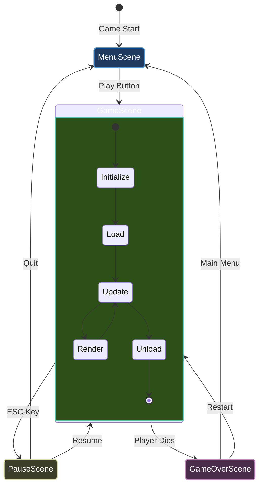
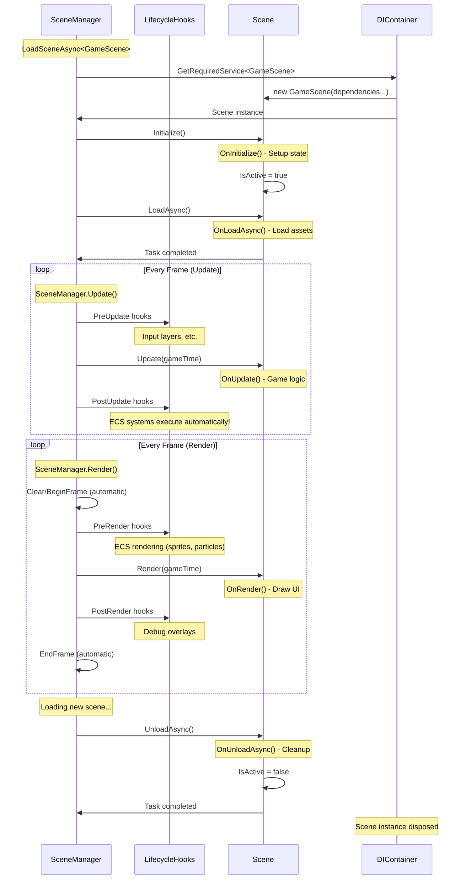

# Scene Management

**Scenes** are the building blocks of your game. Think of them like **ASP.NET Controllers** - each scene handles a specific part of your game (menu, gameplay, pause screen, etc.).

## What is a Scene?

A scene represents a distinct state or screen in your game. Common examples:

| Scene | Purpose |
|-------|---------|
| `MenuScene` | Title screen, options |
| `GameScene` | Main gameplay |
| `PauseScene` | Pause menu overlay |
| `GameOverScene` | End game screen |
| `LoadingScene` | Asset loading screen |



---

## Scene Lifecycle

Every scene goes through a **5-phase lifecycle** with automatic ECS and frame management:



### Phase 1: Constructor (Dependency Injection)

**Purpose:** Receive dependencies via constructor injection

```csharp
public class GameScene : Scene
{
    private readonly IRenderer _renderer;
    private readonly IInputService _input;
    private readonly IGameContext _gameContext;
    private readonly IEntityWorld _world; // ECS support
    
    // Constructor injection (DI)
    public GameScene(
        IRenderer renderer,
        IInputService input,
        IGameContext gameContext,
        IEntityWorld world,
        ILogger<GameScene> logger
    ) : base(logger)
    {
        _renderer = renderer;
        _input = input;
        _gameContext = gameContext;
        _world = world;
    }
}
```

**✅ DO:** Store dependencies in readonly fields  
**❌ DON'T:** Initialize game state here (use `OnInitialize` instead)

---

### Phase 2: Initialize

**Purpose:** Set up initial scene state (synchronous)

```csharp
protected override void OnInitialize()
{
    Logger.LogInformation("Game scene initialized!");
    
    // Set clear color (automatic frame management uses this)
    _renderer.ClearColor = new Color(40, 40, 60);
    
    // Create ECS entities
    var player = _world.CreateEntity("Player");
    player.AddComponent<TransformComponent>().Position = new Vector2(400, 300);
    player.AddComponent<PlayerControllerComponent>();
    
    // Create enemies
    for (int i = 0; i < 5; i++)
    {
        var enemy = _world.CreateEntity($"Enemy{i}");
        enemy.AddComponent<TransformComponent>();
        enemy.AddComponent<AIControllerComponent>();
    }
}
```

**When:** Called once when scene is created  
**Use for:** 
- Creating game objects/entities
- Setting up scene state
- Configuring clear color
- Initializing non-async resources

**❌ DON'T:** Load assets here (use `OnLoadAsync`)

---

### Phase 3: Load (Async)

**Purpose:** Load assets and resources asynchronously

```csharp
protected override async Task OnLoadAsync(CancellationToken cancellationToken)
{
    Logger.LogInformation("Loading assets...");
    
    // Load textures
    _playerTexture = await _textureLoader.LoadTextureAsync(
        "assets/player.png",
        TextureScaleMode.Nearest,
        cancellationToken);
    
    // Load audio
    _bgMusic = await _audio.LoadMusicAsync(
        "assets/music.mp3",
        cancellationToken);
    
    _audio.PlayMusic(_bgMusic);
    
    Logger.LogInformation("Assets loaded!");
}
```

**When:** Called once after `Initialize`  
**Use for:**
- Loading textures/sprites
- Loading audio
- Loading fonts
- Reading level data
- Any I/O operations

**✅ DO:** Use `cancellationToken` for long operations  
**✅ DO:** Load assets in parallel when possible

```csharp
// Parallel loading
var loadTasks = new[]
{
    _textureLoader.LoadTextureAsync("player.png", cancellationToken),
    _textureLoader.LoadTextureAsync("enemy.png", cancellationToken),
    _audio.LoadMusicAsync("music.mp3", cancellationToken)
};

await Task.WhenAll(loadTasks);
```

---

### Phase 4: Update (Every Frame)

**Purpose:** Update game logic

```csharp
protected override void OnUpdate(GameTime gameTime)
{
    var deltaTime = (float)gameTime.DeltaTime;
    
    // Input handling
    if (_input.IsKeyPressed(Keys.Escape))
    {
        _gameContext.RequestExit();
    }
    
    // Scene-specific logic
    HandlePlayerInput();
    CheckWinCondition();
    
    // NO MANUAL PIPELINE CALLS NEEDED!
    // ECS systems execute automatically via lifecycle hooks!
    // VelocitySystem, PhysicsSystem, etc. all run automatically
}
```

**When:** Called every frame (~60 times per second)  
**Use for:**
- Input processing
- Scene-specific logic
- Win/lose conditions
- Scene transitions

**Automatic ECS Execution**

You **no longer need** to manually call:

- ❌ `_updatePipeline.Execute(gameTime)` - **Runs automatically!**
- ❌ `_world.Update(gameTime)` - **Runs automatically!**

**Behind the scenes,** `SceneManager` executes:

1. **PreUpdate hooks** (input layers, camera setup)
2. **Your `OnUpdate()`** (scene logic)
3. **PostUpdate hooks** (ECS systems, physics, AI)

This happens automatically via lifecycle hooks!

---

### Phase 5: Render (Every Frame)

**Purpose:** Draw scene-specific graphics (UI, debug overlays)

```csharp
protected override void OnRender(GameTime gameTime)
{
    // NO FRAME MANAGEMENT NEEDED!
    // SceneManager handles Clear/BeginFrame/EndFrame automatically
    
    // NO PIPELINE CALLS NEEDED!
    // ECS render systems (sprites, particles) already drew automatically
    
    // Just draw your scene-specific UI
    DrawUI();
    DrawDebugInfo();
}

private void DrawUI()
{
    _renderer.DrawText($"Score: {_score}", 10, 10, Color.White);
    _renderer.DrawText($"Lives: {_lives}", 10, 35, Color.White);
}
```

**When:** Called every frame after `Update`  
**Use for:**
- Drawing UI overlays
- Debug visualization
- Scene-specific rendering

**Automatic Frame Management**

You **no longer need** to call:
- ❌ `_renderer.Clear(color)` - **Handled automatically!**
- ❌ `_renderer.BeginFrame()` - **Handled automatically!**
- ❌ `_renderer.EndFrame()` - **Handled automatically!**

**Behind the scenes,** `SceneManager` executes:
1. **Clear screen** (uses `_renderer.ClearColor` you set in `OnInitialize`)
2. **BeginFrame()**
3. **PreRender hooks** (ECS sprites, particles)
4. **Your `OnRender()`** (UI, debug)
5. **PostRender hooks** (debug overlays)
6. **EndFrame()**

**❌ DON'T:** Update game logic here (use `OnUpdate`)

---

### Phase 6: Unload (Async)

**Purpose:** Clean up resources

```csharp
protected override Task OnUnloadAsync(CancellationToken cancellationToken)
{
    Logger.LogInformation("Unloading scene...");
    
    // Stop audio
    _audio.StopMusic();
    
    // Unload textures
    if (_playerTexture != null)
    {
        _textureLoader.UnloadTexture(_playerTexture);
    }
    
    Logger.LogInformation("Scene unloaded");
    return Task.CompletedTask;
}
```

**When:** Called when switching to another scene  
**Use for:**
- Unloading assets
- Stopping audio
- Clearing collections
- Disposing resources

---

## Complete Scene Example (Modern Approach)

Here's a full scene with automatic ECS execution:

```csharp
using Brine2D.Core;
using Brine2D.ECS;
using Brine2D.ECS.Components;
using Brine2D.Input;
using Brine2D.Rendering;
using Microsoft.Extensions.Logging;
using System.Numerics;

public class GameScene : Scene
{
    private readonly IRenderer _renderer;
    private readonly IInputService _input;
    private readonly IGameContext _gameContext;
    private readonly IEntityWorld _world;
    
    private Entity? _player;
    private int _score;
    
    public GameScene(
        IRenderer renderer,
        IInputService input,
        IGameContext gameContext,
        IEntityWorld world,
        ILogger<GameScene> logger
    ) : base(logger)
    {
        _renderer = renderer;
        _input = input;
        _gameContext = gameContext;
        _world = world;
    }
    
    protected override void OnInitialize()
    {
        Logger.LogInformation("Game scene initialized!");
        
        // Set clear color (automatic frame management uses this)
        _renderer.ClearColor = new Color(40, 40, 60);
        
        // Create player entity
        _player = _world.CreateEntity("Player");
        _player.Tags.Add("Player");
        
        var transform = _player.AddComponent<TransformComponent>();
        transform.Position = new Vector2(400, 300);
        
        _player.AddComponent<VelocityComponent>();
        _player.AddComponent<PlayerControllerComponent>();
        _player.AddComponent<SpriteComponent>().TexturePath = "assets/player.png";
    }
    
    protected override async Task OnLoadAsync(CancellationToken cancellationToken)
    {
        Logger.LogInformation("Loading game assets...");
        // Textures are loaded automatically by SpriteRenderingSystem
        Logger.LogInformation("Assets loaded!");
    }
    
    protected override void OnUpdate(GameTime gameTime)
    {
        if (_input.IsKeyPressed(Keys.Escape))
        {
            _gameContext.RequestExit();
        }
        
        CheckCollisions();
        UpdateScore();
        
        // ECS systems run automatically!
        // No manual pipeline calls needed
    }
    
    protected override void OnRender(GameTime gameTime)
    {
        // Frame management is automatic!
        // Sprites already rendered via ECS!
        
        // Just draw scene-specific UI
        _renderer.DrawText($"Score: {_score}", 10, 10, Color.White);
    }
    
    protected override Task OnUnloadAsync(CancellationToken cancellationToken)
    {
        Logger.LogInformation("Unloading game scene...");
        return Task.CompletedTask;
    }
    
    private void CheckCollisions() { /* ... */ }
    private void UpdateScore() { /* ... */ }
}
```

---

## Power User: Manual Control

For advanced scenarios, you can **opt out** of automatic behavior:

```csharp
public class AdvancedScene : Scene
{
    // Disable automatic ECS execution
    public override bool EnableLifecycleHooks => false;
    
    // Disable automatic frame management
    public override bool EnableAutomaticFrameManagement => false;
    
    private readonly UpdatePipeline _updatePipeline;
    private readonly RenderPipeline _renderPipeline;
    private readonly IEntityWorld _world;
    private readonly IRenderer _renderer;
    
    public AdvancedScene(
        UpdatePipeline updatePipeline,
        RenderPipeline renderPipeline,
        IEntityWorld world,
        IRenderer renderer,
        ILogger<AdvancedScene> logger
    ) : base(logger)
    {
        _updatePipeline = updatePipeline;
        _renderPipeline = renderPipeline;
        _world = world;
        _renderer = renderer;
    }
    
    protected override void OnUpdate(GameTime gameTime)
    {
        // Manual control - you decide when systems run
        if (_someCondition)
        {
            _updatePipeline.Execute(gameTime);
            _world.Update(gameTime);
        }
    }
    
    protected override void OnRender(GameTime gameTime)
    {
        // Manual frame management
        _renderer.Clear(Color.Black);
        _renderer.BeginFrame();
        
        _renderPipeline.Execute(_renderer);
        DrawCustomUI();
        
        _renderer.EndFrame();
    }
}
```

**Use cases for manual control:**
- Multi-pass rendering
- Custom render targets
- Pausing systems conditionally
- Frame-by-frame debugging
- Post-processing effects

---

## Scene Registration

### Step 1: Register Scene

```csharp
var builder = GameApplication.CreateBuilder(args);

// Register scenes
builder.Services.AddScene<MenuScene>();
builder.Services.AddScene<GameScene>();
builder.Services.AddScene<PauseScene>();
builder.Services.AddScene<GameOverScene>();

var game = builder.Build();
```

**What it does:**
- Registers scene as **transient** (new instance each time)
- Makes scene available for DI resolution

---

### Step 2: Set Initial Scene

```csharp
// Run with MenuScene as starting scene
await game.RunAsync<MenuScene>();
```

---

## Scene Transitions

### Method 1: Via SceneManager (Injected)

```csharp
public class MenuScene : Scene
{
    private readonly ISceneManager _sceneManager;
    
    public MenuScene(
        ISceneManager sceneManager,
        ILogger<MenuScene> logger
    ) : base(logger)
    {
        _sceneManager = sceneManager;
    }
    
    protected override void OnUpdate(GameTime gameTime)
    {
        if (_input.IsKeyPressed(Keys.Enter))
        {
            // Transition to GameScene
            _ = _sceneManager.LoadSceneAsync<GameScene>();
        }
    }
}
```

---

### Method 2: Via Game Context (Common Pattern)

```csharp
public class GameScene : Scene
{
    private readonly IGameContext _gameContext;
    
    protected override void OnUpdate(GameTime gameTime)
    {
        if (_playerHealth <= 0)
        {
            // Request scene transition
            _gameContext.RequestExit(); // Or custom transition logic
        }
    }
}
```

---

## Scene Manager

The `SceneManager` orchestrates scene lifecycle automatically:

```csharp
public interface ISceneManager
{
    IScene? CurrentScene { get; }
    
    Task LoadSceneAsync<TScene>(CancellationToken ct = default) 
        where TScene : IScene;
    
    void Update(GameTime gameTime);
    void Render(GameTime gameTime);
}
```

**What it does automatically:**
1. ✅ Resolves scene from DI
2. ✅ Calls lifecycle methods in correct order
3. ✅ **Executes lifecycle hooks (ECS systems)**
4. ✅ **Handles frame management (Clear/Begin/End)**
5. ✅ Manages current scene state
6. ✅ Handles scene transitions

---

## Best Practices

### DO ✅

1. **Use dependency injection**
   ```csharp
   public GameScene(IRenderer renderer, IEntityWorld world, ...) : base(logger)
   ```

2. **Initialize in `OnInitialize`**
   ```csharp
   protected override void OnInitialize()
   {
       _renderer.ClearColor = new Color(40, 40, 60);
       _player = _world.CreateEntity("Player");
   }
   ```

3. **Load assets in `OnLoadAsync`**
   ```csharp
   protected override async Task OnLoadAsync(CancellationToken ct)
   {
       _texture = await _textureLoader.LoadTextureAsync(..., ct);
   }
   ```

4. **Trust automatic execution**
   ```csharp
   // ✅ Clean - systems run automatically
   protected override void OnUpdate(GameTime gameTime)
   {
       HandleInput();
       CheckWinCondition();
   }
   ```

5. **Draw only UI in `OnRender`**
   ```csharp
   // ✅ Sprites already rendered by ECS
   protected override void OnRender(GameTime gameTime)
   {
       _renderer.DrawText($"Score: {_score}", 10, 10, Color.White);
   }
   ```

6. **Clean up in `OnUnloadAsync`**
   ```csharp
   protected override Task OnUnloadAsync(CancellationToken ct)
   {
       _textureLoader.UnloadTexture(_texture);
       return Task.CompletedTask;
   }
   ```

### DON'T ❌

1. **Don't manually call pipelines (unless opting out)**
   ```csharp
   // ❌ Unnecessary - runs automatically!
   protected override void OnUpdate(GameTime gameTime)
   {
       _updatePipeline.Execute(gameTime); // Don't do this!
       _world.Update(gameTime); // Don't do this!
   }
   ```

2. **Don't manually manage frames (unless opting out)**
   ```csharp
   // ❌ Unnecessary - automatic!
   protected override void OnRender(GameTime gameTime)
   {
       _renderer.Clear(Color.Black); // Don't do this!
       _renderer.BeginFrame(); // Don't do this!
       
       DrawUI();
       
       _renderer.EndFrame(); // Don't do this!
   }
   ```

3. **Don't update logic in `OnRender`**
   ```csharp
   // ❌ Bad
   protected override void OnRender(GameTime gt)
   {
       _player.Update(); // Wrong place!
   }
   ```

4. **Don't forget to unload**
   ```csharp
   // ❌ Memory leak!
   protected override Task OnUnloadAsync(CancellationToken ct)
   {
       // Forgot to unload _texture!
       return Task.CompletedTask;
   }
   ```

---

## Advanced Patterns

### Shared State Between Scenes

```csharp
// Create a shared service
public class GameState
{
    public int PlayerScore { get; set; }
    public int PlayerLevel { get; set; }
}

// Register as singleton
builder.Services.AddSingleton<GameState>();

// Inject into scenes
public class GameScene : Scene
{
    private readonly GameState _gameState;
    
    public GameScene(GameState gameState, ...)
    {
        _gameState = gameState;
    }
    
    protected override void OnUpdate(GameTime gt)
    {
        _gameState.PlayerScore += points;
    }
}
```

---

### Scene Data Transfer

```csharp
// Option 1: Via shared service
public class SceneTransitionData
{
    public string NextLevel { get; set; }
    public int PlayerHealth { get; set; }
}

builder.Services.AddSingleton<SceneTransitionData>();

// Option 2: Via SceneManager extension
public static class SceneManagerExtensions
{
    public static Task LoadGameSceneAsync(
        this ISceneManager sceneManager,
        string level,
        int health)
    {
        // Store data and load scene
        // Implementation specific to your needs
    }
}
```

---

## Troubleshooting

### Scene Not Loading

**Symptom:** Scene doesn't appear

**Solutions:**
1. Check scene is registered:
   ```csharp
   builder.Services.AddScene<GameScene>();
   ```

2. Check `RunAsync` has correct type:
   ```csharp
   await game.RunAsync<GameScene>(); // ✅ Correct
   ```

---

### Assets Not Unloading

**Symptom:** Memory usage keeps growing

**Solution:** Always unload in `OnUnloadAsync`:
```csharp
protected override Task OnUnloadAsync(CancellationToken ct)
{
    _textureLoader.UnloadTexture(_texture);
    _audio.UnloadMusic(_music);
    return Task.CompletedTask;
}
```

---

### Scene State Persists

**Symptom:** Old scene state affects new scene

**Cause:** Scenes are **transient** - new instance each load

**Solution:** Don't rely on scene fields persisting. Use shared services for persistent state.

---

## Summary

| Phase | Method | Purpose | What's Automatic |
|-------|--------|---------|------------------|
| **Constructor** | `__init__` | DI | - |
| **Initialize** | `OnInitialize()` | Setup | - |
| **Load** | `OnLoadAsync()` | Load assets | - |
| **Update** | `OnUpdate(gt)` | Scene logic | ECS systems, World update |
| **Render** | `OnRender(gt)` | Draw UI | Frame management, ECS rendering |
| **Unload** | `OnUnloadAsync()` | Cleanup | - |

---

## Next Steps

- **[Game Loop](game-loop.md)** - Understand how scenes fit in the loop
- **[Dependency Injection](dependency-injection.md)** - Master scene dependencies
- **[ECS Systems](../guides/ecs/systems.md)** - Create systems that run automatically
- **[Input Handling](../guides/input/keyboard.md)** - Process player input

---

**Scenes are now cleaner than ever!** Trust automatic execution and focus on game logic. 🚀