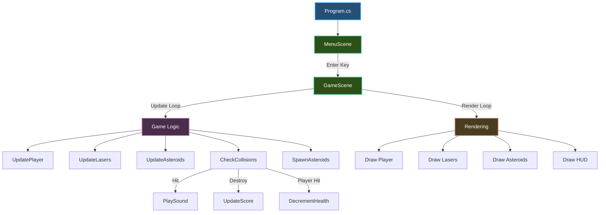

# Your First Game

Build a complete game from scratch - a simple asteroid shooter with sprites, audio, collision detection, and scoring.

## What You'll Build

A space shooter game featuring:

- Player spaceship controlled with arrow keys
- Asteroids to avoid
- Laser shooting mechanics
- Collision detection
- Score tracking
- Sound effects and music
- Game over and restart

**Time required:** 30-45 minutes

**Prerequisites:**
- Completed [Quick Start](quickstart.md)
- Basic C# knowledge
- .NET 10 SDK installed

---

## Project Setup

### Step 1: Create Project

Create a new game project:

```sh
dotnet new console -n AsteroidShooter
cd AsteroidShooter
```

### Step 2: Install Packages

Add Brine2D packages:

```sh
dotnet add package Brine2D --version 0.9.0-beta
dotnet add package Brine2D.SDL --version 0.9.0-beta
```

### Step 3: Create Asset Folders

Organize your assets:

```sh
mkdir -p assets/textures
mkdir -p assets/sounds
mkdir -p assets/music
```

**Project structure:**

```
AsteroidShooter/
├── AsteroidShooter.csproj
├── Program.cs
├── GameScene.cs
├── MenuScene.cs
└── assets/
    ├── textures/
    │   ├── player.png       (64x64 spaceship)
    │   ├── asteroid.png     (32x32 rock)
    │   └── laser.png        (16x4 laser beam)
    ├── sounds/
    │   ├── shoot.wav
    │   ├── explosion.wav
    │   └── hit.wav
    └── music/
        └── background.mp3
```

**Note:** For this tutorial, you can use simple colored rectangles instead of images, or download free assets from [itch.io](https://itch.io/game-assets/free) or [OpenGameArt](https://opengameart.org/).

---

## Core Game Logic

### Step 4: Create Game Entities

Create `GameEntities.cs` to define our game objects:

```csharp
using System.Numerics;

namespace AsteroidShooter;

public class Player
{
    public Vector2 Position { get; set; }
    public float Speed { get; set; } = 300f;
    public int Health { get; set; } = 3;
    public bool IsAlive => Health > 0;
}

public class Asteroid
{
    public Vector2 Position { get; set; }
    public Vector2 Velocity { get; set; }
    public float Size { get; set; } = 32f;
    public bool IsActive { get; set; } = true;
}

public class Laser
{
    public Vector2 Position { get; set; }
    public Vector2 Velocity { get; set; } = new(0, -500f);
    public bool IsActive { get; set; } = true;
}
```

**What this does:**
- Defines data structures for game objects
- Keeps game state separate from rendering logic
- Simple properties for position, velocity, health

---

### Step 5: Create Game Scene

Create `GameScene.cs`:

```csharp
using Brine2D.Audio;
using Brine2D.Core;
using Brine2D.Engine;
using Brine2D.Input;
using Brine2D.Rendering;
using Microsoft.Extensions.Logging;
using System.Numerics;

namespace AsteroidShooter;

public class GameScene : Scene
{
    private readonly IRenderer _renderer;
    private readonly IInputService _input;
    private readonly IAudioService _audio;
    private readonly IGameContext _gameContext;
    
    private Player _player;
    private readonly List<Asteroid> _asteroids = new();
    private readonly List<Laser> _lasers = new();
    
    private int _score = 0;
    private float _asteroidSpawnTimer = 0f;
    private float _shootCooldown = 0f;
    
    private ISoundEffect? _shootSound;
    private ISoundEffect? _explosionSound;
    private ISoundEffect? _hitSound;
    private IMusic? _backgroundMusic;

    public GameScene(
        IRenderer renderer,
        IInputService input,
        IAudioService audio,
        IGameContext gameContext,
        ILogger<GameScene> logger) : base(logger)
    {
        _renderer = renderer;
        _input = input;
        _audio = audio;
        _gameContext = gameContext;
        
        _player = new Player
        {
            Position = new Vector2(400, 500)
        };
    }

    protected override async Task OnLoadAsync(CancellationToken cancellationToken)
    {
        // Load audio
        _shootSound = await _audio.LoadSoundAsync(
            "assets/sounds/shoot.wav", cancellationToken);
        _explosionSound = await _audio.LoadSoundAsync(
            "assets/sounds/explosion.wav", cancellationToken);
        _hitSound = await _audio.LoadSoundAsync(
            "assets/sounds/hit.wav", cancellationToken);
        _backgroundMusic = await _audio.LoadMusicAsync(
            "assets/music/background.mp3", cancellationToken);
        
        // Start music
        _audio.PlayMusic(_backgroundMusic, loops: -1);
        
        Logger.LogInformation("Game loaded successfully");
    }

    protected override void OnUpdate(GameTime gameTime)
    {
        if (!_player.IsAlive)
        {
            // Game over - press R to restart
            if (_input.IsKeyPressed(Keys.R))
            {
                RestartGame();
            }
            return;
        }
        
        var deltaTime = (float)gameTime.DeltaTime;
        
        UpdatePlayer(deltaTime);
        UpdateLasers(deltaTime);
        UpdateAsteroids(deltaTime);
        SpawnAsteroids(deltaTime);
        CheckCollisions();
        
        // Exit
        if (_input.IsKeyPressed(Keys.Escape))
        {
            _gameContext.RequestExit();
        }
    }

    private void UpdatePlayer(float deltaTime)
    {
        // Movement
        var velocity = Vector2.Zero;
        
        if (_input.IsKeyDown(Keys.Left) || _input.IsKeyDown(Keys.A))
            velocity.X = -1;
        if (_input.IsKeyDown(Keys.Right) || _input.IsKeyDown(Keys.D))
            velocity.X = 1;
        if (_input.IsKeyDown(Keys.Up) || _input.IsKeyDown(Keys.W))
            velocity.Y = -1;
        if (_input.IsKeyDown(Keys.Down) || _input.IsKeyDown(Keys.S))
            velocity.Y = 1;
        
        if (velocity != Vector2.Zero)
        {
            velocity = Vector2.Normalize(velocity);
            _player.Position += velocity * _player.Speed * deltaTime;
        }
        
        // Keep in bounds
        _player.Position.X = Math.Clamp(_player.Position.X, 32, 768);
        _player.Position.Y = Math.Clamp(_player.Position.Y, 32, 568);
        
        // Shooting
        _shootCooldown -= deltaTime;
        
        if (_input.IsKeyDown(Keys.Space) && _shootCooldown <= 0)
        {
            Shoot();
            _shootCooldown = 0.25f; // 4 shots per second
        }
    }

    private void Shoot()
    {
        _lasers.Add(new Laser
        {
            Position = new Vector2(_player.Position.X, _player.Position.Y - 20)
        });
        
        _audio.PlaySound(_shootSound, volume: 0.5f);
    }

    private void UpdateLasers(float deltaTime)
    {
        foreach (var laser in _lasers)
        {
            laser.Position += laser.Velocity * deltaTime;
            
            // Remove off-screen lasers
            if (laser.Position.Y < -10)
            {
                laser.IsActive = false;
            }
        }
        
        _lasers.RemoveAll(l => !l.IsActive);
    }

    private void SpawnAsteroids(float deltaTime)
    {
        _asteroidSpawnTimer += deltaTime;
        
        if (_asteroidSpawnTimer >= 1.0f) // Spawn every second
        {
            var random = new Random();
            
            _asteroids.Add(new Asteroid
            {
                Position = new Vector2(random.Next(32, 768), -32),
                Velocity = new Vector2(
                    random.Next(-50, 51),
                    random.Next(100, 200))
            });
            
            _asteroidSpawnTimer = 0f;
        }
    }

    private void UpdateAsteroids(float deltaTime)
    {
        foreach (var asteroid in _asteroids)
        {
            asteroid.Position += asteroid.Velocity * deltaTime;
            
            // Remove off-screen asteroids
            if (asteroid.Position.Y > 650)
            {
                asteroid.IsActive = false;
            }
        }
        
        _asteroids.RemoveAll(a => !a.IsActive);
    }

    private void CheckCollisions()
    {
        // Laser vs Asteroid
        foreach (var laser in _lasers)
        {
            foreach (var asteroid in _asteroids)
            {
                if (CircleCollision(laser.Position, 4, asteroid.Position, asteroid.Size))
                {
                    laser.IsActive = false;
                    asteroid.IsActive = false;
                    _score += 10;
                    
                    _audio.PlaySound(_explosionSound, volume: 0.7f);
                }
            }
        }
        
        // Player vs Asteroid
        foreach (var asteroid in _asteroids)
        {
            if (CircleCollision(_player.Position, 24, asteroid.Position, asteroid.Size))
            {
                asteroid.IsActive = false;
                _player.Health--;
                
                _audio.PlaySound(_hitSound, volume: 0.8f);
                
                Logger.LogInformation("Player hit! Health: {Health}", _player.Health);
            }
        }
    }

    private bool CircleCollision(Vector2 pos1, float radius1, Vector2 pos2, float radius2)
    {
        var distance = Vector2.Distance(pos1, pos2);
        return distance < radius1 + radius2;
    }

    private void RestartGame()
    {
        _player = new Player
        {
            Position = new Vector2(400, 500)
        };
        
        _asteroids.Clear();
        _lasers.Clear();
        _score = 0;
        _asteroidSpawnTimer = 0f;
        
        Logger.LogInformation("Game restarted");
    }

    protected override void OnRender(GameTime gameTime)
    {
        // Clear screen
        _renderer.Clear(new Color(10, 10, 20));
        
        if (_player.IsAlive)
        {
            // Draw player
            _renderer.DrawCircleFilled(
                _player.Position.X, _player.Position.Y,
                24, Color.Blue);
            
            // Draw lasers
            foreach (var laser in _lasers)
            {
                _renderer.DrawRectangleFilled(
                    laser.Position.X - 2, laser.Position.Y - 8,
                    4, 16,
                    Color.Yellow);
            }
            
            // Draw asteroids
            foreach (var asteroid in _asteroids)
            {
                _renderer.DrawCircleFilled(
                    asteroid.Position.X, asteroid.Position.Y,
                    asteroid.Size, Color.Red);
            }
            
            // Draw HUD
            _renderer.DrawText($"Score: {_score}", 10, 10, Color.White);
            _renderer.DrawText($"Health: {_player.Health}", 10, 30, Color.White);
            _renderer.DrawText("WASD/Arrows: Move | Space: Shoot", 10, 570, Color.Gray);
        }
        else
        {
            // Game over screen
            _renderer.DrawText("GAME OVER", 320, 280, Color.Red);
            _renderer.DrawText($"Final Score: {_score}", 310, 310, Color.White);
            _renderer.DrawText("Press R to Restart", 300, 340, Color.Gray);
        }
    }

    protected override void OnDispose()
    {
        _audio.StopMusic();
    }
}
```

**What this does:**
- Manages game state (player, asteroids, lasers)
- Handles input for movement and shooting
- Updates game objects every frame
- Checks for collisions
- Renders everything to screen
- Plays sound effects and music

---

### Step 6: Create Menu Scene

Create `MenuScene.cs`:

```csharp
using Brine2D.Core;
using Brine2D.Engine;
using Brine2D.Input;
using Brine2D.Rendering;
using Microsoft.Extensions.Logging;

namespace AsteroidShooter;

public class MenuScene : Scene
{
    private readonly IRenderer _renderer;
    private readonly IInputService _input;
    private readonly ISceneManager _sceneManager;

    public MenuScene(
        IRenderer renderer,
        IInputService input,
        ISceneManager sceneManager,
        ILogger<MenuScene> logger) : base(logger)
    {
        _renderer = renderer;
        _input = input;
        _sceneManager = sceneManager;
    }

    protected override void OnUpdate(GameTime gameTime)
    {
        if (_input.IsKeyPressed(Keys.Enter))
        {
            _sceneManager.LoadScene<GameScene>();
        }
    }

    protected override void OnRender(GameTime gameTime)
    {
        _renderer.Clear(new Color(10, 10, 20));
        
        _renderer.DrawText("ASTEROID SHOOTER", 280, 200, Color.White);
        _renderer.DrawText("Press ENTER to Start", 290, 300, Color.Green);
        _renderer.DrawText("WASD or Arrows to Move", 270, 360, Color.Gray);
        _renderer.DrawText("SPACE to Shoot", 310, 380, Color.Gray);
    }
}
```

---

### Step 7: Setup Program.cs

Create `Program.cs`:

```csharp
using AsteroidShooter;
using Brine2D.Hosting;
using Brine2D.SDL;
using Microsoft.Extensions.DependencyInjection;

var builder = GameApplication.CreateBuilder(args);

// Add Brine2D with sensible defaults (SDL3 backend, GPU rendering, input)
builder.Services.AddBrine2D(options =>
{
    options.WindowTitle = "Asteroid Shooter";
    options.WindowWidth = 800;
    options.WindowHeight = 600;
    options.VSync = true;
});

// Configure audio separately if needed
builder.Services.AddSDL3Audio();

// Register scenes
builder.Services.AddScene<MenuScene>();
builder.Services.AddScene<GameScene>();

// Build and run
var game = builder.Build();
await game.RunAsync<MenuScene>();
```

---

### Step 8: Configure Assets

Update `.csproj` to copy assets:

```xml
<Project Sdk="Microsoft.NET.Sdk">
  <PropertyGroup>
    <OutputType>Exe</OutputType>
    <TargetFramework>net10.0</TargetFramework>
    <Nullable>enable</Nullable>
  </PropertyGroup>

  <ItemGroup>
    <PackageReference Include="Brine2D" Version="0.9.0-beta" />
    <PackageReference Include="Brine2D.SDL" Version="0.9.0-beta" />
  </ItemGroup>

  <ItemGroup>
    <None Update="assets\**\*">
      <CopyToOutputDirectory>PreserveNewest</CopyToOutputDirectory>
    </None>
  </ItemGroup>
</Project>
```

---

## Run Your Game

Build and run:

```sh
dotnet run
```

**You should see:**
1. Menu screen with title and instructions
2. Press Enter to start
3. Player spaceship you can move
4. Asteroids falling from top
5. Shoot lasers with spacebar
6. Score increases when hitting asteroids
7. Health decreases when hit by asteroids
8. Game over screen when health reaches 0
9. Press R to restart

**Success!** You've built a complete game with sprites, audio, collision detection, and scoring.

---

## Game Architecture Diagram



---

## Enhancements

### Add Textures

Replace shapes with sprites:

```csharp
using Brine2D.Rendering;

public class GameScene : Scene
{
    private ITexture? _playerTexture;
    private ITexture? _asteroidTexture;
    private ITexture? _laserTexture;

    protected override async Task OnLoadAsync(CancellationToken cancellationToken)
    {
        _playerTexture = await _renderer.LoadTextureAsync(
            "assets/textures/player.png", cancellationToken);
        _asteroidTexture = await _renderer.LoadTextureAsync(
            "assets/textures/asteroid.png", cancellationToken);
        _laserTexture = await _renderer.LoadTextureAsync(
            "assets/textures/laser.png", cancellationToken);
        
        // ... load audio
    }

    protected override void OnRender(GameTime gameTime)
    {
        _renderer.Clear(new Color(10, 10, 20));
        
        if (_player.IsAlive)
        {
            // Draw player with texture
            if (_playerTexture != null)
            {
                _renderer.DrawTexture(
                    _playerTexture,
                    _player.Position.X - 32,
                    _player.Position.Y - 32,
                    64, 64);
            }
            
            // Draw lasers with texture
            if (_laserTexture != null)
            {
                foreach (var laser in _lasers)
                {
                    _renderer.DrawTexture(
                        _laserTexture,
                        laser.Position.X - 8,
                        laser.Position.Y - 2,
                        16, 4);
                }
            }
            
            // Draw asteroids with texture
            if (_asteroidTexture != null)
            {
                foreach (var asteroid in _asteroids)
                {
                    _renderer.DrawTexture(
                        _asteroidTexture,
                        asteroid.Position.X - asteroid.Size,
                        asteroid.Position.Y - asteroid.Size,
                        asteroid.Size * 2, asteroid.Size * 2);
                }
            }
            
            // ... rest of rendering
        }
    }
}
```

---

### Add Power-ups

Create power-up entities:

```csharp
public class PowerUp
{
    public Vector2 Position { get; set; }
    public Vector2 Velocity { get; set; } = new(0, 150);
    public PowerUpType Type { get; set; }
    public bool IsActive { get; set; } = true;
}

public enum PowerUpType
{
    Health,
    SpeedBoost,
    RapidFire
}
```

Spawn and handle power-ups:

```csharp
private readonly List<PowerUp> _powerUps = new();
private float _powerUpSpawnTimer = 0f;

private void SpawnPowerUps(float deltaTime)
{
    _powerUpSpawnTimer += deltaTime;
    
    if (_powerUpSpawnTimer >= 10.0f) // Spawn every 10 seconds
    {
        var random = new Random();
        
        _powerUps.Add(new PowerUp
        {
            Position = new Vector2(random.Next(50, 750), -32),
            Type = (PowerUpType)random.Next(0, 3)
        });
        
        _powerUpSpawnTimer = 0f;
    }
}

private void UpdatePowerUps(float deltaTime)
{
    foreach (var powerUp in _powerUps)
    {
        powerUp.Position += powerUp.Velocity * deltaTime;
        
        if (powerUp.Position.Y > 650)
        {
            powerUp.IsActive = false;
        }
    }
    
    _powerUps.RemoveAll(p => !p.IsActive);
}

private void CheckPowerUpCollisions()
{
    foreach (var powerUp in _powerUps)
    {
        if (CircleCollision(_player.Position, 24, powerUp.Position, 16))
        {
            ApplyPowerUp(powerUp.Type);
            powerUp.IsActive = false;
        }
    }
}

private void ApplyPowerUp(PowerUpType type)
{
    switch (type)
    {
        case PowerUpType.Health:
            _player.Health = Math.Min(_player.Health + 1, 5);
            break;
        case PowerUpType.SpeedBoost:
            _player.Speed = 450f;
            break;
        case PowerUpType.RapidFire:
            _shootCooldown = 0.1f;
            break;
    }
}
```

---

### Add Particle Effects

Create explosion particles:

```csharp
public class Particle
{
    public Vector2 Position { get; set; }
    public Vector2 Velocity { get; set; }
    public float Lifetime { get; set; } = 1.0f;
    public Color Color { get; set; }
    public bool IsActive => Lifetime > 0;
}

private readonly List<Particle> _particles = new();

private void CreateExplosion(Vector2 position)
{
    var random = new Random();
    
    for (int i = 0; i < 20; i++)
    {
        var angle = random.NextDouble() * Math.PI * 2;
        var speed = random.Next(50, 150);
        
        _particles.Add(new Particle
        {
            Position = position,
            Velocity = new Vector2(
                (float)Math.Cos(angle) * speed,
                (float)Math.Sin(angle) * speed),
            Lifetime = 1.0f,
            Color = new Color(255, random.Next(100, 255), 0)
        });
    }
}

private void UpdateParticles(float deltaTime)
{
    foreach (var particle in _particles)
    {
        particle.Position += particle.Velocity * deltaTime;
        particle.Lifetime -= deltaTime;
    }
    
    _particles.RemoveAll(p => !p.IsActive);
}

private void RenderParticles()
{
    foreach (var particle in _particles)
    {
        var alpha = (byte)(255 * (particle.Lifetime / 1.0f));
        var color = new Color(particle.Color.R, particle.Color.G, particle.Color.B, alpha);
        
        _renderer.DrawCircleFilled(
            particle.Position.X, particle.Position.Y,
            3, color);
    }
}
```

Call in collision:

```csharp
if (CircleCollision(laser.Position, 4, asteroid.Position, asteroid.Size))
{
    CreateExplosion(asteroid.Position);
    laser.IsActive = false;
    asteroid.IsActive = false;
    _score += 10;
}
```

---

### Add High Score System

Track high scores:

```csharp
using System.IO;
using System.Text.Json;

public class HighScoreManager
{
    private const string ScoreFile = "highscores.json";
    private List<int> _highScores = new();

    public void Load()
    {
        if (File.Exists(ScoreFile))
        {
            var json = File.ReadAllText(ScoreFile);
            _highScores = JsonSerializer.Deserialize<List<int>>(json) ?? new();
        }
    }

    public void Save(int score)
    {
        _highScores.Add(score);
        _highScores.Sort((a, b) => b.CompareTo(a)); // Descending
        _highScores = _highScores.Take(10).ToList(); // Keep top 10
        
        var json = JsonSerializer.Serialize(_highScores);
        File.WriteAllText(ScoreFile, json);
    }

    public List<int> GetTopScores() => _highScores;
}
```

---

## Troubleshooting

### Problem: No audio plays

**Symptom:** Game runs but no sound.

**Solutions:**

1. **Check audio registration:**
   ```csharp
   // Must have in Program.cs
   builder.Services.AddSDL3Audio();
   ```

2. **Verify files exist:**
   ```sh
   ls assets/sounds/
   # Should show: shoot.wav, explosion.wav, hit.wav
   ```

3. **Check file paths:**
   ```csharp
   // ✅ Correct - relative path
   _shootSound = await _audio.LoadSoundAsync("assets/sounds/shoot.wav", ct);
   
   // ❌ Wrong - absolute path
   _shootSound = await _audio.LoadSoundAsync("C:\\...\\shoot.wav", ct);
   ```

4. **Test with placeholder:**
   ```csharp
   // If files missing, skip for now
   if (_shootSound != null)
   {
       _audio.PlaySound(_shootSound);
   }
   ```

---

### Problem: Collisions don't work

**Symptom:** Lasers go through asteroids or player takes no damage.

**Solutions:**

1. **Check collision radius:**
   ```csharp
   // Make sure radius matches visual size
   if (CircleCollision(laser.Position, 4, asteroid.Position, 32))
   ```

2. **Add debug visualization:**
   ```csharp
   // Draw collision circles (add to render)
   foreach (var asteroid in _asteroids)
   {
       _renderer.DrawCircle(
           asteroid.Position.X, asteroid.Position.Y,
           asteroid.Size, Color.Green); // Debug circle
   }
   ```

3. **Log collisions:**
   ```csharp
   if (CircleCollision(...))
   {
       Logger.LogInformation("Collision detected!");
       // ... handle collision
   }
   ```

---

### Problem: Asteroids spawn too fast/slow

**Symptom:** Game too hard or too easy.

**Solution:** Adjust spawn rate:

```csharp
// Spawn every 1 second
if (_asteroidSpawnTimer >= 1.0f)

// Easier - spawn every 2 seconds
if (_asteroidSpawnTimer >= 2.0f)

// Harder - spawn every 0.5 seconds
if (_asteroidSpawnTimer >= 0.5f)

// Progressive difficulty
var spawnRate = Math.Max(0.5f, 2.0f - (_score / 100f));
if (_asteroidSpawnTimer >= spawnRate)
```

---

### Problem: Player moves off screen

**Symptom:** Player disappears when moving to edge.

**Solution:** Already implemented with bounds checking:

```csharp
// Keep player in bounds
_player.Position.X = Math.Clamp(_player.Position.X, 32, 768);
_player.Position.Y = Math.Clamp(_player.Position.Y, 32, 568);
```

Adjust values to match your window size and sprite size.

---

## Best Practices

### DO

1. **Separate data from logic**
   ```csharp
   // ✅ Good - separate entity classes
   public class Player { ... }
   public class GameScene : Scene { ... }
   ```

2. **Use object pools for frequent spawns**
   ```csharp
   // Reuse inactive lasers instead of creating new ones
   private readonly Queue<Laser> _laserPool = new();
   ```

3. **Clean up resources**
   ```csharp
   protected override void OnDispose()
   {
       _audio.StopMusic();
       // Unload textures, sounds, etc.
   }
   ```

4. **Use deltaTime for all movement**
   ```csharp
   position += velocity * deltaTime; // Always!
   ```

5. **Handle null resources gracefully**
   ```csharp
   if (_playerTexture != null)
   {
       _renderer.DrawTexture(_playerTexture, ...);
   }
   ```

### DON'T

1. **Don't create objects every frame**
   ```csharp
   // ❌ Bad
   protected override void OnUpdate(GameTime gameTime)
   {
       var random = new Random(); // Creates every frame!
   }
   
   // ✅ Good
   private readonly Random _random = new();
   ```

2. **Don't forget to remove inactive objects**
   ```csharp
   // ✅ Must do this to prevent memory leak
   _lasers.RemoveAll(l => !l.IsActive);
   _asteroids.RemoveAll(a => !a.IsActive);
   ```

3. **Don't hard-code values**
   ```csharp
   // ❌ Bad
   if (x > 800) ...
   
   // ✅ Good
   private const float WindowWidth = 800f;
   if (x > WindowWidth) ...
   ```

---

## Summary

**What you built:**

| Feature | Implementation |
|---------|----------------|
| **Player** | Movement, shooting, health system |
| **Enemies** | Spawning, movement, collision |
| **Combat** | Laser projectiles, hit detection |
| **Audio** | Sound effects, background music |
| **UI** | Score, health, game over screen |
| **Scenes** | Menu and game screens |

**Key concepts learned:**

| Concept | Usage |
|---------|-------|
| **Game Loop** | Update → CheckCollisions → Render |
| **Entity Management** | Lists of game objects |
| **Collision Detection** | Circle-circle collision |
| **Asset Loading** | Async texture and audio loading |
| **Scene Management** | Multiple scenes with transitions |

---

## Next Steps

Enhance your game further:

- **[ECS Guide](../guides/ecs/getting-started.md)** - Refactor to Entity Component System
- **[Sprite Guide](../guides/rendering/sprites.md)** - Advanced sprite rendering
- **[Animation Guide](../tutorials/animations.md)** - Add sprite animations
- **[Collision Guide](../guides/collision/system.md)** - Better collision detection
- **[Audio Guide](../guides/audio/getting-started.md)** - Spatial audio and effects

**Try these challenges:**

1. Add different asteroid sizes with different scores
2. Implement a shield power-up that blocks one hit
3. Add a boss enemy that appears after reaching 100 points
4. Create multiple levels with increasing difficulty
5. Add particle effects for explosions
6. Implement a combo system for rapid kills

---

## Quick Reference

```csharp
// Basic entity class
public class GameObject
{
    public Vector2 Position { get; set; }
    public Vector2 Velocity { get; set; }
    public bool IsActive { get; set; } = true;
}

// Collision detection
private bool CircleCollision(Vector2 pos1, float r1, Vector2 pos2, float r2)
{
    return Vector2.Distance(pos1, pos2) < r1 + r2;
}

// Spawning objects
private void SpawnObject()
{
    _objects.Add(new GameObject
    {
        Position = new Vector2(x, y),
        Velocity = new Vector2(vx, vy)
    });
}

// Updating objects
private void UpdateObjects(float deltaTime)
{
    foreach (var obj in _objects)
    {
        obj.Position += obj.Velocity * deltaTime;
    }
    
    _objects.RemoveAll(o => !o.IsActive);
}
```

---

Congratulations! You've built a complete game. Ready to learn more advanced techniques? Check out the [ECS Guide](../guides/ecs/getting-started.md)!