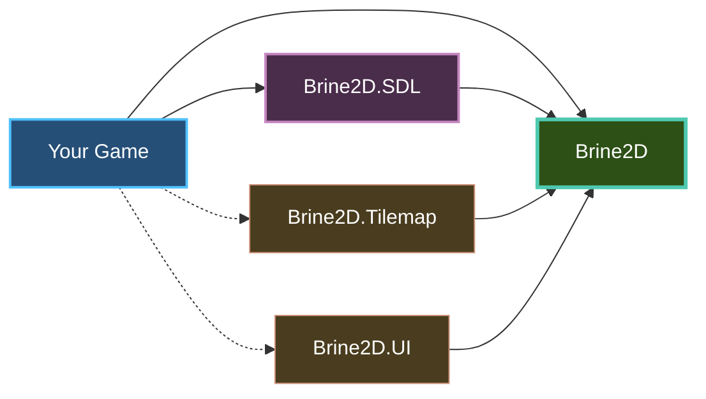

# Installation

Get Brine2D up and running in minutes with .NET 10 and your favorite IDE.

## Overview

Brine2D is a **2-package system** for .NET 10:

- **Brine2D** - Core engine (ECS, scenes, abstractions)
- **Brine2D.SDL** - Platform layer (rendering, input, audio)

Optional packages:
- **Brine2D.Tilemap** - Tiled map support
- **Brine2D.UI** - UI framework



---

## Prerequisites

### Required

- ✅ **.NET 10 SDK** - [Download here](https://dotnet.microsoft.com/download/dotnet/10.0)
- ✅ **IDE** - Visual Studio 2022, VS Code, or Rider

### Optional

- 💡 **Git** - For cloning samples
- 💡 **Tiled** - For creating tilemaps (if using Brine2D.Tilemap)

---

## Verify .NET 10

Check your .NET version:

```sh
dotnet --version
```

**Expected output:**

```
10.0.xxx
```

If you see `9.x` or earlier, [download .NET 10 SDK](https://dotnet.microsoft.com/download/dotnet/10.0).

---

## Quick Install

### Option 1: New Project (Recommended)

Create a new game from scratch:

```sh
# Create project
dotnet new console -n MyGame
cd MyGame

# Add Brine2D packages
dotnet add package Brine2D --version 0.9.0-beta
dotnet add package Brine2D.SDL --version 0.9.0-beta

# Optional: Add tilemap support
dotnet add package Brine2D.Tilemap --version 0.9.0-beta

# Optional: Add UI framework
dotnet add package Brine2D.UI --version 0.9.0-beta
```

**Project structure:**

```
MyGame/
├── MyGame.csproj
├── Program.cs
└── assets/          (create this folder)
    ├── textures/
    ├── sounds/
    └── music/
```

---

### Option 2: Add to Existing Project

Add Brine2D to an existing .NET 10 project:

```sh
# Navigate to your project
cd YourExistingProject

# Add packages
dotnet add package Brine2D --version 0.9.0-beta
dotnet add package Brine2D.SDL --version 0.9.0-beta
```

---

### Option 3: Manual .csproj Edit

Edit your `.csproj` file directly:

```xml
<Project Sdk="Microsoft.NET.Sdk">
  <PropertyGroup>
    <OutputType>Exe</OutputType>
    <TargetFramework>net10.0</TargetFramework>
    <Nullable>enable</Nullable>
  </PropertyGroup>

  <ItemGroup>
    <!-- Core packages (required) -->
    <PackageReference Include="Brine2D" Version="0.9.0-beta" />
    <PackageReference Include="Brine2D.SDL" Version="0.9.0-beta" />
    
    <!-- Optional packages -->
    <PackageReference Include="Brine2D.Tilemap" Version="0.9.0-beta" />
    <PackageReference Include="Brine2D.UI" Version="0.9.0-beta" />
  </ItemGroup>
</Project>
```

Then restore packages:

```sh
dotnet restore
```

---

## Verify Installation

Create a minimal `Program.cs` to test:

```csharp
using Brine2D.Hosting;
using Brine2D.SDL;
using Microsoft.Extensions.DependencyInjection;

var builder = GameApplication.CreateBuilder(args);

builder.Services.AddSDL3Rendering(options =>
{
    options.WindowTitle = "Brine2D Test";
    options.WindowWidth = 800;
    options.WindowHeight = 600;
});

builder.Services.AddSDL3Input();

var game = builder.Build();

Console.WriteLine("✅ Brine2D installed successfully!");
Console.WriteLine("Press any key to exit...");
Console.ReadKey();
```

Run it:

```sh
dotnet run
```

**Expected output:**

```
✅ Brine2D installed successfully!
Press any key to exit...
```

---

## IDE Setup

### Visual Studio 2022

1. **Open/Create Project**
   - `File` → `New` → `Project`
   - Choose **Console App** (.NET 10)
   - Or open existing `.csproj`

2. **Install Packages**
   - Right-click project → `Manage NuGet Packages`
   - Search "Brine2D"
   - Install `Brine2D` and `Brine2D.SDL`

3. **Enable Hot Reload** *(Optional but recommended)*
   - `Tools` → `Options` → `Debugging` → `Hot Reload`
   - ✅ Enable Hot Reload

4. **Run**
   - Press `F5` to build and run
   - Or `Ctrl+F5` (run without debugging)

---

### Visual Studio Code

1. **Install Extensions**
   - [C# Dev Kit](https://marketplace.visualstudio.com/items?itemName=ms-dotnettools.csdevkit)

2. **Open Folder**
   ```sh
   code MyGame
   ```

3. **Install Packages**
   - Open integrated terminal (`` Ctrl+` ``)
   ```sh
   dotnet add package Brine2D --version 0.9.0-beta
   dotnet add package Brine2D.SDL --version 0.9.0-beta
   ```

4. **Run**
   - Press `F5` (creates launch.json automatically)
   - Or terminal: `dotnet run`

---

### JetBrains Rider

1. **Open/Create Project**
   - `File` → `New Solution` → `Console Application` (.NET 10)
   - Or open existing `.sln`/`.csproj`

2. **Install Packages**
   - Right-click project → `Manage NuGet Packages`
   - Search "Brine2D"
   - Install `Brine2D` and `Brine2D.SDL`

3. **Run**
   - Press `Shift+F10` to run
   - Or click ▶️ in toolbar

---

## Platform-Specific Setup

### Windows

**No additional setup required!** ✅

SDL3 binaries are included in `Brine2D.SDL` package.

---

### Linux

Install SDL3 dependencies:

**Ubuntu/Debian:**

```sh
sudo apt-get update
sudo apt-get install -y \
    libsdl3-dev \
    libsdl3-mixer-dev \
    libsdl3-ttf-dev
```

**Fedora:**

```sh
sudo dnf install -y \
    SDL3-devel \
    SDL3_mixer-devel \
    SDL3_ttf-devel
```

**Arch:**

```sh
sudo pacman -S sdl3 sdl3_mixer sdl3_ttf
```

**For GPU rendering (Vulkan):**

```sh
# Ubuntu/Debian
sudo apt-get install vulkan-tools libvulkan-dev

# Fedora
sudo dnf install vulkan-tools vulkan-loader-devel

# Arch
sudo pacman -S vulkan-tools vulkan-icd-loader
```

Verify Vulkan:

```sh
vulkaninfo
```

---

### macOS

Install via Homebrew:

```sh
brew install sdl3 sdl3_mixer sdl3_ttf
```

**Note:** macOS uses Metal for GPU rendering (no Vulkan).

---

## Asset Setup

Create folders for your game assets:

```sh
mkdir -p assets/textures
mkdir -p assets/sounds
mkdir -p assets/music
mkdir -p assets/fonts
mkdir -p assets/levels
```

**Project structure:**

```
MyGame/
├── MyGame.csproj
├── Program.cs
├── Scenes/
│   └── GameScene.cs
└── assets/
    ├── textures/
    │   └── player.png
    ├── sounds/
    │   └── jump.wav
    ├── music/
    │   └── background.mp3
    ├── fonts/
    │   └── arial.ttf
    └── levels/
        └── level1.tmj
```

---

## Package Details

### Brine2D (Core Engine)

**What's included:**

- ✅ ECS framework
- ✅ Scene management
- ✅ Game loop
- ✅ Event system
- ✅ Built-in components (Transform, Velocity, etc.)
- ✅ Built-in systems (Physics, AI, etc.)
- ✅ Abstractions (IRenderer, IInputService, IAudioService)

**Current version:** `0.9.0-beta`

**Install:**

```sh
dotnet add package Brine2D --version 0.9.0-beta
```

---

### Brine2D.SDL (Platform Layer)

**What's included:**

- ✅ SDL3GPURenderer (Vulkan/D3D12/Metal)
- ✅ SDL3Renderer (legacy compatibility)
- ✅ Input handling (keyboard, mouse, gamepad)
- ✅ Audio (SDL3_mixer)
- ✅ Texture loading
- ✅ Font rendering (SDL3_ttf)
- ✅ Texture atlasing
- ✅ Post-processing

**Current version:** `0.9.0-beta`

**Install:**

```sh
dotnet add package Brine2D.SDL --version 0.9.0-beta
```

---

### Brine2D.Tilemap (Optional)

**What's included:**

- ✅ Tiled (.tmj/.json) map loading
- ✅ Tilemap rendering
- ✅ Tileset support
- ✅ Layer management

**Current version:** `0.9.0-beta`

**Install:**

```sh
dotnet add package Brine2D.Tilemap --version 0.9.0-beta
```

---

### Brine2D.UI (Optional)

**What's included:**

- ✅ UI components (buttons, sliders, text inputs)
- ✅ Layout system
- ✅ Event handling
- ✅ Theming

**Current version:** `0.9.0-beta`

**Install:**

```sh
dotnet add package Brine2D.UI --version 0.9.0-beta
```

---

## Version Management

### Check Installed Version

```sh
dotnet list package | grep Brine2D
```

**Output:**

```
> Brine2D           0.9.0-beta
> Brine2D.SDL       0.9.0-beta
```

---

### Update to Latest

```sh
# Update all packages
dotnet add package Brine2D --version 0.9.0-beta
dotnet add package Brine2D.SDL --version 0.9.0-beta
```

Or use wildcard for auto-updates:

```xml
<PackageReference Include="Brine2D" Version="0.9.*-*" />
<PackageReference Include="Brine2D.SDL" Version="0.9.*-*" />
```

---

### Pre-release Versions

To use alpha/preview versions:

```sh
dotnet add package Brine2D --version 0.10.0-alpha
```

Or in `.csproj`:

```xml
<PackageReference Include="Brine2D" Version="0.10.0-alpha" />
```

---

## Troubleshooting

### Problem: Package Not Found

**Symptom:**

```
error NU1101: Unable to find package Brine2D
```

**Solutions:**

1. **Check NuGet source**
   ```sh
   dotnet nuget list source
   ```

   Should include `nuget.org`:
   ```
   https://api.nuget.org/v3/index.json
   ```

2. **Clear NuGet cache**
   ```sh
   dotnet nuget locals all --clear
   dotnet restore
   ```

3. **Verify package name**
   ```csharp
   // ❌ Wrong
   dotnet add package Brine2D-Engine
   
   // ✅ Correct
   dotnet add package Brine2D
   ```

---

### Problem: Wrong .NET Version

**Symptom:**

```
error NETSDK1045: The current .NET SDK does not support targeting .NET 10.0
```

**Solution:**

1. **Download .NET 10 SDK**: https://dotnet.microsoft.com/download/dotnet/10.0

2. **Verify installation**:
   ```sh
   dotnet --version
   ```

3. **Update global.json** (if present):
   ```json
   {
     "sdk": {
       "version": "10.0.100"
     }
   }
   ```

---

### Problem: SDL3 Not Found (Linux)

**Symptom:**

```
error: libSDL3.so: cannot open shared object file
```

**Solution:**

Install SDL3 development libraries:

```sh
# Ubuntu/Debian
sudo apt-get install libsdl3-dev libsdl3-mixer-dev libsdl3-ttf-dev

# Fedora
sudo dnf install SDL3-devel SDL3_mixer-devel SDL3_ttf-devel

# Arch
sudo pacman -S sdl3 sdl3_mixer sdl3_ttf
```

---

### Problem: Vulkan Not Available (Linux)

**Symptom:**

```
GPU device creation failed: Vulkan not supported
```

**Solution:**

1. **Install Vulkan drivers**:
   ```sh
   # Ubuntu/Debian
   sudo apt-get install vulkan-tools libvulkan-dev
   
   # Fedora
   sudo dnf install vulkan-tools vulkan-loader-devel
   
   # Arch
   sudo pacman -S vulkan-tools vulkan-icd-loader
   ```

2. **Verify Vulkan**:
   ```sh
   vulkaninfo
   ```

3. **Fallback to legacy renderer**:
   ```csharp
   builder.Services.AddSDL3Rendering(options =>
   {
       options.Backend = GraphicsBackend.LegacyRenderer;
   });
   ```

---

### Problem: Assets Not Found

**Symptom:**

```
FileNotFoundException: Could not find file 'assets/player.png'
```

**Solution:**

1. **Check file location**:
   - Assets must be relative to **executable location**
   - Default: `bin/Debug/net10.0/`

2. **Copy assets to output**:

   **Option 1: Add to .csproj**
   ```xml
   <ItemGroup>
     <None Update="assets\**\*">
       <CopyToOutputDirectory>PreserveNewest</CopyToOutputDirectory>
     </None>
   </ItemGroup>
   ```

   **Option 2: Manually copy**
   ```sh
   cp -r assets bin/Debug/net10.0/
   ```

3. **Use absolute paths** (not recommended):
   ```csharp
   var path = Path.Combine(AppDomain.CurrentDomain.BaseDirectory, "assets", "player.png");
   ```

---

## Best Practices

### DO

1. **Use specific package versions in production**
   ```xml
   <PackageReference Include="Brine2D" Version="0.9.0-beta" />
   ```

2. **Copy assets to output directory**
   ```xml
   <None Update="assets\**\*">
     <CopyToOutputDirectory>PreserveNewest</CopyToOutputDirectory>
   </None>
   ```

3. **Use .gitignore for packages**
   ```
   bin/
   obj/
   .vs/
   *.user
   ```

4. **Keep packages in sync**
   ```sh
   # Update all at once
   dotnet add package Brine2D --version 0.9.0-beta
   dotnet add package Brine2D.SDL --version 0.9.0-beta
   ```

5. **Use centralized asset folders**
   ```
   assets/
   ├── textures/
   ├── sounds/
   └── music/
   ```

### DON'T

1. **Don't mix package versions**
   ```xml
   <!-- ❌ Bad - version mismatch -->
   <PackageReference Include="Brine2D" Version="0.9.0-beta" />
   <PackageReference Include="Brine2D.SDL" Version="0.8.0-beta" />
   ```

2. **Don't commit packages to Git**
   ```
   # ✅ Add to .gitignore
   bin/
   obj/
   ```

3. **Don't hard-code asset paths**
   ```csharp
   // ❌ Bad
   var texture = await renderer.LoadTextureAsync("C:\\MyGame\\assets\\player.png");
   
   // ✅ Good
   var texture = await renderer.LoadTextureAsync("assets/textures/player.png");
   ```

---

## Summary

| Package | Purpose | Required? | Version |
|---------|---------|-----------|---------|
| **Brine2D** | Core engine | ✅ Yes | `0.9.0-beta` |
| **Brine2D.SDL** | Platform layer | ✅ Yes | `0.9.0-beta` |
| **Brine2D.Tilemap** | Tilemap support | ❌ Optional | `0.9.0-beta` |
| **Brine2D.UI** | UI framework | ❌ Optional | `0.9.0-beta` |

**Minimum requirements:**
- .NET 10 SDK
- Brine2D + Brine2D.SDL packages
- IDE (VS 2022, VS Code, or Rider)

**Platform notes:**
- **Windows**: Works out of the box
- **Linux**: Requires SDL3 dev packages
- **macOS**: Requires Homebrew SDL3

---

## Next Steps

Now that Brine2D is installed, let's create your first game! 🎮

- **[Quick Start](quickstart.md)** - Create your first scene in 5 minutes
- **[Your First Game](first-game.md)** - Build a complete game
- **[Project Structure](project-structure.md)** - Organize your project
- **[Configuration](configuration.md)** - Configure your game

---

## Quick Reference

```sh
# Create new project
dotnet new console -n MyGame
cd MyGame

# Install packages
dotnet add package Brine2D --version 0.9.0-beta
dotnet add package Brine2D.SDL --version 0.9.0-beta

# Verify installation
dotnet list package | grep Brine2D

# Run project
dotnet run
```

```xml
<!-- Minimal .csproj -->
<Project Sdk="Microsoft.NET.Sdk">
  <PropertyGroup>
    <OutputType>Exe</OutputType>
    <TargetFramework>net10.0</TargetFramework>
  </PropertyGroup>
  
  <ItemGroup>
    <PackageReference Include="Brine2D" Version="0.9.0-beta" />
    <PackageReference Include="Brine2D.SDL" Version="0.9.0-beta" />
  </ItemGroup>
  
  <ItemGroup>
    <None Update="assets\**\*">
      <CopyToOutputDirectory>PreserveNewest</CopyToOutputDirectory>
    </None>
  </ItemGroup>
</Project>
```

---

Ready to create your first game? Head to [Quick Start](quickstart.md)!