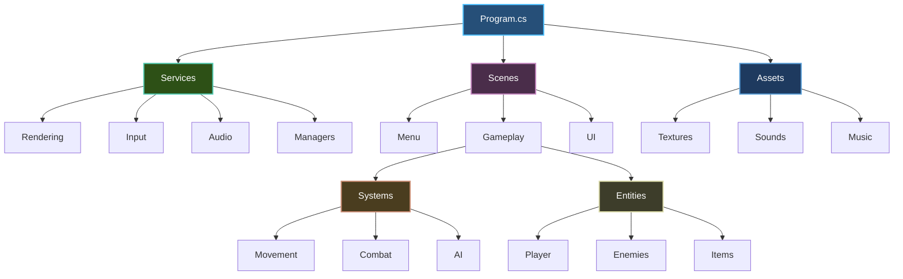

# Project Structure

Learn how to organize your Brine2D project for clean, maintainable, and scalable game development.

## Overview

A well-organized project structure:

- Makes code easy to find and navigate
- Separates concerns (scenes, systems, entities)
- Scales from prototypes to full games
- Simplifies team collaboration
- Reduces merge conflicts

**This guide covers:**
- Recommended folder structures
- File organization patterns
- Namespace conventions
- Asset management
- Scaling strategies

---

## Basic Structure

### Minimal Project

For prototypes and learning:

```
MyGame/
├── MyGame.csproj
├── Program.cs
├── GameScene.cs
└── assets/
    ├── textures/
    ├── sounds/
    └── music/
```

**When to use:**
- Quick prototypes
- Tutorial projects
- Single-scene games
- Learning Brine2D

**Program.cs:**

```csharp
using Brine2D.Hosting;
using Brine2D.SDL;
using Microsoft.Extensions.DependencyInjection;

var builder = GameApplication.CreateBuilder(args);

builder.Services.AddSDL3Rendering(options =>
{
    options.WindowTitle = "My Game";
    options.WindowWidth = 800;
    options.WindowHeight = 600;
});

builder.Services.AddSDL3Input();
builder.Services.AddScene<GameScene>();

var game = builder.Build();
await game.RunAsync<GameScene>();
```

---

### Standard Project

For most games:

```
MyGame/
├── MyGame.csproj
├── Program.cs
├── Scenes/
│   ├── MenuScene.cs
│   ├── GameScene.cs
│   └── PauseScene.cs
├── Entities/
│   ├── Player.cs
│   ├── Enemy.cs
│   └── Projectile.cs
├── Systems/
│   ├── MovementSystem.cs
│   └── CombatSystem.cs
└── assets/
    ├── textures/
    │   ├── player/
    │   ├── enemies/
    │   └── ui/
    ├── sounds/
    │   ├── effects/
    │   └── ui/
    ├── music/
    └── fonts/
```

**When to use:**
- Most 2D games
- Multi-scene projects
- Medium-sized teams
- Commercial games

---

### Large Project

For complex games with many features:

```
MyGame/
├── MyGame.csproj
├── Program.cs
├── Scenes/
│   ├── Menu/
│   │   ├── MainMenuScene.cs
│   │   ├── OptionsScene.cs
│   │   └── CreditsScene.cs
│   ├── Gameplay/
│   │   ├── Level1Scene.cs
│   │   ├── Level2Scene.cs
│   │   └── BossScene.cs
│   └── UI/
│       ├── HUDScene.cs
│       └── InventoryScene.cs
├── Entities/
│   ├── Characters/
│   │   ├── Player.cs
│   │   ├── Enemy.cs
│   │   └── NPC.cs
│   ├── Items/
│   │   ├── Weapon.cs
│   │   ├── Consumable.cs
│   │   └── Collectible.cs
│   └── Environment/
│       ├── Platform.cs
│       └── Hazard.cs
├── Systems/
│   ├── Gameplay/
│   │   ├── MovementSystem.cs
│   │   ├── CombatSystem.cs
│   │   └── HealthSystem.cs
│   ├── AI/
│   │   ├── PathfindingSystem.cs
│   │   └── BehaviorSystem.cs
│   └── Rendering/
│       ├── ParticleSystem.cs
│       └── AnimationSystem.cs
├── Components/
│   ├── TransformComponent.cs
│   ├── SpriteComponent.cs
│   └── HealthComponent.cs
├── Managers/
│   ├── GameStateManager.cs
│   ├── SaveManager.cs
│   └── AudioManager.cs
├── Data/
│   ├── GameConfig.cs
│   ├── LevelData.cs
│   └── ItemDatabase.cs
├── Utilities/
│   ├── MathHelper.cs
│   ├── ColorHelper.cs
│   └── Extensions.cs
└── assets/
    ├── textures/
    │   ├── characters/
    │   ├── items/
    │   ├── environment/
    │   ├── effects/
    │   └── ui/
    ├── sounds/
    │   ├── characters/
    │   ├── ambient/
    │   ├── effects/
    │   └── ui/
    ├── music/
    │   ├── menu/
    │   ├── gameplay/
    │   └── boss/
    ├── fonts/
    ├── levels/
    │   └── *.tmj
    └── data/
        ├── items.json
        └── enemies.json
```

**When to use:**
- Complex games
- Large teams
- Long-term projects
- Multiple game modes

---

## Folder Organization

### Scenes/

Organize scenes by purpose:

```
Scenes/
├── Menu/              # Menu screens
├── Gameplay/          # Main game levels
├── UI/                # Overlay scenes
└── Transitions/       # Loading, fade screens
```

**Pattern:**

```csharp
// Scenes/Gameplay/Level1Scene.cs
namespace MyGame.Scenes.Gameplay;

public class Level1Scene : Scene
{
    // Scene implementation
}
```

---

### Entities/

Group entities by category:

```
Entities/
├── Characters/        # Player, enemies, NPCs
├── Items/             # Weapons, consumables
├── Projectiles/       # Bullets, missiles
└── Environment/       # Platforms, obstacles
```

**Pattern:**

```csharp
// Entities/Characters/Player.cs
namespace MyGame.Entities.Characters;

public class Player
{
    public Vector2 Position { get; set; }
    public int Health { get; set; }
    public float Speed { get; set; } = 200f;
}
```

---

### Systems/

Organize systems by functionality:

```
Systems/
├── Gameplay/          # Core game logic
├── AI/                # Enemy behavior
├── Physics/           # Movement, collision
└── Rendering/         # Visual effects
```

**Pattern:**

```csharp
// Systems/Gameplay/HealthSystem.cs
namespace MyGame.Systems.Gameplay;

public class HealthSystem : IUpdateSystem
{
    public string Name => "HealthSystem";
    public int UpdateOrder => 100;
    
    public void Update(GameTime gameTime)
    {
        // System logic
    }
}
```

---

### Components/

Group components by purpose:

```
Components/
├── Core/              # Transform, Sprite, Physics
├── Gameplay/          # Health, Inventory
└── AI/                # AIState, Pathfinding
```

**Pattern:**

```csharp
// Components/Gameplay/HealthComponent.cs
namespace MyGame.Components.Gameplay;

public class HealthComponent : Component
{
    public int Current { get; set; }
    public int Max { get; set; }
    public bool IsDead => Current <= 0;
}
```

---

### Managers/

Singleton services for game-wide state:

```
Managers/
├── GameStateManager.cs    # Game state machine
├── SaveManager.cs          # Save/load
├── AudioManager.cs         # Audio control
└── ScoreManager.cs         # Score tracking
```

**Pattern:**

```csharp
// Managers/GameStateManager.cs
namespace MyGame.Managers;

public class GameStateManager
{
    public GameState CurrentState { get; private set; }
    
    public void ChangeState(GameState newState)
    {
        CurrentState = newState;
        // State transition logic
    }
}

public enum GameState
{
    MainMenu,
    Playing,
    Paused,
    GameOver
}
```

---

### Data/

Configuration and data files:

```
Data/
├── Configs/           # Game configuration
├── Definitions/       # Item/enemy data
└── Localization/      # Language files
```

**Pattern:**

```csharp
// Data/Configs/GameConfig.cs
namespace MyGame.Data.Configs;

public class GameConfig
{
    public int InitialLives { get; set; } = 3;
    public float PlayerSpeed { get; set; } = 200f;
    public int MaxEnemies { get; set; } = 20;
}
```

---

### Utilities/

Helper classes and extensions:

```
Utilities/
├── Extensions/        # Extension methods
├── Helpers/           # Static helper methods
└── Constants.cs       # Game constants
```

**Pattern:**

```csharp
// Utilities/Constants.cs
namespace MyGame.Utilities;

public static class Constants
{
    public const int WindowWidth = 800;
    public const int WindowHeight = 600;
    public const float Gravity = 980f;
}

// Utilities/Extensions/Vector2Extensions.cs
namespace MyGame.Utilities.Extensions;

public static class Vector2Extensions
{
    public static float Angle(this Vector2 vector)
    {
        return (float)Math.Atan2(vector.Y, vector.X);
    }
}
```

---

## Asset Organization

### Texture Structure

Organize by category and usage:

```
assets/textures/
├── characters/
│   ├── player/
│   │   ├── idle.png
│   │   ├── walk.png
│   │   └── jump.png
│   └── enemies/
│       ├── goblin/
│       ├── skeleton/
│       └── boss/
├── items/
│   ├── weapons/
│   ├── consumables/
│   └── collectibles/
├── environment/
│   ├── tiles/
│   ├── background/
│   └── props/
├── effects/
│   ├── particles/
│   ├── explosions/
│   └── projectiles/
└── ui/
    ├── buttons/
    ├── panels/
    └── icons/
```

---

### Audio Structure

Organize by type and context:

```
assets/sounds/
├── characters/
│   ├── player/
│   │   ├── jump.wav
│   │   ├── land.wav
│   │   └── hurt.wav
│   └── enemies/
│       ├── goblin_attack.wav
│       └── skeleton_death.wav
├── weapons/
│   ├── sword_swing.wav
│   ├── gun_shoot.wav
│   └── reload.wav
├── ambient/
│   ├── wind.wav
│   ├── water.wav
│   └── birds.wav
├── effects/
│   ├── explosion.wav
│   ├── pickup.wav
│   └── powerup.wav
└── ui/
    ├── button_click.wav
    ├── menu_open.wav
    └── error.wav

assets/music/
├── menu/
│   └── main_theme.mp3
├── gameplay/
│   ├── level1.mp3
│   ├── level2.mp3
│   └── boss.mp3
└── credits/
    └── ending.mp3
```

---

### Level Data

Organize maps and level definitions:

```
assets/levels/
├── world1/
│   ├── level1.tmj
│   ├── level2.tmj
│   └── level3.tmj
├── world2/
│   ├── level1.tmj
│   └── boss.tmj
└── tilesets/
    ├── grass.tsx
    ├── dungeon.tsx
    └── cave.tsx
```

---

## Namespace Conventions

### Root Namespace

Use your game name as root:

```csharp
// Good
namespace MyGame;
namespace MyGame.Scenes;
namespace MyGame.Entities;

// Bad
namespace Game;
namespace Scenes;
```

---

### Namespace Hierarchy

Match folder structure:

```
Folder: Scenes/Gameplay/Level1Scene.cs
Namespace: MyGame.Scenes.Gameplay

Folder: Entities/Characters/Player.cs
Namespace: MyGame.Entities.Characters

Folder: Systems/AI/PathfindingSystem.cs
Namespace: MyGame.Systems.AI
```

**Pattern:**

```csharp
// File: Scenes/Gameplay/Level1Scene.cs
namespace MyGame.Scenes.Gameplay;

using MyGame.Entities.Characters;
using MyGame.Systems.Gameplay;

public class Level1Scene : Scene
{
    // Implementation
}
```

---

## Configuration Files

### Project File

Configure project settings in `.csproj`:

```xml
<Project Sdk="Microsoft.NET.Sdk">
  <PropertyGroup>
    <OutputType>Exe</OutputType>
    <TargetFramework>net10.0</TargetFramework>
    <Nullable>enable</Nullable>
    <ImplicitUsings>enable</ImplicitUsings>
    <RootNamespace>MyGame</RootNamespace>
    <AssemblyName>MyGame</AssemblyName>
  </PropertyGroup>

  <ItemGroup>
    <PackageReference Include="Brine2D" Version="0.9.0-beta" />
    <PackageReference Include="Brine2D.SDL" Version="0.9.0-beta" />
  </ItemGroup>

  <ItemGroup>
    <!-- Copy all assets to output -->
    <None Update="assets\**\*">
      <CopyToOutputDirectory>PreserveNewest</CopyToOutputDirectory>
    </None>
  </ItemGroup>
</Project>
```

---

### Game Settings

Store configuration in `gamesettings.json`:

```json
{
  "Rendering": {
    "WindowTitle": "My Game",
    "WindowWidth": 1280,
    "WindowHeight": 720,
    "VSync": true,
    "Backend": "GPU"
  },
  "Audio": {
    "MasterVolume": 0.8,
    "MusicVolume": 0.6,
    "SoundVolume": 0.7
  },
  "Gameplay": {
    "Difficulty": "Normal",
    "InitialLives": 3,
    "PlayerSpeed": 200
  }
}
```

Load in `Program.cs`:

```csharp
using Brine2D.Hosting;
using Brine2D.SDL;
using Microsoft.Extensions.Configuration;

var builder = GameApplication.CreateBuilder(args);

// Load configuration
builder.Configuration.AddJsonFile("gamesettings.json", optional: false);

// Bind to options (typical approach)
builder.Services.AddBrine2D(options =>
{
    builder.Configuration.GetSection("Rendering").Bind(options);
});

// Or configure directly
builder.Services.AddBrine2D(options =>
{
    options.WindowTitle = builder.Configuration["Rendering:WindowTitle"] ?? "My Game";
    options.WindowWidth = builder.Configuration.GetValue<int>("Rendering:WindowWidth", 1280);
    options.WindowHeight = builder.Configuration.GetValue<int>("Rendering:WindowHeight", 720);
});
```

---

## Scaling Strategies

### Start Small

Begin with minimal structure:

```
MyGame/
├── MyGame.csproj
├── Program.cs
├── GameScene.cs
└── assets/
```

---

### Add Folders as Needed

Grow organically:

**Add Scenes folder:**

```
MyGame/
├── Program.cs
├── Scenes/
│   ├── MenuScene.cs
│   └── GameScene.cs
└── assets/
```

**Add Entities folder:**

```
MyGame/
├── Program.cs
├── Scenes/
├── Entities/
│   ├── Player.cs
│   └── Enemy.cs
└── assets/
```

**Add Systems folder:**

```
MyGame/
├── Program.cs
├── Scenes/
├── Entities/
├── Systems/
│   └── HealthSystem.cs
└── assets/
```

---

### Refactor When Necessary

Split large files:

**Before:**

```
Scenes/
└── GameScene.cs (500+ lines)
```

**After:**

```
Scenes/
└── Gameplay/
    ├── GameScene.cs
    ├── Level1Scene.cs
    └── Level2Scene.cs
```

---

## Architecture Diagram


```mermaid
graph TB
    A[Program.cs] --> B[Services]
    A --> C[Scenes]
    
    B --> B1[Rendering]
    B --> B2[Input]
    B --> B3[Audio]
    B --> B4[Managers]
    
    C --> C1[Menu]
    C --> C2[Gameplay]
    C --> C3[UI]
    
    C2 --> D[Systems]
    C2 --> E[Entities]
    
    D --> D1[Movement]
    D --> D2[Combat]
    D --> D3[AI]
    
    E --> E1[Player]
    E --> E2[Enemies]
    E --> E3[Items]
    
    A --> F[Assets]
    F --> F1[Textures]
    F --> F2[Sounds]
    F --> F3[Music]
    
    style A fill:#264f78,stroke:#4fc1ff,stroke-width:2px,color:#fff
    style B fill:#2d5016,stroke:#4ec9b0,stroke-width:2px,color:#fff
    style C fill:#4a2d4a,stroke:#c586c0,stroke-width:2px,color:#fff
    style D fill:#4a3d1f,stroke:#ce9178,stroke-width:2px,color:#fff
    style E fill:#3d3d2a,stroke:#dcdcaa,stroke-width:2px,color:#fff
    style F fill:#1e3a5f,stroke:#569cd6,stroke-width:2px,color:#fff
```

---

## Example: Platformer Structure

Complete example for a platformer game:

```
PlatformerGame/
├── PlatformerGame.csproj
├── Program.cs
├── Scenes/
│   ├── Menu/
│   │   ├── MainMenuScene.cs
│   │   ├── LevelSelectScene.cs
│   │   └── OptionsScene.cs
│   ├── Gameplay/
│   │   ├── Level1Scene.cs
│   │   ├── Level2Scene.cs
│   │   ├── Level3Scene.cs
│   │   └── BossScene.cs
│   └── UI/
│       ├── HUDScene.cs
│       └── PauseScene.cs
├── Entities/
│   ├── Player/
│   │   ├── Player.cs
│   │   └── PlayerController.cs
│   ├── Enemies/
│   │   ├── Slime.cs
│   │   ├── Bat.cs
│   │   └── Boss.cs
│   ├── Items/
│   │   ├── Coin.cs
│   │   ├── HealthPickup.cs
│   │   └── PowerUp.cs
│   └── Environment/
│       ├── Platform.cs
│       ├── Spike.cs
│       └── MovingPlatform.cs
├── Components/
│   ├── TransformComponent.cs
│   ├── SpriteComponent.cs
│   ├── RigidbodyComponent.cs
│   ├── ColliderComponent.cs
│   └── HealthComponent.cs
├── Systems/
│   ├── PlayerMovementSystem.cs
│   ├── EnemyAISystem.cs
│   ├── PhysicsSystem.cs
│   ├── CollisionSystem.cs
│   └── AnimationSystem.cs
├── Managers/
│   ├── LevelManager.cs
│   ├── ScoreManager.cs
│   └── SaveManager.cs
├── Data/
│   ├── LevelData.cs
│   ├── EnemyData.cs
│   └── ItemData.cs
└── assets/
    ├── textures/
    │   ├── player/
    │   ├── enemies/
    │   ├── items/
    │   ├── environment/
    │   └── ui/
    ├── sounds/
    │   ├── player/
    │   ├── enemies/
    │   ├── items/
    │   └── ui/
    ├── music/
    │   ├── menu.mp3
    │   ├── level.mp3
    │   └── boss.mp3
    └── levels/
        ├── level1.tmj
        ├── level2.tmj
        └── level3.tmj
```

---

## Best Practices

### DO

1. **Match namespaces to folders**
   ```csharp
   // File: Scenes/Gameplay/Level1Scene.cs
   namespace MyGame.Scenes.Gameplay;
   ```

2. **Group related files**
   ```
   Entities/Characters/
   ├── Player.cs
   ├── Enemy.cs
   └── NPC.cs
   ```

3. **Use consistent naming**
   ```csharp
   // Scene files end with Scene
   MenuScene.cs
   GameScene.cs
   
   // System files end with System
   HealthSystem.cs
   CombatSystem.cs
   ```

4. **Organize assets by usage**
   ```
   assets/textures/player/
   assets/sounds/player/
   ```

5. **Copy assets to output**
   ```xml
   <None Update="assets\**\*">
     <CopyToOutputDirectory>PreserveNewest</CopyToOutputDirectory>
   </None>
   ```

### DON'T

1. **Don't use generic names**
   ```csharp
   // ❌ Bad
   namespace Game;
   public class Manager { }
   
   // ✅ Good
   namespace MyGame;
   public class SaveManager { }
   ```

2. **Don't mix concerns**
   ```
   // ❌ Bad
   Stuff/
   ├── Player.cs
   ├── MenuScene.cs
   └── HealthSystem.cs
   
   // ✅ Good
   Entities/Player.cs
   Scenes/MenuScene.cs
   Systems/HealthSystem.cs
   ```

3. **Don't nest too deeply**
   ```
   // ❌ Bad (6 levels deep)
   Entities/Characters/Players/Playable/Main/Player.cs
   
   // ✅ Good (3 levels)
   Entities/Characters/Player.cs
   ```

4. **Don't hard-code paths**
   ```csharp
   // ❌ Bad
   var texture = await renderer.LoadTextureAsync("C:\\MyGame\\assets\\player.png");
   
   // ✅ Good
   var texture = await renderer.LoadTextureAsync("assets/textures/player.png");
   ```

---

## Migration Guide

### Restructuring Existing Project

**Step 1: Create folders**

```sh
mkdir Scenes
mkdir Entities
mkdir Systems
```

**Step 2: Move files**

```sh
# Move scenes
mv GameScene.cs Scenes/
mv MenuScene.cs Scenes/

# Move entities
mv Player.cs Entities/
mv Enemy.cs Entities/
```

**Step 3: Update namespaces**

```csharp
// Before
namespace MyGame;

public class GameScene : Scene { }

// After
namespace MyGame.Scenes;

public class GameScene : Scene { }
```

**Step 4: Update usings**

```csharp
// In Program.cs
using MyGame.Scenes;
using MyGame.Entities;

builder.Services.AddScene<GameScene>();
```

---

## Troubleshooting

### Problem: Namespace not found

**Symptom:**

```
error CS0246: The type or namespace name 'GameScene' could not be found
```

**Solution:**

1. **Check namespace matches folder:**
   ```csharp
   // File: Scenes/GameScene.cs
   namespace MyGame.Scenes; // Must match
   ```

2. **Add using statement:**
   ```csharp
   using MyGame.Scenes;
   ```

3. **Verify .csproj has correct root namespace:**
   ```xml
   <RootNamespace>MyGame</RootNamespace>
   ```

---

### Problem: Assets not found

**Symptom:**

```
FileNotFoundException: Could not find file 'assets/player.png'
```

**Solution:**

1. **Copy assets to output:**
   ```xml
   <ItemGroup>
     <None Update="assets\**\*">
       <CopyToOutputDirectory>PreserveNewest</CopyToOutputDirectory>
     </None>
   </ItemGroup>
   ```

2. **Use correct path separator:**
   ```csharp
   // ✅ Works on all platforms
   "assets/textures/player.png"
   
   // ❌ Windows only
   "assets\\textures\\player.png"
   ```

3. **Check file exists:**
   ```csharp
   if (!File.Exists("assets/textures/player.png"))
   {
       Logger.LogError("Player texture not found!");
   }
   ```

---

## Summary

**Structure patterns:**

| Project Size | Folders | When to Use |
|--------------|---------|-------------|
| **Minimal** | 1-2 files + assets | Prototypes, learning |
| **Standard** | Scenes, Entities, Systems | Most games |
| **Large** | Nested folders | Complex games |

**Key principles:**

| Principle | Description |
|-----------|-------------|
| **Match folders to namespaces** | `Scenes/GameScene.cs` → `MyGame.Scenes` |
| **Group by purpose** | Scenes, Entities, Systems, Assets |
| **Start small, grow** | Add folders as needed |
| **Consistent naming** | `*Scene.cs`, `*System.cs`, `*Component.cs` |

---

## Next Steps

- **[Configuration](configuration.md)** - Configure your game
- **[First Game](first-game.md)** - Build a complete game
- **[Scene Management](../concepts/scenes.md)** - Understand scene architecture
- **[ECS Guide](../guides/ecs/getting-started.md)** - Entity Component System structure

---

## Quick Reference

```
# Standard project structure
MyGame/
├── MyGame.csproj           # Project configuration
├── Program.cs              # Entry point
├── Scenes/                 # Game scenes
│   ├── MenuScene.cs
│   └── GameScene.cs
├── Entities/               # Game entities
│   ├── Player.cs
│   └── Enemy.cs
├── Systems/                # ECS systems
│   └── HealthSystem.cs
└── assets/                 # Game assets
    ├── textures/
    ├── sounds/
    └── music/
```

```csharp
// Namespace pattern
// File: Scenes/Gameplay/Level1Scene.cs
namespace MyGame.Scenes.Gameplay;

using MyGame.Entities;
using MyGame.Systems;

public class Level1Scene : Scene
{
    // Implementation
}
```

```xml
<!-- Copy assets to output -->
<ItemGroup>
  <None Update="assets\**\*">
    <CopyToOutputDirectory>PreserveNewest</CopyToOutputDirectory>
  </None>
</ItemGroup>
```

---

Ready to configure your game? Check out [Configuration](configuration.md)!