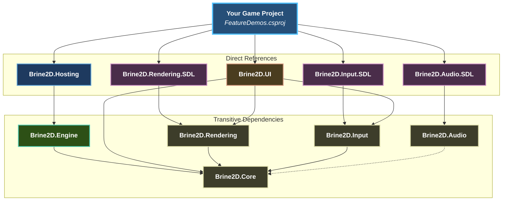

# Project Structure

Brine2D follows a **clean, modular architecture** inspired by ASP.NET Core's design principles. Each package has a single responsibility and depends only on what it needs.

## Architecture Overview



This design follows the **Dependency Inversion Principle**: high-level modules (your game) depend on abstractions (interfaces), not concrete implementations.

## Core Packages

### Brine2D.Core

**Purpose:** Core abstractions and data structures used throughout the engine.

**Key Types:**

- `IScene` - Interface for game scenes
- `Scene` - Base class with lifecycle methods
- `GameTime` - Holds frame timing information
- `IGameContext` - Access to game state and exit control
- `Color`, `Rectangle`, `RectangleF` - Common data types

**Namespaces:**

- `Brine2D.Core` - Core interfaces and base classes
- `Brine2D.Core.Animation` - Sprite animation system
- `Brine2D.Core.Collision` - Collision detection
- `Brine2D.Core.Tilemap` - Tilemap loading and rendering

**No Dependencies** - This package is the foundation and doesn't depend on other Brine2D packages.

```csharp
// Example: Implementing a custom scene
public class MyScene : Scene
{
    public MyScene(ILogger<MyScene> logger) : base(logger) { }
    
    protected override void OnUpdate(GameTime gameTime) { }
    protected override void OnRender(GameTime gameTime) { }
}
```

---

### Brine2D.Engine

**Purpose:** Game loop, scene management, and engine coordination.

**Key Types:**

- `IGameEngine` - Core engine interface
- `GameEngine` - Coordinates subsystems
- `IGameLoop` - Game loop abstraction
- `GameLoop` - Frame timing and update/render cycle
- `ISceneManager` - Scene loading and transitions
- `SceneManager` - Manages active scene

**Dependencies:**

- `Brine2D.Core`
- `Microsoft.Extensions.*` (DI, Logging, Configuration)

```csharp
// The engine coordinates everything
var engine = serviceProvider.GetRequiredService<IGameEngine>();
await engine.InitializeAsync();

// Scene manager handles scene transitions
var sceneManager = serviceProvider.GetRequiredService<ISceneManager>();
await sceneManager.LoadSceneAsync<MenuScene>();
```

---

### Brine2D.Hosting

**Purpose:** ASP.NET-style application hosting and builder pattern.

**Key Types:**

- `GameApplication` - The main application host
- `GameApplicationBuilder` - Fluent API for configuration
- Service registration extensions

**Dependencies:**

- `Brine2D.Core`
- `Brine2D.Engine`
- `Microsoft.Extensions.Hosting`

**This is your entry point:**

```csharp
// Familiar ASP.NET-style builder
var builder = GameApplication.CreateBuilder(args);

// Configure services
builder.Services.AddSDL3Rendering();
builder.Services.AddSDL3Input();
builder.Services.AddScene<GameScene>();

// Build and run
var game = builder.Build();
await game.RunAsync<GameScene>();
```

---

## Rendering System

### Brine2D.Rendering

**Purpose:** Rendering abstractions (interfaces and options).

**Key Types:**

- `IRenderer` - Core rendering interface
- `ITexture` - Texture abstraction
- `ITextureLoader` - Async texture loading
- `IFont`, `IFontLoader` - Font rendering
- `ICamera` - Camera abstraction
- `Camera2D` - 2D camera implementation
- `Color` - Color representation
- `RenderingOptions` - Configuration

**Dependencies:**

- `Brine2D.Core`

```csharp
// All rendering goes through IRenderer
public class GameScene : Scene
{
    private readonly IRenderer _renderer;
    
    protected override void OnRender(GameTime gameTime)
    {
        _renderer.Clear(Color.Black);
        _renderer.BeginFrame();
        _renderer.DrawTexture(texture, x, y);
        _renderer.EndFrame();
    }
}
```

---

### Brine2D.Rendering.SDL

**Purpose:** SDL3-based rendering implementation.

**Key Types:**

- `SDL3Renderer` - Implements `IRenderer` using SDL3
- `SDL3Texture` - SDL3 texture wrapper
- `SDL3TextureLoader` - Loads textures via SDL3_image
- `SDL3Font`, `SDL3FontLoader` - Font rendering via SDL3_ttf
- Service registration extensions

**Dependencies:**

- `Brine2D.Rendering`
- `SDL3-CS` (NuGet package - C# bindings for SDL3)

**Registration:**

```csharp
builder.Services.AddSDL3Rendering(options =>
{
    options.WindowTitle = "My Game";
    options.WindowWidth = 1280;
    options.WindowHeight = 720;
    options.VSync = true;
    options.Backend = GraphicsBackend.GPU; // or Legacy
});
```

---

## Input System

### Brine2D.Input

**Purpose:** Input abstractions for keyboard, mouse, and gamepad.

**Key Types:**

- `IInputService` - Unified input interface
- `Keys` - Keyboard key enumeration
- `MouseButton` - Mouse button enumeration
- `GamepadButton`, `GamepadAxis` - Gamepad enums
- `IInputLayer` - For layered input processing (like middleware)
- `InputLayerManager` - Manages input layers

**Dependencies:**

- `Brine2D.Core`

```csharp
// Unified input API
if (_input.IsKeyPressed(Keys.Space))
{
    Jump();
}

if (_input.IsMouseButtonDown(MouseButton.Left))
{
    Shoot();
}

var stick = _input.GetGamepadLeftStick();
```

---

### Brine2D.Input.SDL

**Purpose:** SDL3-based input implementation.

**Key Types:**

- `SDL3InputService` - Implements `IInputService`
- Service registration extensions

**Dependencies:**

- `Brine2D.Input`
- `SDL3-CS`

**Registration:**

```csharp
builder.Services.AddSDL3Input();
```

---

## Audio System

### Brine2D.Audio

**Purpose:** Audio abstractions for sound effects and music.

**Key Types:**

- `IAudioService` - Audio playback interface
- `ISoundEffect` - Short sound effect
- `IMusic` - Background music

**Dependencies:**

- None (pure abstractions)

```csharp
// Simple audio API
var jumpSound = await _audio.LoadSoundAsync("jump.wav");
_audio.PlaySound(jumpSound);

var bgMusic = await _audio.LoadMusicAsync("theme.mp3");
_audio.PlayMusic(bgMusic, loops: -1); // Loop forever
```

---

### Brine2D.Audio.SDL

**Purpose:** SDL3_mixer-based audio implementation.

**Key Types:**

- `SDL3AudioService` - Implements `IAudioService`
- `SDL3SoundEffect`, `SDL3Music` - SDL3 wrappers
- Service registration extensions

**Dependencies:**

- `Brine2D.Audio`
- `SDL3-CS` (includes SDL3_mixer bindings)

**Registration:**

```csharp
builder.Services.AddSDL3Audio();
```

---

## UI System

### Brine2D.UI

**Purpose:** Immediate-mode UI framework.

**Key Types:**

- `UICanvas` - Container for UI components
- `UIButton`, `UILabel`, `UISlider` - Basic components
- `UITextInput`, `UICheckbox`, `UIDropdown` - Form controls
- `UIDialog`, `UITooltip` - Advanced components
- `UIPanel`, `UIScrollView` - Layout containers
- `IUIComponent` - Interface for custom UI

**Dependencies:**

- `Brine2D.Core`
- `Brine2D.Rendering`
- `Brine2D.Input`

```csharp
// Add UI canvas to your scene
private readonly UICanvas _uiCanvas;

var button = new UIButton("Click Me", new Vector2(10, 10), new Vector2(100, 30));
button.OnClick += () => Logger.LogInformation("Clicked!");
_uiCanvas.Add(button);

// Update and render
_uiCanvas.Update(deltaTime);
_uiCanvas.Render(_renderer);
```

---

## Optional Packages

### Brine2D.Core.Animation

**Included in:** `Brine2D.Core`

**Purpose:** Sprite animation system.

**Key Types:**

- `SpriteAnimator` - Plays animation clips
- `AnimationClip` - Sequence of frames
- `SpriteFrame` - Single frame with duration

```csharp
var animator = new SpriteAnimator();
var walkAnim = AnimationClip.FromSpriteSheet("walk", 32, 32, 8, columns: 10);
animator.AddAnimation(walkAnim);
animator.Play("walk");
```

---

### Brine2D.Core.Collision

**Included in:** `Brine2D.Core`

**Purpose:** Collision detection system.

**Key Types:**

- `CollisionSystem` - Manages collision checks
- `CollisionShape` - Base for all colliders
- `BoxCollider`, `CircleCollider` - Shape types
- `RectangleF` - Floating-point rectangle
- `CollisionResponse` - Helper methods for collision resolution

```csharp
var collisionSystem = new CollisionSystem();
var playerCollider = new BoxCollider(32, 32);
collisionSystem.AddShape(playerCollider);

var collisions = collisionSystem.GetCollisions(playerCollider);
```

---

### Brine2D.Core.Tilemap

**Included in:** `Brine2D.Core`

**Purpose:** Tilemap loading and rendering (Tiled format).

**Key Types:**

- `Tilemap` - Loaded tilemap data
- `ITilemapLoader` - Loads `.tmj` files
- `TilemapRenderer` - Renders tilemaps

**Supports:**

- Tiled Editor `.tmj` format
- Multiple layers
- Automatic collision generation

```csharp
var tilemap = await _tilemapLoader.LoadAsync("level1.tmj");
await _tilemapRenderer.LoadTilesetAsync(tilemap, _textureLoader);
_tilemapRenderer.Render(tilemap, _renderer, _camera);

// Generate collision from tilemap
var colliders = tilemap.GenerateColliders("collision");
```

---

## Dependency Flow

Understanding how packages depend on each other:

```
Your Game
    ↓ references
Brine2D.Hosting
    ↓ uses
Brine2D.Engine + Brine2D.Core
    ↓ abstractions
Brine2D.Rendering ← Brine2D.Rendering.SDL (implementation)
Brine2D.Input ← Brine2D.Input.SDL (implementation)
Brine2D.Audio ← Brine2D.Audio.SDL (implementation)
```

**Key insight:** Your game references **abstractions** (interfaces), and the **hosting layer** wires up concrete implementations via dependency injection.

---

## Directory Structure

```
Brine2D/
├── src/
│   ├── Brine2D.Core/
│   │   ├── Scene.cs, IScene.cs
│   │   ├── GameTime.cs, IGameContext.cs
│   │   ├── Animation/
│   │   │   ├── SpriteAnimator.cs
│   │   │   └── AnimationClip.cs
│   │   ├── Collision/
│   │   │   ├── CollisionSystem.cs
│   │   │   └── CollisionShape.cs
│   │   └── Tilemap/
│   │       ├── Tilemap.cs
│   │       └── TilemapLoader.cs
│   │
│   ├── Brine2D.Engine/
│   │   ├── GameEngine.cs
│   │   ├── GameLoop.cs
│   │   └── SceneManager.cs
│   │
│   ├── Brine2D.Hosting/
│   │   ├── GameApplication.cs
│   │   └── GameApplicationBuilder.cs
│   │
│   ├── Brine2D.Rendering/
│   │   ├── IRenderer.cs
│   │   ├── ITexture.cs, ITextureLoader.cs
│   │   ├── IFont.cs, IFontLoader.cs
│   │   ├── ICamera.cs, Camera2D.cs
│   │   ├── Color.cs
│   │   └── RenderingOptions.cs
│   │
│   ├── Brine2D.Rendering.SDL/
│   │   ├── SDL3Renderer.cs
│   │   ├── SDL3Texture.cs, SDL3TextureLoader.cs
│   │   └── SDL3Font.cs, SDL3FontLoader.cs
│   │
│   ├── Brine2D.Input/
│   │   ├── IInputService.cs
│   │   ├── Keys.cs, MouseButton.cs
│   │   ├── GamepadButton.cs, GamepadAxis.cs
│   │   └── IInputLayer.cs, InputLayerManager.cs
│   │
│   ├── Brine2D.Input.SDL/
│   │   └── SDL3InputService.cs
│   │
│   ├── Brine2D.Audio/
│   │   ├── IAudioService.cs
│   │   ├── ISoundEffect.cs
│   │   └── IMusic.cs
│   │
│   ├── Brine2D.Audio.SDL/
│   │   ├── SDL3AudioService.cs
│   │   ├── SDL3SoundEffect.cs
│   │   └── SDL3Music.cs
│   │
│   └── Brine2D.UI/
│       ├── UICanvas.cs
│       ├── IUIComponent.cs
│       ├── UIButton.cs, UILabel.cs
│       ├── UISlider.cs, UITextInput.cs
│       └── UIDialog.cs, UITooltip.cs
│
├── samples/
│   ├── FeatureDemos/
│   ├── PlatformerGame/
│   └── AdvancedGame/
│
└── tests/
    ├── Brine2D.Core.Tests/
    ├── Brine2D.Engine.Tests/
    └── ...
```

---

## Design Principles

Brine2D's architecture follows these key principles:

### 1. **Dependency Inversion**

High-level modules (your game) depend on abstractions (`IRenderer`), not implementations (`SDL3Renderer`).

### 2. **Single Responsibility**

Each package has one job:

- `Core` = abstractions
- `Engine` = game loop
- `Rendering` = draw things
- `Input` = handle input
- etc.

### 3. **Open/Closed**

Open for extension (implement `IRenderer` with DirectX, Metal, etc.), closed for modification (core interfaces rarely change).

### 4. **Dependency Injection**

Everything is resolved via DI container—testable, mockable, swappable.

### 5. **Configuration Over Code**

Prefer `gamesettings.json` over hardcoded values.

---

## Extending Brine2D

### Add a Custom Renderer

```csharp
// 1. Implement IRenderer
public class MyCustomRenderer : IRenderer
{
    public void DrawTexture(ITexture texture, float x, float y) { ... }
    // ... implement all methods
}

// 2. Register it
builder.Services.AddSingleton<IRenderer, MyCustomRenderer>();
```

### Add a Custom Input Provider

```csharp
// 1. Implement IInputService
public class MyInputService : IInputService
{
    public bool IsKeyDown(Keys key) { ... }
    // ... implement all methods
}

// 2. Register it
builder.Services.AddSingleton<IInputService, MyInputService>();
```

### Create Custom UI Components

```csharp
public class MyCustomWidget : IUIComponent
{
    public Vector2 Position { get; set; }
    public Vector2 Size { get; set; }
    public bool Visible { get; set; } = true;
    public bool Enabled { get; set; } = true;
    public UITooltip? Tooltip { get; set; }
    
    public void Update(float deltaTime) { }
    public void Render(IRenderer renderer) { }
    public bool Contains(Vector2 screenPosition) { return false; }
}
```

---

## Best Practices

### **DO: Depend on Interfaces**

```csharp
// Good
private readonly IRenderer _renderer;

// Bad
private readonly SDL3Renderer _renderer;
```

### **DO: Use Constructor Injection**

```csharp
public MyScene(IRenderer renderer, IInputService input, ILogger<MyScene> logger)
    : base(logger)
{
    _renderer = renderer;
    _input = input;
}
```

### **DO: Keep Scenes Focused**

Each scene should represent one game state (Menu, Gameplay, GameOver, etc.).

### **DO: Use Async for Loading**

```csharp
protected override async Task OnLoadAsync(CancellationToken cancellationToken)
{
    _texture = await _textureLoader.LoadTextureAsync("sprite.png", cancellationToken);
}
```

### **DON'T: Directly Reference SDL3**

Let the SDL implementations handle SDL—your game should only use Brine2D abstractions.

### **DON'T: Use Static State**

Use DI instead of singletons or static classes.

---

## Next Steps

- [Configuration](configuration.md) - Learn about `gamesettings.json` and options
- [Core Concepts](../concepts/architecture.md) - Deep dive into architecture
- [Scene Management](../concepts/scenes.md) - Understanding scene lifecycle
- [Dependency Injection](../concepts/dependency-injection.md) - How DI works in Brine2D

---

Understanding Brine2D's structure makes it easy to navigate, extend, and maintain. The modular design means you can swap out any piece—just like ASP.NET!