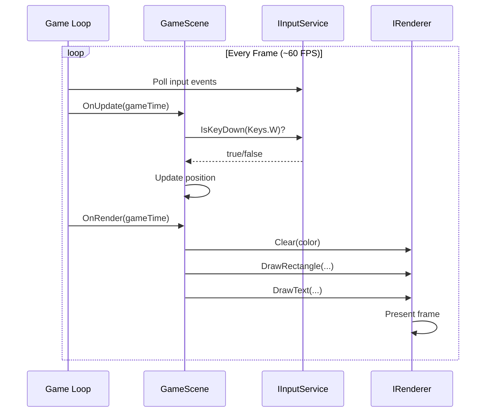

# Quick Start

Get a Brine2D game running in 5 minutes. This guide takes you from zero to a window with a moving sprite.

## Prerequisites

Before starting:

- ✅ [.NET 10 SDK](https://dotnet.microsoft.com/download/dotnet/10.0) installed
- ✅ IDE ready (Visual Studio 2022, VS Code, or Rider)
- ✅ 5 minutes

**New to Brine2D?** Perfect! This guide assumes no prior knowledge.

**Already have a project?** Skip to [Add to Existing Project](#add-to-existing-project).

---

## Step 1: Create Project

Open your terminal and create a new console application:

```sh
dotnet new console -n MyFirstGame
cd MyFirstGame
```

**What this does:**
- Creates a new .NET 10 console application
- Names it `MyFirstGame`
- Changes to the project directory

---

## Step 2: Install Brine2D

Add the Brine2D packages:

```sh
dotnet add package Brine2D --version 0.9.0-beta
dotnet add package Brine2D.SDL --version 0.9.0-beta
```

**What this does:**
- Installs **Brine2D** (core engine)
- Installs **Brine2D.SDL** (rendering, input, audio)

**Verify installation:**

```sh
dotnet list package
```

You should see:

```
Top-level Package                Requested  Resolved
> Brine2D                        0.9.0-beta 0.9.0-beta
> Brine2D.SDL                    0.9.0-beta 0.9.0-beta
```

---

## Step 3: Create Your First Scene

Replace the contents of `Program.cs` with:

```csharp
using Brine2D.Core;
using Brine2D.Engine;
using Brine2D.Hosting;
using Brine2D.Input;
using Brine2D.Rendering;
using Brine2D.SDL;
using Microsoft.Extensions.DependencyInjection;
using Microsoft.Extensions.Logging;
using System.Numerics;

// Create application
var builder = GameApplication.CreateBuilder(args);

// Add Brine2D with sensible defaults (SDL3 backend, GPU rendering, input)
builder.Services.AddBrine2D(options =>
{
    options.WindowTitle = "My First Game";
    options.WindowWidth = 800;
    options.WindowHeight = 600;
});

// Register scene
builder.Services.AddScene<GameScene>();

// Build and run
var game = builder.Build();
await game.RunAsync<GameScene>();

// Game scene
public class GameScene : Scene
{
    private readonly IRenderer _renderer;
    private readonly IInputService _input;
    private readonly IGameContext _gameContext;
    
    private Vector2 _playerPosition = new(400, 300);
    private readonly float _speed = 200f;

    public GameScene(
        IRenderer renderer,
        IInputService input,
        IGameContext gameContext,
        ILogger<GameScene> logger) : base(logger)
    {
        _renderer = renderer;
        _input = input;
        _gameContext = gameContext;
    }

    protected override void OnUpdate(GameTime gameTime)
    {
        // Exit on Escape
        if (_input.IsKeyPressed(Keys.Escape))
        {
            _gameContext.RequestExit();
            return;
        }

        // Move with WASD
        var deltaTime = (float)gameTime.DeltaTime;
        
        if (_input.IsKeyDown(Keys.W)) _playerPosition.Y -= _speed * deltaTime;
        if (_input.IsKeyDown(Keys.S)) _playerPosition.Y += _speed * deltaTime;
        if (_input.IsKeyDown(Keys.A)) _playerPosition.X -= _speed * deltaTime;
        if (_input.IsKeyDown(Keys.D)) _playerPosition.X += _speed * deltaTime;
    }

    protected override void OnRender(GameTime gameTime)
    {
        // Clear screen
        _renderer.Clear(new Color(20, 20, 30));
        
        // Draw player (simple rectangle)
        _renderer.DrawRectangleFilled(
            _playerPosition.X - 25,
            _playerPosition.Y - 25,
            50, 50,
            Color.Blue);
        
        // Draw instructions
        _renderer.DrawText("WASD: Move | ESC: Quit", 10, 10, Color.White);
    }
}
```

---

## Step 4: Run Your Game

Start your game:

```sh
dotnet run
```

**You should see:**
- A window titled "My First Game"
- A blue square in the center
- Instructions at the top
- The square moves with WASD keys
- Escape quits the game

**Success!** You've created your first Brine2D game.

---

## Understanding the Code

Let's break down what each part does:

### Application Setup

```csharp
var builder = GameApplication.CreateBuilder(args);

builder.Services.AddSDL3Rendering(options =>
{
    options.WindowTitle = "My First Game";
    options.WindowWidth = 800;
    options.WindowHeight = 600;
});

builder.Services.AddSDL3Input();
builder.Services.AddScene<GameScene>();

var game = builder.Build();
await game.RunAsync<GameScene>();
```

**What this does:**
1. Creates a game application builder (like ASP.NET Core)
2. Configures rendering (window settings)
3. Adds input handling (keyboard, mouse, gamepad)
4. Registers your game scene
5. Builds and runs the game

**Pattern:** This is dependency injection - Brine2D uses ASP.NET Core patterns.

---

### Scene Class

```csharp
public class GameScene : Scene
{
    private readonly IRenderer _renderer;
    private readonly IInputService _input;
    private readonly IGameContext _gameContext;
    
    public GameScene(
        IRenderer renderer,
        IInputService input,
        IGameContext gameContext,
        ILogger<GameScene> logger) : base(logger)
    {
        _renderer = renderer;
        _input = input;
        _gameContext = gameContext;
    }
}
```

**What this does:**
- Inherits from `Scene` (base class for game scenes)
- Injects dependencies via constructor (renderer, input, context)
- Stores services for use in update/render

**Pattern:** Constructor injection - services are automatically provided.

---

### Update Loop

```csharp
protected override void OnUpdate(GameTime gameTime)
{
    if (_input.IsKeyPressed(Keys.Escape))
    {
        _gameContext.RequestExit();
        return;
    }

    var deltaTime = (float)gameTime.DeltaTime;
    
    if (_input.IsKeyDown(Keys.W)) _playerPosition.Y -= _speed * deltaTime;
    if (_input.IsKeyDown(Keys.S)) _playerPosition.Y += _speed * deltaTime;
    if (_input.IsKeyDown(Keys.A)) _playerPosition.X -= _speed * deltaTime;
    if (_input.IsKeyDown(Keys.D)) _playerPosition.X += _speed * deltaTime;
}
```

**What this does:**
- Called every frame (~60 times per second)
- Handles input (keyboard, mouse, gamepad)
- Updates game state (position, physics, AI)
- Uses `deltaTime` for frame-rate independent movement

**Pattern:** Game loop - update game state before rendering.

---

### Render Loop

```csharp
protected override void OnRender(GameTime gameTime)
{
    _renderer.Clear(new Color(20, 20, 30));
    
    _renderer.DrawRectangleFilled(
        _playerPosition.X - 25,
        _playerPosition.Y - 25,
        50, 50,
        Color.Blue);
    
    _renderer.DrawText("WASD: Move | ESC: Quit", 10, 10, Color.White);
}
```

**What this does:**
- Called every frame after update
- Clears the screen
- Draws game objects (sprites, shapes, text)
- Presents the frame to the screen

**Pattern:** Immediate mode rendering - draw what you see each frame.

---

## Game Loop Diagram



**Key concepts:**
- **Update** runs first (game logic)
- **Render** runs second (drawing)
- Loop runs ~60 times per second
- `deltaTime` ensures consistent speed regardless of FPS

---

## Next Steps

### Add a Sprite

Replace the rectangle with a texture:

```csharp
public class GameScene : Scene
{
    private readonly IRenderer _renderer;
    private ITexture? _playerTexture;

    protected override async Task OnLoadAsync(CancellationToken cancellationToken)
    {
        _playerTexture = await _renderer.LoadTextureAsync(
            "assets/player.png", 
            cancellationToken);
    }

    protected override void OnRender(GameTime gameTime)
    {
        _renderer.Clear(new Color(20, 20, 30));
        
        if (_playerTexture != null)
        {
            _renderer.DrawTexture(
                _playerTexture,
                _playerPosition.X - 25,
                _playerPosition.Y - 25,
                50, 50);
        }
    }
}
```

**Don't forget:** Create `assets/` folder and add `player.png`.

---

### Add Sound Effects

```csharp
using Brine2D.Audio;

public class GameScene : Scene
{
    private readonly IAudioService _audio;
    private ISoundEffect? _jumpSound;

    public GameScene(
        IAudioService audio,
        ...) : base(...)
    {
        _audio = audio;
    }

    protected override async Task OnLoadAsync(CancellationToken cancellationToken)
    {
        _jumpSound = await _audio.LoadSoundAsync(
            "assets/jump.wav", 
            cancellationToken);
    }

    protected override void OnUpdate(GameTime gameTime)
    {
        if (_input.IsKeyPressed(Keys.Space))
        {
            _audio.PlaySound(_jumpSound);
        }
    }
}
```

**Don't forget:** Add audio registration in `Program.cs`:

```csharp
builder.Services.AddSDL3Audio();
```

---

### Add Multiple Scenes

Create a menu scene:

```csharp
public class MenuScene : Scene
{
    private readonly IRenderer _renderer;
    private readonly IInputService _input;
    private readonly ISceneManager _sceneManager;

    public MenuScene(
        IRenderer renderer,
        IInputService input,
        ISceneManager sceneManager,
        ILogger<MenuScene> logger) : base(logger)
    {
        _renderer = renderer;
        _input = input;
        _sceneManager = sceneManager;
    }

    protected override void OnUpdate(GameTime gameTime)
    {
        if (_input.IsKeyPressed(Keys.Enter))
        {
            _sceneManager.LoadScene<GameScene>();
        }
    }

    protected override void OnRender(GameTime gameTime)
    {
        _renderer.Clear(Color.Black);
        _renderer.DrawText("Press ENTER to Start", 300, 280, Color.White);
    }
}
```

Register both scenes:

```csharp
builder.Services.AddScene<MenuScene>();
builder.Services.AddScene<GameScene>();

var game = builder.Build();
await game.RunAsync<MenuScene>(); // Start with menu
```

---

## Add to Existing Project

Already have a .NET 10 project? Add Brine2D to it:

```sh
cd YourExistingProject

# Add packages
dotnet add package Brine2D --version 0.9.0-beta
dotnet add package Brine2D.SDL --version 0.9.0-beta
```

**Update your `Program.cs`:**

```csharp
using Brine2D.Hosting;
using Brine2D.SDL;
using Microsoft.Extensions.DependencyInjection;

var builder = GameApplication.CreateBuilder(args);

builder.Services.AddSDL3Rendering(options =>
{
    options.WindowTitle = "My Game";
    options.WindowWidth = 800;
    options.WindowHeight = 600;
});

builder.Services.AddSDL3Input();
builder.Services.AddScene<GameScene>();

var game = builder.Build();
await game.RunAsync<GameScene>();
```

**Create your scene** in a separate file (`GameScene.cs`).

---

## Troubleshooting

### Problem: Window doesn't appear

**Symptom:** Console shows but no window opens.

**Solutions:**

1. **Check rendering registration:**
   ```csharp
   // Typical approach - AddBrine2D includes rendering
   builder.Services.AddBrine2D(options => 
   {
       options.WindowTitle = "My Game";
       options.WindowWidth = 800;
       options.WindowHeight = 600;
   });
   
   // Or power user approach - manual rendering setup
   builder.Services.AddSDL3Rendering(options => { ... });
   ```

2. **Verify scene is registered:**
   ```csharp
   // Must register scene
   builder.Services.AddScene<GameScene>();
   ```

3. **Check scene is loaded:**
   ```csharp
   // Must specify starting scene
   await game.RunAsync<GameScene>();
   ```

---

### Problem: Nothing renders

**Symptom:** Window opens but is black/empty.

**Solutions:**

1. **Check OnRender is called:**
   ```csharp
   protected override void OnRender(GameTime gameTime)
   {
       Logger.LogInformation("Rendering!"); // Add debug log
       _renderer.Clear(Color.Red); // Should show red
   }
   ```

2. **Verify renderer is injected:**
   ```csharp
   public GameScene(IRenderer renderer, ...) : base(...)
   {
       _renderer = renderer; // Don't forget to store it!
   }
   ```

3. **Check coordinates are visible:**
   ```csharp
   // Draw at 0,0 to test
   _renderer.DrawRectangleFilled(0, 0, 100, 100, Color.Red);
   ```

---

### Problem: Input doesn't work

**Symptom:** Keys don't respond.

**Solutions:**

1. **Check input registration:**
   ```csharp
   // Must have this!
   builder.Services.AddSDL3Input();
   ```

2. **Verify input is injected:**
   ```csharp
   public GameScene(IInputService input, ...) : base(...)
   {
       _input = input; // Don't forget to store it!
   }
   ```

3. **Test in OnUpdate, not OnRender:**
   ```csharp
   // ✅ Correct
   protected override void OnUpdate(GameTime gameTime)
   {
       if (_input.IsKeyDown(Keys.W)) { ... }
   }
   
   // ❌ Wrong
   protected override void OnRender(GameTime gameTime)
   {
       if (_input.IsKeyDown(Keys.W)) { ... } // Won't work!
   }
   ```

---

### Problem: Movement is too fast/slow

**Symptom:** Player zooms around or moves very slowly.

**Solution:** Always use `deltaTime`:

```csharp
// ❌ Wrong - speed depends on FPS
if (_input.IsKeyDown(Keys.W))
{
    _playerPosition.Y -= _speed; // Too fast at 60 FPS!
}

// ✅ Correct - consistent speed
if (_input.IsKeyDown(Keys.W))
{
    _playerPosition.Y -= _speed * deltaTime; // Frame-rate independent
}
```

**Why?**
- Update runs ~60 times per second
- Without `deltaTime`, movement depends on FPS
- With `deltaTime`, movement is consistent (pixels per second)

---

### Problem: Package not found

**Symptom:**

```
error NU1101: Unable to find package Brine2D
```

**Solutions:**

1. **Check NuGet source:**
   ```sh
   dotnet nuget list source
   ```
   
   Should include `nuget.org`:
   ```
   https://api.nuget.org/v3/index.json
   ```

2. **Clear cache and restore:**
   ```sh
   dotnet nuget locals all --clear
   dotnet restore
   ```

3. **Verify package name (no typos):**
   ```sh
   # ❌ Wrong
   dotnet add package Brine2D-Engine
   
   # ✅ Correct
   dotnet add package Brine2D
   ```

---

## Best Practices

### DO

1. **Always use deltaTime for movement**
   ```csharp
   _position += _velocity * (float)gameTime.DeltaTime;
   ```

2. **Store injected services**
   ```csharp
   public GameScene(IRenderer renderer, ...) : base(...)
   {
       _renderer = renderer; // Store it!
   }
   ```

3. **Check for null when using optional resources**
   ```csharp
   if (_playerTexture != null)
   {
       _renderer.DrawTexture(_playerTexture, x, y);
   }
   ```

4. **Use OnLoadAsync for loading assets**
   ```csharp
   protected override async Task OnLoadAsync(CancellationToken ct)
   {
       _texture = await _renderer.LoadTextureAsync("player.png", ct);
   }
   ```

5. **Handle exit gracefully**
   ```csharp
   if (_input.IsKeyPressed(Keys.Escape))
   {
       _gameContext.RequestExit();
   }
   ```

### DON'T

1. **Don't poll input in OnRender**
   ```csharp
   // ❌ Wrong
   protected override void OnRender(GameTime gameTime)
   {
       if (_input.IsKeyDown(Keys.W)) { ... } // Input in update only!
   }
   ```

2. **Don't forget to inject dependencies**
   ```csharp
   // ❌ Wrong
   public GameScene() : base(null) { }
   
   // ✅ Correct
   public GameScene(IRenderer renderer, ...) : base(logger) { }
   ```

3. **Don't load assets in OnUpdate**
   ```csharp
   // ❌ Wrong - causes lag every frame!
   protected override void OnUpdate(GameTime gameTime)
   {
       var texture = await _renderer.LoadTextureAsync(...); // NO!
   }
   ```

4. **Don't forget deltaTime**
   ```csharp
   // ❌ Wrong
   _position += _velocity; // FPS-dependent
   
   // ✅ Correct
   _position += _velocity * deltaTime; // FPS-independent
   ```

---

## Summary

**What you learned:**

| Concept | Description |
|---------|-------------|
| **GameApplication** | Entry point, similar to ASP.NET Core |
| **Scene** | Container for game logic (update + render) |
| **Dependency Injection** | Services injected via constructor |
| **Game Loop** | Update (logic) → Render (drawing) |
| **deltaTime** | Frame-rate independent movement |

**Key patterns:**

```csharp
// 1. Typical setup (recommended)
var builder = GameApplication.CreateBuilder(args);
builder.Services.AddBrine2D(options =>
{
    options.WindowTitle = "My Game";
    options.WindowWidth = 1280;
    options.WindowHeight = 720;
    // Defaults: GPU backend with VSync enabled
});
builder.Services.AddScene<GameScene>();

// 2. Scene
public class GameScene : Scene
{
    public GameScene(IRenderer renderer, ...) : base(logger) { }
    
    protected override void OnUpdate(GameTime gameTime) { }
    protected override void OnRender(GameTime gameTime) { }
}

// 3. Run
await game.RunAsync<GameScene>();
```

---

## Next Steps

Now that you have a working game, explore more features:

- **[Your First Game](first-game.md)** - Build a complete game with sprites, audio, and collision
- **[Project Structure](project-structure.md)** - Organize your code
- **[Configuration](configuration.md)** - Configure game settings
- **[Input Guide](../guides/input/keyboard.md)** - Master keyboard, mouse, and gamepad input
- **[Rendering Guide](../guides/rendering/sprites.md)** - Work with sprites and textures
- **[ECS Guide](../guides/ecs/getting-started.md)** - Use the Entity Component System

---

## Quick Reference

```csharp
// Minimal Program.cs
using Brine2D.Hosting;
using Brine2D.SDL;
using Microsoft.Extensions.DependencyInjection;

var builder = GameApplication.CreateBuilder(args);

builder.Services.AddSDL3Rendering(options =>
{
    options.WindowTitle = "My Game";
    options.WindowWidth = 800;
    options.WindowHeight = 600;
});

builder.Services.AddSDL3Input();
builder.Services.AddScene<GameScene>();

var game = builder.Build();
await game.RunAsync<GameScene>();
```

```csharp
// Minimal Scene
public class GameScene : Scene
{
    private readonly IRenderer _renderer;
    private readonly IInputService _input;
    private readonly IGameContext _gameContext;

    public GameScene(
        IRenderer renderer,
        IInputService input,
        IGameContext gameContext,
        ILogger<GameScene> logger) : base(logger)
    {
        _renderer = renderer;
        _input = input;
        _gameContext = gameContext;
    }

    protected override void OnUpdate(GameTime gameTime)
    {
        if (_input.IsKeyPressed(Keys.Escape))
        {
            _gameContext.RequestExit();
        }
    }

    protected override void OnRender(GameTime gameTime)
    {
        _renderer.Clear(Color.Black);
        _renderer.DrawText("Hello, Brine2D!", 10, 10, Color.White);
    }
}
```

---

Ready to build your first complete game? Head to [Your First Game](first-game.md)!