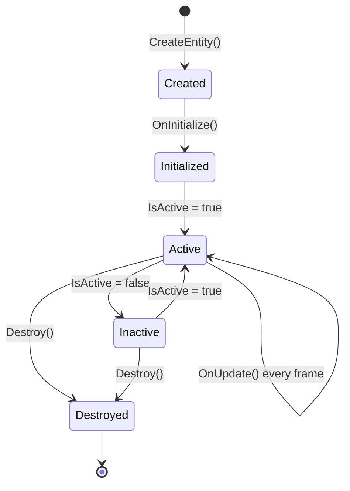

# ECS Entities

Entities are the **fundamental building blocks** of Brine2D's ECS. They're lightweight containers that hold components and represent game objects. Think of them as rows in a database or GameObjects in Unity, but simpler and more flexible.

## What Are Entities?

**Entities are containers** with:
- Unique ID (Guid)
- Optional name (for debugging)
- Tags (for grouping/querying)
- Components (data and behavior)
- Lifecycle state (active/inactive)

```csharp
using Brine2D.ECS;

var player = world.CreateEntity("Player");

Console.WriteLine(player.Id);       // Guid: "123e4567-e89b-12d3..."
Console.WriteLine(player.Name);     // "Player"
Console.WriteLine(player.IsActive); // true
Console.WriteLine(player.Tags);     // HashSet<string>
```

---

## Creating Entities

### Basic Creation

```csharp
// Simple entity
var entity = world.CreateEntity();

// Entity with name
var player = world.CreateEntity("Player");

// Add tags for grouping
player.Tags.Add("Player");
player.Tags.Add("Controllable");
```

### Adding Components

```csharp
// Method 1: Add and configure separately
var transform = player.AddComponent<TransformComponent>();
transform.Position = new Vector2(100, 200);
transform.Rotation = 0;

// Method 2: Add and configure inline
player.AddComponent<VelocityComponent>().MaxSpeed = 200f;

// Method 3: Fluent syntax (chainable)
var enemy = world.CreateEntity("Enemy")
    .AddComponent<TransformComponent>()
    .AddComponent<VelocityComponent>()
    .AddComponent<SpriteComponent>()
    .AddComponent<HealthComponent>();
```

### Using Prefabs

For reusable entity templates:

```csharp
using Brine2D.ECS;

// Create prefab
var bulletPrefab = new EntityPrefab("Bullet");
bulletPrefab.Tags.Add("Projectile");

bulletPrefab.AddComponent<TransformComponent>();
bulletPrefab.AddComponent<VelocityComponent>(v => v.MaxSpeed = 500f);
bulletPrefab.AddComponent<SpriteComponent>(s => s.TexturePath = "assets/bullet.png");
bulletPrefab.AddComponent<LifetimeComponent>(l => l.Lifetime = 3f);

// Register prefab
prefabLibrary.Register(bulletPrefab);

// Instantiate many times
for (int i = 0; i < 10; i++)
{
    var bullet = bulletPrefab.Instantiate(world, new Vector2(i * 50, 100));
}
```

---

## Entity Lifecycle

Entities have several states and lifecycle events:



### Lifecycle Methods

```csharp
public class MyEntity : Entity
{
    protected internal override void OnInitialize()
    {
        // Called once when entity is created
        // Set up initial state
    }
    
    protected internal override void OnUpdate(GameTime gameTime)
    {
        // Called every frame if entity is active
        // Updates all enabled components
    }
    
    protected internal override void OnDestroy()
    {
        // Called when entity is destroyed
        // Clean up resources
    }
}
```

### Entity Events

```csharp
var entity = world.CreateEntity("Player");

// Subscribe to entity events
entity.OnComponentAdded += (e, component) =>
{
    Logger.LogInformation($"Added {component.GetType().Name}");
};

entity.OnComponentRemoved += (e, component) =>
{
    Logger.LogInformation($"Removed {component.GetType().Name}");
};

entity.OnDestroyed += (e) =>
{
    Logger.LogInformation($"Entity {e.Name} destroyed");
};
```

---

## Managing Entities

### Activating/Deactivating

```csharp
// Disable entity (stops updates, keeps in world)
entity.IsActive = false;

// Re-enable entity
entity.IsActive = true;

// Check state
if (entity.IsActive)
{
    // Entity is updating
}
```

When deactivated:
- Entity remains in world
- Components don't update
- Still queryable
- Still renders (unless system checks `IsActive`)

### Destroying Entities

```csharp
// Method 1: Via entity
entity.Destroy();

// Method 2: Via world
world.DestroyEntity(entity);

// Destruction:
// - Fires OnDestroy event
// - Calls OnRemoved on all components
// - Removes from world
// - Cannot be reused
```

### Parent-Child Relationships

```csharp
// Create parent
var player = world.CreateEntity("Player");
player.AddComponent<TransformComponent>();

// Create child
var weapon = world.CreateEntity("Sword");
weapon.AddComponent<TransformComponent>();

// Set parent (requires transform hierarchy)
weapon.SetParent(player);

// Unparent
weapon.SetParent(null);

// When parent is destroyed, children are also destroyed
```

---

## Querying Entities

Brine2D provides several ways to find entities:

### Get All Entities

```csharp
// Get all entities in world
var allEntities = world.Entities;

foreach (var entity in allEntities)
{
    Console.WriteLine(entity.Name);
}
```

### Query by Component

```csharp
// Get entities with specific component
var withHealth = world.GetEntitiesWithComponent<HealthComponent>();

foreach (var entity in withHealth)
{
    var health = entity.GetComponent<HealthComponent>()!;
    Console.WriteLine($"{entity.Name}: {health.Current}/{health.Max}");
}
```

### Query by Multiple Components

```csharp
// Get entities with Transform AND Velocity
var moving = world.GetEntitiesWithComponents<TransformComponent, VelocityComponent>();

foreach (var entity in moving)
{
    var transform = entity.GetComponent<TransformComponent>()!;
    var velocity = entity.GetComponent<VelocityComponent>()!;
    
    // Process moving entity
}
```

### Query by Tag

```csharp
// Get all enemies
var enemies = world.GetEntitiesByTag("Enemy");

// Get entities with multiple tags (AND logic)
var bossEnemies = world.GetEntitiesByTag("Enemy")
    .Where(e => e.Tags.Contains("Boss"));
```

### Find Specific Entity

```csharp
// Find by name
var player = world.GetEntityByName("Player");

// Find by ID
var entity = world.GetEntityById(someGuid);

// Find by predicate (custom logic)
var boss = world.FindEntity(e => 
    e.Tags.Contains("Enemy") && 
    e.Name.Contains("Boss") &&
    e.GetComponent<HealthComponent>()?.Max > 500
);
```

---

## Entity Patterns

### Factory Pattern

Create entities through factory methods:

```csharp
public class EntityFactory
{
    private readonly IEntityWorld _world;
    private readonly ITextureLoader _textureLoader;
    
    public EntityFactory(IEntityWorld world, ITextureLoader textureLoader)
    {
        _world = world;
        _textureLoader = textureLoader;
    }
    
    public Entity CreatePlayer(Vector2 position)
    {
        var player = _world.CreateEntity("Player");
        player.Tags.Add("Player");
        player.Tags.Add("Controllable");
        
        player.AddComponent<TransformComponent>().Position = position;
        player.AddComponent<VelocityComponent>().MaxSpeed = 200f;
        player.AddComponent<PlayerControllerComponent>();
        player.AddComponent<HealthComponent>().Max = 100;
        
        var sprite = player.AddComponent<SpriteComponent>();
        sprite.TexturePath = "assets/player.png";
        
        return player;
    }
    
    public Entity CreateEnemy(Vector2 position, EnemyType type)
    {
        var enemy = _world.CreateEntity($"Enemy_{type}");
        enemy.Tags.Add("Enemy");
        
        enemy.AddComponent<TransformComponent>().Position = position;
        enemy.AddComponent<VelocityComponent>();
        enemy.AddComponent<AIControllerComponent>().Behavior = AIBehavior.Chase;
        
        switch (type)
        {
            case EnemyType.Weak:
                enemy.AddComponent<HealthComponent>().Max = 30;
                break;
            case EnemyType.Strong:
                enemy.AddComponent<HealthComponent>().Max = 100;
                break;
            case EnemyType.Boss:
                enemy.AddComponent<HealthComponent>().Max = 500;
                enemy.Tags.Add("Boss");
                break;
        }
        
        return enemy;
    }
    
    public Entity CreateBullet(Vector2 position, Vector2 direction)
    {
        var bullet = _world.CreateEntity("Bullet");
        bullet.Tags.Add("Projectile");
        
        bullet.AddComponent<TransformComponent>().Position = position;
        bullet.AddComponent<VelocityComponent>().Velocity = direction * 500f;
        bullet.AddComponent<LifetimeComponent>().Lifetime = 3f;
        
        return bullet;
    }
}

public enum EnemyType
{
    Weak,
    Strong,
    Boss
}
```

### Builder Pattern

Fluent API for entity construction:

```csharp
public class EntityBuilder
{
    private readonly IEntityWorld _world;
    private readonly Entity _entity;
    
    public EntityBuilder(IEntityWorld world, string name = "")
    {
        _world = world;
        _entity = world.CreateEntity(name);
    }
    
    public EntityBuilder WithTag(string tag)
    {
        _entity.Tags.Add(tag);
        return this;
    }
    
    public EntityBuilder WithTransform(Vector2 position)
    {
        _entity.AddComponent<TransformComponent>().Position = position;
        return this;
    }
    
    public EntityBuilder WithVelocity(float maxSpeed)
    {
        _entity.AddComponent<VelocityComponent>().MaxSpeed = maxSpeed;
        return this;
    }
    
    public EntityBuilder WithSprite(string texturePath)
    {
        _entity.AddComponent<SpriteComponent>().TexturePath = texturePath;
        return this;
    }
    
    public EntityBuilder WithHealth(float max)
    {
        var health = _entity.AddComponent<HealthComponent>();
        health.Max = max;
        health.Current = max;
        return this;
    }
    
    public EntityBuilder WithComponent<T>() where T : Component, new()
    {
        _entity.AddComponent<T>();
        return this;
    }
    
    public EntityBuilder WithComponent<T>(Action<T> configure) where T : Component, new()
    {
        var component = _entity.AddComponent<T>();
        configure(component);
        return this;
    }
    
    public Entity Build() => _entity;
}

// Usage
var player = new EntityBuilder(world, "Player")
    .WithTag("Player")
    .WithTag("Controllable")
    .WithTransform(new Vector2(400, 300))
    .WithVelocity(200f)
    .WithSprite("assets/player.png")
    .WithHealth(100)
    .WithComponent<PlayerControllerComponent>()
    .Build();
```

### Object Pool Pattern

Reuse entities instead of creating/destroying:

```csharp
public class EntityPool
{
    private readonly IEntityWorld _world;
    private readonly Queue<Entity> _pool = new();
    private readonly EntityPrefab _prefab;
    
    public EntityPool(IEntityWorld world, EntityPrefab prefab, int initialSize = 10)
    {
        _world = world;
        _prefab = prefab;
        
        // Pre-create entities
        for (int i = 0; i < initialSize; i++)
        {
            var entity = prefab.Instantiate(world, Vector2.Zero);
            entity.IsActive = false;
            _pool.Enqueue(entity);
        }
    }
    
    public Entity Spawn(Vector2 position)
    {
        Entity entity;
        
        if (_pool.Count > 0)
        {
            // Reuse from pool
            entity = _pool.Dequeue();
            entity.IsActive = true;
        }
        else
        {
            // Create new
            entity = _prefab.Instantiate(_world, position);
        }
        
        // Reset position
        var transform = entity.GetComponent<TransformComponent>();
        if (transform != null)
        {
            transform.Position = position;
        }
        
        return entity;
    }
    
    public void Despawn(Entity entity)
    {
        // Reset state
        var velocity = entity.GetComponent<VelocityComponent>();
        if (velocity != null)
        {
            velocity.Velocity = Vector2.Zero;
        }
        
        // Deactivate and return to pool
        entity.IsActive = false;
        _pool.Enqueue(entity);
    }
}

// Usage
var bulletPool = new EntityPool(world, bulletPrefab, 50);

// Spawn bullet
var bullet = bulletPool.Spawn(playerPosition);

// Later, despawn instead of destroy
bulletPool.Despawn(bullet);
```

---

## Entity Groups

Organize entities into logical groups:

```csharp
public class EntityGroup
{
    private readonly HashSet<Entity> _entities = new();
    
    public string Name { get; }
    public IReadOnlyCollection<Entity> Entities => _entities;
    
    public EntityGroup(string name)
    {
        Name = name;
    }
    
    public void Add(Entity entity)
    {
        _entities.Add(entity);
        entity.OnDestroyed += OnEntityDestroyed;
    }
    
    public void Remove(Entity entity)
    {
        _entities.Remove(entity);
        entity.OnDestroyed -= OnEntityDestroyed;
    }
    
    private void OnEntityDestroyed(Entity entity)
    {
        _entities.Remove(entity);
    }
    
    public void DestroyAll()
    {
        foreach (var entity in _entities.ToList())
        {
            entity.Destroy();
        }
        _entities.Clear();
    }
    
    public void SetActiveAll(bool active)
    {
        foreach (var entity in _entities)
        {
            entity.IsActive = active;
        }
    }
}

// Usage
var enemyGroup = new EntityGroup("Enemies");

for (int i = 0; i < 10; i++)
{
    var enemy = factory.CreateEnemy(randomPosition, EnemyType.Weak);
    enemyGroup.Add(enemy);
}

// Later...
enemyGroup.DestroyAll(); // Destroy all enemies at once
```

---

## Advanced Querying

### Filtering Queries

```csharp
// Get all active enemies with low health
var weakEnemies = world.GetEntitiesByTag("Enemy")
    .Where(e => e.IsActive)
    .Where(e =>
    {
        var health = e.GetComponent<HealthComponent>();
        return health != null && health.Percentage < 0.3f;
    });

// Get all projectiles moving right
var rightMoving = world.GetEntitiesWithComponents<VelocityComponent>()
    .Where(e => e.Tags.Contains("Projectile"))
    .Where(e => e.GetComponent<VelocityComponent>()!.Velocity.X > 0);
```

### Spatial Queries

```csharp
public static class EntityQueryExtensions
{
    public static IEnumerable<Entity> WithinRadius(
        this IEnumerable<Entity> entities,
        Vector2 center,
        float radius)
    {
        var radiusSquared = radius * radius;
        
        return entities.Where(e =>
        {
            var transform = e.GetComponent<TransformComponent>();
            if (transform == null) return false;
            
            var distanceSquared = Vector2.DistanceSquared(transform.Position, center);
            return distanceSquared <= radiusSquared;
        });
    }
    
    public static IEnumerable<Entity> InRectangle(
        this IEnumerable<Entity> entities,
        RectangleF bounds)
    {
        return entities.Where(e =>
        {
            var transform = e.GetComponent<TransformComponent>();
            return transform != null && bounds.Contains(transform.Position);
        });
    }
}

// Usage
var nearbyEnemies = world.GetEntitiesByTag("Enemy")
    .WithinRadius(playerPosition, 200f);

var visibleEntities = world.GetEntitiesWithComponent<SpriteComponent>()
    .InRectangle(cameraViewport);
```

### Component-Based Filtering

```csharp
// Get entities that have Health AND Transform but NOT Dead tag
var aliveEntities = world.GetEntitiesWithComponents<HealthComponent, TransformComponent>()
    .Where(e => !e.Tags.Contains("Dead"));

// Get entities with optional components
var entities = world.GetEntitiesWithComponent<TransformComponent>();

foreach (var entity in entities)
{
    var transform = entity.GetComponent<TransformComponent>()!;
    var velocity = entity.GetComponent<VelocityComponent>(); // Optional
    
    if (velocity != null)
    {
        // Has velocity
    }
    else
    {
        // Stationary
    }
}
```

---

## Performance Tips

### Query Caching

Cache queries when possible:

```csharp
public class EnemyManager
{
    private readonly IEntityWorld _world;
    private List<Entity>? _cachedEnemies;
    private bool _isDirty = true;
    
    public EnemyManager(IEntityWorld world)
    {
        _world = world;
        
        // Invalidate cache on entity changes
        _world.OnEntityCreated += _ => _isDirty = true;
        _world.OnEntityDestroyed += _ => _isDirty = true;
    }
    
    public IEnumerable<Entity> GetEnemies()
    {
        if (_isDirty || _cachedEnemies == null)
        {
            _cachedEnemies = _world.GetEntitiesByTag("Enemy").ToList();
            _isDirty = false;
        }
        
        return _cachedEnemies;
    }
}
```

### Minimize Lookups

```csharp
// ❌ Slow - multiple component lookups
foreach (var entity in entities)
{
    if (entity.HasComponent<HealthComponent>())
    {
        var health = entity.GetComponent<HealthComponent>();
        var transform = entity.GetComponent<TransformComponent>();
        // Process...
    }
}

// ✅ Fast - query for both components upfront
var entities = world.GetEntitiesWithComponents<HealthComponent, TransformComponent>();

foreach (var entity in entities)
{
    var health = entity.GetComponent<HealthComponent>()!;
    var transform = entity.GetComponent<TransformComponent>()!;
    // Process...
}
```

### Use Tags Wisely

Tags are faster than component checks:

```csharp
// ✅ Fast - tag check
if (entity.Tags.Contains("Enemy"))
{
    // ...
}

// ⚠️ Slower - component check
if (entity.HasComponent<EnemyComponent>())
{
    // ...
}
```

---

## Debugging Entities

### Entity Inspector

```csharp
public static class EntityDebugger
{
    public static void PrintEntity(Entity entity)
    {
        Console.WriteLine($"=== Entity: {entity.Name} ===");
        Console.WriteLine($"ID: {entity.Id}");
        Console.WriteLine($"Active: {entity.IsActive}");
        Console.WriteLine($"Tags: {string.Join(", ", entity.Tags)}");
        Console.WriteLine("Components:");
        
        foreach (var component in entity.GetAllComponents())
        {
            var enabled = component.IsEnabled ? "✓" : "✗";
            Console.WriteLine($"  [{enabled}] {component.GetType().Name}");
        }
    }
    
    public static void PrintWorldStats(IEntityWorld world)
    {
        Console.WriteLine($"=== World Statistics ===");
        Console.WriteLine($"Total Entities: {world.Entities.Count}");
        Console.WriteLine($"Active Entities: {world.Entities.Count(e => e.IsActive)}");
        
        // Count by tag
        var tagCounts = world.Entities
            .SelectMany(e => e.Tags)
            .GroupBy(t => t)
            .Select(g => new { Tag = g.Key, Count = g.Count() });
        
        Console.WriteLine("Entities by Tag:");
        foreach (var tagCount in tagCounts)
        {
            Console.WriteLine($"  {tagCount.Tag}: {tagCount.Count}");
        }
    }
}

// Usage
EntityDebugger.PrintEntity(player);
EntityDebugger.PrintWorldStats(world);
```

---

## Quick Reference

### Entity Creation

```csharp
var entity = world.CreateEntity("Name");
entity.Tags.Add("Tag");
entity.AddComponent<MyComponent>();
```

### Entity Queries

```csharp
world.Entities                                    // All entities
world.GetEntityByName("Player")                   // By name
world.GetEntityById(guid)                         // By ID
world.GetEntitiesByTag("Enemy")                   // By tag
world.GetEntitiesWithComponent<T>()               // By component
world.GetEntitiesWithComponents<T1, T2>()         // By multiple
world.FindEntity(e => /* predicate */)            // By condition
```

### Entity Management

```csharp
entity.IsActive = false;                          // Deactivate
entity.Destroy();                                 // Destroy
world.DestroyEntity(entity);                      // Destroy via world
entity.OnDestroyed += handler;                    // Subscribe to events
```

---

## Next Steps

Now that you understand entities, explore related topics:

<div class="grid cards" markdown>

-   **Components Guide**

    ---

    Learn how to create and use components

    [:octicons-arrow-right-24: Components Guide](components.md)

-   **Systems Guide**

    ---

    Write systems that process entities efficiently

    [:octicons-arrow-right-24: Systems Guide](systems.md)

-   **ECS Concepts**

    ---

    Understand the big picture

    [:octicons-arrow-right-24: ECS Concepts](../../concepts/entity-component-system.md)

</div>

---

**Remember:** Entities are simple containers. The real power comes from combining components to create complex behaviors through composition!