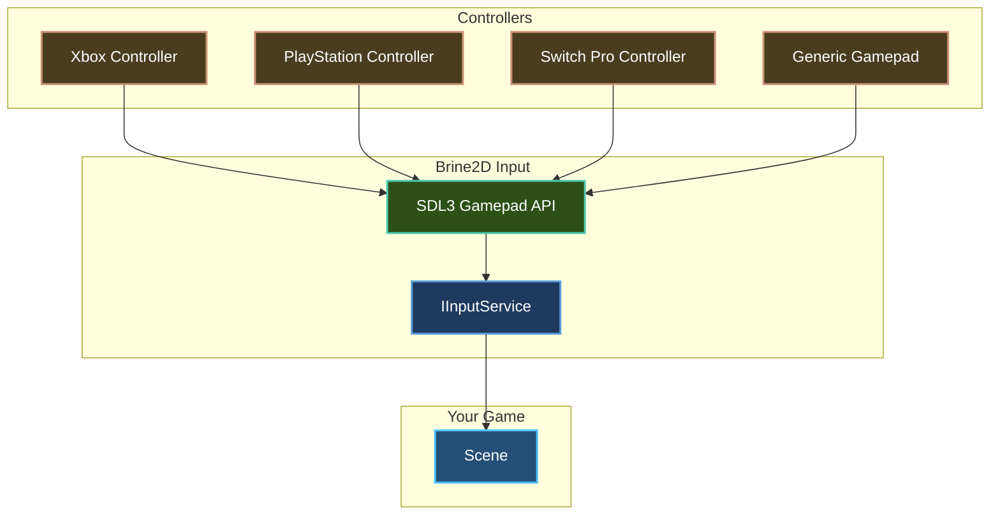

# Gamepad Support

Add full controller support to your game with Xbox, PlayStation, and generic gamepad compatibility.

## Overview

Brine2D provides comprehensive gamepad support via `IInputService`:
- ✅ **Universal compatibility** - Xbox, PlayStation, Switch Pro, generic
- ✅ **Buttons** - Face buttons, shoulders, D-pad, start/back
- ✅ **Analog sticks** - Left/right sticks with deadzone
- ✅ **Triggers** - Left/right analog triggers
- ✅ **Hot-plug** - Automatic connect/disconnect detection
- ✅ **Multiple controllers** - Support up to 4 gamepads



---

## Prerequisites

- ✅ [Quick Start](../getting-started/quick-start.md) - Basic scene setup
- ✅ [Keyboard Input](keyboard.md) - Understanding input basics
- ✅ A gamepad/controller connected

---

## Quick Example

```csharp GamepadExample.cs
using Brine2D.Core;
using Brine2D.Input;
using Brine2D.Rendering;
using Microsoft.Extensions.Logging;
using System.Numerics;

public class GamepadScene : Scene
{
    private readonly IInputService _input;
    private readonly IRenderer _renderer;
    private readonly IGameContext _gameContext;
    
    private Vector2 _playerPosition = new Vector2(400, 300);
    private float _speed = 200f;
    
    public GamepadScene(
        IInputService input,
        IRenderer renderer,
        IGameContext gameContext,
        ILogger<GamepadScene> logger
    ) : base(logger)
    {
        _input = input;
        _renderer = renderer;
        _gameContext = gameContext;
    }
    
    protected override void OnUpdate(GameTime gameTime)
    {
        var deltaTime = (float)gameTime.DeltaTime;
        
        // Check if gamepad is connected
        if (!_input.IsGamepadConnected())
        {
            return; // No gamepad, skip input
        }
        
        // Get left stick for movement
        var leftStick = _input.GetGamepadLeftStick();
        _playerPosition += leftStick * _speed * deltaTime;
        
        // Jump on A button
        if (_input.IsGamepadButtonPressed(GamepadButton.A))
        {
            Logger.LogInformation("Jump!");
        }
        
        // Exit on Start button
        if (_input.IsGamepadButtonPressed(GamepadButton.Start))
        {
            _gameContext.RequestExit();
        }
    }
    
    protected override void OnRender(GameTime gameTime)
    {
        _renderer.Clear(Color.Black);
        _renderer.BeginFrame();
        
        // Draw player
        _renderer.DrawRectangle(
            _playerPosition.X - 25, _playerPosition.Y - 25,
            50, 50, Color.Green);
        
        // Show controller status
        var status = _input.IsGamepadConnected() 
            ? "Controller Connected" 
            : "No Controller";
        _renderer.DrawText(status, 10, 10, Color.White);
        
        _renderer.EndFrame();
    }
}
```

**Result:** Move with left stick, jump with A, exit with Start! 🎮

---

## Controller Layout

### Universal Button Mapping

Brine2D uses **Xbox-style naming** that maps correctly to all controllers:

```
         [LB]              [RB]          ← Shoulder Buttons
         
    [LT]                      [RT]       ← Triggers (analog)
    
         [Back]  (O)  [Start]            ← System Buttons
                                           O = Guide/Home
    
         [D-Pad]          [Y]             ← Face Buttons
          ↑               / \
        ←   →           [X] [B]
          ↓               [A]
    
    [Left Stick]    [Right Stick]       ← Analog Sticks (clickable)
         (⊙)             (⊙)
```

| Xbox | PlayStation | Nintendo Switch |
|------|-------------|-----------------|
| A | Cross (X) | B |
| B | Circle (O) | A |
| X | Square (□) | Y |
| Y | Triangle (△) | X |
| LB | L1 | L |
| RB | R1 | R |
| LT | L2 | ZL |
| RT | R2 | ZR |
| Left Stick | L3 (click) | L Stick (click) |
| Right Stick | R3 (click) | R Stick (click) |
| Back | Select/Share | Minus (-) |
| Start | Start/Options | Plus (+) |
| Guide | PS Button | Home |

---

## Connection Detection

### Check if Gamepad is Connected

```csharp
protected override void OnUpdate(GameTime gameTime)
{
    // Check if any gamepad is connected
    if (_input.IsGamepadConnected())
    {
        // Gamepad available!
        HandleGamepadInput();
    }
    else
    {
        // Fallback to keyboard/mouse
        HandleKeyboardInput();
    }
}
```

---

### Multiple Gamepads

```csharp
protected override void OnUpdate(GameTime gameTime)
{
    // Check specific gamepad indices (0-3)
    if (_input.IsGamepadConnected(0)) // Player 1
    {
        HandlePlayer1Input(0);
    }
    
    if (_input.IsGamepadConnected(1)) // Player 2
    {
        HandlePlayer2Input(1);
    }
}
```

**Indices:**
- `0` = Player 1 (default)
- `1` = Player 2
- `2` = Player 3
- `3` = Player 4

---

## Buttons

### Available Buttons

```csharp
// Face buttons (right side)
GamepadButton.A        // Bottom (Xbox A, PS Cross)
GamepadButton.B        // Right (Xbox B, PS Circle)
GamepadButton.X        // Left (Xbox X, PS Square)
GamepadButton.Y        // Top (Xbox Y, PS Triangle)

// Shoulder buttons
GamepadButton.LeftShoulder   // LB, L1
GamepadButton.RightShoulder  // RB, R1

// Stick clicks
GamepadButton.LeftStick      // L3 click
GamepadButton.RightStick     // R3 click

// D-Pad
GamepadButton.DPadUp
GamepadButton.DPadDown
GamepadButton.DPadLeft
GamepadButton.DPadRight

// System buttons
GamepadButton.Start          // Start, Options, Plus
GamepadButton.Back           // Back, Select, Minus
GamepadButton.Guide          // Xbox/PS/Home button
```

---

### Button States

#### IsGamepadButtonDown - Held Detection

```csharp
protected override void OnUpdate(GameTime gameTime)
{
    // Returns TRUE while button is held
    if (_input.IsGamepadButtonDown(GamepadButton.A))
    {
        ChargeAttack(); // Continuous charging
    }
}
```

---

#### IsGamepadButtonPressed - Press Detection

```csharp
protected override void OnUpdate(GameTime gameTime)
{
    // Returns TRUE only on first frame of press
    if (_input.IsGamepadButtonPressed(GamepadButton.A))
    {
        Jump(); // One jump per press
    }
    
    if (_input.IsGamepadButtonPressed(GamepadButton.X))
    {
        Attack(); // One attack per press
    }
}
```

---

#### IsGamepadButtonReleased - Release Detection

```csharp
private bool _isChargingAttack = false;
private float _chargeTime = 0f;

protected override void OnUpdate(GameTime gameTime)
{
    var deltaTime = (float)gameTime.DeltaTime;
    
    // Start charging
    if (_input.IsGamepadButtonPressed(GamepadButton.B))
    {
        _isChargingAttack = true;
        _chargeTime = 0f;
    }
    
    // Accumulate charge
    if (_isChargingAttack && _input.IsGamepadButtonDown(GamepadButton.B))
    {
        _chargeTime += deltaTime;
    }
    
    // Release - fire charged attack
    if (_input.IsGamepadButtonReleased(GamepadButton.B))
    {
        if (_isChargingAttack)
        {
            FireChargedAttack(_chargeTime);
            _isChargingAttack = false;
        }
    }
}
```

---

## Analog Sticks

### Get Stick Input

```csharp
protected override void OnUpdate(GameTime gameTime)
{
    var deltaTime = (float)gameTime.DeltaTime;
    
    // Get left stick (-1 to 1 for each axis)
    var leftStick = _input.GetGamepadLeftStick();
    
    // Get right stick
    var rightStick = _input.GetGamepadRightStick();
    
    // Use for movement
    if (leftStick.LengthSquared() > 0.01f) // Deadzone check
    {
        _playerPosition += leftStick * _speed * deltaTime;
    }
    
    // Use for camera/aiming
    if (rightStick.LengthSquared() > 0.01f)
    {
        _cameraRotation += rightStick * _cameraSensitivity * deltaTime;
    }
}
```

**Returns:**
- `Vector2(-1 to 1, -1 to 1)`
- `X` axis: -1 = left, +1 = right
- `Y` axis: -1 = up, +1 = down

```
Stick Coordinates:
       Y-
       |
  (-1,0)|  (1,0)
-X ----+---- X+
  (-1,0)|  (1,0)
       |
       Y+
       
Center = (0, 0)
Fully pushed = (±1, ±1)
```

---

### Individual Axes

```csharp
protected override void OnUpdate(GameTime gameTime)
{
    // Get individual axis values
    var leftX = _input.GetGamepadAxis(GamepadAxis.LeftX);   // -1 to 1
    var leftY = _input.GetGamepadAxis(GamepadAxis.LeftY);   // -1 to 1
    var rightX = _input.GetGamepadAxis(GamepadAxis.RightX); // -1 to 1
    var rightY = _input.GetGamepadAxis(GamepadAxis.RightY); // -1 to 1
}
```

---

### Deadzone Handling

Apply deadzone to avoid stick drift:

```csharp
public static Vector2 ApplyDeadzone(Vector2 stick, float deadzone = 0.15f)
{
    var magnitude = stick.Length();
    
    if (magnitude < deadzone)
    {
        return Vector2.Zero; // Inside deadzone
    }
    
    // Rescale to 0-1 range outside deadzone
    var normalized = stick / magnitude;
    var scaledMagnitude = (magnitude - deadzone) / (1.0f - deadzone);
    
    return normalized * scaledMagnitude;
}

// Usage
var leftStick = ApplyDeadzone(_input.GetGamepadLeftStick(), 0.15f);
```

**Why?** Controllers have slight drift near center. Deadzone prevents unwanted movement.

---

## Triggers

### Get Trigger Values

```csharp
protected override void OnUpdate(GameTime gameTime)
{
    // Get trigger values (0 to 1)
    var leftTrigger = _input.GetGamepadAxis(GamepadAxis.LeftTrigger);
    var rightTrigger = _input.GetGamepadAxis(GamepadAxis.RightTrigger);
    
    // Use for analog control
    if (leftTrigger > 0.1f) // Slight deadzone
    {
        Brake(leftTrigger); // Brake proportional to trigger
    }
    
    if (rightTrigger > 0.1f)
    {
        Accelerate(rightTrigger); // Accelerate proportional to trigger
    }
}
```

**Returns:**
- `0.0f` = Not pressed
- `1.0f` = Fully pressed
- Values between for partial press

---

### Trigger as Button

```csharp
protected override void OnUpdate(GameTime gameTime)
{
    var rightTrigger = _input.GetGamepadAxis(GamepadAxis.RightTrigger);
    
    // Treat as button (threshold)
    if (rightTrigger > 0.8f) // 80% pressed = "down"
    {
        Shoot();
    }
}
```

---

## Common Patterns

### Pattern 1: Stick Movement

```csharp
protected override void OnUpdate(GameTime gameTime)
{
    if (!_input.IsGamepadConnected()) return;
    
    var deltaTime = (float)gameTime.DeltaTime;
    var leftStick = _input.GetGamepadLeftStick();
    
    // Apply deadzone
    if (leftStick.LengthSquared() < 0.15f * 0.15f)
    {
        leftStick = Vector2.Zero;
    }
    
    // Apply movement
    _playerPosition += leftStick * _speed * deltaTime;
}
```

---

### Pattern 2: D-Pad Menu Navigation

```csharp
private int _selectedIndex = 0;

protected override void OnUpdate(GameTime gameTime)
{
    if (!_input.IsGamepadConnected()) return;
    
    if (_input.IsGamepadButtonPressed(GamepadButton.DPadUp))
    {
        _selectedIndex = Math.Max(0, _selectedIndex - 1);
    }
    
    if (_input.IsGamepadButtonPressed(GamepadButton.DPadDown))
    {
        _selectedIndex = Math.Min(_menuItems.Length - 1, _selectedIndex + 1);
    }
    
    if (_input.IsGamepadButtonPressed(GamepadButton.A))
    {
        SelectMenuItem(_selectedIndex);
    }
}
```

---

### Pattern 3: Twin-Stick Shooter

```csharp
protected override void OnUpdate(GameTime gameTime)
{
    if (!_input.IsGamepadConnected()) return;
    
    var deltaTime = (float)gameTime.DeltaTime;
    
    // Left stick = movement
    var leftStick = _input.GetGamepadLeftStick();
    if (leftStick.LengthSquared() > 0.01f)
    {
        _playerPosition += leftStick * _moveSpeed * deltaTime;
    }
    
    // Right stick = aiming
    var rightStick = _input.GetGamepadRightStick();
    if (rightStick.LengthSquared() > 0.01f)
    {
        _aimDirection = rightStick;
        
        // Auto-fire when aiming
        FireBullet(_aimDirection);
    }
}
```

---

### Pattern 4: Racing Game Controls

```csharp
protected override void OnUpdate(GameTime gameTime)
{
    if (!_input.IsGamepadConnected()) return;
    
    var deltaTime = (float)gameTime.DeltaTime;
    
    // Left stick X = steering
    var steer = _input.GetGamepadAxis(GamepadAxis.LeftX);
    _carRotation += steer * _steerSpeed * deltaTime;
    
    // Right trigger = accelerate
    var accelerate = _input.GetGamepadAxis(GamepadAxis.RightTrigger);
    _carSpeed += accelerate * _acceleration * deltaTime;
    
    // Left trigger = brake
    var brake = _input.GetGamepadAxis(GamepadAxis.LeftTrigger);
    _carSpeed -= brake * _brakeForce * deltaTime;
    
    _carSpeed = Math.Max(0, _carSpeed); // No reverse
}
```

---

### Pattern 5: Combo Input (Fighting Game)

```csharp
private readonly Queue<GamepadButton> _inputBuffer = new();
private const int BufferSize = 5;

protected override void OnUpdate(GameTime gameTime)
{
    if (!_input.IsGamepadConnected()) return;
    
    // Add pressed buttons to buffer
    foreach (GamepadButton button in Enum.GetValues<GamepadButton>())
    {
        if (_input.IsGamepadButtonPressed(button))
        {
            _inputBuffer.Enqueue(button);
            
            if (_inputBuffer.Count > BufferSize)
            {
                _inputBuffer.Dequeue();
            }
        }
    }
    
    // Check for combo: Down, Right, A
    CheckCombo();
}

private void CheckCombo()
{
    var sequence = _inputBuffer.ToArray();
    
    if (sequence.Length >= 3 &&
        sequence[^3] == GamepadButton.DPadDown &&
        sequence[^2] == GamepadButton.DPadRight &&
        sequence[^1] == GamepadButton.A)
    {
        ExecuteSpecialMove();
        _inputBuffer.Clear();
    }
}
```

---

## Advanced Techniques

### Rumble/Vibration

**Note:** SDL3 supports rumble, but not yet exposed in Brine2D API. Coming soon!

```csharp
// Future API:
_input.GamepadRumble(0, lowFreq: 0.5f, highFreq: 1.0f, duration: 0.3f);
```

---

### Button Prompts

Display correct button icons for detected controller:

```csharp
public class GamepadPrompts
{
    public enum ControllerType
    {
        Xbox,
        PlayStation,
        Switch,
        Generic
    }
    
    public static ControllerType DetectController(IInputService input)
    {
        // SDL3 provides controller name
        // Can detect from name string
        return ControllerType.Xbox; // Default
    }
    
    public static string GetButtonPrompt(GamepadButton button, ControllerType type)
    {
        return (button, type) switch
        {
            (GamepadButton.A, ControllerType.Xbox) => "A",
            (GamepadButton.A, ControllerType.PlayStation) => "Cross",
            (GamepadButton.A, ControllerType.Switch) => "B",
            
            (GamepadButton.B, ControllerType.Xbox) => "B",
            (GamepadButton.B, ControllerType.PlayStation) => "Circle",
            (GamepadButton.B, ControllerType.Switch) => "A",
            
            _ => button.ToString()
        };
    }
}
```

---

### Input Abstraction Layer

Map gamepad and keyboard to actions:

```csharp
public class InputMapper
{
    private readonly IInputService _input;
    
    public bool IsJumpPressed()
    {
        // Check both keyboard and gamepad
        return _input.IsKeyPressed(Keys.Space) ||
               (_input.IsGamepadConnected() && 
                _input.IsGamepadButtonPressed(GamepadButton.A));
    }
    
    public Vector2 GetMovementInput()
    {
        // Gamepad takes priority
        if (_input.IsGamepadConnected())
        {
            return _input.GetGamepadLeftStick();
        }
        
        // Fallback to WASD
        var movement = Vector2.Zero;
        if (_input.IsKeyDown(Keys.W)) movement.Y -= 1;
        if (_input.IsKeyDown(Keys.S)) movement.Y += 1;
        if (_input.IsKeyDown(Keys.A)) movement.X -= 1;
        if (_input.IsKeyDown(Keys.D)) movement.X += 1;
        
        if (movement != Vector2.Zero)
            movement = Vector2.Normalize(movement);
        
        return movement;
    }
}
```

---

## Troubleshooting

### Problem: Gamepad Not Detected

**Symptom:** `IsGamepadConnected()` returns false

**Solutions:**

1. **Check connection**
   - Plug in controller
   - Check USB/Bluetooth connection
   - Try different USB port

2. **Check logs**
   ```csharp
   // Brine2D logs gamepad detection
   // Look for: "Found X gamepad(s)" or "Gamepad X connected"
   ```

3. **Test with other software**
   - Verify controller works in other games
   - Test with gamepad tester tools

---

### Problem: Stick Drift

**Symptom:** Player moves without touching stick

**Solution:** Apply deadzone:

```csharp
private const float Deadzone = 0.15f;

var stick = _input.GetGamepadLeftStick();

if (stick.Length() < Deadzone)
{
    stick = Vector2.Zero; // Ignore drift
}
```

---

### Problem: Wrong Buttons

**Symptom:** A button does something unexpected

**Cause:** Controller mapping issue

**Solution:**
- SDL3 handles most mappings automatically
- Check SDL gamepad database
- Use `GamepadButton` enum names (not physical position)

---

### Problem: No Trigger Response

**Symptom:** Triggers don't register

**Solution:**

1. **Check axis range**
   ```csharp
   var trigger = _input.GetGamepadAxis(GamepadAxis.RightTrigger);
   Logger.LogInformation("Trigger value: {Value}", trigger);
   ```

2. **Apply threshold**
   ```csharp
   // Some controllers have resting values > 0
   if (trigger > 0.1f) // 10% deadzone
   {
       // Trigger actually pressed
   }
   ```

---

## Best Practices

### DO

1. **Always check connection first**
   ```csharp
   if (_input.IsGamepadConnected())
   {
       HandleGamepadInput();
   }
   ```

2. **Apply deadzones**
   ```csharp
   if (stick.Length() < 0.15f)
       stick = Vector2.Zero;
   ```

3. **Support both gamepad AND keyboard**
   ```csharp
   // Gamepad primary, keyboard fallback
   var input = _input.IsGamepadConnected() 
       ? GetGamepadInput()
       : GetKeyboardInput();
   ```

4. **Use IsButtonPressed for discrete actions**
   ```csharp
   if (_input.IsGamepadButtonPressed(GamepadButton.A))
       Jump();
   ```

5. **Show button prompts**
   - Display "(A) Jump" or visual icons
   - Update when controller changes

6. **Test with multiple controller types**
   - Xbox
   - PlayStation
   - Switch Pro
   - Generic USB

### DON'T

1. **Don't assume gamepad is always connected**
   ```csharp
   // ❌ Bad - crashes if no gamepad!
   var stick = _input.GetGamepadLeftStick();
   
   // ✅ Good
   if (_input.IsGamepadConnected())
   {
       var stick = _input.GetGamepadLeftStick();
   }
   ```

2. **Don't ignore deadzone**
   ```csharp
   // ❌ Bad - stick drift!
   _playerPosition += _input.GetGamepadLeftStick() * speed * dt;
   
   // ✅ Good
   var stick = _input.GetGamepadLeftStick();
   if (stick.LengthSquared() > 0.15f * 0.15f)
   {
       _playerPosition += stick * speed * dt;
   }
   ```

3. **Don't use button DOWN for menus**
   ```csharp
   // ❌ Bad - scrolls too fast!
   if (_input.IsGamepadButtonDown(GamepadButton.DPadDown))
       ScrollMenu();
   
   // ✅ Good
   if (_input.IsGamepadButtonPressed(GamepadButton.DPadDown))
       ScrollMenu();
   ```

---

## Summary

| Method | Returns | Use For |
|--------|---------|---------|
| `IsGamepadConnected(index)` | `bool` | Check connection |
| `IsGamepadButtonDown(btn, idx)` | `bool` | Held detection |
| `IsGamepadButtonPressed(btn, idx)` | `bool` | Press detection |
| `IsGamepadButtonReleased(btn, idx)` | `bool` | Release detection |
| `GetGamepadLeftStick(index)` | `Vector2` | Movement stick (-1 to 1) |
| `GetGamepadRightStick(index)` | `Vector2` | Camera/aim stick (-1 to 1) |
| `GetGamepadAxis(axis, index)` | `float` | Individual axis (-1 to 1) |

**Available Axes:**
- `GamepadAxis.LeftX`, `LeftY` - Left stick
- `GamepadAxis.RightX`, `RightY` - Right stick
- `GamepadAxis.LeftTrigger`, `RightTrigger` - Triggers (0 to 1)

---

## Next Steps

- **[Input Layers](input-layers.md)** - Priority-based input routing
- **[Player Movement](../mechanics/movement.md)** - Complete movement system
- **[UI Navigation](../ui/menus.md)** - Gamepad-friendly menus
- **[Keyboard Input](keyboard.md)** - Combine with keyboard support

---

Ready to layer your input? Check out [Input Layers](input-layers.md)!