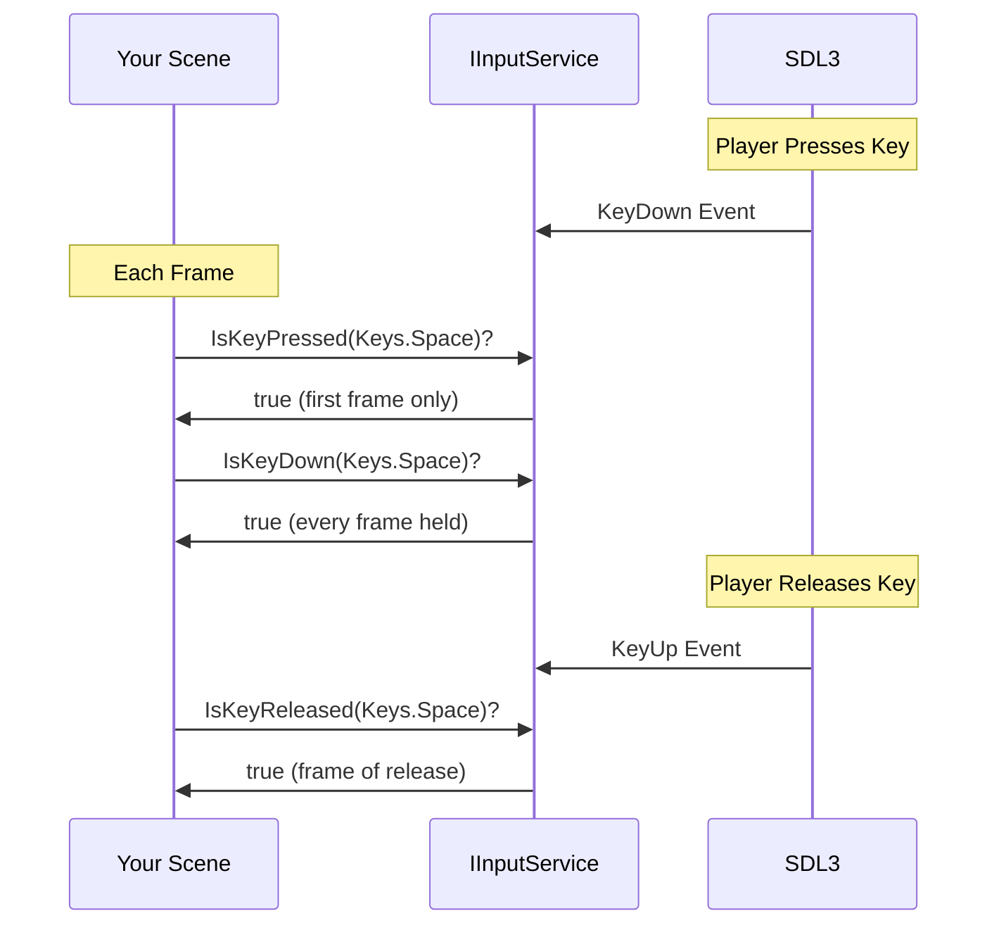

# Keyboard Input

Master keyboard input handling in Brine2D for player movement, menu navigation, shortcuts, and text entry.

## Overview

Brine2D provides a simple, frame-based keyboard input system via `IInputService`:

- ✅ **Key down** - Is key currently held?
- ✅ **Key pressed** - Was key just pressed this frame?
- ✅ **Key released** - Was key just released this frame?
- ✅ **100+ keys** supported - Letters, numbers, F-keys, arrows, modifiers, etc.



---

## Prerequisites

- ✅ [Quick Start](../getting-started/quick-start.md) - Basic scene setup
- ✅ [Scenes](../../concepts/scenes.md) - Understanding OnUpdate

---

## Quick Example

```csharp
using Brine2D.Core;
using Brine2D.Input;
using Brine2D.Rendering;
using Microsoft.Extensions.Logging;
using System.Numerics;

public class KeyboardScene : Scene
{
    private readonly IInputService _input;
    private readonly IGameContext _gameContext;
    private readonly IRenderer _renderer;
    
    private Vector2 _playerPosition = new Vector2(400, 300);
    private float _speed = 200f;
    
    public KeyboardScene(
        IInputService input,
        IGameContext gameContext,
        IRenderer renderer,
        ILogger<KeyboardScene> logger
    ) : base(logger)
    {
        _input = input;
        _gameContext = gameContext;
        _renderer = renderer;
    }
    
    protected override void OnUpdate(GameTime gameTime)
    {
        var deltaTime = (float)gameTime.DeltaTime;
        
        // Exit on ESC
        if (_input.IsKeyPressed(Keys.Escape))
        {
            _gameContext.RequestExit();
        }
        
        // WASD Movement
        if (_input.IsKeyDown(Keys.W))
            _playerPosition.Y -= _speed * deltaTime;
        
        if (_input.IsKeyDown(Keys.S))
            _playerPosition.Y += _speed * deltaTime;
        
        if (_input.IsKeyDown(Keys.A))
            _playerPosition.X -= _speed * deltaTime;
        
        if (_input.IsKeyDown(Keys.D))
            _playerPosition.X += _speed * deltaTime;
        
        // Jump on Spacebar (once per press)
        if (_input.IsKeyPressed(Keys.Space))
        {
            Logger.LogInformation("Jump!");
        }
    }
    
    protected override void OnRender(GameTime gameTime)
    {
        _renderer.Clear(Color.Black);
        _renderer.BeginFrame();
        
        // Draw player
        _renderer.DrawRectangle(
            _playerPosition.X - 25, _playerPosition.Y - 25,
            50, 50, Color.Red);
        
        _renderer.EndFrame();
    }
}
```

**Result:** Player moves with WASD, jumps with Space, exits with ESC! ⌨️

---

## Key States

### IsKeyDown - Continuous Input

**Use for:** Movement, aiming, holding buttons

```csharp
protected override void OnUpdate(GameTime gameTime)
{
    var deltaTime = (float)gameTime.DeltaTime;
    
    // Returns TRUE while key is held
    if (_input.IsKeyDown(Keys.W))
    {
        _playerY -= _speed * deltaTime; // Move up continuously
    }
}
```

**Behavior:**

- ✅ Returns `true` **every frame** while key is held
- ✅ Perfect for smooth movement
- ✅ Frame-rate independent (use delta time!)

---

### IsKeyPressed - Single Event

**Use for:** Jumping, shooting, menu actions

```csharp
protected override void OnUpdate(GameTime gameTime)
{
    // Returns TRUE only on first frame of press
    if (_input.IsKeyPressed(Keys.Space))
    {
        Jump(); // Only jumps once per press
    }
    
    if (_input.IsKeyPressed(Keys.F))
    {
        FireWeapon(); // One shot per press
    }
}
```

**Behavior:**

- ✅ Returns `true` **only on first frame** of press
- ✅ Ignores key repeats
- ✅ Perfect for discrete actions

---

### IsKeyReleased - Release Detection

**Use for:** Charge attacks, button releases

```csharp
private bool _isCharging = false;
private float _chargeTime = 0f;

protected override void OnUpdate(GameTime gameTime)
{
    var deltaTime = (float)gameTime.DeltaTime;
    
    // Start charging
    if (_input.IsKeyPressed(Keys.Space))
    {
        _isCharging = true;
        _chargeTime = 0f;
    }
    
    // Accumulate charge
    if (_isCharging && _input.IsKeyDown(Keys.Space))
    {
        _chargeTime += deltaTime;
    }
    
    // Release - fire charged attack
    if (_input.IsKeyReleased(Keys.Space))
    {
        if (_isCharging)
        {
            FireChargedAttack(_chargeTime);
            _isCharging = false;
        }
    }
}
```

**Behavior:**

- ✅ Returns `true` **on frame of release**
- ✅ Perfect for charge mechanics

---

## Available Keys

### Letters (A-Z)

```csharp
Keys.A, Keys.B, Keys.C, ... Keys.Z
```

**Example:**

```csharp
if (_input.IsKeyPressed(Keys.P))
{
    TogglePause();
}
```

---

### Numbers (0-9)

```csharp
Keys.D0, Keys.D1, Keys.D2, ... Keys.D9
```

**Why `D` prefix?** C# enums can't start with numbers!

**Example:**

```csharp
// Weapon selection
if (_input.IsKeyPressed(Keys.D1)) SelectWeapon(1);
if (_input.IsKeyPressed(Keys.D2)) SelectWeapon(2);
if (_input.IsKeyPressed(Keys.D3)) SelectWeapon(3);
```

---

### Arrow Keys

```csharp
Keys.Up, Keys.Down, Keys.Left, Keys.Right
```

**Example:**

```csharp
// Menu navigation
if (_input.IsKeyPressed(Keys.Up)) SelectPreviousMenuItem();
if (_input.IsKeyPressed(Keys.Down)) SelectNextMenuItem();
if (_input.IsKeyPressed(Keys.Enter)) ActivateMenuItem();
```

---

### Function Keys (F1-F12)

```csharp
Keys.F1, Keys.F2, ... Keys.F12
```

**Example:**

```csharp
// Debug shortcuts
if (_input.IsKeyPressed(Keys.F1)) ToggleDebugOverlay();
if (_input.IsKeyPressed(Keys.F5)) QuickSave();
if (_input.IsKeyPressed(Keys.F9)) QuickLoad();
```

---

### Special Keys

| Key | Usage |
|-----|-------|
| `Keys.Space` | Jump, shoot, confirm |
| `Keys.Enter` | Confirm, submit |
| `Keys.Escape` | Cancel, pause, exit |
| `Keys.Tab` | Inventory, map |
| `Keys.Backspace` | Delete text |
| `Keys.Delete` | Delete forward |

---

### Modifier Keys

```csharp
Keys.LeftShift, Keys.RightShift
Keys.LeftControl, Keys.RightControl
Keys.LeftAlt, Keys.RightAlt
```

**Example:**

```csharp
// Sprint (hold Shift + W)
if (_input.IsKeyDown(Keys.W))
{
    var speed = _normalSpeed;
    
    if (_input.IsKeyDown(Keys.LeftShift))
    {
        speed = _sprintSpeed; // 2x speed
    }
    
    _playerY -= speed * deltaTime;
}

// Shortcut (Ctrl+S = Save)
if (_input.IsKeyDown(Keys.LeftControl) && _input.IsKeyPressed(Keys.S))
{
    SaveGame();
}
```

---

### Numpad Keys

```csharp
Keys.Numpad0, Keys.Numpad1, ... Keys.Numpad9
Keys.NumpadEnter, Keys.NumpadPlus, Keys.NumpadMinus
```

---

### **[Full Keys Enum →](../../api/Keys.md)**

---

## Common Patterns

### Pattern 1: WASD Movement

```csharp
protected override void OnUpdate(GameTime gameTime)
{
    var deltaTime = (float)gameTime.DeltaTime;
    var movement = Vector2.Zero;
    
    if (_input.IsKeyDown(Keys.W)) movement.Y -= 1;
    if (_input.IsKeyDown(Keys.S)) movement.Y += 1;
    if (_input.IsKeyDown(Keys.A)) movement.X -= 1;
    if (_input.IsKeyDown(Keys.D)) movement.X += 1;
    
    if (movement != Vector2.Zero)
    {
        movement = Vector2.Normalize(movement); // Prevent faster diagonal
        _playerPosition += movement * _speed * deltaTime;
    }
}
```

---

### Pattern 2: Arrow Key Menu Navigation

```csharp
private int _selectedIndex = 0;
private readonly string[] _menuItems = ["New Game", "Load Game", "Options", "Exit"];

protected override void OnUpdate(GameTime gameTime)
{
    // Navigate menu
    if (_input.IsKeyPressed(Keys.Up))
    {
        _selectedIndex = Math.Max(0, _selectedIndex - 1);
    }
    
    if (_input.IsKeyPressed(Keys.Down))
    {
        _selectedIndex = Math.Min(_menuItems.Length - 1, _selectedIndex + 1);
    }
    
    // Confirm selection
    if (_input.IsKeyPressed(Keys.Enter) || _input.IsKeyPressed(Keys.Space))
    {
        ActivateMenuItem(_selectedIndex);
    }
}
```

---

### Pattern 3: Number Key Hotbar

```csharp
protected override void OnUpdate(GameTime gameTime)
{
    // Check number keys 1-9
    for (int i = 0; i < 9; i++)
    {
        var key = (Keys)((int)Keys.D1 + i); // D1, D2, D3, etc.
        
        if (_input.IsKeyPressed(key))
        {
            SelectHotbarSlot(i);
        }
    }
}
```

---

### Pattern 4: Toggle Key

```csharp
private bool _debugMode = false;

protected override void OnUpdate(GameTime gameTime)
{
    // Toggle debug mode with F3
    if (_input.IsKeyPressed(Keys.F3))
    {
        _debugMode = !_debugMode;
        Logger.LogInformation("Debug mode: {Enabled}", _debugMode);
    }
}
```

---

### Pattern 5: Combo Keys (Modifiers)

```csharp
protected override void OnUpdate(GameTime gameTime)
{
    var ctrl = _input.IsKeyDown(Keys.LeftControl) || 
               _input.IsKeyDown(Keys.RightControl);
    var shift = _input.IsKeyDown(Keys.LeftShift) || 
                _input.IsKeyDown(Keys.RightShift);
    
    // Ctrl+S = Save
    if (ctrl && _input.IsKeyPressed(Keys.S))
    {
        SaveGame();
    }
    
    // Ctrl+Shift+D = Debug save
    if (ctrl && shift && _input.IsKeyPressed(Keys.D))
    {
        SaveDebugInfo();
    }
}
```

---

## Advanced Techniques

### Input Buffering

Store recent inputs for combo systems:

```csharp
private readonly Queue<Keys> _inputBuffer = new();
private const int BufferSize = 5;

protected override void OnUpdate(GameTime gameTime)
{
    // Add pressed keys to buffer
    foreach (Keys key in Enum.GetValues<Keys>())
    {
        if (_input.IsKeyPressed(key))
        {
            _inputBuffer.Enqueue(key);
            
            if (_inputBuffer.Count > BufferSize)
            {
                _inputBuffer.Dequeue();
            }
        }
    }
    
    // Check for combo: Down, Down, Right, A
    CheckCombo();
}

private void CheckCombo()
{
    var sequence = _inputBuffer.ToArray();
    
    if (sequence.Length >= 4 &&
        sequence[^4] == Keys.Down &&
        sequence[^3] == Keys.Down &&
        sequence[^2] == Keys.Right &&
        sequence[^1] == Keys.A)
    {
        ExecuteSpecialMove();
        _inputBuffer.Clear();
    }
}
```

---

### Key Rebinding

Allow players to customize controls:

```csharp
public class InputMapper
{
    private readonly Dictionary<string, Keys> _bindings = new()
    {
        ["Jump"] = Keys.Space,
        ["Shoot"] = Keys.LeftControl,
        ["Reload"] = Keys.R
    };
    
    public bool IsActionPressed(IInputService input, string action)
    {
        if (_bindings.TryGetValue(action, out var key))
        {
            return input.IsKeyPressed(key);
        }
        
        return false;
    }
    
    public void RebindAction(string action, Keys newKey)
    {
        _bindings[action] = newKey;
        SaveBindings(); // Persist to config file
    }
}

// Usage
if (_inputMapper.IsActionPressed(_input, "Jump"))
{
    Jump();
}
```

---

## Troubleshooting

### Problem: Key Not Detected

**Symptom:** `IsKeyPressed()` always returns false

**Solutions:**

1. **Check key name**
   ```csharp
   // ❌ Wrong
   if (_input.IsKeyPressed(Keys.0)) // Compile error!
   
   // ✅ Correct
   if (_input.IsKeyPressed(Keys.D0)) // Number keys have 'D' prefix
   ```

2. **Check input service is injected**
   ```csharp
   // Constructor must inject IInputService
   public MyScene(IInputService input, ILogger<MyScene> logger) 
       : base(logger)
   {
       _input = input; // Don't forget to store!
   }
   ```

---

### Problem: Movement Too Fast/Slow

**Symptom:** Player zooms or crawls

**Solution:** Use delta time for frame-rate independence:

```csharp
// ❌ Bad - frame-rate dependent
if (_input.IsKeyDown(Keys.W))
{
    _playerY -= 5; // Moves 5 pixels per frame
}

// ✅ Good - frame-rate independent
if (_input.IsKeyDown(Keys.W))
{
    _playerY -= _speed * deltaTime; // Moves at constant real-world speed
}
```

---

### Problem: Diagonal Movement Too Fast

**Symptom:** Moving diagonally (W+D) is √2 faster

**Solution:** Normalize movement vector:

```csharp
// ❌ Bad
if (_input.IsKeyDown(Keys.W)) _playerY -= speed * dt;
if (_input.IsKeyDown(Keys.D)) _playerX += speed * dt;
// Diagonal = speed * √2 ≈ 1.41x!

// ✅ Good
var movement = Vector2.Zero;
if (_input.IsKeyDown(Keys.W)) movement.Y -= 1;
if (_input.IsKeyDown(Keys.D)) movement.X += 1;

if (movement != Vector2.Zero)
{
    movement = Vector2.Normalize(movement); // Length = 1
    _playerPosition += movement * speed * dt;
}
```

---

### Problem: Keys Stuck After Alt+Tab

**Symptom:** Keys remain "pressed" after window loses focus

**Note:** SDL3 handles this automatically! Keys are released when window loses focus.

---

## Best Practices

### DO

1. **Use `IsKeyPressed` for discrete actions**
   ```csharp
   if (_input.IsKeyPressed(Keys.Space)) Jump();
   ```

2. **Use `IsKeyDown` for continuous actions**
   ```csharp
   if (_input.IsKeyDown(Keys.W)) MoveForward(deltaTime);
   ```

3. **Always use delta time for movement**
   ```csharp
   position += velocity * deltaTime;
   ```

4. **Normalize movement vectors**
   ```csharp
   if (movement != Vector2.Zero)
       movement = Vector2.Normalize(movement);
   ```

5. **Provide key rebinding**
   - Let players customize controls
   - Store in config file

6. **Support multiple keys for same action**
   ```csharp
   bool jump = _input.IsKeyPressed(Keys.Space) || 
               _input.IsKeyPressed(Keys.W);
   ```

### DON'T

1. **Don't poll input outside OnUpdate**
   ```csharp
   // ❌ Bad - won't update!
   protected override void OnInitialize()
   {
       if (_input.IsKeyDown(Keys.W)) // Never true here!
   }
   ```

2. **Don't forget delta time**
   ```csharp
   // ❌ Bad
   _playerX += 5; // Frame-rate dependent!
   
   // ✅ Good
   _playerX += _speed * deltaTime;
   ```

3. **Don't check IsKeyPressed in loops**
   ```csharp
   // ❌ Bad - only true once per frame!
   while (gameRunning)
   {
       if (_input.IsKeyPressed(Keys.Space)) // Won't work!
   }
   ```

---

## Summary

| Method | When True | Use For |
|--------|-----------|---------|
| `IsKeyDown(key)` | Every frame held | Movement, continuous actions |
| `IsKeyPressed(key)` | First frame only | Jump, shoot, single actions |
| `IsKeyReleased(key)` | Frame of release | Charge attacks, release detection |

---

## Next Steps

- **[Mouse Input](mouse.md)** - Handle clicks and cursor
- **[Gamepad Support](gamepad.md)** - Add controller support
- **[Input Layers](input-layers.md)** - Priority-based input routing
- **[Player Movement](../mechanics/movement.md)** - Complete movement system

---

Ready to add mouse support? Check out [Mouse Input](mouse.md)!