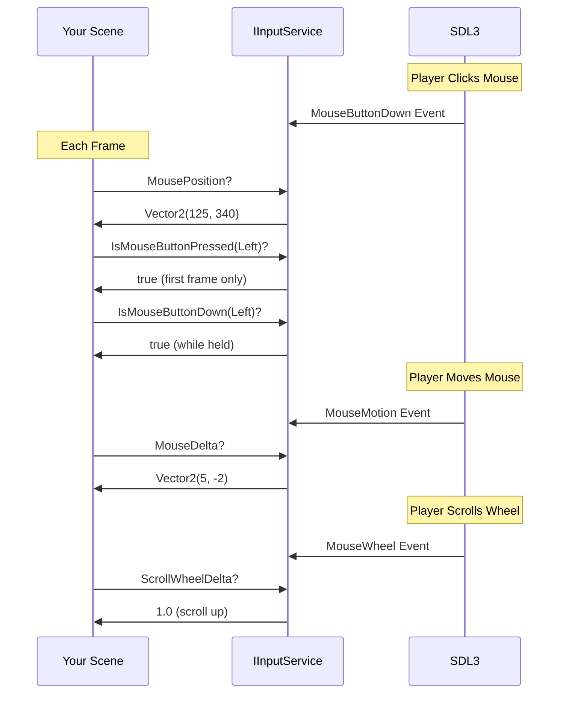

# Mouse Input

Master mouse input handling in Brine2D for point-and-click gameplay, UI interaction, and camera control.

## Overview

Brine2D provides comprehensive mouse input via `IInputService`:
- ✅ **Mouse buttons** - Left, right, middle, X1, X2
- ✅ **Mouse position** - Screen coordinates
- ✅ **Mouse delta** - Movement since last frame
- ✅ **Scroll wheel** - Zoom, scroll, etc.



---

## Prerequisites

- ✅ [Quick Start](../getting-started/quickstart.md) - Basic scene setup
- ✅ [Keyboard Input](keyboard.md) - Understanding input basics

---

## Quick Example

```csharp
using Brine2D.Core;
using Brine2D.Input;
using Brine2D.Rendering;
using Microsoft.Extensions.Logging;
using System.Numerics;

public class MouseScene : Scene
{
    private readonly IInputService _input;
    private readonly IRenderer _renderer;
    
    private Vector2 _cursorPosition;
    
    public MouseScene(
        IInputService input,
        IRenderer renderer,
        ILogger<MouseScene> logger
    ) : base(logger)
    {
        _input = input;
        _renderer = renderer;
    }
    
    protected override void OnUpdate(GameTime gameTime)
    {
        // Get mouse position
        _cursorPosition = _input.MousePosition;
        
        // Handle left click
        if (_input.IsMouseButtonPressed(MouseButton.Left))
        {
            Logger.LogInformation("Clicked at: ({X}, {Y})", 
                _cursorPosition.X, _cursorPosition.Y);
        }
    }
    
    protected override void OnRender(GameTime gameTime)
    {
        _renderer.Clear(Color.Black);
        _renderer.BeginFrame();
        
        // Draw cursor position indicator
        _renderer.DrawCircle(_cursorPosition.X, _cursorPosition.Y, 10, Color.Red);
        
        // Show coordinates
        _renderer.DrawText($"Mouse: ({(int)_cursorPosition.X}, {(int)_cursorPosition.Y})", 
            10, 10, Color.White);
        
        _renderer.EndFrame();
    }
}
```

**Result:** Red circle follows cursor, displays coordinates!

---

## Mouse Position

### Get Current Position

```csharp
protected override void OnUpdate(GameTime gameTime)
{
    // Get current mouse position (screen coordinates)
    var mousePos = _input.MousePosition;
    
    Logger.LogInformation("Mouse at: X={X}, Y={Y}", mousePos.X, mousePos.Y);
}
```

**Coordinates:**
- Origin `(0, 0)` = top-left corner
- X increases → right
- Y increases → down

```
Screen Coordinates:
(0,0) ───────────────► X
  │
  │     (400, 300)
  │         ●
  │
  │
  ▼
  Y
```

---

### Mouse Delta (Movement)

```csharp
protected override void OnUpdate(GameTime gameTime)
{
    // Get movement since last frame
    var mouseDelta = _input.MouseDelta;
    
    if (mouseDelta.LengthSquared() > 0)
    {
        Logger.LogInformation("Mouse moved: ({X}, {Y})", 
            mouseDelta.X, mouseDelta.Y);
    }
}
```

**Use for:**
- Camera rotation (first-person)
- Dragging objects
- Mouse-look controls

---

## Mouse Buttons

### Available Buttons

```csharp
MouseButton.Left     // Primary button (left)
MouseButton.Right    // Secondary button (right)
MouseButton.Middle   // Scroll wheel click
MouseButton.X1       // Extra button 1 (back)
MouseButton.X2       // Extra button 2 (forward)
```

---

### IsMouseButtonPressed - Click Detection

**Use for:** Clicking UI, shooting, selecting

```csharp
protected override void OnUpdate(GameTime gameTime)
{
    // Returns TRUE only on first frame of press
    if (_input.IsMouseButtonPressed(MouseButton.Left))
    {
        var mousePos = _input.MousePosition;
        SpawnObjectAt(mousePos);
    }
    
    if (_input.IsMouseButtonPressed(MouseButton.Right))
    {
        ShowContextMenu();
    }
}
```

---

### IsMouseButtonDown - Held Detection

**Use for:** Dragging, continuous shooting

```csharp
protected override void OnUpdate(GameTime gameTime)
{
    // Returns TRUE every frame while held
    if (_input.IsMouseButtonDown(MouseButton.Left))
    {
        var mousePos = _input.MousePosition;
        ContinuousPaint(mousePos);
    }
}
```

---

### IsMouseButtonReleased - Release Detection

**Use for:** Drag-and-drop, charge attacks

```csharp
private Vector2? _dragStart = null;

protected override void OnUpdate(GameTime gameTime)
{
    // Start drag
    if (_input.IsMouseButtonPressed(MouseButton.Left))
    {
        _dragStart = _input.MousePosition;
    }
    
    // End drag
    if (_input.IsMouseButtonReleased(MouseButton.Left))
    {
        if (_dragStart.HasValue)
        {
            var dragEnd = _input.MousePosition;
            HandleDrag(_dragStart.Value, dragEnd);
            _dragStart = null;
        }
    }
}
```

---

## Scroll Wheel

### Get Scroll Delta

```csharp
protected override void OnUpdate(GameTime gameTime)
{
    var scroll = _input.ScrollWheelDelta;
    
    if (scroll > 0)
    {
        // Scrolled up
        ZoomIn();
    }
    else if (scroll < 0)
    {
        // Scrolled down
        ZoomOut();
    }
}
```

**Values:**
- `> 0` = Scroll up
- `< 0` = Scroll down
- `0` = No scroll this frame

---

## Common Patterns

### Pattern 1: Point-and-Click Movement

```csharp
private Vector2 _playerPosition = new Vector2(400, 300);
private Vector2? _targetPosition = null;
private float _moveSpeed = 200f;

protected override void OnUpdate(GameTime gameTime)
{
    var deltaTime = (float)gameTime.DeltaTime;
    
    // Click to set target
    if (_input.IsMouseButtonPressed(MouseButton.Left))
    {
        _targetPosition = _input.MousePosition;
    }
    
    // Move towards target
    if (_targetPosition.HasValue)
    {
        var direction = _targetPosition.Value - _playerPosition;
        var distance = direction.Length();
        
        if (distance > 5f) // Close enough threshold
        {
            direction = Vector2.Normalize(direction);
            _playerPosition += direction * _moveSpeed * deltaTime;
        }
        else
        {
            _targetPosition = null; // Arrived!
        }
    }
}
```

---

### Pattern 2: Click Detection on Objects

```csharp
public class ClickableObject
{
    public Vector2 Position { get; set; }
    public float Radius { get; set; }
    
    public bool Contains(Vector2 point)
    {
        var offset = point - Position;
        return offset.Length() <= Radius;
    }
}

private readonly List<ClickableObject> _objects = new();

protected override void OnUpdate(GameTime gameTime)
{
    if (_input.IsMouseButtonPressed(MouseButton.Left))
    {
        var mousePos = _input.MousePosition;
        
        foreach (var obj in _objects)
        {
            if (obj.Contains(mousePos))
            {
                Logger.LogInformation("Clicked object at {Pos}", obj.Position);
                break; // First object only
            }
        }
    }
}
```

---

### Pattern 3: Drag and Drop

```csharp
private object? _draggedObject = null;
private Vector2 _dragOffset;

protected override void OnUpdate(GameTime gameTime)
{
    var mousePos = _input.MousePosition;
    
    // Start drag
    if (_input.IsMouseButtonPressed(MouseButton.Left) && _draggedObject == null)
    {
        _draggedObject = GetObjectUnderMouse(mousePos);
        
        if (_draggedObject != null)
        {
            _dragOffset = mousePos - _draggedObject.Position;
        }
    }
    
    // During drag
    if (_input.IsMouseButtonDown(MouseButton.Left) && _draggedObject != null)
    {
        _draggedObject.Position = mousePos - _dragOffset;
    }
    
    // End drag
    if (_input.IsMouseButtonReleased(MouseButton.Left))
    {
        if (_draggedObject != null)
        {
            SnapToGrid(_draggedObject);
            _draggedObject = null;
        }
    }
}
```

---

### Pattern 4: Camera Zoom with Scroll

```csharp
private float _cameraZoom = 1.0f;

protected override void OnUpdate(GameTime gameTime)
{
    var scroll = _input.ScrollWheelDelta;
    
    if (Math.Abs(scroll) > 0.001f)
    {
        // Zoom in/out
        _cameraZoom += scroll * 0.1f;
        _cameraZoom = Math.Clamp(_cameraZoom, 0.5f, 3.0f);
        
        if (_camera != null)
        {
            _camera.Zoom = _cameraZoom;
        }
    }
}
```

---

### Pattern 5: Right-Click Context Menu

```csharp
private bool _showContextMenu = false;
private Vector2 _contextMenuPosition;

protected override void OnUpdate(GameTime gameTime)
{
    // Show menu on right-click
    if (_input.IsMouseButtonPressed(MouseButton.Right))
    {
        _contextMenuPosition = _input.MousePosition;
        _showContextMenu = true;
    }
    
    // Hide menu on left-click elsewhere
    if (_input.IsMouseButtonPressed(MouseButton.Left))
    {
        _showContextMenu = false;
    }
}

protected override void OnRender(GameTime gameTime)
{
    // ... render game ...
    
    if (_showContextMenu)
    {
        DrawContextMenu(_contextMenuPosition);
    }
}
```

---

## World Space Conversion

When using a camera, convert mouse position from screen to world:

```csharp
protected override void OnUpdate(GameTime gameTime)
{
    // Mouse position in screen space
    var mouseScreen = _input.MousePosition;
    
    // Convert to world space
    var mouseWorld = _camera?.ScreenToWorld(mouseScreen) ?? mouseScreen;
    
    // Now use world position
    if (_input.IsMouseButtonPressed(MouseButton.Left))
    {
        SpawnObjectInWorld(mouseWorld);
    }
}
```

**[See Camera Guide](../rendering/camera.md) for details**

---

## Advanced Techniques

### Double-Click Detection

```csharp
private float _lastClickTime = 0f;
private const float DoubleClickThreshold = 0.3f; // seconds

protected override void OnUpdate(GameTime gameTime)
{
    var currentTime = (float)gameTime.TotalTime;
    
    if (_input.IsMouseButtonPressed(MouseButton.Left))
    {
        var timeSinceLastClick = currentTime - _lastClickTime;
        
        if (timeSinceLastClick < DoubleClickThreshold)
        {
            // Double click!
            OnDoubleClick();
        }
        
        _lastClickTime = currentTime;
    }
}
```

---

### Mouse Hover Detection

```csharp
private IUIComponent? _hoveredComponent = null;

protected override void OnUpdate(GameTime gameTime)
{
    var mousePos = _input.MousePosition;
    
    // Find hovered component
    IUIComponent? newHovered = null;
    
    foreach (var component in _uiComponents)
    {
        if (component.Contains(mousePos))
        {
            newHovered = component;
            break;
        }
    }
    
    // Handle hover state changes
    if (newHovered != _hoveredComponent)
    {
        _hoveredComponent?.OnHoverExit();
        newHovered?.OnHoverEnter();
        _hoveredComponent = newHovered;
    }
}
```

---

### Mouse Lock (FPS Camera)

```csharp
private bool _mouseLocked = false;
private Vector2 _cameraRotation;

protected override void OnUpdate(GameTime gameTime)
{
    // Toggle mouse lock with Tab
    if (_input.IsKeyPressed(Keys.Tab))
    {
        _mouseLocked = !_mouseLocked;
        
        if (_mouseLocked)
        {
            // Hide cursor, center it
            // (SDL3 API needed - not yet exposed)
        }
    }
    
    if (_mouseLocked)
    {
        var mouseDelta = _input.MouseDelta;
        var sensitivity = 0.002f;
        
        _cameraRotation.X += mouseDelta.X * sensitivity;
        _cameraRotation.Y -= mouseDelta.Y * sensitivity;
        
        // Clamp vertical rotation
        _cameraRotation.Y = Math.Clamp(_cameraRotation.Y, -1.5f, 1.5f);
        
        ApplyCameraRotation(_cameraRotation);
    }
}
```

---

## Troubleshooting

### Problem: Wrong Mouse Coordinates

**Symptom:** Mouse position doesn't match visual location

**Causes & Solutions:**

1. **Camera active**
   ```csharp
   // ❌ Problem: Using screen coords with camera
   var mousePos = _input.MousePosition;
   SpawnAt(mousePos); // Wrong when camera moved!
   
   // ✅ Solution: Convert to world space
   var mouseWorld = _camera.ScreenToWorld(_input.MousePosition);
   SpawnAt(mouseWorld);
   ```

2. **Window scaling/DPI**
   - Usually handled automatically by SDL3
   - Check `RenderingOptions.WindowWidth/Height` matches actual size

---

### Problem: Clicks Not Detected

**Symptom:** `IsMouseButtonPressed()` always false

**Solutions:**

1. **Check correct button**
   ```csharp
   // ❌ Wrong button
   if (_input.IsMouseButtonPressed(MouseButton.Middle))
   
   // ✅ Left button
   if (_input.IsMouseButtonPressed(MouseButton.Left))
   ```

2. **UI consuming clicks**
   ```csharp
   // Check if UI consumed the click
   if (!_inputLayerManager.MouseConsumed)
   {
       // Now safe to check game input
       if (_input.IsMouseButtonPressed(MouseButton.Left))
       {
           // Handle game click
       }
   }
   ```

---

### Problem: Scroll Wheel Not Working

**Symptom:** `ScrollWheelDelta` always 0

**Solutions:**

1. **Check each frame**
   ```csharp
   // ❌ Bad - only true for one frame
   if (_input.ScrollWheelDelta != 0)
   
   // ✅ Good - explicit check
   var scroll = _input.ScrollWheelDelta;
   if (scroll > 0) ZoomIn();
   else if (scroll < 0) ZoomOut();
   ```

2. **Verify window has focus**
   - Scroll only works when window is focused

---

## Best Practices

### DO

1. **Use `IsMouseButtonPressed` for clicks**
   ```csharp
   if (_input.IsMouseButtonPressed(MouseButton.Left))
       HandleClick();
   ```

2. **Convert to world space when using camera**
   ```csharp
   var worldPos = _camera.ScreenToWorld(_input.MousePosition);
   ```

3. **Respect UI input consumption**
   ```csharp
   if (!_inputLayerManager.MouseConsumed)
   {
       // Game input here
   }
   ```

4. **Use smooth scrolling**
   ```csharp
   _targetZoom += _input.ScrollWheelDelta * 0.1f;
   _currentZoom = Lerp(_currentZoom, _targetZoom, 10f * deltaTime);
   ```

5. **Provide visual feedback**
   ```csharp
   // Change cursor appearance on hover
   if (IsHoveringButton())
       DrawHighlightedCursor();
   ```

### DON'T

1. **Don't ignore UI layers**
   ```csharp
   // ❌ Bad - clicks UI AND game
   if (_input.IsMouseButtonPressed(MouseButton.Left))
       SpawnUnit(); // Spawns even when clicking UI!
   
   // ✅ Good
   if (!_inputLayerManager.MouseConsumed && 
       _input.IsMouseButtonPressed(MouseButton.Left))
       SpawnUnit();
   ```

2. **Don't forget camera transform**
   ```csharp
   // ❌ Bad with camera
   var mousePos = _input.MousePosition;
   
   // ✅ Good
   var mousePos = _camera.ScreenToWorld(_input.MousePosition);
   ```

3. **Don't hardcode button checks**
   ```csharp
   // ❌ Hard to rebind
   if (_input.IsMouseButtonPressed(MouseButton.Left))
   
   // ✅ Use action mapping
   if (_inputMapper.IsActionPressed("PrimaryAction"))
   ```

---

## Summary

| Method | Returns | Use For |
|--------|---------|---------|
| `MousePosition` | `Vector2` | Current cursor position |
| `MouseDelta` | `Vector2` | Movement since last frame |
| `ScrollWheelDelta` | `float` | Scroll amount (+ = up) |
| `IsMouseButtonPressed(btn)` | `bool` | Clicking (first frame) |
| `IsMouseButtonDown(btn)` | `bool` | Held (continuous) |
| `IsMouseButtonReleased(btn)` | `bool` | Release detection |

---

## Next Steps

- **[Input Layers](input-layers.md)** - Priority-based input routing
- **[Gamepad Support](gamepad.md)** - Add controller support
- **[UI Components](../ui/buttons.md)** - Build interactive UI
- **[Camera System](../rendering/camera.md)** - Handle world/screen conversion

---

Ready to support controllers? Check out [Gamepad Support](gamepad.md)!