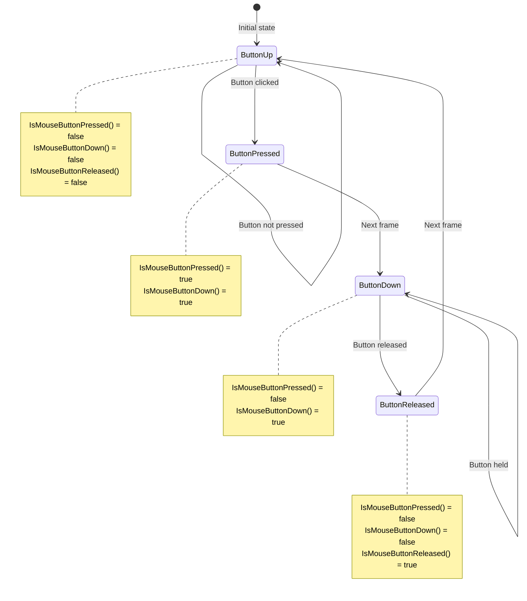

# Mouse Input

Learn how to handle mouse input in your Brine2D games.

## Overview

Brine2D's mouse input system provides:

- **Button States** - Down, pressed, released
- **Position** - Absolute screen coordinates
- **Movement** - Delta/relative motion
- **Scroll Wheel** - Vertical and horizontal scrolling
- **Cursor Control** - Show, hide, lock cursor
- **Drag Detection** - Click and drag operations

**Powered by:** SDL3 input system

---

## Setup

### Inject Input Service

In your scene:

```csharp
using Brine2D.Engine;
using Brine2D.Input;
using Microsoft.Extensions.Logging;

public class GameScene : Scene
{
    private readonly IInputService _input;
    
    public GameScene(
        IInputService input,
        ILogger<GameScene> logger) : base(logger)
    {
        _input = input;
    }
}
```

---

## Mouse Buttons

### Available Buttons

```csharp
MouseButton.Left    // Primary button (left click)
MouseButton.Right   // Secondary button (right click)
MouseButton.Middle  // Middle button (wheel click)
MouseButton.X1      // Extra button 1 (side button)
MouseButton.X2      // Extra button 2 (side button)
```

---

### IsMouseButtonDown

Check if button is currently held down:

```csharp
protected override void OnUpdate(GameTime gameTime)
{
    // Continuous action while held
    if (_input.IsMouseButtonDown(MouseButton.Left))
    {
        // Draw while holding left button
        DrawAtMousePosition();
    }
    
    // Camera rotation while right button held
    if (_input.IsMouseButtonDown(MouseButton.Right))
    {
        RotateCamera(_input.GetMouseDelta());
    }
}
```

**Use for:**
- Continuous actions (drawing, camera control)
- Drag operations
- Hold-to-charge mechanics

---

### IsMouseButtonPressed

Check if button was just pressed this frame:

```csharp
protected override void OnUpdate(GameTime gameTime)
{
    // Click to select
    if (_input.IsMouseButtonPressed(MouseButton.Left))
    {
        var mousePos = _input.GetMousePosition();
        SelectObjectAt(mousePos);
    }
    
    // Right click for context menu
    if (_input.IsMouseButtonPressed(MouseButton.Right))
    {
        var mousePos = _input.GetMousePosition();
        ShowContextMenu(mousePos);
    }
}
```

**Use for:**
- Single click actions
- UI button clicks
- Object selection
- Menu interactions

---

### IsMouseButtonReleased

Check if button was just released this frame:

```csharp
protected override void OnUpdate(GameTime gameTime)
{
    // Start drag on press
    if (_input.IsMouseButtonPressed(MouseButton.Left))
    {
        _dragStart = _input.GetMousePosition();
        _isDragging = true;
    }
    
    // End drag on release
    if (_input.IsMouseButtonReleased(MouseButton.Left))
    {
        if (_isDragging)
        {
            var dragEnd = _input.GetMousePosition();
            CompleteDragOperation(_dragStart, dragEnd);
            _isDragging = false;
        }
    }
}
```

**Use for:**
- Drag operations
- Click-and-release mechanics
- Button up events

---

## Mouse Button State Diagram


```mermaid
stateDiagram-v2
    [*] --> ButtonUp: Initial state
    
    ButtonUp --> ButtonPressed: Button clicked
    ButtonPressed --> ButtonDown: Next frame
    
    ButtonDown --> ButtonDown: Button held
    ButtonDown --> ButtonReleased: Button released
    
    ButtonReleased --> ButtonUp: Next frame
    ButtonUp --> ButtonUp: Button not pressed
    
    note right of ButtonPressed
        IsMouseButtonPressed() = true
        IsMouseButtonDown() = true
    end note
    
    note right of ButtonDown
        IsMouseButtonPressed() = false
        IsMouseButtonDown() = true
    end note
    
    note right of ButtonReleased
        IsMouseButtonPressed() = false
        IsMouseButtonDown() = false
        IsMouseButtonReleased() = true
    end note
    
    note right of ButtonUp
        IsMouseButtonPressed() = false
        IsMouseButtonDown() = false
        IsMouseButtonReleased() = false
    end note
```

---

## Mouse Position

### GetMousePosition

Get current mouse position:

```csharp
using System.Numerics;

protected override void OnUpdate(GameTime gameTime)
{
    var mousePos = _input.GetMousePosition();
    
    Logger.LogDebug("Mouse at: ({X}, {Y})", mousePos.X, mousePos.Y);
    
    // Use mouse position
    if (_input.IsMouseButtonPressed(MouseButton.Left))
    {
        SpawnObjectAt(mousePos);
    }
}
```

**Returns:** `Vector2` with screen coordinates (0,0 = top-left)

---

### World Position Conversion

Convert screen to world coordinates:

```csharp
public class MouseToWorld
{
    private readonly IInputService _input;
    private readonly Camera _camera;

    public Vector2 GetMouseWorldPosition()
    {
        var screenPos = _input.GetMousePosition();
        return _camera.ScreenToWorld(screenPos);
    }
}

// Usage
protected override void OnUpdate(GameTime gameTime)
{
    if (_input.IsMouseButtonPressed(MouseButton.Left))
    {
        var worldPos = GetMouseWorldPosition();
        PlaceObjectAt(worldPos);
    }
}
```

---

## Mouse Movement

### GetMouseDelta

Get mouse movement since last frame:

```csharp
protected override void OnUpdate(GameTime gameTime)
{
    var delta = _input.GetMouseDelta();
    
    if (delta != Vector2.Zero)
    {
        Logger.LogDebug("Mouse moved: ({X}, {Y})", delta.X, delta.Y);
    }
    
    // Camera rotation
    if (_input.IsMouseButtonDown(MouseButton.Right))
    {
        _cameraRotation += delta.X * 0.5f;
    }
}
```

**Returns:** `Vector2` with relative movement

**Use for:**
- Camera control (FPS, RTS)
- Mouse look
- Gesture detection
- Relative input

---

### Mouse Look (FPS Style)

```csharp
public class MouseLook
{
    private readonly IInputService _input;
    private float _yaw = 0f;
    private float _pitch = 0f;
    private readonly float _sensitivity = 0.1f;

    public void Update()
    {
        var delta = _input.GetMouseDelta();
        
        _yaw += delta.X * _sensitivity;
        _pitch -= delta.Y * _sensitivity;
        
        // Clamp pitch to prevent flipping
        _pitch = Math.Clamp(_pitch, -89f, 89f);
    }
    
    public (float yaw, float pitch) GetRotation()
    {
        return (_yaw, _pitch);
    }
}
```

---

## Mouse Scroll

### Scroll Wheel

Get scroll wheel movement:

```csharp
protected override void OnUpdate(GameTime gameTime)
{
    var scrollDelta = _input.GetMouseWheelDelta();
    
    if (scrollDelta.Y > 0)
    {
        // Scrolled up
        ZoomIn();
    }
    else if (scrollDelta.Y < 0)
    {
        // Scrolled down
        ZoomOut();
    }
    
    // Horizontal scroll (some mice support this)
    if (scrollDelta.X != 0)
    {
        ScrollHorizontal(scrollDelta.X);
    }
}
```

**Returns:** `Vector2` with scroll delta
- `Y` = Vertical scroll (up/down)
- `X` = Horizontal scroll (left/right)

---

### Camera Zoom

```csharp
public class CameraZoom
{
    private readonly IInputService _input;
    private float _zoom = 1.0f;
    private const float ZoomSpeed = 0.1f;
    private const float MinZoom = 0.5f;
    private const float MaxZoom = 3.0f;

    public void Update()
    {
        var scroll = _input.GetMouseWheelDelta();
        
        if (scroll.Y != 0)
        {
            _zoom += scroll.Y * ZoomSpeed;
            _zoom = Math.Clamp(_zoom, MinZoom, MaxZoom);
        }
    }
    
    public float GetZoom() => _zoom;
}
```

---

## Common Patterns

### Click Detection

```csharp
public class ClickDetector
{
    private readonly IInputService _input;

    public bool IsClickAt(Vector2 position, float radius)
    {
        if (_input.IsMouseButtonPressed(MouseButton.Left))
        {
            var mousePos = _input.GetMousePosition();
            var distance = Vector2.Distance(mousePos, position);
            return distance <= radius;
        }
        return false;
    }
}

// Usage
protected override void OnUpdate(GameTime gameTime)
{
    if (IsClickAt(_buttonPosition, _buttonRadius))
    {
        OnButtonClicked();
    }
}
```

---

### Drag Detection

```csharp
public class DragDetector
{
    private readonly IInputService _input;
    private Vector2 _dragStart;
    private bool _isDragging = false;
    private const float DragThreshold = 5f; // pixels

    public void Update()
    {
        // Start drag
        if (_input.IsMouseButtonPressed(MouseButton.Left))
        {
            _dragStart = _input.GetMousePosition();
            _isDragging = false; // Not dragging until threshold
        }
        
        // Check drag threshold
        if (_input.IsMouseButtonDown(MouseButton.Left) && !_isDragging)
        {
            var currentPos = _input.GetMousePosition();
            var distance = Vector2.Distance(_dragStart, currentPos);
            
            if (distance > DragThreshold)
            {
                _isDragging = true;
                OnDragStart(_dragStart);
            }
        }
        
        // Update drag
        if (_isDragging)
        {
            var currentPos = _input.GetMousePosition();
            OnDragUpdate(_dragStart, currentPos);
        }
        
        // End drag
        if (_input.IsMouseButtonReleased(MouseButton.Left))
        {
            if (_isDragging)
            {
                var dragEnd = _input.GetMousePosition();
                OnDragEnd(_dragStart, dragEnd);
                _isDragging = false;
            }
        }
    }
    
    public bool IsDragging => _isDragging;
    public Vector2 DragStart => _dragStart;
}
```

---

### Selection Box

```csharp
public class SelectionBox
{
    private readonly IInputService _input;
    private Vector2 _startPos;
    private bool _isSelecting = false;

    public void Update()
    {
        if (_input.IsMouseButtonPressed(MouseButton.Left))
        {
            _startPos = _input.GetMousePosition();
            _isSelecting = true;
        }
        
        if (_input.IsMouseButtonReleased(MouseButton.Left))
        {
            if (_isSelecting)
            {
                var endPos = _input.GetMousePosition();
                var selectionRect = GetSelectionRectangle(_startPos, endPos);
                SelectObjectsInRectangle(selectionRect);
                _isSelecting = false;
            }
        }
    }
    
    public void Render(IRenderer renderer)
    {
        if (_isSelecting)
        {
            var currentPos = _input.GetMousePosition();
            var rect = GetSelectionRectangle(_startPos, currentPos);
            
            // Draw selection box
            renderer.DrawRectangle(
                rect.X, rect.Y, rect.Width, rect.Height,
                new Color(0, 255, 0, 128));
        }
    }
    
    private Rectangle GetSelectionRectangle(Vector2 start, Vector2 end)
    {
        var x = Math.Min(start.X, end.X);
        var y = Math.Min(start.Y, end.Y);
        var width = Math.Abs(end.X - start.X);
        var height = Math.Abs(end.Y - start.Y);
        
        return new Rectangle(x, y, width, height);
    }
}
```

---

### Hover Detection

```csharp
public class HoverDetector
{
    private readonly IInputService _input;

    public bool IsHoveringOver(Vector2 position, Vector2 size)
    {
        var mousePos = _input.GetMousePosition();
        
        return mousePos.X >= position.X &&
               mousePos.X <= position.X + size.X &&
               mousePos.Y >= position.Y &&
               mousePos.Y <= position.Y + size.Y;
    }
    
    public bool IsHoveringOverCircle(Vector2 position, float radius)
    {
        var mousePos = _input.GetMousePosition();
        var distance = Vector2.Distance(mousePos, position);
        return distance <= radius;
    }
}

// Usage
protected override void OnUpdate(GameTime gameTime)
{
    var isHovering = IsHoveringOver(_buttonPosition, _buttonSize);
    
    if (isHovering)
    {
        // Show tooltip or change cursor
        ShowTooltip();
    }
}
```

---

### RTS Camera Control

```csharp
public class RTSCameraControl
{
    private readonly IInputService _input;
    private Vector2 _cameraPosition;
    private readonly float _panSpeed = 500f;
    private readonly float _edgePanDistance = 20f;
    private readonly int _screenWidth;
    private readonly int _screenHeight;

    public void Update(GameTime gameTime)
    {
        var deltaTime = (float)gameTime.DeltaTime;
        var mousePos = _input.GetMousePosition();
        var pan = Vector2.Zero;
        
        // Edge panning
        if (mousePos.X < _edgePanDistance)
        {
            pan.X -= 1;
        }
        else if (mousePos.X > _screenWidth - _edgePanDistance)
        {
            pan.X += 1;
        }
        
        if (mousePos.Y < _edgePanDistance)
        {
            pan.Y -= 1;
        }
        else if (mousePos.Y > _screenHeight - _edgePanDistance)
        {
            pan.Y += 1;
        }
        
        // Middle mouse drag
        if (_input.IsMouseButtonDown(MouseButton.Middle))
        {
            var delta = _input.GetMouseDelta();
            pan -= delta * 2f; // Inverted drag
        }
        
        // Apply panning
        if (pan != Vector2.Zero)
        {
            _cameraPosition += pan * _panSpeed * deltaTime;
        }
    }
}
```

---

### Point-and-Click Movement

```csharp
public class PointAndClickMovement
{
    private readonly IInputService _input;
    private Vector2 _playerPosition;
    private Vector2? _targetPosition;
    private readonly float _moveSpeed = 200f;

    public void Update(GameTime gameTime)
    {
        // Set target on click
        if (_input.IsMouseButtonPressed(MouseButton.Left))
        {
            _targetPosition = _input.GetMousePosition();
        }
        
        // Move towards target
        if (_targetPosition.HasValue)
        {
            var deltaTime = (float)gameTime.DeltaTime;
            var direction = _targetPosition.Value - _playerPosition;
            var distance = direction.Length();
            
            if (distance < 5f)
            {
                // Reached target
                _playerPosition = _targetPosition.Value;
                _targetPosition = null;
            }
            else
            {
                // Move towards target
                direction = Vector2.Normalize(direction);
                _playerPosition += direction * _moveSpeed * deltaTime;
            }
        }
    }
}
```

---

## UI Interaction

### Button Click

```csharp
public class Button
{
    public Vector2 Position { get; set; }
    public Vector2 Size { get; set; }
    public Action? OnClick { get; set; }
    
    private bool _isHovered = false;
    private bool _isPressed = false;

    public void Update(IInputService input)
    {
        var mousePos = input.GetMousePosition();
        
        // Check hover
        _isHovered = IsPointInside(mousePos);
        
        // Check press
        if (_isHovered && input.IsMouseButtonPressed(MouseButton.Left))
        {
            _isPressed = true;
        }
        
        // Check release (click)
        if (_isPressed && input.IsMouseButtonReleased(MouseButton.Left))
        {
            if (_isHovered)
            {
                OnClick?.Invoke();
            }
            _isPressed = false;
        }
        
        // Cancel if mouse moves away
        if (!input.IsMouseButtonDown(MouseButton.Left))
        {
            _isPressed = false;
        }
    }
    
    public void Render(IRenderer renderer)
    {
        var color = _isPressed ? Color.DarkGray :
                    _isHovered ? Color.LightGray :
                    Color.Gray;
        
        renderer.DrawRectangleFilled(
            Position.X, Position.Y,
            Size.X, Size.Y,
            color);
    }
    
    private bool IsPointInside(Vector2 point)
    {
        return point.X >= Position.X &&
               point.X <= Position.X + Size.X &&
               point.Y >= Position.Y &&
               point.Y <= Position.Y + Size.Y;
    }
}
```

---

### Slider Control

```csharp
public class Slider
{
    public Vector2 Position { get; set; }
    public float Width { get; set; } = 200f;
    public float Value { get; private set; } = 0.5f; // 0 to 1
    
    private bool _isDragging = false;

    public void Update(IInputService input)
    {
        var mousePos = input.GetMousePosition();
        
        // Start drag
        if (IsMouseOverHandle(mousePos) && 
            input.IsMouseButtonPressed(MouseButton.Left))
        {
            _isDragging = true;
        }
        
        // Update value while dragging
        if (_isDragging)
        {
            var relativeX = mousePos.X - Position.X;
            Value = Math.Clamp(relativeX / Width, 0f, 1f);
        }
        
        // End drag
        if (input.IsMouseButtonReleased(MouseButton.Left))
        {
            _isDragging = false;
        }
    }
    
    public void Render(IRenderer renderer)
    {
        // Draw track
        renderer.DrawRectangleFilled(
            Position.X, Position.Y + 8,
            Width, 4,
            Color.Gray);
        
        // Draw handle
        var handleX = Position.X + (Value * Width);
        var handleColor = _isDragging ? Color.Blue : Color.White;
        
        renderer.DrawRectangleFilled(
            handleX - 8, Position.Y,
            16, 20,
            handleColor);
    }
    
    private bool IsMouseOverHandle(Vector2 mousePos)
    {
        var handleX = Position.X + (Value * Width);
        return mousePos.X >= handleX - 8 &&
               mousePos.X <= handleX + 8 &&
               mousePos.Y >= Position.Y &&
               mousePos.Y <= Position.Y + 20;
    }
}
```

---

## Cursor Control

### Show/Hide Cursor

```csharp
public class CursorController
{
    private readonly IInputService _input;

    public void ShowCursor()
    {
        // Show system cursor
        _input.SetCursorVisible(true);
    }
    
    public void HideCursor()
    {
        // Hide system cursor (for custom cursor)
        _input.SetCursorVisible(false);
    }
}

// Usage
protected override void OnInitialize()
{
    // Hide cursor for FPS game
    _input.SetCursorVisible(false);
}
```

---

### Custom Cursor

```csharp
public class CustomCursor
{
    private readonly IInputService _input;
    private readonly IRenderer _renderer;
    private ITexture? _cursorTexture;

    protected override async Task OnLoadAsync(CancellationToken ct)
    {
        _cursorTexture = await _renderer.LoadTextureAsync(
            "assets/cursor.png", ct);
        
        // Hide system cursor
        _input.SetCursorVisible(false);
    }

    protected override void OnRender(GameTime gameTime)
    {
        // ... render game
        
        // Draw custom cursor on top
        var mousePos = _input.GetMousePosition();
        if (_cursorTexture != null)
        {
            _renderer.DrawTexture(
                _cursorTexture,
                mousePos.X - 16, mousePos.Y - 16,
                32, 32);
        }
    }
}
```

---

### Lock Cursor (Relative Mode)

```csharp
public class CursorLocker
{
    private readonly IInputService _input;
    private bool _isLocked = false;

    public void LockCursor()
    {
        _input.SetRelativeMouseMode(true);
        _input.SetCursorVisible(false);
        _isLocked = true;
    }
    
    public void UnlockCursor()
    {
        _input.SetRelativeMouseMode(false);
        _input.SetCursorVisible(true);
        _isLocked = false;
    }
    
    public void Toggle()
    {
        if (_isLocked)
            UnlockCursor();
        else
            LockCursor();
    }
}

// Usage for FPS game
protected override void OnInitialize()
{
    _cursorLocker.LockCursor();
}

protected override void OnUpdate(GameTime gameTime)
{
    // Toggle lock with Escape
    if (_input.IsKeyPressed(Keys.Escape))
    {
        _cursorLocker.Toggle();
    }
    
    // Use mouse delta for camera
    if (_cursorLocker.IsLocked)
    {
        var delta = _input.GetMouseDelta();
        UpdateCamera(delta);
    }
}
```

---

## Complete Example

```csharp
using Brine2D.Core;
using Brine2D.Engine;
using Brine2D.Input;
using Brine2D.Rendering;
using Microsoft.Extensions.Logging;
using System.Numerics;

public class MouseDemoScene : Scene
{
    private readonly IInputService _input;
    private readonly IRenderer _renderer;
    
    private readonly List<Vector2> _clickPoints = new();
    private Vector2? _dragStart = null;
    private bool _isDragging = false;

    public MouseDemoScene(
        IInputService input,
        IRenderer renderer,
        ILogger<MouseDemoScene> logger) : base(logger)
    {
        _input = input;
        _renderer = renderer;
    }

    protected override void OnUpdate(GameTime gameTime)
    {
        var mousePos = _input.GetMousePosition();
        
        // Left click to add point
        if (_input.IsMouseButtonPressed(MouseButton.Left))
        {
            _clickPoints.Add(mousePos);
            Logger.LogInformation("Point added at ({X}, {Y})", 
                mousePos.X, mousePos.Y);
        }
        
        // Right click and drag
        if (_input.IsMouseButtonPressed(MouseButton.Right))
        {
            _dragStart = mousePos;
            _isDragging = true;
        }
        
        if (_input.IsMouseButtonReleased(MouseButton.Right))
        {
            if (_isDragging && _dragStart.HasValue)
            {
                Logger.LogInformation("Dragged from ({X1}, {Y1}) to ({X2}, {Y2})",
                    _dragStart.Value.X, _dragStart.Value.Y,
                    mousePos.X, mousePos.Y);
                _isDragging = false;
                _dragStart = null;
            }
        }
        
        // Mouse wheel to zoom
        var scroll = _input.GetMouseWheelDelta();
        if (scroll.Y > 0)
        {
            Logger.LogInformation("Scroll up");
        }
        else if (scroll.Y < 0)
        {
            Logger.LogInformation("Scroll down");
        }
        
        // Middle click to clear
        if (_input.IsMouseButtonPressed(MouseButton.Middle))
        {
            _clickPoints.Clear();
            Logger.LogInformation("Cleared all points");
        }
    }

    protected override void OnRender(GameTime gameTime)
    {
        _renderer.Clear(new Color(20, 20, 30));
        
        // Draw all click points
        foreach (var point in _clickPoints)
        {
            _renderer.DrawRectangleFilled(
                point.X - 5, point.Y - 5,
                10, 10,
                Color.Green);
        }
        
        // Draw drag line
        if (_isDragging && _dragStart.HasValue)
        {
            var mousePos = _input.GetMousePosition();
            _renderer.DrawLine(
                _dragStart.Value.X, _dragStart.Value.Y,
                mousePos.X, mousePos.Y,
                Color.Yellow);
        }
        
        // Draw crosshair at mouse position
        var currentPos = _input.GetMousePosition();
        _renderer.DrawLine(
            currentPos.X - 10, currentPos.Y,
            currentPos.X + 10, currentPos.Y,
            Color.White);
        _renderer.DrawLine(
            currentPos.X, currentPos.Y - 10,
            currentPos.X, currentPos.Y + 10,
            Color.White);
        
        // Draw instructions
        _renderer.DrawText("Left Click: Add Point", 10, 10, Color.White);
        _renderer.DrawText("Right Drag: Draw Line", 10, 30, Color.White);
        _renderer.DrawText("Middle Click: Clear", 10, 50, Color.White);
        _renderer.DrawText("Scroll: Zoom", 10, 70, Color.White);
        _renderer.DrawText($"Points: {_clickPoints.Count}", 10, 90, Color.White);
        
        var mouseDelta = _input.GetMouseDelta();
        _renderer.DrawText($"Delta: ({mouseDelta.X:F1}, {mouseDelta.Y:F1})", 
            10, 110, Color.White);
    }
}
```

---

## Best Practices

### DO

1. **Use appropriate button state**
   ```csharp
   // ✅ Good - continuous action
   if (_input.IsMouseButtonDown(MouseButton.Left))
   {
       DrawAtMousePosition();
   }
   
   // ✅ Good - single click
   if (_input.IsMouseButtonPressed(MouseButton.Left))
   {
       SelectObject();
   }
   ```

2. **Check hover before click**
   ```csharp
   // ✅ Good - ensure hovering
   if (IsMouseOverButton() && 
       _input.IsMouseButtonPressed(MouseButton.Left))
   {
       OnButtonClicked();
   }
   ```

3. **Implement drag threshold**
   ```csharp
   // ✅ Good - prevent accidental drags
   const float DragThreshold = 5f;
   var distance = Vector2.Distance(_dragStart, currentPos);
   if (distance > DragThreshold)
   {
       StartDragging();
   }
   ```

4. **Use GetMouseDelta for relative input**
   ```csharp
   // ✅ Good - camera rotation
   var delta = _input.GetMouseDelta();
   _cameraYaw += delta.X * sensitivity;
   ```

5. **Convert to world coordinates when needed**
   ```csharp
   // ✅ Good - world space interaction
   var screenPos = _input.GetMousePosition();
   var worldPos = _camera.ScreenToWorld(screenPos);
   PlaceObjectAt(worldPos);
   ```

### DON'T

1. **Don't use IsMouseButtonDown for single clicks**
   ```csharp
   // ❌ Bad - clicks 60 times per second!
   if (_input.IsMouseButtonDown(MouseButton.Left))
   {
       FireWeapon();
   }
   
   // ✅ Good - fires once
   if (_input.IsMouseButtonPressed(MouseButton.Left))
   {
       FireWeapon();
   }
   ```

2. **Don't forget to check hover**
   ```csharp
   // ❌ Bad - clicks anywhere
   if (_input.IsMouseButtonPressed(MouseButton.Left))
   {
       OnButtonClicked(); // Wrong!
   }
   
   // ✅ Good - checks hover first
   if (IsMouseOverButton() && 
       _input.IsMouseButtonPressed(MouseButton.Left))
   {
       OnButtonClicked();
   }
   ```

3. **Don't poll mouse position unnecessarily**
   ```csharp
   // ❌ Bad - gets position 5 times
   if (IsInBounds(_input.GetMousePosition()) &&
       IsOverButton(_input.GetMousePosition()) &&
       IsClickable(_input.GetMousePosition()))
   
   // ✅ Good - cache position
   var mousePos = _input.GetMousePosition();
   if (IsInBounds(mousePos) &&
       IsOverButton(mousePos) &&
       IsClickable(mousePos))
   ```

4. **Don't mix screen and world coordinates**
   ```csharp
   // ❌ Bad - comparing different spaces!
   var mousePos = _input.GetMousePosition(); // Screen
   if (Vector2.Distance(mousePos, _enemyWorldPos) < 10) // World
   
   // ✅ Good - same coordinate space
   var mouseWorld = _camera.ScreenToWorld(_input.GetMousePosition());
   if (Vector2.Distance(mouseWorld, _enemyWorldPos) < 10)
   ```

---

## Troubleshooting

### Problem: Mouse clicks not registering

**Symptom:** Clicks don't work.

**Solutions:**

1. **Check input service is injected:**
   ```csharp
   public GameScene(IInputService input, ...) : base(...)
   {
       _input = input;
   }
   ```

2. **Use correct button state:**
   ```csharp
   // For single clicks:
   if (_input.IsMouseButtonPressed(MouseButton.Left))
   ```

3. **Check input is in Update:**
   ```csharp
   protected override void OnUpdate(GameTime gameTime)
   {
       // Check input here, not in Render!
   }
   ```

---

### Problem: Drag not working

**Symptom:** Drag operations don't behave correctly.

**Solution:** Implement proper drag state:

```csharp
// Start drag
if (_input.IsMouseButtonPressed(MouseButton.Left))
{
    _dragStart = _input.GetMousePosition();
    _isDragging = true;
}

// Update drag
if (_isDragging && _input.IsMouseButtonDown(MouseButton.Left))
{
    var currentPos = _input.GetMousePosition();
    UpdateDrag(_dragStart, currentPos);
}

// End drag
if (_input.IsMouseButtonReleased(MouseButton.Left))
{
    if (_isDragging)
    {
        CompleteDrag();
        _isDragging = false;
    }
}
```

---

### Problem: Mouse position incorrect

**Symptom:** Mouse position doesn't match visual location.

**Solutions:**

1. **Check coordinate system:**
   ```csharp
   // Mouse position is in screen space (pixels)
   var mousePos = _input.GetMousePosition();
   // (0,0) = top-left corner
   ```

2. **Convert to world space if needed:**
   ```csharp
   var screenPos = _input.GetMousePosition();
   var worldPos = _camera.ScreenToWorld(screenPos);
   ```

3. **Account for window scaling:**
   ```csharp
   // If window is scaled, convert coordinates
   var mousePos = _input.GetMousePosition();
   var scaledPos = mousePos * _windowScale;
   ```

---

### Problem: Mouse delta always zero

**Symptom:** GetMouseDelta() returns (0, 0).

**Solutions:**

1. **Enable relative mouse mode:**
   ```csharp
   _input.SetRelativeMouseMode(true);
   ```

2. **Check mouse is actually moving:**
   ```csharp
   var delta = _input.GetMouseDelta();
   if (delta != Vector2.Zero)
   {
       Logger.LogDebug("Mouse moved: {Delta}", delta);
   }
   ```

---

### Problem: Scroll wheel not working

**Symptom:** GetMouseWheelDelta() always returns zero.

**Solution:** Check scroll in Update:

```csharp
protected override void OnUpdate(GameTime gameTime)
{
    var scroll = _input.GetMouseWheelDelta();
    if (scroll.Y != 0)
    {
        Logger.LogDebug("Scrolled: {Y}", scroll.Y);
        Zoom(scroll.Y);
    }
}
```

---

## Summary

**Mouse buttons:**

| Button | Description | Common Use |
|--------|-------------|------------|
| `Left` | Primary button | Selection, primary action |
| `Right` | Secondary button | Context menu, camera |
| `Middle` | Wheel click | Camera pan, special action |
| `X1` / `X2` | Side buttons | Extra actions |

**Button states:**

| Method | Usage | Example |
|--------|-------|---------|
| `IsMouseButtonDown()` | Button held | Drawing, dragging |
| `IsMouseButtonPressed()` | Button just clicked | Selection, UI |
| `IsMouseButtonReleased()` | Button just released | End drag |

**Position methods:**

| Method | Returns | Usage |
|--------|---------|-------|
| `GetMousePosition()` | `Vector2` (screen) | Absolute position |
| `GetMouseDelta()` | `Vector2` (relative) | Camera control, mouse look |
| `GetMouseWheelDelta()` | `Vector2` | Zoom, scroll |

**Common patterns:**

| Pattern | Implementation |
|---------|----------------|
| **Click** | `IsMouseButtonPressed()` + hover check |
| **Drag** | Press → Move → Release tracking |
| **Hover** | Position within bounds check |
| **Camera Control** | `GetMouseDelta()` + sensitivity |
| **Selection Box** | Press position + current position |

---

## Next Steps

- **[Keyboard Input](keyboard.md)** - Keyboard input handling
- **[Gamepad Input](gamepad.md)** - Controller support
- **[Input Layers](layers.md)** - Priority-based input
- **[First Game](../../getting-started/first-game.md)** - Build a complete game

---

## Quick Reference

```csharp
// Inject input service
public GameScene(IInputService input, ...) : base(...)
{
    _input = input;
}

// Mouse buttons
if (_input.IsMouseButtonDown(MouseButton.Left))     // Held
if (_input.IsMouseButtonPressed(MouseButton.Left))  // Just clicked
if (_input.IsMouseButtonReleased(MouseButton.Left)) // Just released

// Mouse position
var mousePos = _input.GetMousePosition(); // Screen coordinates
var mouseDelta = _input.GetMouseDelta();  // Relative movement

// Mouse scroll
var scroll = _input.GetMouseWheelDelta();
if (scroll.Y > 0) // Scrolled up
if (scroll.Y < 0) // Scrolled down

// Cursor control
_input.SetCursorVisible(false);      // Hide cursor
_input.SetRelativeMouseMode(true);   // Lock cursor

// Drag detection
if (_input.IsMouseButtonPressed(MouseButton.Left))
{
    _dragStart = _input.GetMousePosition();
    _isDragging = true;
}

if (_isDragging)
{
    var currentPos = _input.GetMousePosition();
    // Update drag
}

if (_input.IsMouseButtonReleased(MouseButton.Left))
{
    _isDragging = false;
}

// Hover detection
var mousePos = _input.GetMousePosition();
bool isHovering = mousePos.X >= bounds.X &&
                  mousePos.X <= bounds.X + bounds.Width &&
                  mousePos.Y >= bounds.Y &&
                  mousePos.Y <= bounds.Y + bounds.Height;
```

---

Ready to learn about gamepad input? Check out [Gamepad Input](gamepad.md)!