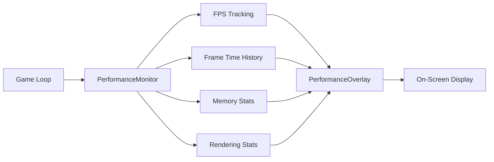

# Performance Monitoring

Learn how to use Brine2D's built-in performance overlay and profiling tools to identify bottlenecks and optimize your game.

## Overview

Brine2D includes a comprehensive performance monitoring system that provides real-time metrics without impacting game performance. The overlay displays FPS, frame time, memory usage, rendering statistics, and more.



---

## Quick Start

### Enable Performance Monitoring

Add performance monitoring to your game builder:

```csharp
using Brine2D.Hosting;
using Brine2D.Rendering.Performance;

var builder = GameApplication.CreateBuilder(args);

// Add performance monitoring with default settings
builder.Services.AddPerformanceMonitoring(options =>
{
    options.EnableOverlay = true;
    options.ShowFPS = true;
    options.ShowFrameTime = true;
    options.ShowMemory = true;
});

var game = builder.Build();
await game.RunAsync<GameScene>();
```

That's it! The performance overlay will now appear in your game.

---

## Keyboard Shortcuts

Control the performance overlay with these hotkeys:

| Hotkey | Action |
|--------|--------|
| `F1` | Toggle overlay visibility (on/off) |
| `F3` | Toggle detailed stats (includes frame time graph and memory) |

!!! tip "Demo Scene"
    Try the **Performance Benchmark** demo to see the overlay in action with 10,000+ sprites!
    
    ```bash
    cd samples/FeatureDemos
    dotnet run
    # Select "Performance Benchmark" from menu
    ```

---

## Performance Metrics

### FPS Counter

The FPS counter tracks frames per second with historical data:

**Displayed Metrics:**
- **Current FPS** - Real-time frame rate
- **Min FPS** - Lowest FPS recorded (since startup)
- **Max FPS** - Highest FPS recorded
- **Average FPS** - Rolling average (last 60 frames)

**Color Coding:**
- 🟢 **Green** - 60+ FPS (excellent)
- 🟡 **Yellow** - 30-59 FPS (acceptable)
- 🔴 **Red** - Below 30 FPS (poor)

```csharp
// Access FPS metrics programmatically
var monitor = serviceProvider.GetRequiredService<PerformanceMonitor>();

var currentFPS = monitor.CurrentFPS;
var minFPS = monitor.MinFPS;
var maxFPS = monitor.MaxFPS;
var avgFPS = monitor.AverageFPS;

Logger.LogInformation($"FPS: {currentFPS:F1} (Min: {minFPS:F0}, Max: {maxFPS:F0}, Avg: {avgFPS:F1})");
```

---

### Frame Time

Frame time measures how long each frame takes to render (in milliseconds):

**Key Metrics:**
- **Current Frame Time** - Time for the last frame
- **Frame Time Graph** - Visual history of last 60 frames
- **Target Line** - 16.67ms line (60 FPS target)

**Interpreting Frame Time:**
- **< 16.67ms** - Running at 60+ FPS ✅
- **16.67-33.33ms** - Running at 30-60 FPS ⚠️
- **> 33.33ms** - Below 30 FPS ❌

```csharp
// Access frame time metrics
var frameTime = monitor.CurrentFrameTime;
var minFrameTime = monitor.MinFrameTime;
var maxFrameTime = monitor.MaxFrameTime;

Logger.LogDebug($"Frame Time: {frameTime:F2}ms");
```

**Frame Time Graph:**

The graph shows a rolling 60-frame history, with spikes indicating frame drops. Green bars indicate frames under the 60 FPS target (16.67ms), while red bars show slower frames.

---

### Memory Statistics

Track managed memory usage and garbage collection:

**Displayed Metrics:**
- **Total Memory (MB)** - Current managed heap size
- **GC Gen 0/1/2** - Collection counts per generation

**Understanding GC Generations:**
- **Gen 0** - Short-lived objects (frequent, cheap)
- **Gen 1** - Medium-lived objects (less frequent)
- **Gen 2** - Long-lived objects (rare, expensive!)

```csharp
// Access memory metrics
var memoryMB = monitor.TotalMemoryMB;
var gen0 = monitor.Gen0Collections;
var gen1 = monitor.Gen1Collections;
var gen2 = monitor.Gen2Collections;

Logger.LogInformation($"Memory: {memoryMB:F2} MB | GC: {gen0}/{gen1}/{gen2}");
```

!!! warning "Watch Gen 2 Collections"
    Frequent Gen 2 collections indicate memory pressure. Consider using object pooling (see [Optimization Guide](optimization.md)).

---

### Rendering Statistics

Monitor sprite rendering performance:

**Displayed Metrics:**
- **Entity Count** - Total entities in the world
- **Sprite Count** - Sprites rendered this frame
- **Culled Sprites** - Off-screen sprites skipped
- **Draw Calls** - Number of render batches
- **Batch Efficiency** - Average sprites per batch

```csharp
// Update rendering stats each frame
monitor.UpdateRenderStats(
    drawCalls: 5,
    entityCount: 1000,
    spriteCount: 850,
    culledSprites: 150,
    batchCount: 5
);

// Access rendering stats
var drawCalls = monitor.DrawCalls;
var spriteCount = monitor.SpriteCount;
var batchEfficiency = monitor.BatchEfficiency; // sprites per batch

Logger.LogDebug($"Rendered {spriteCount} sprites in {drawCalls} batches ({batchEfficiency:F1}x efficiency)");
```

**Batch Efficiency:**
- **1x** - No batching (poor) 🔴
- **5-10x** - Moderate batching (acceptable) 🟡
- **10+x** - Excellent batching ✅

---

## Configuration Options

### Basic Configuration

```csharp
builder.Services.AddPerformanceMonitoring(options =>
{
    // Toggle overlay visibility
    options.EnableOverlay = true;
    
    // Choose which stats to display
    options.ShowFPS = true;
    options.ShowFrameTime = true;
    options.ShowMemory = true;
});
```

### Advanced Configuration

```csharp
// Access overlay at runtime for customization
public class GameScene : Scene
{
    private readonly PerformanceOverlay _perfOverlay;
    
    public GameScene(PerformanceOverlay perfOverlay, ILogger<GameScene> logger) : base(logger)
    {
        _perfOverlay = perfOverlay;
        
        // Change overlay position
        _perfOverlay.Position = OverlayPosition.TopLeft;
        
        // Adjust update frequency (default: 0.25 seconds = 4 updates/sec)
        _perfOverlay.DisplayUpdateInterval = 0.5; // Update twice per second
        
        // Start with detailed stats visible
        _perfOverlay.ShowDetailedStats = true;
    }
}
```

**Overlay Positions:**
- `OverlayPosition.TopRight` (default)
- `OverlayPosition.TopLeft`
- `OverlayPosition.BottomLeft`
- `OverlayPosition.BottomRight`

---

## Programmatic Access

### Manual Frame Timing

Track custom operations:

```csharp
public class GameScene : Scene
{
    private readonly PerformanceMonitor _monitor;
    
    protected override void OnUpdate(GameTime gameTime)
    {
        // Monitor tracks frames automatically, but you can reset stats
        if (Input.IsKeyPressed(Keys.R))
        {
            _monitor.Reset(); // Clear min/max/average stats
            Logger.LogInformation("Performance stats reset!");
        }
    }
}
```

### Custom Profiling Regions

Profile specific code sections:

```csharp
using System.Diagnostics;

public class AISystem : ECSSystem
{
    private readonly Stopwatch _stopwatch = new();
    
    public override void Update(GameTime gameTime)
    {
        _stopwatch.Restart();
        
        // Your AI logic here
        ProcessEnemyAI();
        
        _stopwatch.Stop();
        
        if (_stopwatch.ElapsedMilliseconds > 5)
        {
            Logger.LogWarning($"AI system took {_stopwatch.ElapsedMilliseconds}ms (> 5ms budget!)");
        }
    }
}
```

---

## Performance Targets

### 60 FPS Target

Target specifications for smooth gameplay:

| Metric | Target | Acceptable | Poor |
|--------|--------|------------|------|
| **FPS** | 60+ | 30-59 | < 30 |
| **Frame Time** | < 16.67ms | 16.67-33.33ms | > 33.33ms |
| **Gen 2 GC** | 0/sec | < 1/sec | > 1/sec |
| **Batch Efficiency** | 10+x | 5-10x | < 5x |

### Platform-Specific Targets

Adjust expectations based on platform:

```csharp
// Desktop: Target 60 FPS
// Mobile: Target 30 FPS (optional)
// Web: Target 30-60 FPS depending on device

var targetFPS = RuntimeInformation.IsOSPlatform(OSPlatform.Windows) ? 60 : 30;
Logger.LogInformation($"Target FPS: {targetFPS}");
```

---

## Troubleshooting

### High Frame Time (Low FPS)

**Symptoms:**
- FPS consistently below 60
- Frame time spikes above 16.67ms

**Common Causes:**
1. **Too many entities** - Reduce entity count or use culling
2. **Expensive queries** - Cache queries, avoid complex predicates
3. **Allocations** - Use object pooling (see [Optimization Guide](optimization.md))
4. **Draw calls** - Enable sprite batching

**Solutions:**

```csharp
// 1. Enable frustum culling (automatic with SpriteRenderingSystem)
var spriteSystem = world.GetSystem<SpriteRenderingSystem>();
var (rendered, culled) = spriteSystem.GetCullingStats();
Logger.LogInfo($"Rendered: {rendered}, Culled: {culled}");

// 2. Use cached queries
var enemies = world.CreateCachedQuery<EnemyComponent, TransformComponent>();

// 3. Check batch efficiency
var (spriteCount, drawCalls) = spriteSystem.GetBatchStats();
var efficiency = (float)spriteCount / drawCalls;
if (efficiency < 5f)
{
    Logger.LogWarning($"Low batch efficiency: {efficiency:F1}x");
}
```

---

### Frequent GC Collections

**Symptoms:**
- Gen 2 collections increasing rapidly
- Frame time spikes during collections

**Common Causes:**
1. **LINQ in hot paths** - Use `for` loops instead
2. **String concatenation** - Use `StringBuilder` or string interpolation
3. **New allocations** - Use object pooling

**Solutions:**

```csharp
// ❌ BAD: Creates garbage
var results = world.Query()
    .With<EnemyComponent>()
    .Execute()
    .ToList(); // Allocation!

foreach (var enemy in results)
{
    var message = "Enemy: " + enemy.Name; // Allocation!
}

// ✅ GOOD: Zero allocation
var enemies = world.CreateCachedQuery<EnemyComponent>();

foreach (var enemy in enemies.Execute())
{
    Logger.LogDebug($"Enemy: {enemy.Name}"); // Interpolation is optimized
}
```

See [Performance Optimization](optimization.md) for detailed guidance.

---

### Low Batch Efficiency

**Symptoms:**
- Batch efficiency < 5x
- High draw call count

**Common Causes:**
1. **Many different textures** - Use texture atlases
2. **Frequent layer changes** - Group sprites by layer

**Solutions:**

```csharp
// Group sprites by texture and layer
var sprites = world.Query()
    .With<SpriteComponent>()
    .OrderBy(e => e.GetComponent<SpriteComponent>().Layer)
    .ThenBy(e => e.GetComponent<SpriteComponent>().TexturePath)
    .Execute();
```

---

## Best Practices

### DO

✅ **Enable monitoring during development**

```csharp
#if DEBUG
builder.Services.AddPerformanceMonitoring(options =>
{
    options.EnableOverlay = true;
    options.ShowDetailedStats = true;
});
#endif
```

✅ **Profile before optimizing**

Measure first, optimize second. Don't guess where bottlenecks are!

✅ **Set performance budgets**

```csharp
const float MAX_FRAME_TIME = 16.67f; // 60 FPS

if (monitor.CurrentFrameTime > MAX_FRAME_TIME)
{
    Logger.LogWarning($"Frame time exceeded budget: {monitor.CurrentFrameTime:F2}ms");
}
```

### DON'T

❌ **Don't optimize prematurely**

Profile first to identify actual bottlenecks.

❌ **Don't leave overlay enabled in production**

```csharp
// Only enable in debug builds
#if !RELEASE
options.EnableOverlay = true;
#endif
```

❌ **Don't ignore Gen 2 collections**

Frequent Gen 2 GCs indicate serious memory problems.

---

## Next Steps

<div class="grid cards" markdown>

-   **Optimization Guide**

    ---

    Learn zero-allocation patterns

    [:octicons-arrow-right-24: Optimization Guide](optimization.md)

-   **Particle System**

    ---

    High-performance effects

    [:octicons-arrow-right-24: Particle System](../rendering/particles.md)

-   **Sprite Batching**

    ---

    Minimize draw calls

    [:octicons-arrow-right-24: Rendering Guide](../rendering/sprites.md)

</div>

---

**Remember:** Measure first, optimize second!