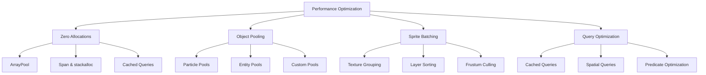

# Performance Optimization

Master zero-allocation patterns, object pooling, and other techniques to build high-performance games in Brine2D.

## Overview

Brine2D is designed for performance from the ground up, using modern .NET techniques to minimize garbage collection pressure and maximize frame rates. This guide covers best practices for building games that run at 60+ FPS with minimal memory allocations.



---

## Zero-Allocation Patterns

### Understanding Allocations

Every `new` allocation creates garbage that must eventually be collected:

```csharp
// ❌ BAD: Allocates every frame
protected override void OnUpdate(GameTime gameTime)
{
    var enemies = new List<Entity>(); // Allocation!
    
    foreach (var entity in World.Entities)
    {
        if (entity.HasComponent<EnemyComponent>())
        {
            enemies.Add(entity);
        }
    }
    
    // Process enemies...
}
```

**Problems:**
- Creates garbage every frame
- Triggers Gen 0 collections (minor, but still pauses)
- Eventually triggers Gen 2 collections (major pauses!)

---

### ArrayPool<T>

Use `ArrayPool<T>` for temporary buffers:

```csharp
using System.Buffers;

// ✅ GOOD: Zero allocation
protected override void OnUpdate(GameTime gameTime)
{
    var enemyCount = World.GetEntitiesWithComponent<EnemyComponent>().Count();
    var array = ArrayPool<Entity>.Shared.Rent(enemyCount);
    
    try
    {
        int index = 0;
        foreach (var entity in World.GetEntitiesWithComponent<EnemyComponent>())
        {
            array[index++] = entity;
        }
        
        // Process array[0..index]
        for (int i = 0; i < index; i++)
        {
            ProcessEnemy(array[i]);
        }
    }
    finally
    {
        ArrayPool<Entity>.Shared.Return(array, clearArray: true);
    }
}
```

**Benefits:**
- Zero allocation (array is reused)
- No GC pressure
- Minimal overhead

**Best Practices:**
- Always use `try/finally` to ensure return
- Set `clearArray: true` to avoid memory leaks
- Rent exact size if known, or slightly larger

---

### Cached Queries

Brine2D's cached queries eliminate allocations in hot paths:

```csharp
public class MovementSystem : ECSSystem
{
    private readonly IEntityWorld _world;
    private readonly CachedQuery<TransformComponent, VelocityComponent> _movingEntities;
    
    public MovementSystem(IEntityWorld world)
    {
        _world = world;
        
        // Create cached query once (setup cost)
        _movingEntities = world.CreateCachedQuery<TransformComponent, VelocityComponent>();
    }
    
    public override void Update(GameTime gameTime)
    {
        var deltaTime = (float)gameTime.DeltaTime;
        
        // ✅ Zero allocation per frame!
        foreach (var entity in _movingEntities.Execute())
        {
            var transform = entity.GetComponent<TransformComponent>();
            var velocity = entity.GetComponent<VelocityComponent>();
            
            transform.Position += velocity.Velocity * deltaTime;
        }
    }
}
```

**When to Use:**
- Hot paths (every frame)
- Systems processing many entities
- Frequently executed queries

**Limitations:**
- Up to 3 component types
- No complex predicates
- Automatically invalidated on entity/component changes

---

### Avoid LINQ in Hot Paths

LINQ is convenient but allocates:

```csharp
// ❌ BAD: LINQ allocates enumerators
var weakEnemies = World.Query()
    .With<EnemyComponent>()
    .With<HealthComponent>()
    .Execute()
    .Where(e => e.GetComponent<HealthComponent>().CurrentHealth < 50) // Allocation!
    .ToList(); // More allocation!

// ✅ GOOD: Manual iteration
var weakEnemies = new List<Entity>(capacity: 10); // Pre-allocate once

foreach (var entity in World.Query()
    .With<EnemyComponent>()
    .With<HealthComponent>()
    .Execute())
{
    var health = entity.GetComponent<HealthComponent>();
    if (health.CurrentHealth < 50)
    {
        weakEnemies.Add(entity);
    }
}
```

**Even Better:**

```csharp
// ✅ BEST: Use query predicates
var weakEnemies = World.Query()
    .With<EnemyComponent>()
    .With<HealthComponent>(h => h.CurrentHealth < 50) // Filtered at query level!
    .Execute();
```

---

## Object Pooling

### Built-in Particle Pooling

Brine2D's particle system uses object pooling automatically:

```csharp
// ParticleEmitterComponent uses ObjectPool<Particle> internally
var emitter = entity.AddComponent<ParticleEmitterComponent>();
emitter.MaxParticles = 200;
emitter.EmissionRate = 50f;

// Particles are Get() from pool on spawn, Return() on death
// Zero allocation per particle!
```

**Under the Hood:**

```csharp
public class ParticleEmitterComponent : Component
{
    private readonly ObjectPool<Particle> _particlePool;
    
    public ParticleEmitterComponent()
    {
        // Pool created once
        _particlePool = new ObjectPool<Particle>(
            createFunc: () => new Particle(),
            resetAction: p => p.Reset(),
            maxSize: MaxParticles
        );
    }
    
    private void EmitParticle()
    {
        var particle = _particlePool.Get(); // Reuse existing particle
        // Configure particle...
        _particles.Add(particle);
    }
    
    private void UpdateParticle(Particle particle)
    {
        if (particle.IsExpired)
        {
            _particlePool.Return(particle); // Return to pool
        }
    }
}
```

---

### Custom Object Pools

Create your own pools for frequently spawned objects:

```csharp
using Brine2D.Core.Pooling;

public class BulletPool
{
    private readonly ObjectPool<Entity> _pool;
    private readonly IEntityWorld _world;
    
    public BulletPool(IEntityWorld world, int maxSize = 100)
    {
        _world = world;
        
        _pool = new ObjectPool<Entity>(
            createFunc: CreateBullet,
            resetAction: ResetBullet,
            maxSize: maxSize
        );
    }
    
    private Entity CreateBullet()
    {
        var bullet = _world.CreateEntity("Bullet");
        bullet.AddComponent<TransformComponent>();
        bullet.AddComponent<VelocityComponent>();
        bullet.AddComponent<SpriteComponent>();
        bullet.AddComponent<BulletComponent>();
        bullet.IsActive = false; // Start disabled
        
        return bullet;
    }
    
    private void ResetBullet(Entity bullet)
    {
        bullet.IsActive = false;
        bullet.GetComponent<TransformComponent>().Position = Vector2.Zero;
        bullet.GetComponent<VelocityComponent>().Velocity = Vector2.Zero;
    }
    
    public Entity SpawnBullet(Vector2 position, Vector2 velocity)
    {
        var bullet = _pool.Get();
        
        bullet.IsActive = true;
        bullet.GetComponent<TransformComponent>().Position = position;
        bullet.GetComponent<VelocityComponent>().Velocity = velocity;
        
        return bullet;
    }
    
    public void DespawnBullet(Entity bullet)
    {
        _pool.Return(bullet);
    }
}
```

**Usage:**

```csharp
public class WeaponSystem : ECSSystem
{
    private readonly BulletPool _bulletPool;
    
    public WeaponSystem(IEntityWorld world)
    {
        _bulletPool = new BulletPool(world, maxSize: 100);
    }
    
    public void FireWeapon(Vector2 position, Vector2 direction)
    {
        // ✅ Zero allocation - bullet is pooled!
        var bullet = _bulletPool.SpawnBullet(position, direction * 500f);
    }
    
    public void OnBulletHit(Entity bullet)
    {
        _bulletPool.DespawnBullet(bullet); // Return to pool
    }
}
```

---

### Pool Guidelines

**When to Pool:**
- ✅ Frequently spawned/destroyed objects (bullets, particles, effects)
- ✅ Large objects (expensive to allocate)
- ✅ Objects with complex initialization

**When NOT to Pool:**
- ❌ Rarely spawned objects (bosses, level geometry)
- ❌ Objects with unique state
- ❌ Small, simple structs (use stack allocation instead)

**Pool Sizing:**
- Set `maxSize` to expected maximum concurrent instances
- Too small: Pool doesn't help much
- Too large: Wastes memory

---

## Sprite Batching

### Automatic Batching

`SpriteRenderingSystem` automatically batches sprites:

```csharp
// Sprites are automatically batched by:
// 1. Texture (same texture = same batch)
// 2. Layer (sort for correct rendering order)

var sprite1 = entity1.AddComponent<SpriteComponent>();
sprite1.TexturePath = "assets/enemy.png";
sprite1.Layer = 10;

var sprite2 = entity2.AddComponent<SpriteComponent>();
sprite2.TexturePath = "assets/enemy.png"; // Same texture!
sprite2.Layer = 10; // Same layer!

// Both sprites rendered in 1 draw call! ✅
```

**Check Batching Efficiency:**

```csharp
var spriteSystem = world.GetSystem<SpriteRenderingSystem>();
var (spriteCount, drawCalls) = spriteSystem.GetBatchStats();
var efficiency = (float)spriteCount / drawCalls;

Logger.LogDebug($"Batch efficiency: {efficiency:F1}x ({spriteCount} sprites in {drawCalls} calls)");

if (efficiency < 5f)
{
    Logger.LogWarning("Low batch efficiency! Consider using texture atlases.");
}
```

---

### Texture Atlases

Combine multiple textures into one atlas:

```csharp
// ❌ BAD: Many textures = many batches
sprite1.TexturePath = "assets/enemy1.png";  // Batch 1
sprite2.TexturePath = "assets/enemy2.png";  // Batch 2
sprite3.TexturePath = "assets/player.png";  // Batch 3
// 3 draw calls for 3 sprites!

// ✅ GOOD: One atlas = one batch
sprite1.TexturePath = "assets/atlas.png";
sprite1.SourceRect = new Rectangle(0, 0, 32, 32);    // Enemy 1

sprite2.TexturePath = "assets/atlas.png";
sprite2.SourceRect = new Rectangle(32, 0, 32, 32);   // Enemy 2

sprite3.TexturePath = "assets/atlas.png";
sprite3.SourceRect = new Rectangle(64, 0, 32, 32);   // Player

// 1 draw call for 3 sprites! ✅
```

**Tools for Creating Atlases:**
- [TexturePacker](https://www.codeandweb.com/texturepacker)
- [ShoeBox](https://renderhjs.net/shoebox/)
- [LibGDX Texture Packer](https://github.com/libgdx/libgdx/wiki/Texture-packer)

---

### Layer Optimization

Group sprites by layer to minimize state changes:

```csharp
// ✅ GOOD: Group by layer
background.Layer = 0;   // All backgrounds
terrain.Layer = 1;      // All terrain
enemies.Layer = 10;     // All enemies
player.Layer = 15;      // Player
effects.Layer = 20;     // All effects
ui.Layer = 100;         // All UI

// Rendered in order: 0 → 1 → 10 → 15 → 20 → 100
// Minimal layer switches = better batching!
```

---

## Query Optimization

### Spatial Queries

Use spatial queries to reduce iteration:

```csharp
// ❌ BAD: Check all entities
foreach (var entity in World.Query().With<EnemyComponent>().Execute())
{
    var distance = Vector2.Distance(entity.Position, playerPosition);
    if (distance < 200f)
    {
        // Process nearby enemy
    }
}

// ✅ GOOD: Only iterate nearby entities
var nearbyEnemies = World.Query()
    .WithinRadius(playerPosition, 200f)
    .With<EnemyComponent>()
    .Execute();

foreach (var enemy in nearbyEnemies)
{
    // Already filtered by distance!
}
```

---

### Component Predicates

Filter at query level, not in loops:

```csharp
// ❌ BAD: Filter in loop
foreach (var entity in World.Query().With<HealthComponent>().Execute())
{
    var health = entity.GetComponent<HealthComponent>();
    if (health.CurrentHealth < 50)
    {
        // Process low health...
    }
}

// ✅ GOOD: Filter in query
var lowHealthEntities = World.Query()
    .With<HealthComponent>(h => h.CurrentHealth < 50)
    .Execute();

foreach (var entity in lowHealthEntities)
{
    // Already filtered!
}
```

---

### Query Complexity

Keep queries simple for best performance:

```csharp
// ⚠️ ACCEPTABLE: Simple predicate
var result = World.Query()
    .With<HealthComponent>(h => h.CurrentHealth < 50)
    .Execute();

// ❌ BAD: Complex predicate (executes per entity!)
var result = World.Query()
    .With<TransformComponent>()
    .Where(e => 
    {
        var transform = e.GetComponent<TransformComponent>();
        var distance = Vector2.Distance(transform.Position, playerPos);
        var health = e.GetComponent<HealthComponent>();
        return distance < 200f && health.CurrentHealth < 50;
    })
    .Execute();

// ✅ BETTER: Split into multiple simpler queries
var nearbyLowHealth = World.Query()
    .WithinRadius(playerPos, 200f)
    .With<HealthComponent>(h => h.CurrentHealth < 50)
    .Execute();
```

---

## Memory Management

### Avoid String Allocations

```csharp
// ❌ BAD: Concatenation allocates
var message = "Player: " + player.Name + " HP: " + player.Health;

// ✅ GOOD: Interpolation is optimized by compiler
var message = $"Player: {player.Name} HP: {player.Health}";

// ✅ BEST: StringBuilder for complex cases
var sb = new StringBuilder(capacity: 100); // Pre-allocate
sb.Append("Player: ");
sb.Append(player.Name);
sb.Append(" HP: ");
sb.Append(player.Health);
var message = sb.ToString();
sb.Clear(); // Reuse!
```

---

### Struct vs Class

Use structs for small, immutable data:

```csharp
// ✅ GOOD: Struct for small data (no allocation)
public struct Velocity
{
    public float X;
    public float Y;
    
    public Velocity(float x, float y)
    {
        X = x;
        Y = y;
    }
}

// Use it
var velocity = new Velocity(10, 20); // Stack allocated!
```

**Guidelines:**
- ✅ Use structs for < 16 bytes
- ✅ Use structs for immutable data
- ❌ Avoid large structs (copying is expensive)
- ❌ Avoid mutable structs (confusing semantics)

---

### Collection Capacity

Pre-allocate collections with known sizes:

```csharp
// ❌ BAD: Grows dynamically (allocates multiple times)
var list = new List<Entity>();
for (int i = 0; i < 1000; i++)
{
    list.Add(CreateEntity()); // Reallocates at 4, 8, 16, 32...
}

// ✅ GOOD: Pre-allocate
var list = new List<Entity>(capacity: 1000);
for (int i = 0; i < 1000; i++)
{
    list.Add(CreateEntity()); // No reallocation!
}
```

---

## Profiling Tips

### Use BenchmarkDotNet

Micro-benchmark critical code:

```csharp
using BenchmarkDotNet.Attributes;
using BenchmarkDotNet.Running;

[MemoryDiagnoser]
public class QueryBenchmarks
{
    private IEntityWorld _world;
    
    [GlobalSetup]
    public void Setup()
    {
        _world = new EntityWorld();
        // Create test entities...
    }
    
    [Benchmark]
    public void QueryWithLinq()
    {
        var result = _world.Query()
            .With<EnemyComponent>()
            .Execute()
            .Where(e => e.GetComponent<HealthComponent>().CurrentHealth < 50)
            .ToList();
    }
    
    [Benchmark]
    public void QueryWithPredicate()
    {
        var result = _world.Query()
            .With<EnemyComponent>()
            .With<HealthComponent>(h => h.CurrentHealth < 50)
            .Execute();
    }
}

// Run: dotnet run -c Release
```

---

### Measure GC Pressure

Track Gen 2 collections:

```csharp
var gen2Before = GC.CollectionCount(2);

// Run your code...
RunGameLoop();

var gen2After = GC.CollectionCount(2);
var gen2Collections = gen2After - gen2Before;

if (gen2Collections > 0)
{
    Logger.LogWarning($"Triggered {gen2Collections} Gen 2 collections!");
}
```

---

## Performance Checklist

### Hot Path Checklist

Before shipping, verify:

- [ ] No LINQ in hot paths (Update, Render)
- [ ] Cached queries for frequent lookups
- [ ] ArrayPool used for temporary buffers
- [ ] Object pools for frequently spawned objects
- [ ] Sprite batching enabled (check efficiency)
- [ ] Frustum culling enabled
- [ ] No string concatenation in loops
- [ ] Collections pre-allocated with capacity
- [ ] Gen 2 collections < 1 per minute
- [ ] Frame time < 16.67ms (60 FPS)

---

## Best Practices

### DO

✅ **Profile before optimizing**

Use the [Performance Monitor](monitoring.md) to identify real bottlenecks.

✅ **Use cached queries in systems**

```csharp
private readonly CachedQuery<T1, T2> _query = world.CreateCachedQuery<T1, T2>();
```

✅ **Pool frequently spawned objects**

Bullets, particles, effects, projectiles.

✅ **Pre-allocate collections**

```csharp
var list = new List<Entity>(capacity: expectedSize);
```

✅ **Use structs for small data**

Position, velocity, color (< 16 bytes).

### DON'T

❌ **Don't use LINQ in hot paths**

LINQ allocates enumerators.

❌ **Don't create new objects every frame**

Use pooling or reuse.

❌ **Don't use `ToList()` on queries**

Iterate directly with `foreach`.

❌ **Don't ignore GC warnings**

Gen 2 collections = serious problem!

❌ **Don't optimize prematurely**

Measure first!

---

## Next Steps

<div class="grid cards" markdown>

-   **Performance Monitoring**

    ---

    Measure and profile your game

    [:octicons-arrow-right-24: Monitoring Guide](monitoring.md)

-   **Particle System**

    ---

    Zero-allocation effects

    [:octicons-arrow-right-24: Particle System](../rendering/particles.md)

-   **Advanced Queries**

    ---

    Optimize entity lookups

    [:octicons-arrow-right-24: Query Guide](../ecs/queries.md)

</div>

---

**Remember:** Profile first, optimize second, measure results!