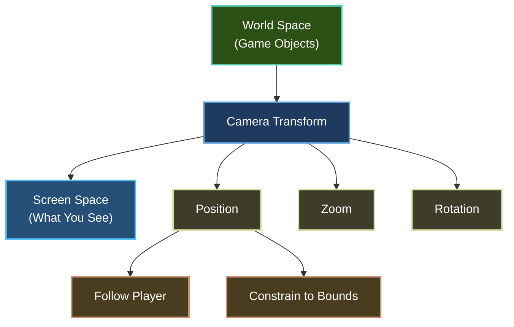

# Camera System

Learn how to implement camera movement, zoom, rotation, and player following to create dynamic 2D worlds.

## Overview

A **camera** in 2D games defines what portion of the game world is visible on screen. Think of it like a virtual viewport that can:
- ✅ **Move** - Pan around the world
- ✅ **Zoom** - Get closer or farther from action
- ✅ **Rotate** - Tilt the view (optional)
- ✅ **Follow** - Track player smoothly
- ✅ **Constrain** - Stay within world bounds



---

## Prerequisites

- ✅ [Quick Start](../getting-started/quick-start.md) - Basic scene setup
- ✅ [Drawing Basics](drawing-basics.md) - Understand rendering
- ✅ [Player Movement](../mechanics/movement.md) - Have something to follow

---

## Quick Example

### Minimal Camera Setup

```csharp CameraExample.cs
using Brine2D.Core;
using Brine2D.Rendering;
using System.Numerics;

public class CameraScene : Scene
{
    private readonly IRenderer _renderer;
    private Camera2D? _camera;
    private Vector2 _playerPosition = new Vector2(400, 300);
    
    public CameraScene(IRenderer renderer, ILogger<CameraScene> logger) 
        : base(logger) 
    {
        _renderer = renderer;
    }
    
    protected override void OnInitialize()
    {
        // Create camera
        _camera = new Camera2D(1280, 720); // viewport size
        _camera.Position = _playerPosition;
        _camera.Zoom = 1.0f;
        
        // Set as renderer's active camera
        _renderer.Camera = _camera;
    }
    
    protected override void OnUpdate(GameTime gameTime)
    {
        // Camera follows player smoothly
        _camera?.LerpTo(_playerPosition, 5f * (float)gameTime.DeltaTime);
    }
    
    protected override void OnRender(GameTime gameTime)
    {
        _renderer.Clear(Color.CornflowerBlue);
        _renderer.BeginFrame();
        
        // Draw at world position (camera transforms automatically)
        _renderer.DrawRectangle(_playerPosition.X - 25, _playerPosition.Y - 25, 
            50, 50, Color.Red);
        
        _renderer.EndFrame();
    }
}
```

**Result:** Camera smoothly follows the player!

---

## Concept: World Space vs Screen Space

### Without Camera (Screen Space)

```csharp
// Everything drawn at screen coordinates
_renderer.DrawRectangle(100, 100, 50, 50, Color.Red);
// Always at pixel (100, 100) on screen
```

### With Camera (World Space)

```csharp
// Set camera
_renderer.Camera = _camera;

// Draw at WORLD coordinates
_renderer.DrawRectangle(100, 100, 50, 50, Color.Red);
// Camera transforms to screen position
```

**Visual:**

```
World Space (large):           Screen Space (viewport):
┌─────────────────────┐       ┌───────────┐
│                     │       │           │
│   Player @(500,300) │  →→→  │ Player    │
│                     │       │ (centered)|
│  2000x2000 pixels   │       │ 1280x720  │
└─────────────────────┘       └───────────┘
```

---

## Camera Basics

### Create a Camera

```csharp
protected override void OnInitialize()
{
    // Create camera with viewport size
    _camera = new Camera2D(1280, 720);
    
    // Set initial position (world coordinates)
    _camera.Position = new Vector2(400, 300);
    
    // Set zoom (1.0 = normal, 2.0 = 2x zoomed in)
    _camera.Zoom = 1.0f;
    
    // Set rotation (in degrees, 0 = no rotation)
    _camera.Rotation = 0f;
    
    // Activate camera
    _renderer.Camera = _camera;
}
```

---

### Camera Properties

| Property | Type | Description |
|----------|------|-------------|
| `Position` | `Vector2` | Camera center in world space |
| `Zoom` | `float` | Zoom level (0.5 = zoomed out, 2.0 = zoomed in) |
| `Rotation` | `float` | Rotation in degrees (clockwise) |
| `ViewportWidth` | `int` | Screen width in pixels (readonly) |
| `ViewportHeight` | `int` | Screen height in pixels (readonly) |

---

## Camera Movement

### Manual Movement (Arrow Keys)

```csharp
protected override void OnUpdate(GameTime gameTime)
{
    if (_camera == null) return;
    
    var deltaTime = (float)gameTime.DeltaTime;
    var moveSpeed = 300f; // pixels per second
    var movement = Vector2.Zero;
    
    // Camera controls
    if (_input.IsKeyDown(Keys.Left))  movement.X -= 1;
    if (_input.IsKeyDown(Keys.Right)) movement.X += 1;
    if (_input.IsKeyDown(Keys.Up))    movement.Y -= 1;
    if (_input.IsKeyDown(Keys.Down))  movement.Y += 1;
    
    if (movement != Vector2.Zero)
    {
        movement = Vector2.Normalize(movement);
        _camera.Move(movement * moveSpeed * deltaTime);
    }
}
```

---

### Instant Centering

```csharp
// Immediately center camera on position
_camera.CenterOn(new Vector2(500, 500));
```

---

### Smooth Following (Lerp)

```csharp
protected override void OnUpdate(GameTime gameTime)
{
    var deltaTime = (float)gameTime.DeltaTime;
    var smoothing = 5f; // Higher = faster following
    
    // Camera smoothly moves towards player
    _camera?.LerpTo(_playerPosition, smoothing * deltaTime);
}
```

**Smoothing values:**
- `1f` - Very slow, cinematic
- `5f` - Nice balance (recommended)
- `10f` - Quick, responsive
- `20f` - Almost instant

---

## Zoom Control

### Basic Zoom

```csharp
protected override void OnUpdate(GameTime gameTime)
{
    if (_camera == null) return;
    
    var deltaTime = (float)gameTime.DeltaTime;
    
    // Q/E to zoom in/out
    if (_input.IsKeyDown(Keys.Q))
    {
        _camera.Zoom = Math.Max(0.5f, _camera.Zoom - 1.0f * deltaTime);
    }
    
    if (_input.IsKeyDown(Keys.E))
    {
        _camera.Zoom = Math.Min(3.0f, _camera.Zoom + 1.0f * deltaTime);
    }
}
```

---

### Smooth Zoom

```csharp
private float _targetZoom = 1.0f;

protected override void OnUpdate(GameTime gameTime)
{
    var deltaTime = (float)gameTime.DeltaTime;
    
    // Scroll wheel for zoom
    var scrollDelta = _input.ScrollWheelDelta;
    if (Math.Abs(scrollDelta) > 0.001f)
    {
        _targetZoom = Math.Clamp(_targetZoom + scrollDelta * 0.1f, 0.5f, 3.0f);
    }
    
    // Smooth zoom transition
    if (_camera != null)
    {
        _camera.Zoom = MathHelper.Lerp(_camera.Zoom, _targetZoom, 10f * deltaTime);
    }
}
```

---

### Zoom Presets

```csharp
public enum ZoomLevel
{
    Far = 0,    // 0.5x - See more world
    Normal = 1, // 1.0x - Standard view
    Close = 2,  // 2.0x - Zoomed in
    VeryClose = 3 // 3.0x - Very zoomed in
}

private void SetZoom(ZoomLevel level)
{
    _targetZoom = level switch
    {
        ZoomLevel.Far => 0.5f,
        ZoomLevel.Normal => 1.0f,
        ZoomLevel.Close => 2.0f,
        ZoomLevel.VeryClose => 3.0f,
        _ => 1.0f
    };
}
```

---

## World Bounds

Prevent camera from showing outside the world:

### Create Bounds

```csharp
protected override void OnInitialize()
{
    _camera = new Camera2D(1280, 720);
    _renderer.Camera = _camera;
    
    // Define world boundaries (min/max coordinates)
    _worldBounds = new CameraBounds(0, 0, 2000, 2000);
}
```

---

### Constrain Camera

```csharp
protected override void OnUpdate(GameTime gameTime)
{
    // Update camera position
    _camera?.LerpTo(_playerPosition, 5f * (float)gameTime.DeltaTime);
    
    // Clamp to world bounds
    if (_camera != null && _worldBounds != null)
    {
        _camera.Position = _worldBounds.ClampPosition(_camera.Position, _camera);
    }
}
```

**How it works:**
- Calculates camera's visible area based on zoom
- Prevents camera edges from showing outside world bounds
- Automatically handles different zoom levels

---

## Following Patterns

### Pattern 1: Direct Follow (No Smoothing)

```csharp
protected override void OnUpdate(GameTime gameTime)
{
    // Camera instantly follows player
    if (_camera != null)
    {
        _camera.Position = _playerPosition;
    }
}
```

**Use for:** Tight, precise camera control (2D fighters, puzzle games)

---

### Pattern 2: Smooth Follow (Lerp)

```csharp
protected override void OnUpdate(GameTime gameTime)
{
    var deltaTime = (float)gameTime.DeltaTime;
    
    // Camera smoothly follows
    _camera?.LerpTo(_playerPosition, 5f * deltaTime);
}
```

**Use for:** Most games (platformers, top-down shooters)

---

### Pattern 3: Deadzone Follow

```csharp
private readonly float _deadzoneRadius = 100f;

protected override void OnUpdate(GameTime gameTime)
{
    if (_camera == null) return;
    
    var deltaTime = (float)gameTime.DeltaTime;
    var offset = _playerPosition - _camera.Position;
    var distance = offset.Length();
    
    // Only move camera if player leaves deadzone
    if (distance > _deadzoneRadius)
    {
        var direction = Vector2.Normalize(offset);
        var moveAmount = distance - _deadzoneRadius;
        _camera.Position += direction * moveAmount * 5f * deltaTime;
    }
}
```

**Use for:** Exploration games, slower-paced games

```
Deadzone Visualization:
┌──────────────────┐
│                  │
│   ┌────────┐     │
│   │ Player │     │ Camera doesn't move
│   └────────┘     │
│   (deadzone)     │
│                  │
└──────────────────┘

Player moves outside → Camera follows
```

---

### Pattern 4: Look-Ahead Follow

```csharp
private readonly float _lookAheadDistance = 150f;

protected override void OnUpdate(GameTime gameTime)
{
    var deltaTime = (float)gameTime.DeltaTime;
    
    // Calculate player's facing direction from velocity
    var facing = Vector2.Zero;
    if (_playerVelocity.LengthSquared() > 0.01f)
    {
        facing = Vector2.Normalize(_playerVelocity);
    }
    
    // Target is ahead of player
    var lookAheadTarget = _playerPosition + facing * _lookAheadDistance;
    
    _camera?.LerpTo(lookAheadTarget, 3f * deltaTime);
}
```

**Use for:** Fast-paced games (racing, side-scrolling shooters)

---

## Complete Camera Example

Here's a full scene with all camera features:

```csharp CameraGameScene.cs
using Brine2D.Core;
using Brine2D.Input;
using Brine2D.Rendering;
using Microsoft.Extensions.Logging;
using System.Numerics;

public class CameraGameScene : Scene
{
    private readonly IRenderer _renderer;
    private readonly IInputService _input;
    private readonly IGameContext _gameContext;
    
    private Camera2D? _camera;
    private CameraBounds? _worldBounds;
    
    private Vector2 _playerPosition = new Vector2(400, 300);
    private float _playerSpeed = 200f;
    
    private float _targetZoom = 1.0f;
    
    public CameraGameScene(
        IRenderer renderer,
        IInputService input,
        IGameContext gameContext,
        ILogger<CameraGameScene> logger
    ) : base(logger)
    {
        _renderer = renderer;
        _input = input;
        _gameContext = gameContext;
    }
    
    // ============================================
    // INITIALIZATION
    // ============================================
    protected override void OnInitialize()
    {
        Logger.LogInformation("Camera Demo initialized!");
        Logger.LogInformation("Controls:");
        Logger.LogInformation("  WASD - Move player");
        Logger.LogInformation("  Q/E - Zoom out/in");
        Logger.LogInformation("  R - Reset camera");
        Logger.LogInformation("  ESC - Exit");
        
        // Create camera with viewport size
        _camera = new Camera2D(1280, 720);
        _camera.Position = _playerPosition;
        _camera.Zoom = 1.0f;
        _renderer.Camera = _camera;
        
        // Set world bounds (2000x2000 world)
        _worldBounds = new CameraBounds(0, 0, 2000, 2000);
    }
    
    // ============================================
    // UPDATE
    // ============================================
    protected override void OnUpdate(GameTime gameTime)
    {
        var deltaTime = (float)gameTime.DeltaTime;
        
        // Exit
        if (_input.IsKeyPressed(Keys.Escape))
        {
            _gameContext.RequestExit();
        }
        
        // Player movement
        UpdatePlayerMovement(deltaTime);
        
        // Camera zoom controls
        UpdateCameraZoom(deltaTime);
        
        // Reset camera
        if (_input.IsKeyPressed(Keys.R) && _camera != null)
        {
            _camera.Zoom = 1.0f;
            _targetZoom = 1.0f;
            _camera.Rotation = 0f;
        }
        
        // Camera follows player smoothly
        if (_camera != null && _worldBounds != null)
        {
            _camera.LerpTo(_playerPosition, 5f * deltaTime);
            _camera.Position = _worldBounds.ClampPosition(_camera.Position, _camera);
        }
    }
    
    private void UpdatePlayerMovement(float deltaTime)
    {
        var movement = Vector2.Zero;
        
        if (_input.IsKeyDown(Keys.W)) movement.Y -= 1;
        if (_input.IsKeyDown(Keys.S)) movement.Y += 1;
        if (_input.IsKeyDown(Keys.A)) movement.X -= 1;
        if (_input.IsKeyDown(Keys.D)) movement.X += 1;
        
        if (movement != Vector2.Zero)
        {
            movement = Vector2.Normalize(movement);
            _playerPosition += movement * _playerSpeed * deltaTime;
            
            // Keep player in world bounds
            _playerPosition = new Vector2(
                Math.Clamp(_playerPosition.X, 0, 2000),
                Math.Clamp(_playerPosition.Y, 0, 2000));
        }
    }
    
    private void UpdateCameraZoom(float deltaTime)
    {
        if (_camera == null) return;
        
        // Zoom controls
        if (_input.IsKeyDown(Keys.Q))
        {
            _targetZoom = Math.Max(0.5f, _targetZoom - 1.0f * deltaTime);
        }
        
        if (_input.IsKeyDown(Keys.E))
        {
            _targetZoom = Math.Min(3.0f, _targetZoom + 1.0f * deltaTime);
        }
        
        // Smooth zoom transition
        _camera.Zoom = MathHelper.Lerp(_camera.Zoom, _targetZoom, 10f * deltaTime);
    }
    
    // ============================================
    // RENDER
    // ============================================
    protected override void OnRender(GameTime gameTime)
    {
        _renderer.Clear(new Color(40, 40, 40));
        _renderer.BeginFrame();
        
        // Draw grid (to visualize camera movement)
        DrawGrid();
        
        // Draw player
        DrawPlayer();
        
        _renderer.EndFrame();
    }
    
    private void DrawGrid()
    {
        var gridSize = 100;
        var gridColor = new Color(60, 60, 60);
        
        // Draw vertical lines
        for (int x = 0; x <= 2000; x += gridSize)
        {
            _renderer.DrawRectangle(x, 0, 2, 2000, gridColor);
        }
        
        // Draw horizontal lines
        for (int y = 0; y <= 2000; y += gridSize)
        {
            _renderer.DrawRectangle(0, y, 2000, 2, gridColor);
        }
    }
    
    private void DrawPlayer()
    {
        var playerSize = 50f;
        _renderer.DrawRectangle(
            _playerPosition.X - playerSize / 2,
            _playerPosition.Y - playerSize / 2,
            playerSize,
            playerSize,
            Color.Red);
    }
}

// Helper class for smooth interpolation
public static class MathHelper
{
    public static float Lerp(float a, float b, float t)
    {
        return a + (b - a) * Math.Clamp(t, 0f, 1f);
    }
}
```

---

## Advanced Techniques

### Camera Shake

Add screen shake for impact effects:

```csharp
private float _shakeIntensity = 0f;
private float _shakeDuration = 0f;
private Random _random = new Random();

public void ShakeCamera(float intensity, float duration)
{
    _shakeIntensity = intensity;
    _shakeDuration = duration;
}

protected override void OnUpdate(GameTime gameTime)
{
    var deltaTime = (float)gameTime.DeltaTime;
    
    // Update shake
    if (_shakeDuration > 0)
    {
        _shakeDuration -= deltaTime;
        
        // Add random offset to camera
        var shakeOffset = new Vector2(
            (_random.NextSingle() - 0.5f) * 2f * _shakeIntensity,
            (_random.NextSingle() - 0.5f) * 2f * _shakeIntensity);
        
        if (_camera != null)
        {
            _camera.Position += shakeOffset;
        }
    }
    
    // Normal camera movement
    _camera?.LerpTo(_playerPosition, 5f * deltaTime);
}

// Trigger shake on explosion
private void OnExplosion()
{
    ShakeCamera(intensity: 10f, duration: 0.3f);
}
```

---

### Screen-To-World Conversion

Convert mouse position to world coordinates:

```csharp
protected override void OnUpdate(GameTime gameTime)
{
    // Get mouse position in screen space
    var mouseScreen = _input.MousePosition;
    
    // Convert to world space
    var mouseWorld = _camera?.ScreenToWorld(mouseScreen) ?? mouseScreen;
    
    // Now you can use world position for gameplay
    if (_input.IsMouseButtonPressed(MouseButton.Left))
    {
        SpawnObjectAt(mouseWorld);
    }
}
```

---

### Multi-Camera Setup

Have different cameras for different purposes:

```csharp
private Camera2D? _gameCamera;
private Camera2D? _minimapCamera;

protected override void OnInitialize()
{
    // Main game camera
    _gameCamera = new Camera2D(1280, 720);
    _gameCamera.Zoom = 1.0f;
    
    // Minimap camera (zoomed out, top-right corner)
    _minimapCamera = new Camera2D(200, 200);
    _minimapCamera.Zoom = 0.2f; // See more world
}

protected override void OnRender(GameTime gameTime)
{
    // Render main game view
    _renderer.Camera = _gameCamera;
    _renderer.Clear(Color.Black);
    _renderer.BeginFrame();
    DrawGameWorld();
    _renderer.EndFrame();
    
    // Render minimap (separate pass)
    _renderer.Camera = _minimapCamera;
    // ... render minimap ...
    _renderer.Camera = null; // Reset to screen space
}
```

---

## Troubleshooting

### Problem: Camera Jitters

**Symptom:** Camera shakes or stutters

**Causes:**
- Rounding errors
- Too fast lerp speed
- Conflicting movement

**Solutions:**

```csharp
// 1. Smooth lerp speed
_camera.LerpTo(_playerPosition, 5f * deltaTime); // Not 50f!

// 2. Don't mix immediate and lerp
// ❌ Bad
_camera.Position = _playerPosition; // Instant
_camera.LerpTo(_playerPosition, 5f * deltaTime); // Smooth

// ✅ Good - pick one
_camera.LerpTo(_playerPosition, 5f * deltaTime);
```

---

### Problem: Camera Shows Outside World

**Symptom:** Black bars or empty space visible

**Solution:** Use `CameraBounds` to constrain:

```csharp
_worldBounds = new CameraBounds(0, 0, 2000, 2000);
_camera.Position = _worldBounds.ClampPosition(_camera.Position, _camera);
```

---

### Problem: UI Not Showing

**Symptom:** UI elements invisible or transformed

**Solution:** Disable camera for UI rendering:

```csharp
protected override void OnRender(GameTime gameTime)
{
    // Game world (with camera)
    _renderer.Camera = _camera;
    DrawGameWorld();
    
    // UI (without camera)
    _renderer.Camera = null; // Screen space
    DrawUI();
}
```

---

## Best Practices

### DO

1. **Use smooth following** for better feel
   ```csharp
   _camera.LerpTo(_playerPosition, 5f * deltaTime);
   ```

2. **Constrain to world bounds** to avoid showing empty space
   ```csharp
   _camera.Position = _worldBounds.ClampPosition(_camera.Position, _camera);
   ```

3. **Disable camera for UI** to keep UI in screen space
   ```csharp
   _renderer.Camera = null; // Before rendering UI
   ```

4. **Use reasonable zoom limits** to prevent extreme views
   ```csharp
   _camera.Zoom = Math.Clamp(_camera.Zoom, 0.5f, 3.0f);
   ```

### DON'T

1. **Don't update camera position multiple times per frame**
   ```csharp
   // ❌ Bad - conflicts
   _camera.Position = _playerPosition;
   _camera.LerpTo(_target, 5f);
   ```

2. **Don't forget delta time** in camera movement
   ```csharp
   // ❌ Bad
   _camera.LerpTo(_target, 5f);
   
   // ✅ Good
   _camera.LerpTo(_target, 5f * deltaTime);
   ```

3. **Don't use extreme zoom values** (causes rendering issues)
   ```csharp
   // ❌ Bad
   _camera.Zoom = 0.01f; // Too small
   _camera.Zoom = 100f;  // Too large
   ```

---

## Performance Tips

1. **Culling** - Only render visible objects:
   ```csharp
   foreach (var obj in _gameObjects)
   {
       if (IsVisibleToCamera(obj, _camera))
       {
           obj.Render(_renderer);
       }
   }
   ```

2. **Grid rendering** - Only draw visible grid cells:
   ```csharp
   var visibleBounds = _camera.GetVisibleBounds();
   var startX = (int)(visibleBounds.Left / gridSize) * gridSize;
   var endX = (int)(visibleBounds.Right / gridSize) * gridSize;
   // ... draw only visible portion
   ```

---

## Summary

| Feature | Code | Use Case |
|---------|------|----------|
| **Create Camera** | `new Camera2D(1280, 720)` | Initialize |
| **Set Camera** | `_renderer.Camera = camera` | Activate |
| **Direct Follow** | `camera.Position = target` | Instant tracking |
| **Smooth Follow** | `camera.LerpTo(target, 5f * dt)` | Smooth tracking |
| **Zoom** | `camera.Zoom = 2.0f` | Get closer |
| **Bounds** | `new CameraBounds(0, 0, w, h)` | Constrain view |
| **Screen→World** | `camera.ScreenToWorld(pos)` | Mouse to world |
| **World→Screen** | `camera.WorldToScreen(pos)` | World to screen |

---

## Next Steps

- **[Animation](animation.md)** - Animate camera movements
- **[Tilemaps](../tilemaps/rendering.md)** - Optimize large world rendering
- **[Player Movement](../mechanics/movement.md)** - Create smooth player controls
- **[Parallax Scrolling](parallax.md)** - Multi-layer backgrounds

---

Ready to add more? Try [Camera Shake and Effects](camera-effects.md)!