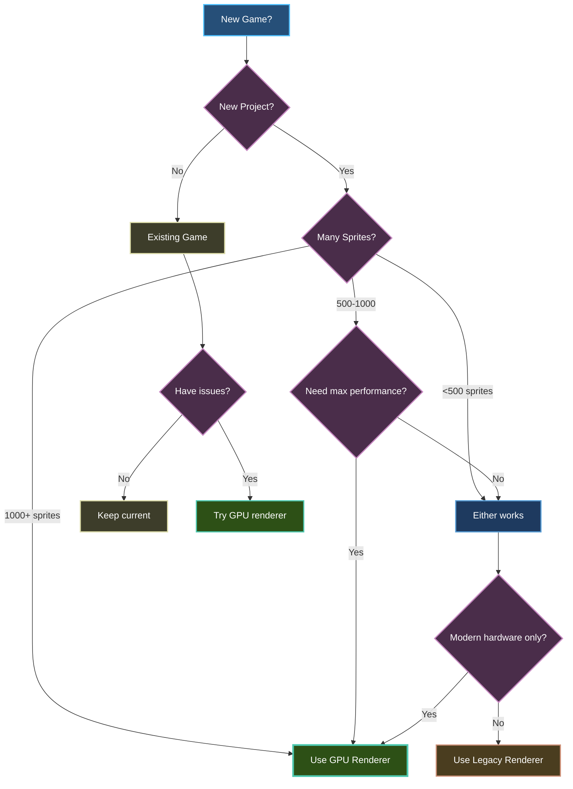

# Choosing a Renderer

Brine2D v0.7.0+ offers two rendering backends: the modern **GPU Renderer** and the classic **Legacy Renderer**. This guide helps you choose the right one for your project.

## Quick Decision

**Use GPU Renderer (default) if:**
- Building a new game
- Need high performance (1,000+ sprites)
- Targeting modern hardware (2015+)
- Want future features (shaders, post-processing)

**Use Legacy Renderer if:**
- Maximum compatibility needed
- Targeting older hardware
- Simple game (<500 sprites)
- Experiencing GPU driver issues



---

## Renderer Overview

### GPU Renderer (Recommended)

Modern shader-based renderer using SDL3's GPU API.

**Graphics APIs:**
- **Vulkan** (Windows, Linux, Android)
- **Metal** (macOS, iOS)
- **Direct3D 11** (Windows)
- **Direct3D 12** (Windows 10+)

**Best For:**
- Modern games (2020+)
- High sprite counts
- Particle effects
- Future features

**Requires:**
- Modern GPU (2015+)
- Updated drivers
- Vulkan/Metal/D3D11+ support

---

### Legacy Renderer

Classic SDL_Renderer API with broader compatibility.

**Graphics APIs:**
- Platform-specific backends
- Software fallback available
- OpenGL (some platforms)

**Best For:**
- Maximum compatibility
- Simple 2D games
- Older hardware
- Fallback option

**Requires:**
- Any GPU or CPU
- SDL3 support
- Minimal driver requirements

---

## Feature Comparison

| Feature | GPU Renderer | Legacy Renderer |
|---------|-------------|-----------------|
| **Graphics API** | Vulkan/Metal/D3D11/D3D12 | Platform-specific |
| **Rendering** | Shader-based | Fixed-function |
| **Max sprites/frame** | 10,000+ @ 60 FPS | 1,000-5,000 @ 60 FPS |
| **Batching** | Advanced vertex batching | Basic batching |
| **Texture switches** | Optimized | Moderate overhead |
| **Custom shaders** | Future support | No |
| **Post-processing** | Future support | No |
| **Render-to-texture** | Future support | Limited |
| **Platform support** | Modern systems | Broader |
| **Driver requirements** | Up-to-date drivers | Minimal |
| **Memory usage** | Efficient | Moderate |
| **Initialization** | Slower | Faster |

---

## Performance Comparison

### Sprite Rendering Benchmarks

```
Test: Render sprites at 60 FPS target
Hardware: GTX 1060 / Ryzen 5 3600

Sprite Count    GPU Renderer    Legacy Renderer
-----------     ------------    ---------------
100 sprites     60 FPS ████     60 FPS ████
500 sprites     60 FPS ████     60 FPS ████
1,000 sprites   60 FPS ████     60 FPS ████
2,500 sprites   60 FPS ████     55 FPS ███░
5,000 sprites   60 FPS ████     45 FPS ██░░
10,000 sprites  60 FPS ████     25 FPS █░░░

Winner: GPU Renderer (+140% at 10k sprites)
```

### Texture Switch Performance

```
Test: 100 sprites with different textures

GPU Renderer:     Legacy Renderer:
- 100 sprites     - 100 sprites
- 50 textures     - 50 textures
- 60 FPS ████     - 45 FPS ██░░

Winner: GPU Renderer (33% better)
```

### Particle Systems

```
Test: Particles at 60 FPS

Particle Count   GPU Renderer    Legacy Renderer
--------------   ------------    ---------------
1,000            60 FPS ████     60 FPS ████
5,000            60 FPS ████     40 FPS ██░░
10,000           60 FPS ████     20 FPS █░░░
50,000           55 FPS ███░     5 FPS ░░░░

Winner: GPU Renderer (300% better)
```

**Summary:**
- Simple games (<500 sprites): **Equal performance**
- Medium games (500-2,500): **GPU 20-30% faster**
- Complex games (2,500+): **GPU 100-300% faster**

---

## Use Cases

### When to Use GPU Renderer

**1. High-Performance Games**

```csharp
// Bullet hell shooter with 1000+ bullets
public class BulletHellScene : Scene
{
    private List<Bullet> _bullets = new();
    
    protected override void OnRender(GameTime gameTime)
    {
        // GPU renderer handles this easily
        foreach (var bullet in _bullets)
        {
            _renderer.DrawTexture(_bulletTexture, bullet.X, bullet.Y);
        }
        // 1000+ sprites at 60 FPS!
    }
}
```

**2. Particle-Heavy Games**

```csharp
// Particle effects game
public class ParticleScene : Scene
{
    private ParticleEmitter _emitter;
    
    protected override void OnUpdate(GameTime gameTime)
    {
        // GPU renderer: 10,000+ particles at 60 FPS
        _emitter.Emit(100);  // 100 particles per frame
    }
}
```

**3. Future-Proof Projects**

```csharp
// Planning to add shaders/post-processing later
builder.Services.AddSDL3Rendering(options =>
{
    options.Backend = GraphicsBackend.GPU;
    // Ready for future features
});
```

**4. Modern Platforms Only**

```csharp
// Targeting Steam Deck, modern PCs, consoles
builder.Services.AddSDL3Rendering(options =>
{
    options.Backend = GraphicsBackend.GPU;
    // Excellent performance on modern hardware
});
```

---

### When to Use Legacy Renderer

**1. Maximum Compatibility**

```csharp
// Need to run on very old hardware
builder.Services.AddSDL3Rendering(options =>
{
    options.Backend = GraphicsBackend.LegacyRenderer;
    // Works on nearly anything
});
```

**2. Simple Games**

```csharp
// Turn-based strategy with <100 sprites
public class StrategyScene : Scene
{
    protected override void OnRender(GameTime gameTime)
    {
        // Draw board (small sprite count)
        foreach (var tile in _board)
        {
            _renderer.DrawTexture(_tileTexture, tile.X, tile.Y);
        }
        // Legacy renderer is fine here
    }
}
```

**3. GPU Driver Issues**

```csharp
// Fallback for systems with GPU problems
try
{
    builder.Services.AddSDL3Rendering(options =>
    {
        options.Backend = GraphicsBackend.GPU;
    });
}
catch
{
    builder.Services.AddSDL3Rendering(options =>
    {
        options.Backend = GraphicsBackend.LegacyRenderer;
    });
}
```

**4. Faster Initialization**

```csharp
// Quick prototyping/testing
builder.Services.AddSDL3Rendering(options =>
{
    options.Backend = GraphicsBackend.LegacyRenderer;
    // Faster startup
});
```

---

## Configuration Examples

### GPU Renderer Setup

```csharp Program.cs
using Brine2D.Hosting;
using Brine2D.Rendering.SDL;

var builder = GameApplication.CreateBuilder(args);

builder.Services.AddSDL3Rendering(options =>
{
    options.Backend = GraphicsBackend.GPU;  // Explicit
    options.WindowWidth = 1280;
    options.WindowHeight = 720;
    options.VSync = true;
    
    // Optional: Force specific API
    // options.PreferredGPUDriver = "Vulkan";
});

builder.Services.AddScene<GameScene>();

var game = builder.Build();
await game.RunAsync<GameScene>();
```

```json gamesettings.json
{
  "Rendering": {
    "Backend": "GPU",
    "WindowTitle": "My Game",
    "WindowWidth": 1280,
    "WindowHeight": 720,
    "VSync": true,
    "PreferredGPUDriver": null
  }
}
```

---

### Legacy Renderer Setup

```csharp Program.cs
using Brine2D.Hosting;
using Brine2D.Rendering.SDL;

var builder = GameApplication.CreateBuilder(args);

builder.Services.AddSDL3Rendering(options =>
{
    options.Backend = GraphicsBackend.LegacyRenderer;  // Explicit
    options.WindowWidth = 1280;
    options.WindowHeight = 720;
    options.VSync = true;
});

builder.Services.AddScene<GameScene>();

var game = builder.Build();
await game.RunAsync<GameScene>();
```

```json gamesettings.json
{
  "Rendering": {
    "Backend": "LegacyRenderer",
    "WindowTitle": "My Game",
    "WindowWidth": 1280,
    "WindowHeight": 720,
    "VSync": true
  }
}
```

---

### Runtime Fallback

```csharp Program.cs
var builder = GameApplication.CreateBuilder(args);

// Try GPU first, fallback to Legacy
builder.Services.AddSDL3Rendering(options =>
{
    var backendSetting = builder.Configuration["Rendering:Backend"];
    
    options.Backend = backendSetting?.ToLower() switch
    {
        "gpu" => GraphicsBackend.GPU,
        "legacy" => GraphicsBackend.LegacyRenderer,
        _ => GraphicsBackend.Auto  // Let SDL3 decide
    };
    
    builder.Configuration.GetSection("Rendering").Bind(options);
});
```

---

## Platform Recommendations

### Windows

```csharp
// Recommended: GPU renderer with D3D11
options.Backend = GraphicsBackend.GPU;
options.PreferredGPUDriver = null;  // Auto-select D3D11

// Alternative: Force Vulkan for testing
// options.PreferredGPUDriver = "Vulkan";

// Fallback: Legacy for older systems
// options.Backend = GraphicsBackend.LegacyRenderer;
```

**Target Hardware:**
- **GPU**: Windows 7+ with D3D11 GPU (2010+)
- **Legacy**: Windows XP+ with any GPU

---

### macOS / iOS

```csharp
// Recommended: GPU renderer (Metal only)
options.Backend = GraphicsBackend.GPU;
// PreferredGPUDriver ignored (Metal automatic)

// Fallback: Legacy for older Macs
// options.Backend = GraphicsBackend.LegacyRenderer;
```

**Target Hardware:**
- **GPU**: macOS 10.15+ (2019+), iOS 13+
- **Legacy**: macOS 10.9+ (2013+)

---

### Linux

```csharp
// Recommended: GPU renderer (Vulkan)
options.Backend = GraphicsBackend.GPU;
// Vulkan automatic on Linux

// Fallback: Legacy if Vulkan unavailable
// options.Backend = GraphicsBackend.LegacyRenderer;
```

**Target Hardware:**
- **GPU**: Vulkan-capable GPU + drivers
- **Legacy**: Any GPU with OpenGL 2.1+

**Check Vulkan support:**
```bash
vulkaninfo | grep "Vulkan Instance Version"
```

---

### Steam Deck

```csharp
// Recommended: GPU renderer (optimized for Deck)
options.Backend = GraphicsBackend.GPU;
// Excellent Vulkan performance on Steam Deck
```

**Performance:**
- GPU renderer: 60 FPS with 5,000+ sprites
- Legacy renderer: 30-45 FPS with 2,000 sprites

---

## Decision Matrix

Use this table to help choose:

| Game Type | Sprite Count | Target Hardware | Recommended Renderer |
|-----------|-------------|-----------------|---------------------|
| Puzzle game | <100 | Any | Legacy |
| Platformer | 100-500 | Modern | GPU |
| Platformer | 100-500 | Old PC | Legacy |
| Bullet hell | 1,000+ | Modern | **GPU** |
| Bullet hell | 1,000+ | Old PC | GPU (with settings) |
| RPG | 200-500 | Any | Either |
| RTS | 500-2,000 | Modern | **GPU** |
| RTS | 500-2,000 | Old PC | Legacy |
| Particle demo | 10,000+ | Modern | **GPU only** |
| Turn-based | <50 | Any | Legacy |

**Key:**
- **GPU** = Strongly recommended
- GPU = Recommended
- Either = No significant difference
- Legacy = Better choice

---

## Testing Both Renderers

### Method 1: Configuration Switch

```json gamesettings.json
{
  "Rendering": {
    "Backend": "GPU"  // Change to "LegacyRenderer" to test
  }
}
```

### Method 2: Command-Line Override

```csharp Program.cs
var builder = GameApplication.CreateBuilder(args);

builder.Services.AddSDL3Rendering(options =>
{
    // Check for --legacy argument
    var useLegacy = args.Contains("--legacy");
    
    options.Backend = useLegacy 
        ? GraphicsBackend.LegacyRenderer 
        : GraphicsBackend.GPU;
});
```

Run with:
```bash
# GPU renderer (default)
dotnet run

# Legacy renderer
dotnet run -- --legacy
```

### Method 3: Performance Comparison

```csharp
using Brine2D.Rendering.Performance;

public class BenchmarkScene : Scene
{
    private readonly PerformanceOverlay _perfOverlay;
    private int _spriteCount = 1000;
    
    protected override void OnRender(GameTime gameTime)
    {
        // Draw many sprites
        for (int i = 0; i < _spriteCount; i++)
        {
            _renderer.DrawTexture(_texture, i % 1280, i / 1280 * 32);
        }
        
        // Show FPS
        _perfOverlay.Render(gameTime);
        _renderer.DrawText($"Sprites: {_spriteCount}", 10, 50, Color.White);
    }
    
    protected override void OnUpdate(GameTime gameTime)
    {
        // Increase sprite count to test performance
        if (_input.IsKeyPressed(Keys.Up))
            _spriteCount += 100;
    }
}
```

Test both renderers and compare FPS at different sprite counts.

---

## Migration Guide

### From Legacy to GPU

**Step 1:** Update configuration

```json gamesettings.json
{
  "Rendering": {
    "Backend": "GPU"  // Changed from "LegacyRenderer"
  }
}
```

**Step 2:** Test your game

- Run and verify graphics display correctly
- Check console for GPU driver messages
- Test window resizing
- Verify textures load properly

**Step 3:** Optimize for GPU

```csharp
// Group sprites by texture for better batching
// Before: Mixed drawing
foreach (var entity in allEntities)
    _renderer.DrawTexture(entity.Texture, entity.X, entity.Y);

// After: Batched by texture
foreach (var enemy in enemies)
    _renderer.DrawTexture(_enemyTexture, enemy.X, enemy.Y);
    
foreach (var coin in coins)
    _renderer.DrawTexture(_coinTexture, coin.X, coin.Y);
```

**Step 4:** Monitor performance

```csharp
// Add performance overlay to verify improvement
builder.Services.AddSingleton<PerformanceOverlay>();
```

---

### From GPU to Legacy

**Step 1:** Update configuration

```json gamesettings.json
{
  "Rendering": {
    "Backend": "LegacyRenderer"  // Changed from "GPU"
  }
}
```

**Step 2:** Test compatibility

- Run on target hardware
- Verify acceptable performance
- Check for rendering issues

**Step 3:** Adjust expectations

```csharp
// Reduce sprite count if needed
private const int MaxSprites = 1000;  // Instead of 10,000

// Use sprite sheets more aggressively
// Minimize texture switches
```

---

## Troubleshooting

### GPU Renderer Issues

**Problem:** Black screen on startup

```
[ERR] Failed to create GPU device
```

**Solutions:**
1. Update graphics drivers
2. Try different `PreferredGPUDriver`:
   ```csharp
   options.PreferredGPUDriver = "D3D11";  // Windows
   // or
   options.PreferredGPUDriver = "Vulkan";
   ```
3. Fallback to Legacy renderer

---

**Problem:** Poor performance with GPU renderer

**Possible causes:**
- Too many texture switches
- Not batching sprites
- Old GPU (pre-2015)

**Solutions:**
```csharp
// Batch sprites by texture
// Use sprite sheets
// Or switch to Legacy renderer
options.Backend = GraphicsBackend.LegacyRenderer;
```

---

### Legacy Renderer Issues

**Problem:** Low FPS with many sprites

**Solutions:**
1. Switch to GPU renderer:
   ```csharp
   options.Backend = GraphicsBackend.GPU;
   ```

2. Reduce sprite count:
   ```csharp
   // Cull off-screen sprites
   var visibleSprites = sprites.Where(s => IsOnScreen(s));
   ```

3. Use sprite sheets:
   ```csharp
   // One texture for all sprites
   ```

---

## Summary

| Aspect | GPU Renderer | Legacy Renderer |
|--------|-------------|-----------------|
| **Recommendation** | Default choice | Fallback/compatibility |
| **Best For** | Modern games, high sprite counts | Simple games, old hardware |
| **Performance** | Excellent | Good |
| **Compatibility** | Modern systems (2015+) | Broader (2005+) |
| **Future Features** | Yes (shaders, etc.) | No |
| **Setup** | `Backend = GraphicsBackend.GPU` | `Backend = GraphicsBackend.LegacyRenderer` |

**Quick Recommendation:**
- **New projects:** Start with GPU renderer
- **Existing projects:** Test GPU renderer, keep Legacy as fallback
- **Simple games:** Either works
- **Complex games:** GPU renderer strongly recommended

---

## Next Steps

- **[GPU Renderer Guide](gpu-renderer.md)** - Deep dive into GPU renderer
- **[Sprites & Textures](sprites.md)** - Load and draw sprites
- **[Performance Optimization](../performance/optimization.md)** - Maximize FPS
- **[What's New v0.7.0](../../whats-new/v-0.7.0-beta.md)** - All v0.7.0 changes

---

**Ready to choose?** Check out the [GPU Renderer Guide](gpu-renderer.md) or start with [Sprites & Textures](sprites.md)!