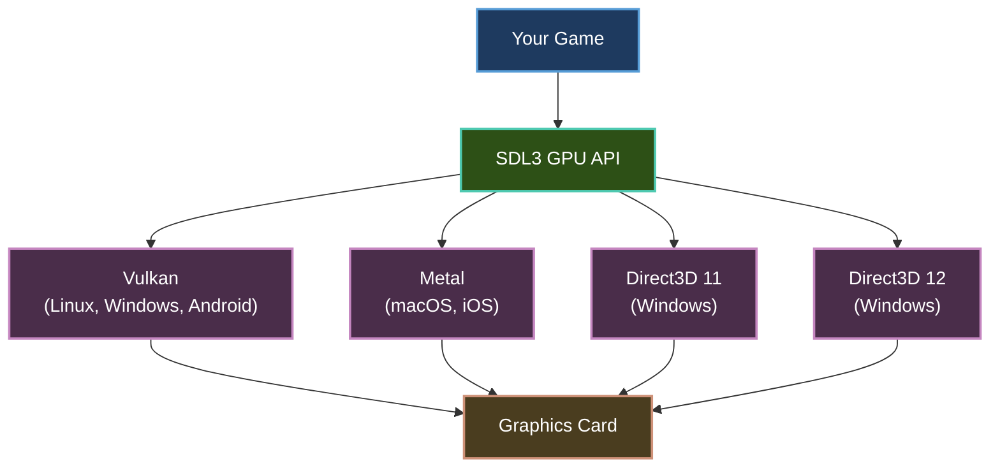
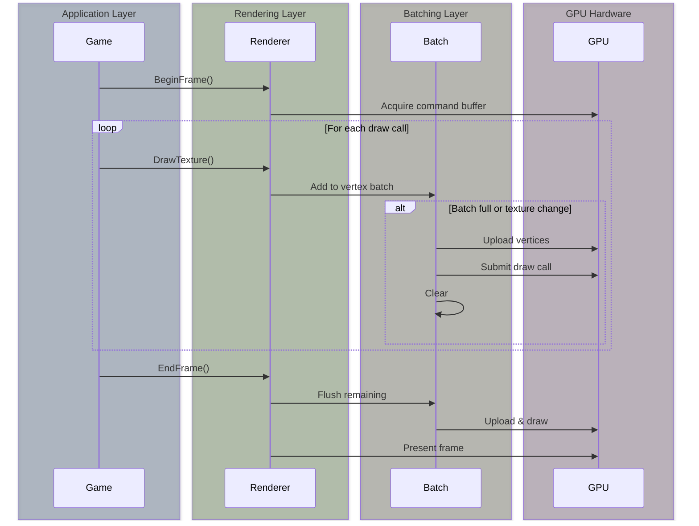

# SDL3 GPU Renderer

The SDL3 GPU renderer provides modern, shader-based rendering with automatic graphics API selection across platforms.

## Overview

**SDL3GPURenderer** is Brine2D's high-performance renderer using SDL3's GPU API. It supports Vulkan, Metal, DirectX 11, and DirectX 12 for hardware-accelerated 2D rendering.

**Key Features:**

- **Modern GPU APIs** - Vulkan, Metal, D3D11, D3D12
- **Shader-based rendering** - Custom rendering pipeline
- **High-performance batching** - 10,000+ vertices per frame
- **Cross-platform** - Automatic API selection
- **Future-proof** - Foundation for advanced features



---

## Prerequisites

- SDL3 (included via NuGet)
- Graphics card with GPU API support:
  - **Vulkan** 1.0+
  - **Metal** (macOS 10.15+, iOS 13+)
  - **Direct3D 11** (Windows Vista+)
  - **Direct3D 12** (Windows 10+)

---

## Quick Start

### Basic Setup

```csharp Program.cs
using Brine2D.Hosting;
using Brine2D.Rendering.SDL;

var builder = GameApplication.CreateBuilder(args);

// Configure GPU renderer (default in v0.7.0)
builder.Services.AddSDL3Rendering(options =>
{
    options.Backend = GraphicsBackend.GPU;  // Explicitly set GPU renderer
    options.WindowWidth = 1280;
    options.WindowHeight = 720;
    options.WindowTitle = "GPU Renderer Demo";
});

// Register scenes
builder.Services.AddScene<GameScene>();

var game = builder.Build();
await game.RunAsync<GameScene>();
```

### Configuration File

```json gamesettings.json
{
  "Rendering": {
    "Backend": "GPU",
    "WindowTitle": "My Game",
    "WindowWidth": 1280,
    "WindowHeight": 720,
    "VSync": true,
    "Resizable": true,
    "Fullscreen": false,
    "PreferredGPUDriver": null
  }
}
```

```csharp Program.cs
builder.Services.AddSDL3Rendering(options =>
{
    builder.Configuration.GetSection("Rendering").Bind(options);
});
```

---

## GPU vs Legacy Renderer

### Feature Comparison

| Feature | GPU Renderer | Legacy Renderer |
|---------|-------------|-----------------|
| **Graphics API** | Vulkan/Metal/D3D11/D3D12 | SDL_Renderer (varied) |
| **Rendering** | Shader-based | Fixed-function |
| **Performance** | High (10k+ sprites) | Moderate |
| **Batching** | Vertex batching | Basic |
| **Texture switches** | Optimized | Moderate overhead |
| **Platform support** | Modern systems | Broader compatibility |
| **Future features** | Shaders, post-processing | Limited |

### Performance Comparison

```
Sprites Rendered (60 FPS target):

Legacy Renderer:        GPU Renderer:
1,000:  ████████████    1,000:  ████████████ (same)
5,000:  ████████░░░░    5,000:  ████████████ (33% faster)
10,000: ████░░░░░░░░    10,000: ████████████ (140% faster)
        25 FPS                  60 FPS
```

**GPU Renderer excels at:**
- Large sprite counts (1,000+)
- Frequent texture switches
- Particle systems
- Dynamic scenes

**Legacy Renderer is better for:**
- Simple games (<500 sprites)
- Maximum compatibility
- Older hardware

---

## GPU API Selection

### Automatic Selection

By default, SDL3 automatically selects the best GPU API for your platform:

| Platform | Default API | Fallback |
|----------|-------------|----------|
| **Windows** | Direct3D 11 | D3D12, Vulkan |
| **macOS** | Metal | - |
| **iOS** | Metal | - |
| **Linux** | Vulkan | - |
| **Android** | Vulkan | - |

### Manual Selection

Override automatic selection with `PreferredGPUDriver`:

```csharp
builder.Services.AddSDL3Rendering(options =>
{
    options.Backend = GraphicsBackend.GPU;
    
    // Force Vulkan (cross-platform)
    options.PreferredGPUDriver = "Vulkan";
    
    // Or force Direct3D 11 (Windows)
    // options.PreferredGPUDriver = "D3D11";
    
    // Or force Metal (macOS/iOS)
    // options.PreferredGPUDriver = "Metal";
    
    // Or auto-select (recommended)
    // options.PreferredGPUDriver = null;
});
```

**Supported drivers:**
- `"Vulkan"` - Cross-platform (Windows, Linux, Android)
- `"Metal"` - Apple platforms (macOS, iOS)
- `"D3D11"` - Windows (Vista+)
- `"D3D12"` - Windows (10+)
- `null` - Auto-select (recommended)

---

## Advanced Configuration

### Performance Options

```csharp
builder.Services.AddSDL3Rendering(options =>
{
    options.Backend = GraphicsBackend.GPU;
    options.VSync = true;  // Lock to display refresh rate
    options.Resizable = true;  // Allow window resizing
    options.Fullscreen = false;
    
    // GPU-specific (optional)
    options.PreferredGPUDriver = null;  // Auto-select
});
```

### Window Events

The GPU renderer automatically handles window events:

```csharp
using Brine2D.Core;
using Brine2D.SDL.Common.Events;

public class GameScene : Scene
{
    private readonly EventBus? _eventBus;
    
    public GameScene(EventBus? eventBus, ILogger<GameScene> logger) : base(logger)
    {
        _eventBus = eventBus;
    }
    
    protected override void OnInitialize()
    {
        // Subscribe to window resize
        _eventBus?.Subscribe<WindowResizedEvent>(OnWindowResized);
    }
    
    private void OnWindowResized(WindowResizedEvent evt)
    {
        Logger.LogInformation("Window resized to {Width}x{Height}", 
            evt.Width, evt.Height);
        
        // Viewport is automatically updated by renderer
        // Update your UI layout, camera, etc.
    }
    
    protected override void OnDispose()
    {
        _eventBus?.Unsubscribe<WindowResizedEvent>(OnWindowResized);
    }
}
```

---

## Rendering Pipeline

### How GPU Rendering Works



### Vertex Batching

The GPU renderer batches draw calls for efficiency:

```csharp
// Each of these is batched together (same texture)
for (int i = 0; i < 1000; i++)
{
    _renderer.DrawTexture(_playerTexture, x, y);
}
// Single GPU draw call for all 1,000 sprites!

// Different texture = new batch
_renderer.DrawTexture(_enemyTexture, x, y);
// Flushes previous batch, starts new one
```

**Performance tip:** Group sprites by texture to minimize batch breaks.

---

## Texture Management

### GPU Memory

Textures are stored in GPU memory (VRAM):

```csharp
protected override async Task OnLoadAsync(CancellationToken ct)
{
    // Allocates GPU memory
    _texture = await _textureLoader.LoadTextureAsync(
        "assets/player.png",
        TextureScaleMode.Nearest,
        ct);
    
    Logger.LogInformation("Texture in GPU memory: {Width}x{Height}", 
        _texture.Width, _texture.Height);
}

protected override Task OnUnloadAsync(CancellationToken ct)
{
    // IMPORTANT: Free GPU memory!
    if (_texture != null)
    {
        _textureLoader.UnloadTexture(_texture);
    }
    
    return Task.CompletedTask;
}
```

### Texture Formats

GPU renderer supports:

| Format | Alpha | Compression | Best For |
|--------|-------|-------------|----------|
| **PNG** | Yes | Lossless | Sprites, UI |
| **JPG** | No | Lossy | Backgrounds |
| **BMP** | No | None | Development |

All formats are converted to GPU-compatible format internally.

---

## Performance Tips

### 1. Batch Sprites by Texture

```csharp
// ✅ Good - batched together
foreach (var enemy in _enemies)
{
    _renderer.DrawTexture(_enemyTexture, enemy.X, enemy.Y);
}

foreach (var coin in _coins)
{
    _renderer.DrawTexture(_coinTexture, coin.X, coin.Y);
}

// ❌ Bad - alternating textures breaks batching
foreach (var entity in _allEntities)
{
    _renderer.DrawTexture(entity.Texture, entity.X, entity.Y);
    // Many texture switches = many draw calls!
}
```

### 2. Use Sprite Sheets

```csharp
// ✅ One texture, multiple sprites = single batch
_renderer.DrawTexture(_spriteSheet, 0, 0, 32, 32, x, y, 32, 32);
_renderer.DrawTexture(_spriteSheet, 32, 0, 32, 32, x2, y2, 32, 32);
_renderer.DrawTexture(_spriteSheet, 64, 0, 32, 32, x3, y3, 32, 32);
// All batched together!

// ❌ Individual textures = multiple batches
_renderer.DrawTexture(_sprite1, x, y);
_renderer.DrawTexture(_sprite2, x2, y2);
_renderer.DrawTexture(_sprite3, x3, y3);
// Each might be a separate draw call
```

### 3. Minimize State Changes

```csharp
// State changes flush the current batch:
// - Texture change
// - Blend mode change (future feature)
// - Shader change (future feature)

// ✅ Group by state
DrawAllEnemies();    // Same texture
DrawAllCoins();      // Same texture
DrawAllBullets();    // Same texture

// ❌ Interleaved drawing
DrawEnemy();
DrawCoin();
DrawBullet();  // Constant texture switching!
```

### 4. Preload Textures

```csharp
protected override async Task OnLoadAsync(CancellationToken ct)
{
    // Load all textures upfront
    _playerTexture = await _textureLoader.LoadTextureAsync("assets/player.png", TextureScaleMode.Nearest, ct);
    _enemyTexture = await _textureLoader.LoadTextureAsync("assets/enemy.png", TextureScaleMode.Nearest, ct);
    _coinTexture = await _textureLoader.LoadTextureAsync("assets/coin.png", TextureScaleMode.Nearest, ct);
    
    // NOT during gameplay!
}
```

---

## Debugging

### Check Active GPU API

```csharp
public class GameScene : Scene
{
    private readonly IRenderer _renderer;
    
    protected override void OnInitialize()
    {
        // Log renderer info
        if (_renderer is SDL3GPURenderer gpuRenderer)
        {
            Logger.LogInformation("Using GPU renderer");
            // Driver name logged during initialization
        }
        else
        {
            Logger.LogInformation("Using Legacy renderer");
        }
    }
}
```

Check console output for:

```sh
[INF] GPU renderer initialized with driver: Vulkan
```

### Performance Monitoring

```csharp
using Brine2D.Rendering.Performance;

public class GameScene : Scene
{
    private readonly PerformanceOverlay _perfOverlay;
    
    protected override void OnRender(GameTime gameTime)
    {
        _renderer.Clear(Color.Black);
        _renderer.BeginFrame();
        
        // Your rendering...
        
        // Show performance stats
        _perfOverlay.Render(gameTime);
        
        _renderer.EndFrame();
    }
}
```

Monitor:
- FPS (frames per second)
- Frame time (ms per frame)
- Sprite count
- Draw calls (fewer = better)

---

## Troubleshooting

### Problem: Black Screen

**Symptoms:**
- Window opens but displays nothing
- No error messages

**Possible Causes:**

1. **GPU driver not found**
   ```csharp
   // Check logs for:
   [ERR] Failed to create GPU device
   ```
   
   **Solution:** Update graphics drivers or use Legacy renderer:
   ```csharp
   options.Backend = GraphicsBackend.LegacyRenderer;
   ```

2. **Shaders failed to compile**
   ```csharp
   [ERR] Failed to load default shaders
   ```
   
   **Solution:** Check GPU API support, update drivers

3. **Texture format issue**
   ```csharp
   [WARN] Failed to create texture
   ```
   
   **Solution:** Use PNG format, check file exists

---

### Problem: Poor Performance

**Symptoms:**
- Low FPS despite GPU renderer
- Frame drops

**Solutions:**

1. **Check draw calls**
   ```csharp
   // Add logging
   Logger.LogDebug("Drawing {Count} sprites", spriteCount);
   ```
   
   If many texture switches → use sprite sheets

2. **VSync disabled**
   ```json
   {
     "Rendering": {
       "VSync": true  // Re-enable
     }
   }
   ```

3. **Too many vertices**
   ```csharp
   // Batch limit: 10,000 vertices per frame
   // Each sprite = 6 vertices (2 triangles)
   // Limit: ~1,666 sprites per batch
   ```
   
   Consider culling off-screen sprites

---

### Problem: Textures Not Loading

**Symptoms:**
- `FileNotFoundException`
- Textures appear as white/black rectangles

**Solutions:**

1. **Check file path**
   ```csharp
   // ✅ Correct - relative path
   "assets/player.png"
   
   // ❌ Wrong - absolute path
   "C:/Game/assets/player.png"
   ```

2. **Verify `.csproj`**
   ```xml
   <ItemGroup>
     <None Update="assets\**\*">
       <CopyToOutputDirectory>PreserveNewest</CopyToOutputDirectory>
     </None>
   </ItemGroup>
   ```

3. **Check format support**
   - Use PNG (recommended)
   - Avoid exotic formats

---

### Problem: Window Resize Issues

**Symptoms:**
- Graphics stretched/distorted on resize
- Black bars appear

**Solution:**

```csharp
using Brine2D.SDL.Common.Events;

protected override void OnInitialize()
{
    // Subscribe to resize events
    _eventBus?.Subscribe<WindowResizedEvent>(OnWindowResized);
}

private void OnWindowResized(WindowResizedEvent evt)
{
    // Update camera viewport
    if (_camera != null)
    {
        _camera.ViewportWidth = evt.Width;
        _camera.ViewportHeight = evt.Height;
    }
    
    // Reposition UI
    UpdateUILayout(evt.Width, evt.Height);
}
```

---

## Platform-Specific Notes

### Windows

**Supported APIs:**
- Direct3D 11 (default, Vista+)
- Direct3D 12 (Windows 10+)
- Vulkan (if driver installed)

**Recommendations:**
- D3D11 for broadest compatibility
- D3D12 for Windows 10+ optimization
- Vulkan for cross-platform development

### macOS / iOS

**Supported API:**
- Metal (only option)

**Requirements:**
- macOS 10.15+ (Catalina)
- iOS 13+

**Notes:**
- `PreferredGPUDriver` ignored (Metal always used)
- Excellent performance on Apple hardware

### Linux

**Supported API:**
- Vulkan (only option)

**Requirements:**
- Vulkan-capable GPU
- Vulkan drivers installed

**Installation:**
```bash
# Ubuntu/Debian
sudo apt install vulkan-tools libvulkan1 mesa-vulkan-drivers

# Fedora
sudo dnf install vulkan-tools vulkan-loader mesa-vulkan-drivers

# Arch
sudo pacman -S vulkan-tools vulkan-icd-loader
```

### Android

**Supported API:**
- Vulkan (Android 7.0+)

**Requirements:**
- Android 7.0+ (API 24)
- Vulkan-capable device

---

## Migration from Legacy Renderer

### Simple Migration

No code changes needed! Just update configuration:

```json gamesettings.json
{
  "Rendering": {
    "Backend": "GPU"  // Changed from "LegacyRenderer"
  }
}
```

### Testing Checklist

- [ ] Window opens correctly
- [ ] Textures display properly
- [ ] Sprites render at correct positions
- [ ] Text rendering works
- [ ] Primitives (rectangles, circles) draw correctly
- [ ] Window resizing works
- [ ] Performance is acceptable
- [ ] No GPU driver errors in logs

### Rollback Plan

If issues occur, revert to Legacy renderer:

```json
{
  "Rendering": {
    "Backend": "LegacyRenderer"
  }
}
```

---

## Future Features

The GPU renderer enables upcoming features:

- **Custom shaders** - User-defined rendering effects
- **Post-processing** - Screen-space effects
- **Render-to-texture** - Off-screen rendering
- **Instanced rendering** - Even faster batching
- **Compute shaders** - GPU-accelerated game logic

---

## Best Practices

### DO

1. **Use GPU renderer by default**
   ```csharp
   options.Backend = GraphicsBackend.GPU;
   ```

2. **Batch by texture**
   ```csharp
   DrawAllSprites(_texture1);
   DrawAllSprites(_texture2);
   ```

3. **Use sprite sheets**
   ```csharp
   // One texture, many sprites
   ```

4. **Unload textures**
   ```csharp
   protected override Task OnUnloadAsync(CancellationToken ct)
   {
       _textureLoader.UnloadTexture(_texture);
       return Task.CompletedTask;
   }
   ```

5. **Handle window events**
   ```csharp
   _eventBus?.Subscribe<WindowResizedEvent>(OnResize);
   ```

### DON'T

1. **Don't mix renderers**
   ```csharp
   // ❌ Pick one backend
   options.Backend = GraphicsBackend.GPU;  // Use this
   ```

2. **Don't ignore GPU errors**
   ```csharp
   // Check logs for GPU initialization errors
   ```

3. **Don't use Legacy renderer without reason**
   ```csharp
   // GPU renderer is faster for most games
   ```

4. **Don't alternate textures unnecessarily**
   ```csharp
   // ❌ Breaks batching
   DrawSprite(_texture1);
   DrawSprite(_texture2);
   DrawSprite(_texture1);  // Texture switch!
   ```

---

## Summary

| Aspect | Details |
|--------|---------|
| **Purpose** | High-performance, modern rendering |
| **APIs** | Vulkan, Metal, D3D11, D3D12 |
| **Performance** | 10,000+ sprites at 60 FPS |
| **Configuration** | `Backend = GraphicsBackend.GPU` |
| **Platform** | Windows, macOS, Linux, iOS, Android |
| **Best For** | Games with 1,000+ sprites, particles |
| **Compatibility** | Modern systems (2015+) |

---

## Next Steps

- **[Sprites & Textures](sprites.md)** - Load and draw sprites
- **[Primitives](primitives.md)** - Draw shapes
- **[Cameras](cameras.md)** - Viewport control
- **[Performance Optimization](../performance/optimization.md)** - Maximize FPS

---

**Ready for high-performance rendering?** Start with [Sprites & Textures](sprites.md)!