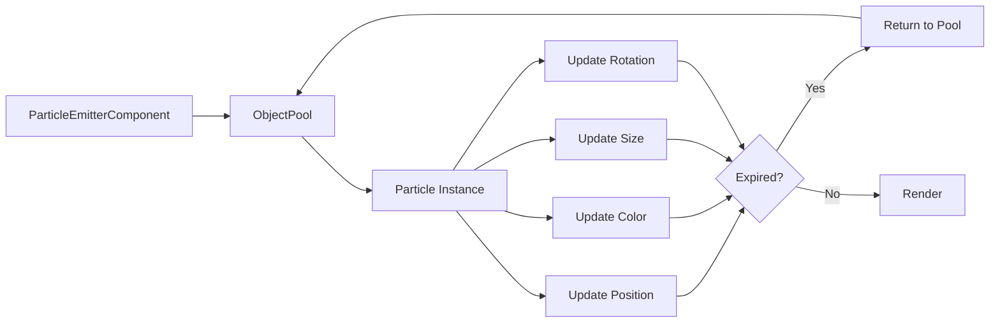

# Particle System

Create fire, explosions, smoke, and other visual effects with Brine2D's high-performance particle system featuring textures, rotation, trails, blend modes, and automatic object pooling.

## Overview

Brine2D's particle system uses object pooling to render thousands of particles without allocating memory. Particles are reused from a pool, ensuring smooth performance even with complex effects.

**New in v0.8.0-beta:**
- Particle textures (custom sprite textures)
- Rotation support (start, end, rotation speed)
- Trail effects (motion trails behind particles)
- Blend modes (additive, alpha, none)
- 7 emitter shapes (point, circle, ring, box, cone, line, burst)



---

## Quick Start

### Basic Particle Emitter

Create a simple particle effect:

```csharp
using Brine2D.ECS;
using Brine2D.ECS.Components;
using Brine2D.Rendering.ECS;
using System.Numerics;

public class GameScene : Scene
{
    private readonly IEntityWorld _world;
    
    protected override void OnInitialize()
    {
        // Create entity with particle emitter
        var fireEffect = _world.CreateEntity("Fire");
        
        var transform = fireEffect.AddComponent<TransformComponent>();
        transform.Position = new Vector2(400, 300);
        
        var emitter = fireEffect.AddComponent<ParticleEmitterComponent>();
        emitter.IsEmitting = true;
        emitter.EmissionRate = 50f; // 50 particles per second
        emitter.MaxParticles = 200;
        emitter.ParticleLifetime = 2f; // Seconds
        
        // Appearance
        emitter.StartColor = new Color(255, 200, 0, 255); // Bright yellow
        emitter.EndColor = new Color(255, 50, 0, 0); // Dark red, transparent
        emitter.StartSize = 8f;
        emitter.EndSize = 2f;
        
        // Physics
        emitter.InitialVelocity = new Vector2(0, -50); // Upward
        emitter.VelocitySpread = 30f; // Random angle variance
        emitter.Gravity = new Vector2(0, 100); // Pull down
    }
}
```

That's it! The `ParticleSystem` will automatically update and render particles.

---

## New Features (v0.8.0)

### Particle Textures

Use custom textures instead of solid circles:

```csharp
var emitter = entity.AddComponent<ParticleEmitterComponent>();

// Use a texture for particles
emitter.TexturePath = "assets/particles/fire.png";
emitter.TextureScaleMode = TextureScaleMode.Nearest; // For pixel art

// Texture combines with color tint
emitter.StartColor = new Color(255, 255, 255, 255); // White = no tint
emitter.EndColor = new Color(255, 100, 0, 0); // Orange fade
```

**Best Practices:**
- Keep textures small (16x16 to 64x64 pixels)
- Use semi-transparent textures for blending
- White textures work best for color tinting
- Use texture atlasing for multiple particle types

### Rotation

Rotate particles over their lifetime:

```csharp
var emitter = entity.AddComponent<ParticleEmitterComponent>();

// Rotation angles (in radians)
emitter.StartRotation = 0f; // Starting angle
emitter.EndRotation = MathF.PI * 2; // End angle (full rotation)

// OR use rotation speed (overrides lerp)
emitter.RotationSpeed = 2f; // Radians per second (constant spin)

// Random rotation variance
emitter.RotationSpread = MathF.PI / 4; // ±45 degrees initial rotation
```

**Rotation Modes:**

```csharp
// Lerp rotation (smooth start → end)
emitter.StartRotation = 0f;
emitter.EndRotation = MathF.PI; // 180 degree rotation over lifetime
emitter.RotationSpeed = 0f; // Disabled

// Constant spin
emitter.StartRotation = 0f;
emitter.RotationSpeed = 3f; // Spin at 3 rad/s regardless of lifetime

// Random initial rotation
emitter.StartRotation = 0f;
emitter.RotationSpread = MathF.PI; // Random ±180 degrees
emitter.RotationSpeed = 1f; // All spin at same speed
```

### Trail Effects

Add motion trails behind particles:

```csharp
var emitter = entity.AddComponent<ParticleEmitterComponent>();

// Enable trails
emitter.TrailEnabled = true;
emitter.TrailLength = 10; // Number of trail segments
emitter.TrailColor = new Color(255, 100, 0, 128); // Semi-transparent orange

// Trail particles inherit main particle properties
// but fade based on trail position
```

**Trail Configuration:**

```csharp
// Short, faint trails (subtle)
emitter.TrailEnabled = true;
emitter.TrailLength = 5;
emitter.TrailColor = new Color(255, 255, 255, 50); // Very transparent

// Long, visible trails (dramatic)
emitter.TrailEnabled = true;
emitter.TrailLength = 15;
emitter.TrailColor = new Color(255, 100, 0, 200); // More opaque

// Colored trails (different from particle)
emitter.StartColor = Color.White; // White particles
emitter.TrailColor = new Color(100, 150, 255, 150); // Blue trails
```

### Blend Modes

Control how particles blend with the background:

```csharp
var emitter = entity.AddComponent<ParticleEmitterComponent>();

// Additive blending (fire, explosions, energy)
emitter.BlendMode = BlendMode.Additive;

// Alpha blending (smoke, fog, default)
emitter.BlendMode = BlendMode.AlphaBlend;

// No blending (solid particles)
emitter.BlendMode = BlendMode.None;
```

**Blend Mode Effects:**

| Blend Mode | Visual Effect | Best For |
|------------|---------------|----------|
| `Additive` | Bright, glowing overlaps | Fire, explosions, energy, magic |
| `AlphaBlend` | Standard transparency | Smoke, fog, water, dust |
| `None` | Solid, opaque | Solid objects, debris, sparks |

### Emitter Shapes

Choose from 7 emitter shapes for different spawn patterns:

```csharp
var emitter = entity.AddComponent<ParticleEmitterComponent>();

// Point emitter (single point)
emitter.EmitterShape = EmitterShape.Point;

// Circle emitter (spawn anywhere in circle)
emitter.EmitterShape = EmitterShape.Circle;
emitter.SpawnRadius = 20f;

// Ring emitter (spawn on circle edge)
emitter.EmitterShape = EmitterShape.Ring;
emitter.SpawnRadius = 30f;

// Box emitter (rectangular spawn area)
emitter.EmitterShape = EmitterShape.Box;
emitter.SpawnRadius = 50f; // Half-width/height

// Cone emitter (directional spray)
emitter.EmitterShape = EmitterShape.Cone;
emitter.ConeAngle = MathF.PI / 4; // 45 degree cone

// Line emitter (spawn along line)
emitter.EmitterShape = EmitterShape.Line;
emitter.LineLength = 100f;

// Burst emitter (radial explosion)
emitter.EmitterShape = EmitterShape.Burst;
emitter.BurstCount = 50; // Particles per burst
```

---

## Particle Properties

### Emission Properties

Control how particles are spawned:

```csharp
var emitter = entity.AddComponent<ParticleEmitterComponent>();

// Basic emission
emitter.IsEmitting = true; // Toggle emission on/off
emitter.EmissionRate = 50f; // Particles per second
emitter.MaxParticles = 200; // Pool size (max concurrent particles)
emitter.ParticleLifetime = 2f; // How long each particle lives (seconds)

// Emitter shape
emitter.EmitterShape = EmitterShape.Circle;
emitter.SpawnRadius = 10f; // Shape-specific size
```

### Visual Properties

Control particle appearance:

```csharp
// Color interpolation (start → end over lifetime)
emitter.StartColor = new Color(255, 200, 0, 255); // Bright yellow, opaque
emitter.EndColor = new Color(255, 50, 0, 0); // Dark red, transparent

// Size interpolation (start → end over lifetime)
emitter.StartSize = 8f; // pixels
emitter.EndSize = 2f; // Shrink over time

// Texture (new in v0.8.0)
emitter.TexturePath = "assets/particles/spark.png";
emitter.TextureScaleMode = TextureScaleMode.Linear;

// Rotation (new in v0.8.0)
emitter.StartRotation = 0f;
emitter.EndRotation = MathF.PI * 2;
emitter.RotationSpeed = 2f;
emitter.RotationSpread = MathF.PI / 4;

// Trails (new in v0.8.0)
emitter.TrailEnabled = true;
emitter.TrailLength = 10;
emitter.TrailColor = new Color(255, 100, 0, 128);

// Blend mode (new in v0.8.0)
emitter.BlendMode = BlendMode.Additive;
```

### Physics Properties

Control particle movement:

```csharp
// Initial velocity (pixels per second)
emitter.InitialVelocity = new Vector2(0, -100); // Upward

// Velocity spread (random angle variance in degrees)
emitter.VelocitySpread = 45f; // ±45° cone

// Gravity (acceleration, pixels per second²)
emitter.Gravity = new Vector2(0, 200); // Pull down

// No gravity (floating particles)
emitter.Gravity = Vector2.Zero;
```

---

## Preset Effects

### Fire Effect (Enhanced)

```csharp
var fireEmitter = entity.AddComponent<ParticleEmitterComponent>();

// Emission
fireEmitter.IsEmitting = true;
fireEmitter.EmissionRate = 100f;
fireEmitter.MaxParticles = 200;
fireEmitter.ParticleLifetime = 1.5f;
fireEmitter.EmitterShape = EmitterShape.Circle;
fireEmitter.SpawnRadius = 15f;

// Appearance
fireEmitter.TexturePath = "assets/particles/fire.png"; // ← NEW
fireEmitter.BlendMode = BlendMode.Additive; // ← NEW
fireEmitter.StartColor = new Color(255, 200, 0, 255);
fireEmitter.EndColor = new Color(255, 50, 0, 0);
fireEmitter.StartSize = 8f;
fireEmitter.EndSize = 2f;

// Rotation (NEW)
fireEmitter.StartRotation = 0f;
fireEmitter.RotationSpeed = 2f;
fireEmitter.RotationSpread = MathF.PI / 2;

// Trails (NEW)
fireEmitter.TrailEnabled = true;
fireEmitter.TrailLength = 5;
fireEmitter.TrailColor = new Color(255, 100, 0, 100);

// Physics
fireEmitter.InitialVelocity = new Vector2(0, -100);
fireEmitter.VelocitySpread = 30f;
fireEmitter.Gravity = new Vector2(0, -20);
```

### Explosion Effect (Enhanced)

```csharp
var explosionEmitter = entity.AddComponent<ParticleEmitterComponent>();

// Emission (burst)
explosionEmitter.EmitterShape = EmitterShape.Burst; // ← NEW
explosionEmitter.BurstCount = 100; // ← NEW
explosionEmitter.IsEmitting = false;
explosionEmitter.MaxParticles = 100;
explosionEmitter.ParticleLifetime = 1f;

// Appearance
explosionEmitter.TexturePath = "assets/particles/explosion.png"; // ← NEW
explosionEmitter.BlendMode = BlendMode.Additive; // ← NEW
explosionEmitter.StartColor = new Color(255, 255, 255, 255);
explosionEmitter.EndColor = new Color(255, 100, 0, 0);
explosionEmitter.StartSize = 12f;
explosionEmitter.EndSize = 2f;

// Rotation (NEW)
explosionEmitter.StartRotation = 0f;
explosionEmitter.RotationSpeed = 5f;

// Physics
explosionEmitter.InitialVelocity = new Vector2(0, -200);
explosionEmitter.VelocitySpread = 180f;
explosionEmitter.Gravity = new Vector2(0, 500);

// Trigger explosion
explosionEmitter.EmitBurst(100);
```

### Smoke Effect (Enhanced)

```csharp
var smokeEmitter = entity.AddComponent<ParticleEmitterComponent>();

// Emission
smokeEmitter.IsEmitting = true;
smokeEmitter.EmissionRate = 20f;
smokeEmitter.MaxParticles = 100;
smokeEmitter.ParticleLifetime = 3f;
smokeEmitter.EmitterShape = EmitterShape.Circle; // ← NEW
smokeEmitter.SpawnRadius = 5f;

// Appearance
smokeEmitter.TexturePath = "assets/particles/smoke.png"; // ← NEW
smokeEmitter.BlendMode = BlendMode.AlphaBlend; // ← NEW
smokeEmitter.StartColor = new Color(60, 60, 60, 200);
smokeEmitter.EndColor = new Color(150, 150, 150, 0);
smokeEmitter.StartSize = 4f;
smokeEmitter.EndSize = 12f;

// Rotation (NEW)
smokeEmitter.StartRotation = 0f;
smokeEmitter.RotationSpeed = 0.5f;
smokeEmitter.RotationSpread = MathF.PI;

// Physics
smokeEmitter.InitialVelocity = new Vector2(0, -30);
smokeEmitter.VelocitySpread = 20f;
smokeEmitter.Gravity = new Vector2(0, -10);
```

### Magic Spell Effect (NEW)

```csharp
var spellEmitter = entity.AddComponent<ParticleEmitterComponent>();

// Emission
spellEmitter.EmitterShape = EmitterShape.Ring; // ← Ring shape
spellEmitter.SpawnRadius = 40f;
spellEmitter.IsEmitting = true;
spellEmitter.EmissionRate = 60f;
spellEmitter.MaxParticles = 200;
spellEmitter.ParticleLifetime = 2f;

// Appearance
spellEmitter.TexturePath = "assets/particles/magic.png";
spellEmitter.BlendMode = BlendMode.Additive; // Glowing effect
spellEmitter.StartColor = new Color(150, 100, 255, 255); // Purple
spellEmitter.EndColor = new Color(150, 100, 255, 0);
spellEmitter.StartSize = 6f;
spellEmitter.EndSize = 1f;

// Rotation
spellEmitter.StartRotation = 0f;
spellEmitter.RotationSpeed = 3f;

// Trails
spellEmitter.TrailEnabled = true;
spellEmitter.TrailLength = 8;
spellEmitter.TrailColor = new Color(150, 100, 255, 100);

// Physics (spiral inward)
spellEmitter.InitialVelocity = new Vector2(-50, 0);
spellEmitter.VelocitySpread = 10f;
spellEmitter.Gravity = Vector2.Zero;
```

### Projectile Trail (NEW)

```csharp
// Attach to moving projectile
var trailEmitter = projectile.AddComponent<ParticleEmitterComponent>();

// Emission
trailEmitter.EmitterShape = EmitterShape.Point;
trailEmitter.IsEmitting = true;
trailEmitter.EmissionRate = 100f;
trailEmitter.MaxParticles = 200;
trailEmitter.ParticleLifetime = 0.5f;

// Appearance
trailEmitter.TexturePath = "assets/particles/spark.png";
trailEmitter.BlendMode = BlendMode.Additive;
trailEmitter.StartColor = new Color(100, 200, 255, 255);
trailEmitter.EndColor = new Color(100, 200, 255, 0);
trailEmitter.StartSize = 6f;
trailEmitter.EndSize = 1f;

// Rotation
trailEmitter.RotationSpeed = 10f;

// Trails (trail of a trail!)
trailEmitter.TrailEnabled = true;
trailEmitter.TrailLength = 5;
trailEmitter.TrailColor = new Color(100, 200, 255, 80);

// Physics (no velocity, stay where spawned)
trailEmitter.InitialVelocity = Vector2.Zero;
trailEmitter.Gravity = Vector2.Zero;
```

### Fountain Effect (NEW)

```csharp
var fountainEmitter = entity.AddComponent<ParticleEmitterComponent>();

// Emission
fountainEmitter.EmitterShape = EmitterShape.Cone; // ← Cone shape
fountainEmitter.ConeAngle = MathF.PI / 6; // 30 degree cone
fountainEmitter.IsEmitting = true;
fountainEmitter.EmissionRate = 80f;
fountainEmitter.MaxParticles = 300;
fountainEmitter.ParticleLifetime = 2.5f;

// Appearance
fountainEmitter.TexturePath = "assets/particles/water.png";
fountainEmitter.BlendMode = BlendMode.AlphaBlend;
fountainEmitter.StartColor = new Color(100, 150, 255, 200);
fountainEmitter.EndColor = new Color(100, 150, 255, 0);
fountainEmitter.StartSize = 4f;
fountainEmitter.EndSize = 2f;

// Physics (upward spray)
fountainEmitter.InitialVelocity = new Vector2(0, -300);
fountainEmitter.VelocitySpread = 15f;
fountainEmitter.Gravity = new Vector2(0, 500); // Strong gravity
```

---

## Advanced Techniques

### Layered Particles

Combine multiple emitters for complex effects:

```csharp
public void CreateExplosion(Vector2 position)
{
    var explosionEntity = _world.CreateEntity("Explosion");
    var transform = explosionEntity.AddComponent<TransformComponent>();
    transform.Position = position;
    
    // Layer 1: Bright flash
    var flashEmitter = explosionEntity.AddComponent<ParticleEmitterComponent>();
    flashEmitter.EmitterShape = EmitterShape.Burst;
    flashEmitter.BurstCount = 20;
    flashEmitter.TexturePath = "assets/particles/flash.png";
    flashEmitter.BlendMode = BlendMode.Additive;
    flashEmitter.StartColor = Color.White;
    flashEmitter.EndColor = new Color(255, 255, 255, 0);
    flashEmitter.ParticleLifetime = 0.2f;
    flashEmitter.StartSize = 20f;
    flashEmitter.EndSize = 40f;
    
    // Layer 2: Fire burst
    var fireEmitter = CreateChildEmitter(explosionEntity);
    fireEmitter.EmitterShape = EmitterShape.Burst;
    fireEmitter.BurstCount = 50;
    fireEmitter.BlendMode = BlendMode.Additive;
    fireEmitter.StartColor = new Color(255, 200, 0, 255);
    fireEmitter.EndColor = new Color(255, 50, 0, 0);
    fireEmitter.ParticleLifetime = 1f;
    fireEmitter.InitialVelocity = new Vector2(0, -200);
    fireEmitter.VelocitySpread = 180f;
    
    // Layer 3: Smoke aftermath
    var smokeEmitter = CreateChildEmitter(explosionEntity);
    smokeEmitter.EmissionRate = 30f;
    smokeEmitter.BlendMode = BlendMode.AlphaBlend;
    smokeEmitter.StartColor = new Color(60, 60, 60, 200);
    smokeEmitter.EndColor = new Color(120, 120, 120, 0);
    smokeEmitter.ParticleLifetime = 3f;
    smokeEmitter.StartSize = 4f;
    smokeEmitter.EndSize = 20f;
    
    // Trigger effects
    flashEmitter.EmitBurst(20);
    fireEmitter.EmitBurst(50);
}
```

### Dynamic Emitter Movement

Create moving particle sources:

```csharp
public class MovingEmitterSystem : IUpdateSystem
{
    public void Update(GameTime gameTime)
    {
        var emitters = _world.GetEntitiesWithComponent<ParticleEmitterComponent>();
        
        foreach (var entity in emitters)
        {
            var transform = entity.GetComponent<TransformComponent>();
            var emitter = entity.GetComponent<ParticleEmitterComponent>();
            
            // Move in a circle
            var time = (float)gameTime.TotalTime * 2f;
            transform.Position = new Vector2(
                640 + MathF.Cos(time) * 200,
                360 + MathF.Sin(time) * 200
            );
        }
    }
}
```

### Conditional Emission

Control emission based on game state:

```csharp
public class ConditionalParticleSystem : IUpdateSystem
{
    public void Update(GameTime gameTime)
    {
        var player = GetPlayer();
        var emitter = player.GetComponent<ParticleEmitterComponent>();
        var velocity = player.GetComponent<VelocityComponent>();
        
        // Only emit when moving fast
        var speed = velocity.Velocity.Length();
        emitter.IsEmitting = speed > 100f;
        
        // Adjust emission rate based on speed
        emitter.EmissionRate = speed * 0.5f; // More particles = faster movement
    }
}
```

---

## Performance

### Object Pooling

Particles use object pooling automatically - no GC allocations!

```csharp
// Under the hood (automatic):
public class ParticleEmitterComponent
{
    private readonly ObjectPool<Particle> _pool;
    
    private void EmitParticle()
    {
        var particle = _pool.Get(); // ✅ Reuse from pool
        // Configure particle...
    }
    
    private void KillParticle(Particle particle)
    {
        _pool.Return(particle); // ✅ Return to pool
    }
}
```

### Performance Tips

```csharp
// ✅ GOOD: Reasonable particle counts
emitter.MaxParticles = 200; // ~200 particles = negligible cost

// ⚠️ ACCEPTABLE: Many particles
emitter.MaxParticles = 1000; // ~1000 particles = minor cost

// ❌ BAD: Too many particles
emitter.MaxParticles = 10000; // > 10k particles = significant cost

// ✅ SOLUTION: Use multiple smaller emitters
for (int i = 0; i < 10; i++)
{
    var smallEmitter = CreateEmitter();
    smallEmitter.MaxParticles = 100; // 10 x 100 = 1000 total
}
```

**Performance Guidelines:**
- **< 500 particles per emitter** - Excellent performance
- **500-1000 particles** - Good performance
- **> 1000 particles** - Consider splitting into multiple emitters
- **Textures** - Use texture atlasing for multiple particle types
- **Trails** - Trails multiply particle count (10 trail length = 10x particles)
- **Blend modes** - Additive blending has similar cost to alpha blending

### Texture Optimization

```csharp
// ✅ GOOD: Pack particle textures into atlas
var atlas = await AtlasBuilder.BuildAtlasAsync(
    _renderer,
    _textureLoader,
    new[] {
        "assets/particles/fire.png",
        "assets/particles/smoke.png",
        "assets/particles/spark.png"
    },
    padding: 2,
    maxSize: 1024
);

// Use atlas regions
emitter.TexturePath = "assets/particles/fire.png"; // Automatically uses atlas
```

---

## Monitoring

### Check Particle Count

```csharp
var emitter = entity.GetComponent<ParticleEmitterComponent>();

Logger.LogDebug($"Active particles: {emitter.ParticleCount}/{emitter.MaxParticles}");

if (emitter.ParticleCount >= emitter.MaxParticles)
{
    Logger.LogWarning("Particle pool exhausted! Increase MaxParticles.");
}
```

### Performance Stats

```csharp
// Enable performance monitoring
builder.Services.AddPerformanceMonitoring(options =>
{
    options.EnableOverlay = true;
});

// Press F3 in-game to toggle detailed stats
// Look for:
// - "Sprites" count (includes particles)
// - "Draw Calls" (should batch with atlasing)
// - Frame time (< 16.67ms for 60 FPS)
```

---

## Best Practices

### Do

- **Use texture atlasing** - Pack all particle textures together
- **Set reasonable MaxParticles** - Start with 200, adjust as needed
- **Use additive blending for bright effects** - Fire, explosions, energy
- **Use alpha blending for soft effects** - Smoke, fog, water
- **Enable trails sparingly** - They multiply particle count
- **Test on target hardware** - Performance varies by device

### Don't

- **Don't use massive textures** - Keep particles 16x16 to 64x64
- **Don't create too many emitters** - Prefer fewer, larger emitters
- **Don't enable trails on all particles** - Use selectively
- **Don't forget to set BlendMode** - Defaults to AlphaBlend
- **Don't use None blend mode with transparency** - Use Alpha or Additive

---

## Troubleshooting

### Particles Not Visible

**Problem:** Emitter is active but no particles appear.

**Solutions:**

```csharp
// 1. Check emission is enabled
emitter.IsEmitting = true;

// 2. Verify EmissionRate is reasonable
emitter.EmissionRate = 50f; // Not 0!

// 3. Check ParticleLifetime
emitter.ParticleLifetime = 2f; // Not too short

// 4. Verify colors have opacity
emitter.StartColor = new Color(255, 255, 255, 255); // Alpha = 255

// 5. Check blend mode
emitter.BlendMode = BlendMode.AlphaBlend; // Or Additive
```

### Textures Not Loading

**Problem:** Particles show as solid circles instead of texture.

**Solution:**

```csharp
// Verify texture path is correct
if (!File.Exists("assets/particles/fire.png"))
{
    Logger.LogError("Particle texture not found!");
}

// Check texture loaded successfully
emitter.TexturePath = "assets/particles/fire.png";

// Fallback: If no texture, particles render as circles (expected)
```

### Poor Performance

**Problem:** Frame rate drops with particles active.

**Solutions:**

```csharp
// 1. Reduce MaxParticles
emitter.MaxParticles = 200; // Instead of 2000

// 2. Reduce trail length
emitter.TrailLength = 5; // Instead of 20

// 3. Use texture atlasing
// Pack all particle textures into one atlas

// 4. Disable distant emitters
if (distance > 1000f)
{
    emitter.IsEmitting = false;
}

// 5. Check particle count
Logger.LogInfo($"Total particles: {GetTotalParticleCount()}");
```

### Trails Look Wrong

**Problem:** Trails appear disconnected or too faint.

**Solutions:**

```csharp
// 1. Increase trail opacity
emitter.TrailColor = new Color(255, 100, 0, 200); // More opaque

// 2. Increase trail length
emitter.TrailLength = 10; // More segments

// 3. Match trail color to particle
emitter.StartColor = new Color(255, 100, 0, 255);
emitter.TrailColor = new Color(255, 100, 0, 150);

// 4. Increase emission rate for continuous trails
emitter.EmissionRate = 100f; // More particles = smoother trails
```

---

## See Also

- [Texture Atlasing](texture-atlasing.md) - Pack particle textures for better performance
- [Sprites & Textures](sprites.md) - Learn about texture loading
- [ECS Systems](../ecs/systems.md#particlesystem) - ParticleSystem implementation details
- [Performance Optimization](../performance/optimization.md) - General optimization techniques

---

**Next Steps:**
- Experiment with different emitter shapes
- Try combining blend modes
- Create layered particle effects
- Add particle textures with atlasing
- Use trails for motion effects