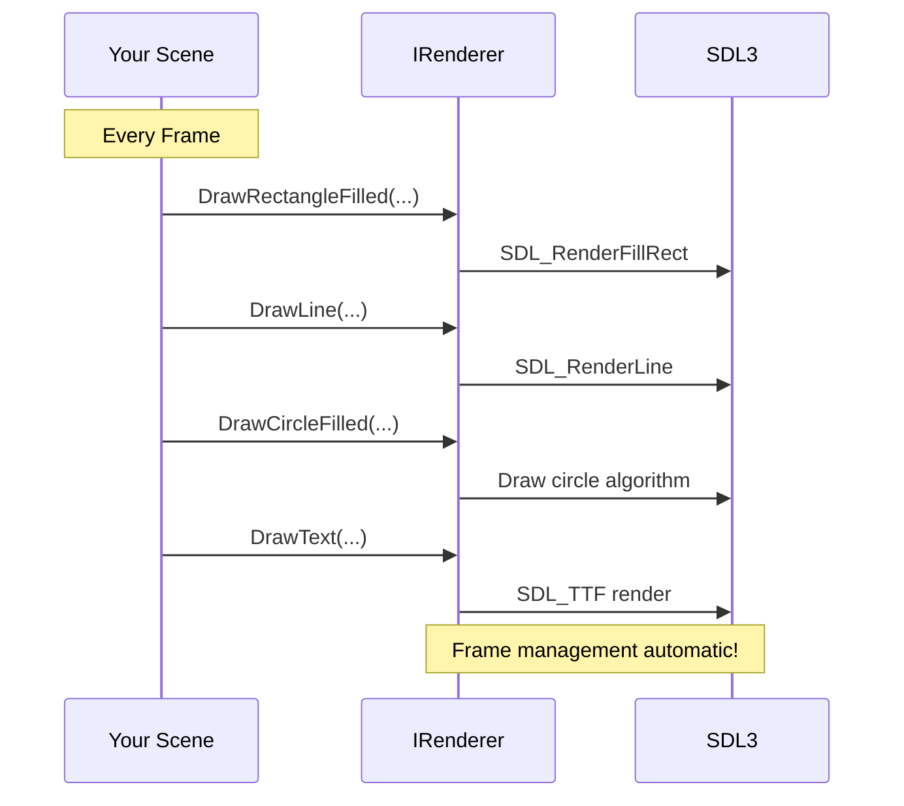

# Drawing Primitives

Master the fundamentals of rendering in Brine2D by learning to draw shapes, lines, colors, and primitives.

## Overview

Brine2D's rendering system provides simple, immediate-mode drawing APIs for 2D graphics:
- ✅ **Rectangles** - Filled and outlined rectangles
- ✅ **Circles** - Filled and outlined circles
- ✅ **Lines** - Lines with configurable thickness
- ✅ **Text** - String rendering with fonts
- ✅ **Textures** - Images and sprites (covered in [Sprites](sprites.md))



---

## Prerequisites

- ✅ [Quick Start](../../getting-started/quickstart.md) - Basic scene setup
- ✅ Basic C# knowledge

---

## Automatic Frame Management

In Brine2D, frame management happens automatically! You don't need to call `Clear()`, `BeginFrame()`, or `EndFrame()`:

```csharp
public class DrawingScene : Scene
{
    protected override void OnRender(GameTime gameTime)
    {
        // Just draw! Frame management is automatic
        _renderer.DrawRectangleFilled(100, 100, 200, 150, Color.Red);
        _renderer.DrawCircleFilled(400, 300, 50, Color.Blue);
        _renderer.DrawLine(100, 100, 300, 200, Color.Yellow, 2f);
    }
}
```

!!! tip "Manual Control Available"
    Need manual control? Set `EnableAutomaticFrameManagement = false` in your scene. See [Lifecycle Hooks](../scenes/lifecycle-hooks.md).

---

## Drawing Rectangles

### Filled Rectangle

```csharp
// DrawRectangleFilled(x, y, width, height, color)
_renderer.DrawRectangleFilled(100, 100, 50, 50, Color.Red);
```

**Parameters:**
- `x` - Left edge position
- `y` - Top edge position
- `width` - Rectangle width
- `height` - Rectangle height
- `color` - Fill color

```
Screen Coordinates:
(0,0) ───────► X
  │
  │    (100,100)
  │      ┌──────────┐
  │      │ 50x50 px │
  │      │  rect    │
  │      └──────────┘
  ▼
  Y
```

### Rectangle Outline

```csharp
// DrawRectangleOutline(x, y, width, height, color, thickness)
_renderer.DrawRectangleOutline(100, 100, 200, 150, Color.White, 2f);
```

**Thickness parameter:**
- Default: `1.0f` (1 pixel)
- Larger values = thicker lines

---

## Drawing Circles

### Filled Circle

```csharp
// DrawCircleFilled(centerX, centerY, radius, color)
_renderer.DrawCircleFilled(400, 300, 50, Color.Blue);
```

### Circle Outline

```csharp
// DrawCircleOutline(centerX, centerY, radius, color, thickness)
_renderer.DrawCircleOutline(400, 300, 50, Color.White, 2f);
```

---

## Drawing Lines

Draw lines between two points with configurable thickness:

### Basic Line

```csharp
// DrawLine(x1, y1, x2, y2, color, thickness)
_renderer.DrawLine(100, 100, 300, 200, Color.Yellow, 1f);
```

**Parameters:**
- `x1, y1` - Start point
- `x2, y2` - End point
- `color` - Line color
- `thickness` - Line thickness (default: 1.0f)

### Thick Lines

```csharp
// Thin line
_renderer.DrawLine(100, 100, 300, 100, Color.Red, 1f);

// Medium line
_renderer.DrawLine(100, 150, 300, 150, Color.Green, 3f);

// Thick line
_renderer.DrawLine(100, 200, 300, 200, Color.Blue, 5f);

// Very thick line
_renderer.DrawLine(100, 250, 300, 250, Color.Yellow, 10f);
```

### Line Patterns

**Draw a cross:**

```csharp
var centerX = 640f;
var centerY = 360f;
var size = 50f;

_renderer.DrawLine(centerX - size, centerY, centerX + size, centerY, Color.White, 2f);
_renderer.DrawLine(centerX, centerY - size, centerX, centerY + size, Color.White, 2f);
```

**Draw a box with lines:**

```csharp
float x = 100, y = 100, w = 200, h = 150;

_renderer.DrawLine(x, y, x + w, y, Color.White, 2f);         // Top
_renderer.DrawLine(x + w, y, x + w, y + h, Color.White, 2f); // Right
_renderer.DrawLine(x + w, y + h, x, y + h, Color.White, 2f); // Bottom
_renderer.DrawLine(x, y + h, x, y, Color.White, 2f);         // Left
```

**Velocity vectors (from collision demo):**

```csharp
private void DrawVelocityVector(Vector2 position, Vector2 velocity, Color color)
{
    var end = position + velocity * 0.1f;
    _renderer.DrawLine(position.X, position.Y, end.X, end.Y, color, 2f);
    
    // Arrow head
    var direction = Vector2.Normalize(velocity);
    var perpendicular = new Vector2(-direction.Y, direction.X);
    
    var arrowPoint1 = end - direction * 10f + perpendicular * 5f;
    var arrowPoint2 = end - direction * 10f - perpendicular * 5f;
    
    _renderer.DrawLine(end.X, end.Y, arrowPoint1.X, arrowPoint1.Y, color, 2f);
    _renderer.DrawLine(end.X, end.Y, arrowPoint2.X, arrowPoint2.Y, color, 2f);
}
```

**Grid with lines:**

```csharp
private void DrawLineGrid(int gridSize, Color gridColor)
{
    // Vertical lines
    for (int x = 0; x <= 1280; x += gridSize)
    {
        _renderer.DrawLine(x, 0, x, 720, gridColor, 1f);
    }
    
    // Horizontal lines
    for (int y = 0; y <= 720; y += gridSize)
    {
        _renderer.DrawLine(0, y, 1280, y, gridColor, 1f);
    }
}
```

---

## Working with Colors

### Predefined Colors

```csharp
Color.White           // (255, 255, 255)
Color.Black           // (0, 0, 0)
Color.Red             // (255, 0, 0)
Color.Green           // (0, 255, 0)
Color.Blue            // (0, 0, 255)
Color.Cyan            // (0, 255, 255)
Color.Yellow          // (255, 255, 0)
Color.Gray            // (128, 128, 128)
Color.CornflowerBlue  // (100, 149, 237)
Color.Transparent     // (0, 0, 0, 0)
```

### Custom Colors

**RGB Color**

```csharp
var purple = new Color(128, 0, 128);
```

**RGBA Color (with transparency)**

```csharp
var semiTransparentRed = new Color(255, 0, 0, 128); // 50% transparent
```

**Helper Methods**

```csharp
var color1 = Color.FromRgb(100, 150, 200);
var color2 = Color.FromRgba(100, 150, 200, 128);
```

---

## Drawing Text

### Basic Text

```csharp
_renderer.DrawText("Hello, World!", 100, 100, Color.White);
```

**Note:** Brine2D includes an embedded font that loads automatically!

---

## Complete Drawing Example

Here's a scene with all drawing primitives:

```csharp
using Brine2D.Core;
using Brine2D.Input;
using Brine2D.Rendering;
using Microsoft.Extensions.Logging;

public class PrimitivesDemo : Scene
{
    private readonly IRenderer _renderer;
    private readonly IInputService _input;
    private readonly IGameContext _gameContext;
    
    private float _pulse = 0f;
    
    public PrimitivesDemo(
        IRenderer renderer,
        IInputService input,
        IGameContext gameContext,
        ILogger<PrimitivesDemo> logger
    ) : base(logger)
    {
        _renderer = renderer;
        _input = input;
        _gameContext = gameContext;
    }
    
    protected override void OnUpdate(GameTime gameTime)
    {
        if (_input.IsKeyPressed(Keys.Escape))
        {
            _gameContext.RequestExit();
        }
        
        _pulse += (float)gameTime.DeltaTime * 2f;
    }
    
    protected override void OnRender(GameTime gameTime)
    {
        // Frame management automatic! Just draw
        
        // Grid background
        DrawGrid();
        
        // Filled rectangles
        _renderer.DrawRectangleFilled(100, 100, 100, 100, Color.Red);
        _renderer.DrawRectangleFilled(250, 100, 150, 80, Color.Green);
        
        // Rectangle outlines
        _renderer.DrawRectangleOutline(100, 250, 100, 100, Color.Yellow, 3f);
        _renderer.DrawRectangleOutline(250, 250, 150, 80, Color.Cyan, 2f);
        
        // Filled circles
        _renderer.DrawCircleFilled(600, 150, 50, Color.Red);
        _renderer.DrawCircleFilled(750, 150, 30, Color.Green);
        
        // Circle outlines
        _renderer.DrawCircleOutline(600, 300, 50, Color.Yellow, 3f);
        _renderer.DrawCircleOutline(750, 300, 30, Color.Cyan, 2f);
        
        // Lines with different thickness
        _renderer.DrawLine(100, 400, 300, 400, Color.White, 1f);
        _renderer.DrawLine(100, 430, 300, 430, Color.White, 3f);
        _renderer.DrawLine(100, 470, 300, 470, Color.White, 5f);
        
        // Cross pattern
        DrawCross(500, 450, 50, Color.Yellow, 3f);
        
        // Pulsing square
        DrawPulsingSquare();
        
        // Text
        _renderer.DrawText("Primitives Demo", 10, 10, Color.White);
        _renderer.DrawText($"FPS: {(int)(1.0 / gameTime.DeltaTime)}", 10, 30, Color.Yellow);
    }
    
    private void DrawGrid()
    {
        var gridSize = 50;
        var gridColor = new Color(60, 60, 60);
        
        for (int x = 0; x <= 1280; x += gridSize)
        {
            _renderer.DrawLine(x, 0, x, 720, gridColor, 1f);
        }
        
        for (int y = 0; y <= 720; y += gridSize)
        {
            _renderer.DrawLine(0, y, 1280, y, gridColor, 1f);
        }
    }
    
    private void DrawCross(float centerX, float centerY, float size, Color color, float thickness)
    {
        _renderer.DrawLine(centerX - size, centerY, centerX + size, centerY, color, thickness);
        _renderer.DrawLine(centerX, centerY - size, centerX, centerY + size, color, thickness);
    }
    
    private void DrawPulsingSquare()
    {
        var scale = 1.0f + MathF.Sin(_pulse) * 0.3f;
        var size = 80 * scale;
        var centerX = 900f;
        var centerY = 500f;
        
        var intensity = (byte)(128 + MathF.Sin(_pulse * 2) * 127);
        var color = new Color(intensity, 0, intensity);
        
        _renderer.DrawRectangleFilled(
            centerX - size / 2,
            centerY - size / 2,
            size,
            size,
            color);
    }
}
```

---

## See It In Action

Check out the **Collision Demo** in FeatureDemos to see `DrawLine` used for velocity vectors!

~~~bash
cd samples/FeatureDemos
dotnet run
# Select "Collision Detection" from the menu
# Press F2 to toggle velocity vectors
~~~

---

## API Reference

### Rectangles

```csharp
DrawRectangleFilled(float x, float y, float width, float height, Color color)
DrawRectangleOutline(float x, float y, float width, float height, Color color, float thickness = 1f)
```

### Circles

```csharp
DrawCircleFilled(float centerX, float centerY, float radius, Color color)
DrawCircleOutline(float centerX, float centerY, float radius, Color color, float thickness = 1f)
```

### Lines

```csharp
DrawLine(float x1, float y1, float x2, float y2, Color color, float thickness = 1f)
```

### Text

```csharp
DrawText(string text, float x, float y, Color color)
```

---

## Best Practices

### DO

✅ **Let the framework manage frames**

```csharp
protected override void OnRender(GameTime gameTime)
{
    // Just draw!
    _renderer.DrawRectangleFilled(...);
}
```

✅ **Use constants for repeated values**

```csharp
private const float PLAYER_SIZE = 50f;
_renderer.DrawRectangleFilled(x, y, PLAYER_SIZE, PLAYER_SIZE, Color.Red);
```

✅ **Cache colors**

```csharp
private static readonly Color PlayerColor = new Color(100, 200, 255);
```

### DON'T

❌ **Don't create colors every frame**

```csharp
// Bad
_renderer.DrawRectangleFilled(x, y, 100, 100, new Color(255, 0, 0));

// Good
private static readonly Color Red = Color.Red;
_renderer.DrawRectangleFilled(x, y, 100, 100, Red);
```

❌ **Don't draw off-screen objects**

```csharp
if (IsVisible(entity))
{
    DrawEntity(entity);
}
```

---

## Next Steps

<div class="grid cards" markdown>

-   **Sprites**

    ---

    Load and draw images

    [:octicons-arrow-right-24: Sprites Guide](sprites.md)

-   **Cameras**

    ---

    Move the viewport

    [:octicons-arrow-right-24: Camera Guide](cameras.md)

-   **FeatureDemos**

    ---

    See primitives in action

    [:octicons-arrow-right-24: View Demos](../../samples/index.md)

</div>

---

**Remember:** Frame management is automatic - just draw!