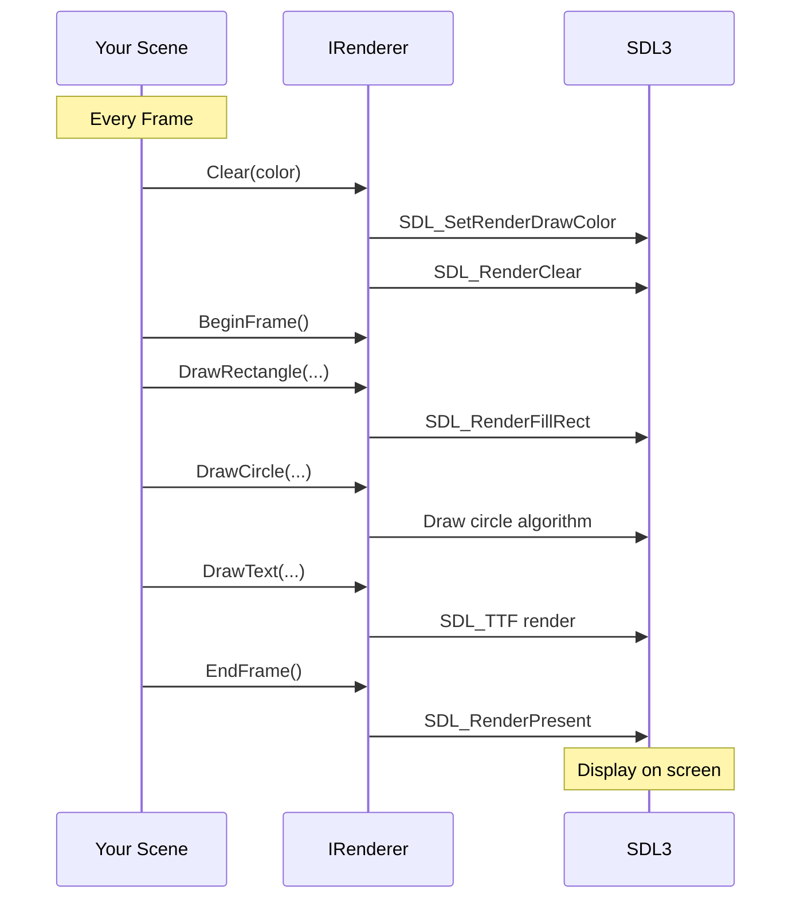

# Drawing Basics

Master the fundamentals of rendering in Brine2D by learning to draw shapes, set colors, and understand the rendering pipeline.

## Overview

Brine2D's rendering system provides simple, immediate-mode drawing APIs for 2D graphics:
- ✅ **Rectangles** - Filled squares and rectangles
- ✅ **Circles** - Filled circles for particles, bullets
- ✅ **Text** - String rendering with fonts
- ✅ **Textures** - Images and sprites (covered in [Textures](textures.md))



---

## Prerequisites

- ✅ [Quick Start](../getting-started/quick-start.md) - Basic scene setup
- ✅ Basic C# knowledge

---

## Your First Drawing

### Minimal Example

```csharp MinimalDrawing.cs
using Brine2D.Core;
using Brine2D.Rendering;
using Microsoft.Extensions.Logging;

public class DrawingScene : Scene
{
    private readonly IRenderer _renderer;
    
    public DrawingScene(IRenderer renderer, ILogger<DrawingScene> logger) 
        : base(logger)
    {
        _renderer = renderer;
    }
    
    protected override void OnRender(GameTime gameTime)
    {
        // 1. Clear screen (required)
        _renderer.Clear(Color.CornflowerBlue);
        
        // 2. Begin frame (required)
        _renderer.BeginFrame();
        
        // 3. Draw your stuff
        _renderer.DrawRectangle(100, 100, 200, 150, Color.Red);
        
        // 4. End frame (required) - presents to screen
        _renderer.EndFrame();
    }
}
```

**Result:** A red rectangle on a blue background!

---

## The Rendering Pipeline

### Frame Structure

Every frame **MUST** follow this pattern:

```csharp
protected override void OnRender(GameTime gameTime)
{
    // Step 1: Clear screen
    _renderer.Clear(backgroundColor);
    
    // Step 2: Begin frame
    _renderer.BeginFrame();
    
    // Step 3: Draw everything
    DrawBackground();
    DrawGameObjects();
    DrawUI();
    
    // Step 4: End frame (displays on screen)
    _renderer.EndFrame();
}
```

**Why this order?**
- `Clear()` - Wipes previous frame
- `BeginFrame()` - Prepares rendering state
- Draw calls - Queues draw commands
- `EndFrame()` - Flips buffers, shows result

---

## Drawing Rectangles

### Basic Rectangle

```csharp
// DrawRectangle(x, y, width, height, color)
_renderer.DrawRectangle(100, 100, 50, 50, Color.Red);
```

**Parameters:**
- `x` - Left edge position
- `y` - Top edge position
- `width` - Rectangle width
- `height` - Rectangle height
- `color` - Fill color

```
Screen Coordinates:
(0,0) ───────► X
  │
  │    (100,100)
  │      ┌──────────┐
  │      │ 50x50 px │
  │      │  rect    │
  │      └──────────┘
  ▼
  Y
```

---

### Rectangle Patterns

**Centered Rectangle**

```csharp
private void DrawCenteredRect(float centerX, float centerY, float size, Color color)
{
    _renderer.DrawRectangle(
        centerX - size / 2,
        centerY - size / 2,
        size,
        size,
        color);
}
```

**Outlined Rectangle** (draw 4 thin rectangles)

```csharp
private void DrawRectangleOutline(float x, float y, float w, float h, Color color, float thickness = 2)
{
    // Top
    _renderer.DrawRectangle(x, y, w, thickness, color);
    // Bottom  
    _renderer.DrawRectangle(x, y + h - thickness, w, thickness, color);
    // Left
    _renderer.DrawRectangle(x, y, thickness, h, color);
    // Right
    _renderer.DrawRectangle(x + w - thickness, y, thickness, h, color);
}
```

**Grid Pattern**

```csharp
private void DrawGrid(int gridSize, Color gridColor)
{
    // Vertical lines
    for (int x = 0; x < 1280; x += gridSize)
    {
        _renderer.DrawRectangle(x, 0, 2, 720, gridColor);
    }
    
    // Horizontal lines
    for (int y = 0; y < 720; y += gridSize)
    {
        _renderer.DrawRectangle(0, y, 1280, 2, gridColor);
    }
}
```

---

## Drawing Circles

### Basic Circle

```csharp
// DrawCircle(centerX, centerY, radius, color)
_renderer.DrawCircle(400, 300, 50, Color.Blue);
```

**Parameters:**
- `centerX` - Circle center X
- `centerY` - Circle center Y
- `radius` - Circle radius in pixels
- `color` - Fill color

**Note:** Circles are filled automatically (no outline-only mode yet).

---

### Circle Patterns

**Particle Effect**

```csharp
private void DrawParticles()
{
    var random = new Random();
    
    for (int i = 0; i < 50; i++)
    {
        var x = random.Next(0, 1280);
        var y = random.Next(0, 720);
        var radius = random.Next(2, 8);
        
        _renderer.DrawCircle(x, y, radius, Color.White);
    }
}
```

**Ripple Effect**

```csharp
private float _rippleRadius = 0f;

protected override void OnUpdate(GameTime gameTime)
{
    _rippleRadius += 100f * (float)gameTime.DeltaTime;
    if (_rippleRadius > 200) _rippleRadius = 0;
}

protected override void OnRender(GameTime gameTime)
{
    _renderer.BeginFrame();
    
    // Draw expanding circle
    var alpha = (byte)(255 * (1.0f - _rippleRadius / 200f));
    _renderer.DrawCircle(640, 360, _rippleRadius, 
        new Color(255, 255, 255, alpha));
    
    _renderer.EndFrame();
}
```

---

## Working with Colors

### Predefined Colors

```csharp
Color.White           // (255, 255, 255)
Color.Black           // (0, 0, 0)
Color.Red             // (255, 0, 0)
Color.Green           // (0, 255, 0)
Color.Blue            // (0, 0, 255)
Color.Yellow          // (255, 255, 0)
Color.CornflowerBlue  // (100, 149, 237)
Color.Transparent     // (0, 0, 0, 0)
```

---

### Custom Colors

**RGB Color**

```csharp
var purple = new Color(128, 0, 128);
```

**RGBA Color (with transparency)**

```csharp
var semiTransparentRed = new Color(255, 0, 0, 128); // 50% transparent
```

**Helper Methods**

```csharp
var color1 = Color.FromRgb(100, 150, 200);
var color2 = Color.FromRgba(100, 150, 200, 128);
```

---

### Color Math

**Lighten/Darken**

```csharp
public static Color Lighten(Color color, float amount)
{
    return new Color(
        (byte)Math.Min(255, color.R + (255 - color.R) * amount),
        (byte)Math.Min(255, color.G + (255 - color.G) * amount),
        (byte)Math.Min(255, color.B + (255 - color.B) * amount),
        color.A);
}

public static Color Darken(Color color, float amount)
{
    return new Color(
        (byte)(color.R * (1 - amount)),
        (byte)(color.G * (1 - amount)),
        (byte)(color.B * (1 - amount)),
        color.A);
}
```

**Blend/Mix Colors**

```csharp
public static Color Lerp(Color a, Color b, float t)
{
    return new Color(
        (byte)(a.R + (b.R - a.R) * t),
        (byte)(a.G + (b.G - a.G) * t),
        (byte)(a.B + (b.B - a.B) * t),
        (byte)(a.A + (b.A - a.A) * t));
}
```

**Pulsing Color**

```csharp
private float _pulse = 0f;

protected override void OnUpdate(GameTime gameTime)
{
    _pulse += (float)gameTime.DeltaTime * 2f;
}

protected override void OnRender(GameTime gameTime)
{
    var intensity = (byte)(128 + Math.Sin(_pulse) * 127);
    var color = new Color(intensity, 0, 0);
    
    _renderer.DrawRectangle(100, 100, 100, 100, color);
}
```

---

## Drawing Text

### Basic Text

```csharp
_renderer.DrawText("Hello, World!", 100, 100, Color.White);
```

**Parameters:**
- `text` - String to display
- `x` - Left edge
- `y` - Top edge
- `color` - Text color

**Note:** You need to load a font first! See [Text Rendering](text.md) for details.

---

### Text Without Fonts (Fallback)

If no font is loaded, Brine2D renders text as rectangles:

```csharp
// Fallback rendering (automatic)
_renderer.DrawText("TEST", 100, 100, Color.White);
// Each character = 8x12 rectangle
```

---

## Complete Drawing Example

Here's a scene with all drawing primitives:

```csharp DrawingDemoScene.cs
using Brine2D.Core;
using Brine2D.Input;
using Brine2D.Rendering;
using Microsoft.Extensions.Logging;

public class DrawingDemoScene : Scene
{
    private readonly IRenderer _renderer;
    private readonly IInputService _input;
    private readonly IGameContext _gameContext;
    
    private float _pulse = 0f;
    private float _rotation = 0f;
    
    public DrawingDemoScene(
        IRenderer renderer,
        IInputService input,
        IGameContext gameContext,
        ILogger<DrawingDemoScene> logger
    ) : base(logger)
    {
        _renderer = renderer;
        _input = input;
        _gameContext = gameContext;
    }
    
    protected override void OnInitialize()
    {
        Logger.LogInformation("Drawing Demo initialized!");
        Logger.LogInformation("Press ESC to exit");
    }
    
    protected override void OnUpdate(GameTime gameTime)
    {
        var deltaTime = (float)gameTime.DeltaTime;
        
        if (_input.IsKeyPressed(Keys.Escape))
        {
            _gameContext.RequestExit();
        }
        
        // Animation
        _pulse += deltaTime * 2f;
        _rotation += deltaTime * 90f; // 90 degrees per second
    }
    
    protected override void OnRender(GameTime gameTime)
    {
        // Clear to dark gray
        _renderer.Clear(new Color(40, 40, 40));
        _renderer.BeginFrame();
        
        // Grid background
        DrawGrid();
        
        // Rectangles
        DrawRectangles();
        
        // Circles
        DrawCircles();
        
        // Pulsing square
        DrawPulsingSquare();
        
        // Text
        _renderer.DrawText("Drawing Demo", 10, 10, Color.White);
        _renderer.DrawText($"FPS: {(int)(1.0 / gameTime.DeltaTime)}", 10, 30, Color.Yellow);
        
        _renderer.EndFrame();
    }
    
    private void DrawGrid()
    {
        var gridSize = 50;
        var gridColor = new Color(60, 60, 60);
        
        // Vertical lines
        for (int x = 0; x <= 1280; x += gridSize)
        {
            _renderer.DrawRectangle(x, 0, 1, 720, gridColor);
        }
        
        // Horizontal lines
        for (int y = 0; y <= 720; y += gridSize)
        {
            _renderer.DrawRectangle(0, y, 1280, 1, gridColor);
        }
    }
    
    private void DrawRectangles()
    {
        // Solid rectangles
        _renderer.DrawRectangle(100, 100, 100, 100, Color.Red);
        _renderer.DrawRectangle(250, 100, 150, 80, Color.Green);
        _renderer.DrawRectangle(450, 100, 120, 120, Color.Blue);
        
        // Semi-transparent
        _renderer.DrawRectangle(100, 250, 100, 100, 
            new Color(255, 0, 0, 128));
        
        // Outlined rectangle
        DrawRectangleOutline(250, 250, 150, 80, Color.Yellow, 3);
    }
    
    private void DrawCircles()
    {
        // Various sizes
        _renderer.DrawCircle(700, 150, 50, Color.Red);
        _renderer.DrawCircle(850, 150, 30, Color.Green);
        _renderer.DrawCircle(950, 150, 70, Color.Blue);
        
        // Semi-transparent
        _renderer.DrawCircle(750, 300, 40, 
            new Color(255, 255, 0, 128));
        
        // Overlapping circles (alpha blending)
        _renderer.DrawCircle(900, 300, 50, 
            new Color(255, 0, 0, 100));
        _renderer.DrawCircle(950, 300, 50, 
            new Color(0, 255, 0, 100));
        _renderer.DrawCircle(925, 340, 50, 
            new Color(0, 0, 255, 100));
    }
    
    private void DrawPulsingSquare()
    {
        var scale = 1.0f + (float)Math.Sin(_pulse) * 0.3f;
        var size = 80 * scale;
        var centerX = 640f;
        var centerY = 500f;
        
        // Pulsing color
        var intensity = (byte)(128 + Math.Sin(_pulse * 2) * 127);
        var color = new Color(intensity, 0, intensity);
        
        _renderer.DrawRectangle(
            centerX - size / 2,
            centerY - size / 2,
            size,
            size,
            color);
    }
    
    private void DrawRectangleOutline(float x, float y, float w, float h, 
        Color color, float thickness)
    {
        _renderer.DrawRectangle(x, y, w, thickness, color);
        _renderer.DrawRectangle(x, y + h - thickness, w, thickness, color);
        _renderer.DrawRectangle(x, y, thickness, h, color);
        _renderer.DrawRectangle(x + w - thickness, y, thickness, h, color);
    }
}
```

---

## Advanced Techniques

### Alpha Blending

```csharp
// Transparent rectangles automatically blend
_renderer.DrawRectangle(100, 100, 100, 100, new Color(255, 0, 0, 128));
_renderer.DrawRectangle(150, 150, 100, 100, new Color(0, 0, 255, 128));
// Result: Purple overlap!
```

**How it works:**
- SDL automatically enables alpha blending when `color.A < 255`
- Overlapping shapes blend correctly

---

### Gradient Effect (Fake)

```csharp
private void DrawVerticalGradient(float x, float y, float w, float h, 
    Color topColor, Color bottomColor)
{
    int steps = (int)h;
    
    for (int i = 0; i < steps; i++)
    {
        float t = i / (float)steps;
        var color = ColorLerp(topColor, bottomColor, t);
        
        _renderer.DrawRectangle(x, y + i, w, 1, color);
    }
}

private Color ColorLerp(Color a, Color b, float t)
{
    return new Color(
        (byte)(a.R + (b.R - a.R) * t),
        (byte)(a.G + (b.G - a.G) * t),
        (byte)(a.B + (b.B - a.B) * t),
        (byte)(a.A + (b.A - a.A) * t));
}
```

---

### Progress Bar

```csharp
private void DrawProgressBar(float x, float y, float width, float height, 
    float progress, Color fillColor, Color bgColor)
{
    // Background
    _renderer.DrawRectangle(x, y, width, height, bgColor);
    
    // Fill
    var fillWidth = width * Math.Clamp(progress, 0f, 1f);
    _renderer.DrawRectangle(x, y, fillWidth, height, fillColor);
    
    // Border
    DrawRectangleOutline(x, y, width, height, Color.White, 2);
}

// Usage
DrawProgressBar(100, 500, 200, 30, 0.75f, Color.Green, Color.Black);
```

---

### Health Bar

```csharp
private void DrawHealthBar(float x, float y, float width, float height, 
    float current, float max)
{
    var percentage = current / max;
    
    // Determine color based on health
    Color fillColor;
    if (percentage > 0.5f) fillColor = Color.Green;
    else if (percentage > 0.25f) fillColor = Color.Yellow;
    else fillColor = Color.Red;
    
    DrawProgressBar(x, y, width, height, percentage, fillColor, 
        new Color(40, 40, 40));
}
```

---

## Troubleshooting

### Problem: Nothing Draws

**Symptom:** Blank screen

**Causes & Solutions:**

1. **Forgot `BeginFrame()` or `EndFrame()`**
   ```csharp
   // ❌ Bad
   _renderer.Clear(Color.Blue);
   _renderer.DrawRectangle(...);
   
   // ✅ Good
   _renderer.Clear(Color.Blue);
   _renderer.BeginFrame();
   _renderer.DrawRectangle(...);
   _renderer.EndFrame();
   ```

2. **Drawing outside screen bounds**
   ```csharp
   // ❌ Bad - off screen
   _renderer.DrawRectangle(2000, 2000, 100, 100, Color.Red);
   
   // ✅ Good - visible
   _renderer.DrawRectangle(100, 100, 100, 100, Color.Red);
   ```

3. **Alpha = 0 (fully transparent)**
   ```csharp
   // ❌ Bad - invisible
   _renderer.DrawRectangle(100, 100, 100, 100, 
       new Color(255, 0, 0, 0));
   
   // ✅ Good - visible
   _renderer.DrawRectangle(100, 100, 100, 100, 
       new Color(255, 0, 0, 255));
   ```

---

### Problem: Shapes Behind Each Other

**Symptom:** Draw order issues

**Solution:** Draw in order (back to front):

```csharp
protected override void OnRender(GameTime gameTime)
{
    _renderer.Clear(Color.Black);
    _renderer.BeginFrame();
    
    // Draw order matters!
    DrawBackground();      // Back
    DrawGameObjects();     // Middle
    DrawUI();              // Front
    
    _renderer.EndFrame();
}
```

**No Z-buffer in 2D!** Last drawn = on top.

---

### Problem: Poor Performance

**Symptom:** Low FPS with many shapes

**Solutions:**

1. **Batch draws** - Don't recreate objects per frame
2. **Cull off-screen** - Don't draw invisible shapes
3. **Use textures** - Faster than many primitives

```csharp
// ❌ Bad - 1000 draw calls
for (int i = 0; i < 1000; i++)
{
    _renderer.DrawCircle(i * 10, 100, 5, Color.White);
}

// ✅ Better - Draw only visible
for (int i = 0; i < 1000; i++)
{
    var x = i * 10;
    if (x >= 0 && x <= 1280) // Visible range
    {
        _renderer.DrawCircle(x, 100, 5, Color.White);
    }
}
```

---

## Best Practices

### DO

1. **Always Clear, Begin, End**
   ```csharp
   _renderer.Clear(bgColor);
   _renderer.BeginFrame();
   // ... draw ...
   _renderer.EndFrame();
   ```

2. **Use constants for repeated values**
   ```csharp
   const float PLAYER_SIZE = 50f;
   _renderer.DrawRectangle(x, y, PLAYER_SIZE, PLAYER_SIZE, Color.Red);
   ```

3. **Extract drawing logic to methods**
   ```csharp
   private void DrawPlayer() { ... }
   private void DrawEnemies() { ... }
   ```

4. **Use delta time for animations**
   ```csharp
   _pulse += (float)gameTime.DeltaTime * 2f;
   ```

### DON'T

1. **Don't call Clear/Begin/End multiple times per frame**
   ```csharp
   // ❌ Bad
   _renderer.BeginFrame();
   DrawStuff();
   _renderer.EndFrame();
   _renderer.BeginFrame(); // Wrong!
   ```

2. **Don't create colors every frame**
   ```csharp
   // ❌ Bad - allocates every frame
   _renderer.DrawRectangle(x, y, 100, 100, new Color(255, 0, 0));
   
   // ✅ Good - reuse
   private static readonly Color Red = new Color(255, 0, 0);
   _renderer.DrawRectangle(x, y, 100, 100, Red);
   ```

3. **Don't draw invisible shapes**
   ```csharp
   // ❌ Bad
   if (!isVisible)
       return;
   _renderer.DrawRectangle(...); // Still calls method
   
   // ✅ Good
   if (isVisible)
   {
       _renderer.DrawRectangle(...);
   }
   ```

---

## Performance Tips

1. **Minimize draw calls** - Combine shapes when possible
2. **Cull off-screen** - Don't draw invisible objects
3. **Cache colors** - Reuse Color instances
4. **Use textures for complex shapes** - Faster than many primitives
5. **Profile first** - Measure before optimizing

---

## Summary

| Shape | Method | Parameters |
|-------|--------|------------|
| **Rectangle** | `DrawRectangle()` | x, y, width, height, color |
| **Circle** | `DrawCircle()` | centerX, centerY, radius, color |
| **Text** | `DrawText()` | text, x, y, color |
| **Clear** | `Clear()` | color |
| **Frame** | `BeginFrame()`, `EndFrame()` | - |

---

## Next Steps

- **[Textures](textures.md)** - Load and draw images
- **[Sprites](sprites.md)** - Work with sprite sheets
- **[Text Rendering](text.md)** - Load fonts and draw text
- **[Animation](animation.md)** - Animate sprites
- **[Camera](camera.md)** - Move the viewport

---

Ready to add images? Move on to [Loading Textures](textures.md)!