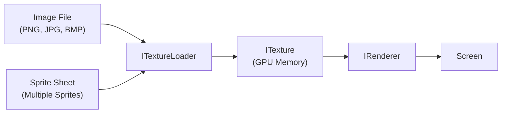
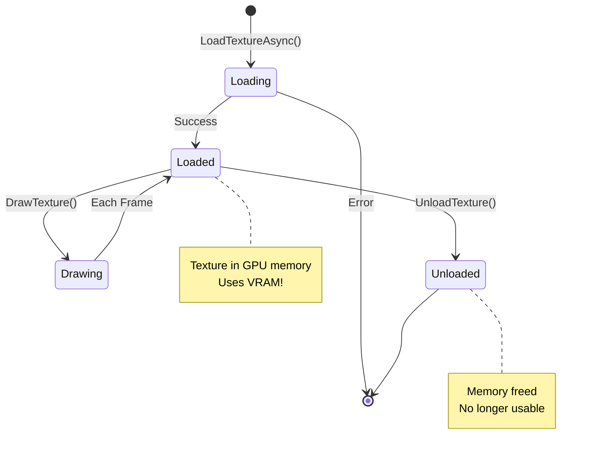

# Sprites & Textures

Learn how to load images, draw sprites, work with sprite sheets, and create animations for your 2D games.

## Overview

Textures are images loaded into memory for rendering. Sprites are textures (or portions of textures) displayed in your game.

**What you'll learn:**

- ✅ **Loading textures** from image files
- ✅ **Drawing sprites** at any position/size
- ✅ **Sprite sheets** for efficient texture atlases
- ✅ **Scale modes** for pixel art vs smooth graphics
- ✅ **Memory management** (loading/unloading)



---

## Prerequisites

- ✅ [Drawing Basics](drawing-basics.md) - Understanding rendering
- ✅ [Quick Start](../getting-started/quick-start.md) - Scene setup
- Image files (PNG, JPG, or BMP)

---

## Quick Example

### Load and Draw a Sprite

```csharp SpriteExample.cs
using Brine2D.Core;
using Brine2D.Rendering;
using Microsoft.Extensions.Logging;

public class SpriteScene : Scene
{
    private readonly IRenderer _renderer;
    private readonly ITextureLoader _textureLoader;
    
    private ITexture? _playerTexture;
    
    public SpriteScene(
        IRenderer renderer,
        ITextureLoader textureLoader,
        ILogger<SpriteScene> logger
    ) : base(logger)
    {
        _renderer = renderer;
        _textureLoader = textureLoader;
    }
    
    protected override async Task OnLoadAsync(CancellationToken cancellationToken)
    {
        // Load texture asynchronously
        _playerTexture = await _textureLoader.LoadTextureAsync(
            "assets/player.png",
            TextureScaleMode.Nearest, // For pixel art
            cancellationToken);
    }
    
    protected override void OnRender(GameTime gameTime)
    {
        _renderer.Clear(Color.Black);
        _renderer.BeginFrame();
        
        if (_playerTexture != null)
        {
            // Draw at position (100, 100)
            _renderer.DrawTexture(_playerTexture, 100, 100);
        }
        
        _renderer.EndFrame();
    }
    
    protected override Task OnUnloadAsync(CancellationToken cancellationToken)
    {
        // Important: Always unload textures!
        if (_playerTexture != null)
        {
            _textureLoader.UnloadTexture(_playerTexture);
        }
        
        return Task.CompletedTask;
    }
}
```

**Result:** Your sprite appears on screen!

---

## Project Structure

Organize your assets:

```
YourGame/
├── Program.cs
├── GameScene.cs
├── YourGame.csproj
├── gamesettings.json
└── assets/
    ├── sprites/
    │   ├── player.png
    │   ├── enemy.png
    │   └── character_sheet.png (sprite sheet)
    ├── backgrounds/
    │   └── background.png
    └── ui/
        └── button.png
```

**In `.csproj`, copy assets to output:**

```xml YourGame.csproj
<ItemGroup>
  <None Update="assets\**\*">
    <CopyToOutputDirectory>PreserveNewest</CopyToOutputDirectory>
  </None>
</ItemGroup>
```

---

## Loading Textures

### Async Loading (Recommended)

```csharp
protected override async Task OnLoadAsync(CancellationToken cancellationToken)
{
    // Load texture asynchronously
    _texture = await _textureLoader.LoadTextureAsync(
        "assets/player.png",
        TextureScaleMode.Nearest,
        cancellationToken);
    
    Logger.LogInformation("Texture loaded: {Width}x{Height}", 
        _texture.Width, _texture.Height);
}
```

**Parameters:**
- `path` - Relative path to image file
- `scaleMode` - `Nearest` (pixel art) or `Linear` (smooth)
- `cancellationToken` - For cancellation support

---

### Synchronous Loading

```csharp
protected override void OnInitialize()
{
    // Load synchronously (blocks thread)
    _texture = _textureLoader.LoadTexture(
        "assets/player.png",
        TextureScaleMode.Nearest);
}
```

**⚠️ Warning:** Blocks the thread. Use async loading when possible!

---

### Scale Modes

| Mode | Best For | Effect |
|------|----------|--------|
| `TextureScaleMode.Nearest` | **Pixel art**, retro games | Sharp, pixelated scaling |
| `TextureScaleMode.Linear` | Photos, smooth graphics | Smooth, blurred scaling |

**Visual Comparison:**

```
Nearest (Pixel Art):        Linear (Smooth):
┌────┬────┐                ┌─────────┐
│ ██ │ ██ │                │░░░░░░░░░│
├────┼────┤  Scaled →      │░░░░░░░░░│
│ ██ │ ██ │   2x           │░░░░░░░░░│
└────┴────┘                └─────────┘
 Sharp edges!               Blended edges!
```

**Choose:**
- **Nearest** - Pixel art, 8-bit style, sharp edges
- **Linear** - Realistic graphics, photos, smooth scaling

---

### Supported Formats

Brine2D supports common image formats via SDL3_image:
- ✅ **PNG** (recommended, alpha support)
- ✅ **JPG/JPEG** (no alpha, smaller files)
- ✅ **BMP** (uncompressed, large files)

**File size tips:**
- **PNG** - Best for sprites (lossless + transparency)
- **JPG** - Best for backgrounds (smaller, no alpha)

---

## Drawing Textures

### Method 1: Draw at Position

```csharp
// Draw at (x, y) with original size
_renderer.DrawTexture(_texture, 100, 100);
```

**Result:** Texture drawn at position, original dimensions.

---

### Method 2: Draw with Scaling

```csharp
// Draw at (x, y) with custom width/height
_renderer.DrawTexture(_texture, 100, 100, 200, 200);
```

**Parameters:**
- `x, y` - Position
- `width, height` - Destination size

**Example:**

```csharp
// Double size
_renderer.DrawTexture(_texture, 100, 100, 
    _texture.Width * 2, _texture.Height * 2);

// Half size
_renderer.DrawTexture(_texture, 100, 100, 
    _texture.Width / 2, _texture.Height / 2);
```

---

### Method 3: Sprite Sheet (Partial Draw)

```csharp
// Draw a portion of texture (for sprite sheets)
_renderer.DrawTexture(
    _texture,
    sourceX, sourceY, sourceWidth, sourceHeight, // Source rectangle in texture
    destX, destY, destWidth, destHeight);        // Destination on screen
```

**Use for:**
- Sprite sheets/texture atlases
- Animation frames
- UI elements

**Example:**

```csharp
// Draw top-left 32x32 region from sprite sheet
_renderer.DrawTexture(
    _spriteSheet,
    0, 0, 32, 32,      // Source: top-left 32x32 pixels
    100, 100, 64, 64); // Draw at (100,100) scaled to 64x64
```

---

## Sprite Sheets

A **sprite sheet** (texture atlas) combines multiple sprites into one image for efficiency.

### What is a Sprite Sheet?

```
character_sheet.png (256x256):
┌────────┬────────┬────────┬────────┐
│ Frame 1│ Frame 2│ Frame 3│ Frame 4│  ← Walk animation
│  32x32 │  32x32 │  32x32 │  32x32 │
├────────┼────────┼────────┼────────┤
│ Frame 5│ Frame 6│ Frame 7│ Frame 8│  ← Run animation
│  32x32 │  32x32 │  32x32 │  32x32 │
└────────┴────────┴────────┴────────┘
8 sprites in 1 texture!
```

**Benefits:**
- ✅ **Fewer draw calls** (faster rendering)
- ✅ **Less memory** (one texture vs many)
- ✅ **Easier management** (one file)

---

### Drawing from Sprite Sheet

```csharp SpriteShe etExample.cs
public class SpriteSheetScene : Scene
{
    private readonly IRenderer _renderer;
    private readonly ITextureLoader _textureLoader;
    
    private ITexture? _spriteSheet;
    private int _currentFrame = 0;
    
    // Sprite sheet info
    private const int FrameWidth = 32;
    private const int FrameHeight = 32;
    private const int FramesPerRow = 8;
    
    protected override async Task OnLoadAsync(CancellationToken cancellationToken)
    {
        _spriteSheet = await _textureLoader.LoadTextureAsync(
            "assets/character_sheet.png",
            TextureScaleMode.Nearest,
            cancellationToken);
    }
    
    protected override void OnRender(GameTime gameTime)
    {
        _renderer.Clear(Color.Black);
        _renderer.BeginFrame();
        
        if (_spriteSheet != null)
        {
            // Calculate source rectangle for current frame
            int frameX = (_currentFrame % FramesPerRow) * FrameWidth;
            int frameY = (_currentFrame / FramesPerRow) * FrameHeight;
            
            // Draw frame scaled 4x
            _renderer.DrawTexture(
                _spriteSheet,
                frameX, frameY, FrameWidth, FrameHeight,    // Source
                100, 100, FrameWidth * 4, FrameHeight * 4); // Dest (4x scale)
        }
        
        _renderer.EndFrame();
    }
    
    protected override void OnUpdate(GameTime gameTime)
    {
        // Cycle through frames (simple animation)
        _currentFrame = (_currentFrame + 1) % (FramesPerRow * 2); // 16 frames total
    }
}
```

---

## Complete Sprite Example

Here's a full scene with player movement:

```csharp PlayerSpriteScene.cs
using Brine2D.Core;
using Brine2D.Input;
using Brine2D.Rendering;
using Microsoft.Extensions.Logging;
using System.Numerics;

public class PlayerSpriteScene : Scene
{
    private readonly IRenderer _renderer;
    private readonly IInputService _input;
    private readonly ITextureLoader _textureLoader;
    private readonly IGameContext _gameContext;
    
    private ITexture? _playerTexture;
    private Vector2 _playerPosition = new Vector2(400, 300);
    private float _playerSpeed = 200f;
    
    public PlayerSpriteScene(
        IRenderer renderer,
        IInputService input,
        ITextureLoader textureLoader,
        IGameContext gameContext,
        ILogger<PlayerSpriteScene> logger
    ) : base(logger)
    {
        _renderer = renderer;
        _input = input;
        _textureLoader = textureLoader;
        _gameContext = gameContext;
    }
    
    // ============================================
    // LOAD
    // ============================================
    protected override async Task OnLoadAsync(CancellationToken cancellationToken)
    {
        Logger.LogInformation("Loading player sprite...");
        
        _playerTexture = await _textureLoader.LoadTextureAsync(
            "assets/player.png",
            TextureScaleMode.Nearest,
            cancellationToken);
        
        Logger.LogInformation("Player sprite loaded: {Width}x{Height}",
            _playerTexture.Width, _playerTexture.Height);
    }
    
    // ============================================
    // UPDATE
    // ============================================
    protected override void OnUpdate(GameTime gameTime)
    {
        var deltaTime = (float)gameTime.DeltaTime;
        
        // Exit
        if (_input.IsKeyPressed(Keys.Escape))
        {
            _gameContext.RequestExit();
        }
        
        // Movement
        var movement = Vector2.Zero;
        
        if (_input.IsKeyDown(Keys.W)) movement.Y -= 1;
        if (_input.IsKeyDown(Keys.S)) movement.Y += 1;
        if (_input.IsKeyDown(Keys.A)) movement.X -= 1;
        if (_input.IsKeyDown(Keys.D)) movement.X += 1;
        
        if (movement != Vector2.Zero)
        {
            movement = Vector2.Normalize(movement);
            _playerPosition += movement * _playerSpeed * deltaTime;
            
            // Keep on screen
            _playerPosition.X = Math.Clamp(_playerPosition.X, 0, 1280);
            _playerPosition.Y = Math.Clamp(_playerPosition.Y, 0, 720);
        }
    }
    
    // ============================================
    // RENDER
    // ============================================
    protected override void OnRender(GameTime gameTime)
    {
        _renderer.Clear(new Color(40, 40, 40));
        _renderer.BeginFrame();
        
        if (_playerTexture != null)
        {
            // Center sprite on position
            var drawX = _playerPosition.X - _playerTexture.Width / 2;
            var drawY = _playerPosition.Y - _playerTexture.Height / 2;
            
            _renderer.DrawTexture(_playerTexture, drawX, drawY);
        }
        
        // Draw instructions
        _renderer.DrawText("WASD to move", 10, 10, Color.White);
        _renderer.DrawText("ESC to exit", 10, 30, Color.White);
        
        _renderer.EndFrame();
    }
    
    // ============================================
    // CLEANUP
    // ============================================
    protected override Task OnUnloadAsync(CancellationToken cancellationToken)
    {
        // IMPORTANT: Always unload!
        if (_playerTexture != null)
        {
            _textureLoader.UnloadTexture(_playerTexture);
            Logger.LogInformation("Player sprite unloaded");
        }
        
        return Task.CompletedTask;
    }
}
```

---

## Sprite Animations

For frame-by-frame animations, see [Animation Guide](animation.md).

**Quick preview:**

```csharp
// Load sprite sheet
_spriteSheet = await _textureLoader.LoadTextureAsync(
    "assets/character.png",
    TextureScaleMode.Nearest,
    cancellationToken);

// Create animator
_animator = new SpriteAnimator();

// Create animation from sprite sheet
var walkAnim = AnimationClip.FromSpriteSheet(
    "walk",           // Name
    32,               // Frame width
    32,               // Frame height
    4,                // Frame count
    8,                // Columns
    0.1f,             // Duration per frame
    true);            // Loop?

_animator.AddAnimation(walkAnim);
_animator.Play("walk");

// Update every frame
_animator.Update(deltaTime);

// Draw current frame
if (_animator.CurrentFrame != null)
{
    var frame = _animator.CurrentFrame.SourceRect;
    _renderer.DrawTexture(
        _spriteSheet,
        frame.X, frame.Y, frame.Width, frame.Height,
        playerX, playerY, 64, 64);
}
```

**[Full Animation Tutorial →](animation.md)**

---

## Memory Management

### Textures Use GPU Memory!

**ALWAYS unload textures when done:**

```csharp
protected override Task OnUnloadAsync(CancellationToken cancellationToken)
{
    if (_playerTexture != null)
    {
        _textureLoader.UnloadTexture(_playerTexture);
    }
    
    if (_backgroundTexture != null)
    {
        _textureLoader.UnloadTexture(_backgroundTexture);
    }
    
    return Task.CompletedTask;
}
```

**Why?**
- Textures live in GPU memory
- Not garbage collected automatically
- Memory leaks if not unloaded!

---

### Texture Lifecycle



---

## Troubleshooting

### Problem: Texture Not Found

**Symptom:** `FileNotFoundException` when loading

**Solutions:**

1. **Check file path**
   ```csharp
   // ❌ Wrong - absolute path
   "C:/MyGame/assets/player.png"
   
   // ✅ Correct - relative path
   "assets/player.png"
   ```

2. **Verify file exists**
   ```csharp
   if (!File.Exists("assets/player.png"))
   {
       Logger.LogError("Texture not found!");
   }
   ```

3. **Check `.csproj` copy settings**
   ```xml
   <ItemGroup>
     <None Update="assets\**\*">
       <CopyToOutputDirectory>PreserveNewest</CopyToOutputDirectory>
     </None>
   </ItemGroup>
   ```

---

### Problem: Blurry Pixel Art

**Symptom:** Pixelated sprites look blurry

**Solution:** Use `TextureScaleMode.Nearest`:

```csharp
// ❌ Bad - blurry pixel art
_texture = await _textureLoader.LoadTextureAsync(
    "assets/player.png",
    TextureScaleMode.Linear); // WRONG for pixel art

// ✅ Good - sharp pixel art
_texture = await _textureLoader.LoadTextureAsync(
    "assets/player.png",
    TextureScaleMode.Nearest); // CORRECT for pixel art
```

---

### Problem: Memory Leak

**Symptom:** Memory usage increases over time

**Cause:** Not unloading textures

**Solution:**

```csharp
// ❌ Bad - memory leak!
protected override Task OnUnloadAsync(CancellationToken cancellationToken)
{
    return Task.CompletedTask; // Forgot to unload!
}

// ✅ Good - proper cleanup
protected override Task OnUnloadAsync(CancellationToken cancellationToken)
{
    if (_texture != null)
    {
        _textureLoader.UnloadTexture(_texture);
    }
    
    return Task.CompletedTask;
}
```

---

### Problem: Texture Appears Black/Wrong

**Symptom:** Texture renders as solid color

**Causes & Solutions:**

1. **File corrupted**
   - Re-export image
   - Try different format (PNG recommended)

2. **Wrong color format**
   - Ensure PNG has RGB/RGBA
   - Avoid grayscale/indexed color

3. **Texture not loaded**
   ```csharp
   if (_texture != null && _texture.IsLoaded)
   {
       _renderer.DrawTexture(_texture, x, y);
   }
   ```

---

## Best Practices

### DO

1. **Use PNG for sprites**
   ```csharp
   // ✅ PNG - transparency, lossless
   "assets/player.png"
   ```

2. **Load async in OnLoadAsync**
   ```csharp
   protected override async Task OnLoadAsync(CancellationToken ct)
   {
       _texture = await _textureLoader.LoadTextureAsync(..., ct);
   }
   ```

3. **Use Nearest for pixel art**
   ```csharp
   TextureScaleMode.Nearest // Sharp scaling
   ```

4. **Always unload**
   ```csharp
   protected override Task OnUnloadAsync(CancellationToken ct)
   {
       _textureLoader.UnloadTexture(_texture);
       return Task.CompletedTask;
   }
   ```

5. **Use sprite sheets**
   - One texture vs many = faster rendering
   - Less texture switches

6. **Cache texture references**
   ```csharp
   private ITexture? _cachedTexture;
   
   // ✅ Load once, use many times
   protected override async Task OnLoadAsync(CancellationToken ct)
   {
       _cachedTexture = await _textureLoader.LoadTextureAsync(..., ct);
   }
   ```

### DON'T

1. **Don't load every frame**
   ```csharp
   // ❌ TERRIBLE - loads every frame!
   protected override void OnRender(GameTime gt)
   {
       var texture = _textureLoader.LoadTexture(...); // NO!
       _renderer.DrawTexture(texture, x, y);
   }
   ```

2. **Don't use absolute paths**
   ```csharp
   // ❌ Bad
   "C:/Users/Me/Game/assets/player.png"
   
   // ✅ Good
   "assets/player.png"
   ```

3. **Don't forget to unload**
   ```csharp
   // ❌ Memory leak!
   protected override Task OnUnloadAsync(CancellationToken ct)
   {
       // Forgot _textureLoader.UnloadTexture(_texture);
       return Task.CompletedTask;
   }
   ```

4. **Don't use Linear for pixel art**
   ```csharp
   // ❌ Blurry pixel art
   TextureScaleMode.Linear
   
   // ✅ Sharp pixel art
   TextureScaleMode.Nearest
   ```

---

## Performance Tips

1. **Batch sprites by texture**
   ```csharp
   // Draw all enemies (same texture) together
   foreach (var enemy in _enemies)
   {
       _renderer.DrawTexture(_enemyTexture, enemy.X, enemy.Y);
   }
   
   // Then draw all coins (same texture)
   foreach (var coin in _coins)
   {
       _renderer.DrawTexture(_coinTexture, coin.X, coin.Y);
   }
   ```

2. **Use sprite sheets**
   - Reduces texture switches
   - Faster than individual files

3. **Preload textures**
   - Load in `OnLoadAsync`, not during gameplay
   - Show loading screen if many textures

4. **Unload unused textures**
   - Free GPU memory when switching levels
   - Reload when needed

---

## Summary

| Task | Code | Notes |
|------|------|-------|
| **Load texture** | `LoadTextureAsync(path, scaleMode, ct)` | Async, returns ITexture |
| **Draw at position** | `DrawTexture(texture, x, y)` | Original size |
| **Draw scaled** | `DrawTexture(texture, x, y, w, h)` | Custom size |
| **Draw from sheet** | `DrawTexture(texture, sx, sy, sw, sh, dx, dy, dw, dh)` | 9 params |
| **Unload** | `UnloadTexture(texture)` | Free GPU memory |
| **Scale mode** | `TextureScaleMode.Nearest` | Pixel art |
| **Scale mode** | `TextureScaleMode.Linear` | Smooth graphics |

---

## Next Steps

- **[Animation](animation.md)** - Animate sprites frame-by-frame
- **[Camera](camera.md)** - Follow sprites with camera
- **[Collision](../collision/basics.md)** - Detect sprite collisions
- **[Tilemaps](../tilemaps/rendering.md)** - Build levels with tiles

---

Ready to bring sprites to life? Try [Sprite Animation](animation.md)!