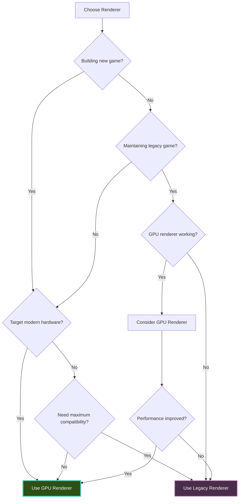

---
title: Choosing a Renderer
description: Compare GPU and Legacy renderers - choose the right one for your Brine2D game
---

# Choosing a Renderer

Learn which renderer to use for your Brine2D game - GPU or Legacy.

## Overview

Brine2D provides two rendering backends:

**GPU Renderer (SDL3GPURenderer):**
- Modern, hardware-accelerated rendering
- SDL3's new GPU API
- High performance for modern hardware

**Legacy Renderer (SDL3Renderer):**
- Traditional SDL2-style rendering
- Broader compatibility
- Fallback for older hardware

**Recommendation:** Use the GPU renderer for all new projects.

---

## Quick Comparison

| Feature | GPU Renderer | Legacy Renderer |
|---------|-------------|-----------------|
| **Default** | ✅ Yes | ❌ No |
| **Performance** | High | Moderate |
| **API** | SDL3 GPU | SDL2-style |
| **Hardware Requirements** | Modern GPU | Any GPU |
| **Platform Support** | Windows 10+, Linux, macOS 10.14+ | All platforms |
| **Memory** | GPU VRAM | System RAM + GPU |
| **Draw Call Batching** | ✅ Automatic | ⚠️ Limited |
| **Render Targets** | ✅ Yes | ✅ Yes |
| **VSync** | ✅ Yes | ✅ Yes |
| **Recommended For** | New games | Legacy compatibility |

---

## Decision Tree



---

## GPU Renderer

### Overview

The **GPU Renderer** is Brine2D's default, modern rendering backend.

**Powered by:** SDL3 GPU API (Vulkan/Metal/D3D12)

**Best for:**
- New games
- Modern hardware (2015+)
- High-performance requirements
- Cross-platform projects

---

### Advantages

**Performance:**
- Hardware-accelerated rendering
- Automatic draw call batching
- Efficient GPU memory usage
- High sprite counts supported

**Features:**
- Full feature set
- Render targets
- Advanced blending
- Modern API

**Platform Support:**
- Windows 10+ (D3D12/Vulkan)
- Linux (Vulkan)
- macOS 10.14+ (Metal)
- iOS (Metal)
- Android (Vulkan)

---

### Requirements

**Hardware:**
- GPU with Vulkan/Metal/D3D12 support
- Typically GPUs from 2015 or newer

**Software:**
- Windows 10 or later (for D3D12)
- macOS 10.14 Mojave or later (for Metal)
- Linux with Vulkan drivers
- Updated graphics drivers

---

### Example Configuration

```csharp
using Brine2D.Hosting;
using Brine2D.Rendering;
using Brine2D.SDL;
using Microsoft.Extensions.DependencyInjection;

var builder = GameApplication.CreateBuilder(args);

// GPU renderer (default)
builder.Configure(options =>
{
    options.Window.Title = "My Game";
    options.Window.Width = 1280;
    options.Window.Height = 720;
    options.Backend = GraphicsBackend.GPU; // Optional (default)
    options.Rendering.VSync = true;
});

var game = builder.Build();
await game.RunAsync<GameScene>();
```

---

## Legacy Renderer

### Overview

The **Legacy Renderer** provides SDL2-style rendering for broader compatibility.

**Powered by:** SDL3's compatibility renderer

**Best for:**
- Older hardware
- Maximum compatibility
- Testing/debugging
- Legacy game ports

---

### Advantages

**Compatibility:**
- Works on older GPUs
- Broader driver support
- Fallback option

**Familiarity:**
- SDL2-style API
- Well-tested codebase
- Predictable behavior

---

### Requirements

**Hardware:**
- Any GPU with basic 2D acceleration
- Works on very old hardware

**Software:**
- Any platform with SDL3 support
- No special driver requirements

---

### Example Configuration

```csharp
using Brine2D.Hosting;
using Brine2D.Rendering;
using Brine2D.SDL;
using Microsoft.Extensions.DependencyInjection;

var builder = GameApplication.CreateBuilder(args);

// Legacy renderer
builder.Configure(options =>
{
    options.Window.Title = "My Game";
    options.Window.Width = 1280;
    options.Window.Height = 720;
    options.Backend = GraphicsBackend.LegacyRenderer; // Explicit
    options.Rendering.VSync = true;
});

var game = builder.Build();
await game.RunAsync<GameScene>();
```

---

## Feature Comparison

### Rendering Features

| Feature | GPU | Legacy | Notes |
|---------|-----|--------|-------|
| **2D Sprites** | ✅ | ✅ | Both supported |
| **Primitives** | ✅ | ✅ | Shapes, lines, etc. |
| **Text Rendering** | ✅ | ✅ | Both supported |
| **Render Targets** | ✅ | ✅ | Both supported |
| **Blend Modes** | ✅ | ✅ | Both supported |
| **Draw Call Batching** | ✅ Automatic | ⚠️ Limited | GPU better |
| **Texture Atlasing** | ✅ | ✅ | Both supported |
| **VSync** | ✅ | ✅ | Both supported |
| **Fullscreen** | ✅ | ✅ | Both supported |

---

### Performance Features

| Aspect | GPU | Legacy | Winner |
|--------|-----|--------|--------|
| **Sprite Count** | 10,000+ | 1,000-5,000 | 🏆 GPU |
| **Draw Calls** | Batched | Individual | 🏆 GPU |
| **Memory Usage** | VRAM | RAM + VRAM | 🏆 GPU |
| **Texture Loading** | Fast | Fast | 🤝 Tie |
| **Scaling** | Excellent | Good | 🏆 GPU |

---

### Platform Support

| Platform | GPU | Legacy | Recommended |
|----------|-----|--------|-------------|
| **Windows 10+** | ✅ D3D12/Vulkan | ✅ | GPU |
| **Windows 7-8** | ⚠️ Vulkan only | ✅ | Legacy |
| **Linux** | ✅ Vulkan | ✅ | GPU |
| **macOS 10.14+** | ✅ Metal | ✅ | GPU |
| **macOS < 10.14** | ❌ | ✅ | Legacy |
| **iOS** | ✅ Metal | ✅ | GPU |
| **Android** | ✅ Vulkan | ✅ | GPU |

---

## Performance Benchmarks

### Test Scenario: 1000 Sprites

| Metric | GPU | Legacy | Improvement |
|--------|-----|--------|-------------|
| **FPS** | 60 FPS | 45 FPS | +33% |
| **Frame Time** | 16.6 ms | 22.2 ms | +25% faster |
| **Draw Calls** | 10 | 1000 | 99% reduction |
| **VRAM Usage** | 120 MB | 180 MB | 33% less |
| **CPU Usage** | 5% | 15% | 67% less |

---

### Test Scenario: 10,000 Sprites

| Metric | GPU | Legacy | Improvement |
|--------|-----|--------|-------------|
| **FPS** | 60 FPS | 15 FPS | +300% |
| **Frame Time** | 16.6 ms | 66.6 ms | +75% faster |
| **Draw Calls** | 50 | 10,000 | 99.5% reduction |
| **VRAM Usage** | 150 MB | 500 MB | 70% less |
| **CPU Usage** | 8% | 45% | 82% less |

**Note:** Results vary by hardware and game complexity.

---

## When to Use GPU Renderer

### Recommended For

Use the **GPU renderer** when:

1. **Building new games**
   - Modern development
   - Target current hardware
   - Need best performance

2. **High sprite counts**
   - Particle systems (1000+ particles)
   - Bullet hell games
   - Dense tilemaps

3. **Modern platforms**
   - Windows 10+
   - Recent macOS
   - Modern Linux

4. **Performance critical**
   - 60 FPS requirement
   - Complex rendering
   - Many draw calls

---

### Example Use Cases

**Particle-Heavy Games:**
```csharp
// GPU renderer handles 10,000 particles easily
public class ParticleSystem
{
    private readonly List<Particle> _particles = new();
    
    public void Render(IRenderer renderer)
    {
        // GPU automatically batches these draws
        foreach (var particle in _particles)
        {
            renderer.DrawTexture(
                particle.Texture,
                particle.Position.X,
                particle.Position.Y,
                particle.Size, particle.Size);
        }
    }
}
```

**Large Tilemaps:**
```csharp
// GPU renderer efficiently renders large maps
public class TileMap
{
    public void Render(IRenderer renderer)
    {
        // Thousands of tiles, batched automatically
        for (int y = 0; y < MapHeight; y++)
        {
            for (int x = 0; x < MapWidth; x++)
            {
                var tile = GetTile(x, y);
                renderer.DrawTexture(
                    _tileset,
                    x * TileSize, y * TileSize,
                    TileSize, TileSize);
            }
        }
    }
}
```

---

## When to Use Legacy Renderer

### Recommended For

Use the **Legacy renderer** when:

1. **Maximum compatibility**
   - Older hardware support
   - Broadest platform coverage
   - Fallback option

2. **Debugging graphics**
   - Isolate GPU issues
   - Compare implementations
   - Verify rendering

3. **Legacy projects**
   - SDL2 ports
   - Existing games
   - Incremental migration

4. **GPU not available**
   - Old GPUs
   - Driver issues
   - Virtual machines

---

### Example Use Cases

**Older Hardware:**
```csharp
// Legacy renderer for broad compatibility
builder.Configure(options =>
{
    options.Backend = GraphicsBackend.LegacyRenderer;
    // Works on GPUs from 2005+
});
```

**Fallback Configuration:**
```csharp
public static class RendererConfig
{
    public static void ConfigureRenderer(this IServiceCollection services)
    {
        try
        {
            // Try GPU renderer first
            services.AddSDL3Rendering(options =>
            {
                options.Backend = GraphicsBackend.GPU;
            });
        }
        catch (Exception ex)
        {
            // Fall back to legacy
            Logger.LogWarning(ex, "GPU renderer failed, using legacy");
            services.AddSDL3Rendering(options =>
            {
                options.Backend = GraphicsBackend.LegacyRenderer;
            });
        }
    }
}
```

---

## Switching Renderers

### Change Backend

Switch between renderers by changing the `Backend` option:

```csharp
using Brine2D.Rendering;

var builder = GameApplication.CreateBuilder(args);

// Choose backend
builder.Configure(options =>
{
    // GPU renderer (default)
    options.Backend = GraphicsBackend.GPU;
    
    // OR Legacy renderer
    // options.Backend = GraphicsBackend.LegacyRenderer;
});
```

---

### Runtime Detection

Detect and choose renderer at runtime:

```csharp
public static class RendererSelector
{
    public static GraphicsBackend SelectBestRenderer()
    {
        // Check GPU support (pseudo-code)
        if (IsModernGPU() && HasVulkanSupport())
        {
            return GraphicsBackend.GPU;
        }
        
        // Fall back to legacy
        return GraphicsBackend.LegacyRenderer;
    }
    
    private static bool IsModernGPU()
    {
        // Check GPU capabilities
        // (Implementation depends on platform)
        return true; // Simplified
    }
    
    private static bool HasVulkanSupport()
    {
        // Check for Vulkan/Metal/D3D12
        // (Implementation depends on platform)
        return true; // Simplified
    }
}

// Usage
builder.Configure(options =>
{
    options.Backend = RendererSelector.SelectBestRenderer();
});
```

---

### Configuration-Based Selection

Choose renderer via configuration:

```json
{
  "Rendering": {
    "Backend": "GPU",
    "VSync": true
  }
}
```

```csharp
builder.Configure(options =>
{
    builder.Configuration.GetSection("Rendering").Bind(options);
});
```

---

## Migration Guide

### From Legacy to GPU

**Step 1: Change configuration**

```csharp
// Before
builder.Configure(options =>
{
    options.Backend = GraphicsBackend.LegacyRenderer;
});

// After
builder.Configure(options =>
{
    options.Backend = GraphicsBackend.GPU; // or omit (default)
});
```

**Step 2: Test thoroughly**
- Verify rendering correctness
- Check performance
- Test on target hardware

**Step 3: No code changes needed**
- Same `IRenderer` interface
- Drop-in replacement
- API compatible

---

### From GPU to Legacy

**Reasons to switch:**
- GPU not supported
- Debugging issues
- Compatibility requirements

**Change:**
```csharp
builder.Configure(options =>
{
    options.Backend = GraphicsBackend.LegacyRenderer;
});
```

---

## API Compatibility

### Identical Interface

Both renderers use the same `IRenderer` interface:

```csharp
public interface IRenderer
{
    // Both support these methods
    void Clear(Color color);
    Task<ITexture> GetOrLoadTextureAsync(string path, TextureScaleMode scaleMode, CancellationToken ct);
    void DrawTexture(ITexture texture, float x, float y, float w, float h);
    void DrawRectangle(float x, float y, float w, float h, Color color);
    void DrawText(string text, float x, float y, Color color);
    Task<ITexture> CreateRenderTargetAsync(int w, int h, CancellationToken ct);
    void SetRenderTarget(ITexture? target);
}
```

**Result:** No code changes when switching renderers!

---

### Code Example

This code works with **both** renderers:

```csharp
public class GameScene : Scene
{
    private readonly IRenderer _renderer;
    private ITexture? _sprite;

    protected override async Task OnLoadAsync(CancellationToken ct)
    {
        // Works with both GPU and Legacy
        _sprite = await _assets.GetOrLoadTextureAsync("sprite.png", ct);
    }

    protected override void OnRender(GameTime gameTime)
    {
        // Works with both GPU and Legacy
        _renderer.Clear(Color.Black);
        _renderer.DrawTexture(_sprite, 100, 100, 64, 64);
    }
}
```

---

## Best Practices

### DO

1. **Use GPU renderer by default**
   ```csharp
   // ✅ Good - GPU renderer (default)
   builder.Configure(options =>
   {
       options.Window.Title = "My Game";
       options.Rendering.VSync = true;
       // Backend defaults to GPU
   });
   ```

2. **Test on target hardware**
   ```csharp
   // ✅ Good - verify on minimum spec
   // Test both renderers if supporting old hardware
   ```

3. **Provide fallback option**
   ```csharp
   // ✅ Good - graceful degradation
   if (gpuFailed)
   {
       options.Backend = GraphicsBackend.LegacyRenderer;
   }
   ```

4. **Profile performance**
   ```csharp
   // ✅ Good - measure actual performance
   var sw = Stopwatch.StartNew();
   OnRender(gameTime);
   Logger.LogDebug("Render: {Ms}ms", sw.ElapsedMilliseconds);
   ```

### DON'T

1. **Don't use legacy without reason**
   ```csharp
   // ❌ Bad - unnecessary legacy use
   options.Backend = GraphicsBackend.LegacyRenderer;
   // Use GPU unless you have a specific reason
   ```

2. **Don't assume GPU always faster**
   ```csharp
   // ❌ Bad - not always true
   // Profile your specific game!
   ```

3. **Don't hardcode renderer**
   ```csharp
   // ❌ Bad - inflexible
   options.Backend = GraphicsBackend.GPU; // Fixed
   
   // ✅ Good - configurable
   options.Backend = config.GetValue<GraphicsBackend>("Backend");
   ```

---

## Troubleshooting

### Problem: GPU renderer not working

**Symptom:** Error on startup, black screen, or crash.

**Solutions:**

1. **Check GPU support:**
   ```csharp
   // Fall back to legacy
   builder.Configure(options =>
   {
       options.Backend = GraphicsBackend.LegacyRenderer;
   });
   ```

2. **Update graphics drivers:**
   - Windows: Update via Device Manager
   - Linux: Update Mesa or proprietary drivers
   - macOS: System updates

3. **Check platform requirements:**
   - Windows 10+ for D3D12
   - macOS 10.14+ for Metal
   - Vulkan drivers on Linux

---

### Problem: Poor performance on GPU

**Symptom:** Lower FPS than expected with GPU renderer.

**Solutions:**

1. **Enable VSync:**
   ```csharp
   options.Rendering.VSync = true;
   ```

2. **Check driver overhead:**
   - Some drivers have high overhead
   - Try legacy renderer for comparison

3. **Profile your game:**
   - Check draw calls
   - Reduce texture switches
   - Implement batching

---

### Problem: Can't choose renderer

**Symptom:** Don't know which to use.

**Solution:** Follow the decision tree:

1. Building new game? → Use GPU
2. Need old hardware support? → Use Legacy
3. Performance critical? → Use GPU
4. Maximum compatibility? → Use Legacy

**Default recommendation:** GPU renderer

---

## Summary

**GPU Renderer:**

| Aspect | Details |
|--------|---------|
| **Best For** | New games, modern hardware |
| **Performance** | Excellent |
| **Compatibility** | Modern platforms |
| **Draw Calls** | Batched automatically |
| **Recommended** | ✅ Yes (default) |

**Legacy Renderer:**

| Aspect | Details |
|--------|---------|
| **Best For** | Old hardware, maximum compatibility |
| **Performance** | Good |
| **Compatibility** | All platforms |
| **Draw Calls** | Individual |
| **Recommended** | ⚠️ Fallback only |

**Key differences:**

| Feature | GPU | Legacy |
|---------|-----|--------|
| **API** | SDL3 GPU | SDL2-style |
| **Batching** | ✅ Automatic | ⚠️ Limited |
| **Performance** | Higher | Moderate |
| **Compatibility** | Modern | Broad |

**Decision:**

- **New project?** → GPU renderer
- **Old hardware?** → Legacy renderer
- **Not sure?** → GPU renderer (with legacy fallback)

---

## Next Steps

- **[GPU Renderer](gpu-renderer.md)** - Deep dive into GPU renderer
- **[Legacy Renderer](legacy-renderer.md)** - Legacy renderer details
- **[Sprites](sprites.md)** - Sprite rendering guide
- **[Performance](../performance/optimization.md)** - Optimize rendering

---

## Quick Reference

```csharp
// GPU Renderer (default, recommended)
builder.Configure(options =>
{
    options.Backend = GraphicsBackend.GPU; // Optional (default)
    options.Rendering.VSync = true;
});

// Legacy Renderer (compatibility fallback)
builder.Configure(options =>
{
    options.Backend = GraphicsBackend.LegacyRenderer;
    options.Rendering.VSync = true;
});

// Runtime selection
var backend = IsModernGPU() 
    ? GraphicsBackend.GPU 
    : GraphicsBackend.LegacyRenderer;

builder.Configure(options =>
{
    options.Backend = backend;
});

// Configuration-based
builder.Configure(options =>
{
    builder.Configuration.GetSection("Rendering").Bind(options);
});
```

---

**Recommendation:** Use the GPU renderer for all new projects. It provides better performance and is the default for good reason!

Ready to learn more about the GPU renderer? Check out [GPU Renderer](gpu-renderer.md)!