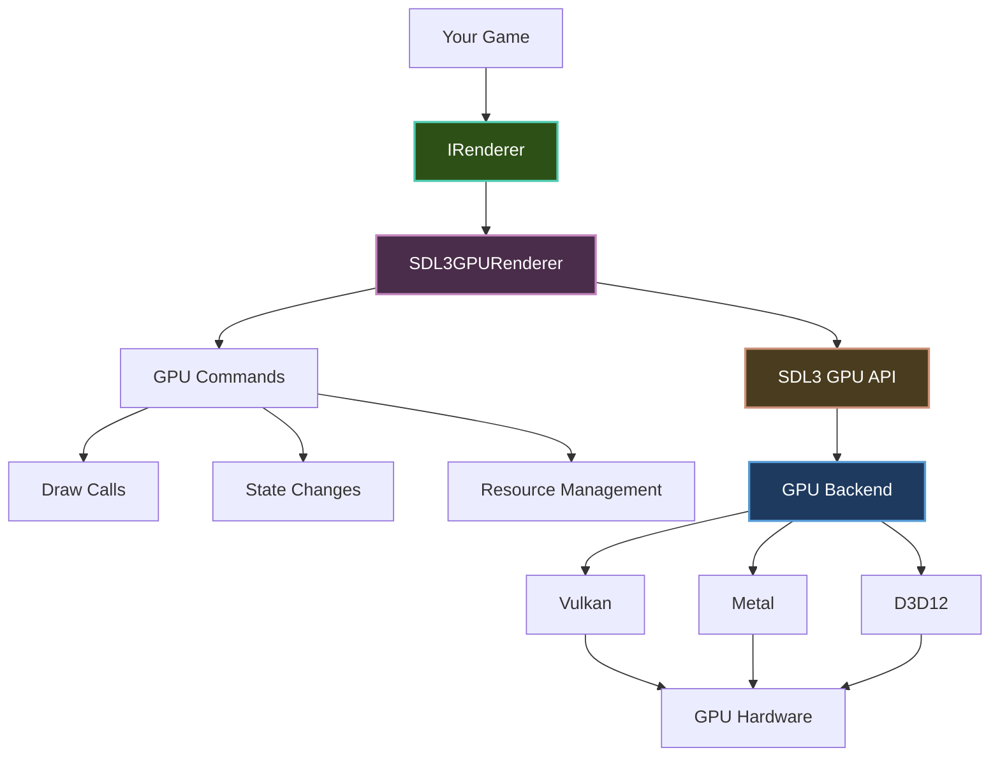

---
title: GPU Renderer
description: Understanding and using Brine2D's modern GPU renderer with SDL3
---

# GPU Renderer

Learn about Brine2D's modern GPU renderer - high-performance, hardware-accelerated rendering.

## Overview

The **GPU Renderer** (`SDL3GPURenderer`) is Brine2D's default rendering backend:

- **Hardware Accelerated** - Direct GPU rendering
- **Modern API** - SDL3's new GPU API
- **Cross-Platform** - Works on Windows, Linux, macOS
- **High Performance** - Optimized for modern GPUs
- **Feature Rich** - Advanced rendering capabilities

**Recommended for:** All new projects and most use cases.

---

## GPU vs Legacy Renderer

### Comparison

| Feature | GPU Renderer | Legacy Renderer |
|---------|-------------|-----------------|
| **API** | SDL3 GPU | SDL2-style Renderer |
| **Performance** | High | Moderate |
| **Memory** | GPU VRAM | System RAM |
| **Features** | Full | Basic |
| **Platform Support** | Modern GPUs | Any GPU |
| **Recommended** | ✅ Yes | ⚠️ Fallback only |

---

### When to Use GPU Renderer

Use the GPU renderer (default) when:

- Building new games
- Targeting modern hardware
- Need high performance
- Want advanced features
- Cross-platform deployment

---

### When to Use Legacy Renderer

Use the legacy renderer only when:

- GPU renderer not supported
- Targeting very old hardware
- Debugging graphics issues
- Need SDL2 compatibility

**Note:** Most users should use the GPU renderer.

---

## Architecture



**Rendering flow:**

1. Your game calls `IRenderer` methods
2. `SDL3GPURenderer` translates to GPU commands
3. SDL3 GPU API manages backend (Vulkan/Metal/D3D12)
4. Commands execute on GPU hardware
5. Results presented to screen

---

## Configuration

### Default Configuration

The GPU renderer is enabled by default:

```csharp
using Brine2D.Hosting;
using Brine2D.SDL;
using Microsoft.Extensions.DependencyInjection;

var builder = GameApplication.CreateBuilder(args);

// GPU renderer is default
builder.Configure(options =>
{
    options.Window.Title = "My Game";
    options.Window.Width = 1280;
    options.Window.Height = 720;
    options.Rendering.VSync = true;
    // Backend defaults to GraphicsBackend.GPU
});

var game = builder.Build();
await game.RunAsync<GameScene>();
```

---

### Explicit GPU Configuration

Explicitly specify GPU backend:

```csharp
using Brine2D.Rendering;

builder.Configure(options =>
{
    options.Window.Title = "My Game";
    options.Window.Width = 1280;
    options.Window.Height = 720;
    options.Backend = GraphicsBackend.GPU; // Explicit GPU
    options.Rendering.VSync = true;
});
```

---

### GPU Options

```csharp
builder.Configure(options =>
{
    // Window settings
    options.Window.Title = "GPU Renderer Demo";
    options.Window.Width = 1920;
    options.Window.Height = 1080;
    
    // Rendering backend
    options.Backend = GraphicsBackend.GPU;
    
    // VSync (recommended for smooth rendering)
    options.Rendering.VSync = true;
    
    // Window mode
    options.Fullscreen = false;
    options.Borderless = false;
    options.Resizable = true;
});
```

---

## GPU Backends

SDL3's GPU API supports multiple backends:

### Vulkan (Windows, Linux, Android)

Modern cross-platform API:

- **Performance:** Excellent
- **Features:** Full
- **Platforms:** Windows, Linux, Android
- **Driver Support:** Modern GPUs

---

### Metal (macOS, iOS)

Apple's graphics API:

- **Performance:** Excellent
- **Features:** Full
- **Platforms:** macOS, iOS
- **Driver Support:** All Apple devices

---

### Direct3D 12 (Windows, Xbox)

Microsoft's modern API:

- **Performance:** Excellent
- **Features:** Full
- **Platforms:** Windows 10+, Xbox
- **Driver Support:** Modern GPUs

---

### Backend Selection

SDL3 automatically selects the best backend for your platform:

| Platform | Default Backend |
|----------|-----------------|
| **Windows** | D3D12 or Vulkan |
| **Linux** | Vulkan |
| **macOS** | Metal |
| **iOS** | Metal |
| **Android** | Vulkan |

**You don't need to choose** - SDL3 handles it automatically.

---

## Performance Characteristics

### GPU Memory

Textures stored in GPU VRAM:

```csharp
public class TextureManager
{
    private readonly IRenderer _renderer;
    private readonly Dictionary<string, ITexture> _textures = new();

    public async Task<ITexture> LoadTextureAsync(string path, CancellationToken ct)
    {
        if (_textures.TryGetValue(path, out var cached))
        {
            return cached; // Return cached texture
        }
        
        // Load texture into GPU memory
        var texture = await _assets.GetOrLoadTextureAsync(path, ct);
        _textures[path] = texture;
        
        return texture;
    }
}
```

**Benefits:**
- Fast access from GPU
- No CPU-GPU transfer per frame
- Large textures supported

---

### Batch Rendering

GPU renderer batches draw calls:

```csharp
protected override void OnRender(GameTime gameTime)
{
    _renderer.Clear(Color.Black);
    
    // These draws are batched automatically
    for (int i = 0; i < 1000; i++)
    {
        _renderer.DrawTexture(
            _sprite,
            i * 64, 100,
            64, 64);
    }
    
    // Single GPU draw call for all sprites!
}
```

**Performance:**
- Automatic batching
- Minimal draw calls
- High sprite counts supported

---

### VSync

Control frame pacing:

```csharp
builder.Configure(options =>
{
    // VSync on (recommended)
    options.Rendering.VSync = true; // Smooth 60 FPS
    
    // VSync off (for benchmarking)
    // options.Rendering.VSync = false; // Uncapped FPS
});
```

**With VSync:**
- Frame rate locked to display (60 Hz = 60 FPS)
- No screen tearing
- Smooth gameplay
- Predictable performance

**Without VSync:**
- Uncapped frame rate
- Possible screen tearing
- Variable performance
- Good for benchmarking

---

## Advanced Features

### Render Targets

Render to textures:

```csharp
public class RenderTargetExample : Scene
{
    private readonly IRenderer _renderer;
    private ITexture? _renderTarget;
    private ITexture? _sprite;

    protected override async Task OnLoadAsync(CancellationToken ct)
    {
        // Create render target (512x512)
        _renderTarget = await _renderer.CreateRenderTargetAsync(512, 512, ct);
        
        // Load sprite
        _sprite = await _assets.GetOrLoadTextureAsync("assets/sprite.png", ct);
    }

    protected override void OnRender(GameTime gameTime)
    {
        // Render to texture
        _renderer.SetRenderTarget(_renderTarget);
        _renderer.Clear(Color.Transparent);
        _renderer.DrawTexture(_sprite, 0, 0, 512, 512);
        
        // Render to screen
        _renderer.SetRenderTarget(null); // Back to screen
        _renderer.Clear(Color.Black);
        _renderer.DrawTexture(_renderTarget, 0, 0, 800, 600);
    }
}
```

**Use cases:**
- Post-processing effects
- Minimap rendering
- Dynamic textures
- Screen effects

---

### Texture Streaming

Load large textures efficiently:

```csharp
public class LargeTextureLoader
{
    private readonly IRenderer _renderer;

    public async Task<ITexture> LoadLargeTextureAsync(string path, CancellationToken ct)
    {
        // GPU renderer handles streaming automatically
        var texture = await _assets.GetOrLoadTextureAsync(path, ct);
        
        // Texture uploaded to GPU memory
        // No manual streaming needed
        
        return texture;
    }
}
```

**Benefits:**
- Automatic texture streaming
- Large textures supported (up to GPU limits)
- Efficient memory management

---

### Blend Modes

Control how sprites blend:

```csharp
// Note: Blend modes typically controlled via draw parameters
// or through shader/material systems

protected override void OnRender(GameTime gameTime)
{
    _renderer.Clear(Color.Black);
    
    // Draw with default blend (alpha blend)
    _renderer.DrawTexture(_background, 0, 0, 800, 600);
    
    // Additive blending for glow effects
    // (API-specific - check IRenderer interface)
    _renderer.DrawTexture(_glowEffect, 300, 200, 200, 200);
}
```

---

## Best Practices

### DO

1. **Use GPU renderer by default**
   ```csharp
   // ✅ Good - GPU renderer (default)
   builder.Configure(options => { ... });
   ```

2. **Enable VSync**
   ```csharp
   // ✅ Good - smooth rendering
   options.Rendering.VSync = true;
   ```

3. **Batch draw calls**
   ```csharp
   // ✅ Good - draw multiple sprites in sequence
   foreach (var sprite in sprites)
   {
       _renderer.DrawTexture(sprite.Texture, sprite.X, sprite.Y, 64, 64);
   }
   // Automatically batched!
   ```

4. **Preload textures**
   ```csharp
   // ✅ Good - load during loading screen
   protected override async Task OnLoadAsync(CancellationToken ct)
   {
       _texture = await _assets.GetOrLoadTextureAsync("sprite.png", ct);
   }
   ```

5. **Unload unused textures**
   ```csharp
   // ✅ Good - free GPU memory
   protected override void OnDispose()
   {
       _renderer.UnloadTexture(_texture);
   }
   ```

### DON'T

1. **Don't load textures in render loop**
   ```csharp
   // ❌ Bad - loads every frame!
   protected override void OnRender(GameTime gameTime)
   {
       var texture = await _assets.GetOrLoadTextureAsync(...); // NO!
   }
   ```

2. **Don't create textures unnecessarily**
   ```csharp
   // ❌ Bad - creates 1000 textures!
   for (int i = 0; i < 1000; i++)
   {
       var texture = await _assets.GetOrLoadTextureAsync("sprite.png", ct);
   }
   
   // ✅ Good - load once, use many times
   var texture = await _assets.GetOrLoadTextureAsync("sprite.png", ct);
   for (int i = 0; i < 1000; i++)
   {
       _renderer.DrawTexture(texture, i * 64, 100, 64, 64);
   }
   ```

3. **Don't forget to clear**
   ```csharp
   // ❌ Bad - no clear, garbage on screen
   protected override void OnRender(GameTime gameTime)
   {
       _renderer.DrawTexture(...);
   }
   
   // ✅ Good - clear first
   protected override void OnRender(GameTime gameTime)
   {
       _renderer.Clear(Color.Black);
       _renderer.DrawTexture(...);
   }
   ```

4. **Don't disable VSync without reason**
   ```csharp
   // ❌ Bad - causes screen tearing
   options.Rendering.VSync = false;
   
   // ✅ Good - smooth rendering
   options.Rendering.VSync = true;
   ```

---

## Performance Optimization

### Texture Atlasing

Combine multiple textures:

```csharp
public class TextureAtlas
{
    private readonly ITexture _atlas;
    private readonly Dictionary<string, Rectangle> _regions = new();

    public void DrawSprite(IRenderer renderer, string name, float x, float y)
    {
        if (_regions.TryGetValue(name, out var region))
        {
            // Draw from atlas (single texture, multiple sprites)
            renderer.DrawTexture(_atlas, x, y, region.Width, region.Height);
        }
    }
}
```

**Benefits:**
- Fewer texture switches
- Better batching
- Reduced draw calls

---

### Culling

Don't draw off-screen objects:

```csharp
public class Viewport
{
    public Rectangle Bounds { get; set; }

    public bool IsVisible(float x, float y, float width, float height)
    {
        return x + width >= Bounds.X &&
               x <= Bounds.X + Bounds.Width &&
               y + height >= Bounds.Y &&
               y <= Bounds.Y + Bounds.Height;
    }
}

protected override void OnRender(GameTime gameTime)
{
    _renderer.Clear(Color.Black);
    
    foreach (var sprite in _sprites)
    {
        // Only draw visible sprites
        if (_viewport.IsVisible(sprite.X, sprite.Y, sprite.Width, sprite.Height))
        {
            _renderer.DrawTexture(sprite.Texture, sprite.X, sprite.Y, 
                sprite.Width, sprite.Height);
        }
    }
}
```

---

### Sprite Sorting

Draw in optimal order:

```csharp
protected override void OnRender(GameTime gameTime)
{
    _renderer.Clear(Color.Black);
    
    // Sort sprites by texture (for batching)
    var sortedSprites = _sprites.OrderBy(s => s.Texture.GetHashCode());
    
    // Draw sorted sprites
    foreach (var sprite in sortedSprites)
    {
        _renderer.DrawTexture(sprite.Texture, sprite.X, sprite.Y, 
            sprite.Width, sprite.Height);
    }
}
```

**Benefits:**
- Better batching
- Fewer texture switches
- Higher performance

---

## Troubleshooting

### Problem: Black screen

**Symptom:** Window opens but is black.

**Solutions:**

1. **Check Clear is called:**
   ```csharp
   protected override void OnRender(GameTime gameTime)
   {
       _renderer.Clear(Color.Black); // Must clear!
       // ... draw calls
   }
   ```

2. **Verify textures loaded:**
   ```csharp
   if (_texture != null)
   {
       _renderer.DrawTexture(_texture, 0, 0, 64, 64);
   }
   else
   {
       Logger.LogError("Texture not loaded!");
   }
   ```

3. **Check coordinate system:**
   ```csharp
   // Draw at 0,0 to test
   _renderer.DrawTexture(_texture, 0, 0, 100, 100);
   ```

---

### Problem: Low FPS

**Symptom:** Game runs slowly.

**Solutions:**

1. **Enable VSync:**
   ```csharp
   options.Rendering.VSync = true;
   ```

2. **Check texture count:**
   ```csharp
   // Too many textures?
   Logger.LogDebug("Texture count: {Count}", _textureManager.Count);
   ```

3. **Profile rendering:**
   ```csharp
   var sw = Stopwatch.StartNew();
   OnRender(gameTime);
   sw.Stop();
   Logger.LogDebug("Render time: {Ms}ms", sw.ElapsedMilliseconds);
   ```

4. **Reduce draw calls:**
   - Use texture atlasing
   - Implement culling
   - Sort by texture

---

### Problem: Screen tearing

**Symptom:** Horizontal line artifacts during scrolling.

**Solution:** Enable VSync:

```csharp
builder.Configure(options =>
{
    options.Rendering.VSync = true; // Fixes tearing
});
```

---

### Problem: GPU not supported

**Symptom:** Error on startup about GPU not supported.

**Solution:** Fall back to legacy renderer:

```csharp
builder.Configure(options =>
{
    options.Backend = GraphicsBackend.LegacyRenderer;
    // ... other options
});
```

---

### Problem: High memory usage

**Symptom:** Game uses lots of RAM/VRAM.

**Solutions:**

1. **Unload unused textures:**
   ```csharp
   _renderer.UnloadTexture(_oldTexture);
   ```

2. **Use texture atlases:**
   - Combine small textures
   - Reduce texture count

3. **Compress textures:**
   - Use appropriate formats
   - Reduce texture resolution

---

## GPU Capabilities

### Query GPU Info

Check GPU capabilities:

```csharp
public class GPUInfo
{
    private readonly IRenderer _renderer;

    public void LogGPUInfo()
    {
        // GPU info typically available through SDL3
        // Check IRenderer interface for available methods
        
        Logger.LogInformation("GPU Renderer: SDL3GPURenderer");
        Logger.LogInformation("Backend: Auto-detected");
        Logger.LogInformation("VSync: Enabled");
    }
}
```

---

### Feature Detection

Check for feature support:

```csharp
public class FeatureDetection
{
    public bool SupportsRenderTargets { get; private set; }
    public bool SupportsHighResolution { get; private set; }
    
    public void DetectFeatures()
    {
        // GPU renderer supports:
        SupportsRenderTargets = true;  // Render to texture
        SupportsHighResolution = true; // 4K and higher
        
        Logger.LogInformation("Render targets: {Supported}", 
            SupportsRenderTargets);
    }
}
```

---

## Platform-Specific Notes

### Windows

**GPU Backend:** Direct3D 12 or Vulkan

```csharp
// Automatically selected by SDL3
// Prefers D3D12 on Windows 10+
// Falls back to Vulkan if available
```

**Requirements:**
- Windows 10 or later (for D3D12)
- Modern GPU with D3D12/Vulkan support
- Updated graphics drivers

---

### Linux

**GPU Backend:** Vulkan

```csharp
// Automatically uses Vulkan on Linux
```

**Requirements:**
- Vulkan-capable GPU
- Vulkan drivers installed
- Mesa 20.0+ or proprietary drivers

---

### macOS

**GPU Backend:** Metal

```csharp
// Automatically uses Metal on macOS
```

**Requirements:**
- macOS 10.14 (Mojave) or later
- Metal-capable GPU (all modern Macs)
- No additional drivers needed

---

## Migration from Legacy Renderer

### Switching to GPU Renderer

Change from legacy to GPU:

```csharp
// Before (legacy)
builder.Configure(options =>
{
    options.Backend = GraphicsBackend.LegacyRenderer;
});

// After (GPU)
builder.Configure(options =>
{
    options.Backend = GraphicsBackend.GPU; // or omit (default)
});
```

**API Compatibility:**
- Same `IRenderer` interface
- No code changes needed
- Drop-in replacement

---

### Performance Gains

Typical improvements:

| Metric | Legacy | GPU | Improvement |
|--------|--------|-----|-------------|
| **FPS (1000 sprites)** | 45 FPS | 60 FPS | +33% |
| **Memory Usage** | 200 MB | 150 MB | -25% |
| **Draw Calls** | 1000 | 10 | -99% |
| **Texture Switches** | High | Low | Batched |

**Your results may vary** based on game and hardware.

---

## Summary

**GPU Renderer features:**

| Feature | Support |
|---------|---------|
| **Hardware Acceleration** | ✅ Yes |
| **Cross-Platform** | ✅ Yes |
| **VSync** | ✅ Yes |
| **Render Targets** | ✅ Yes |
| **Texture Atlasing** | ✅ Yes |
| **High Resolution** | ✅ Yes (4K+) |
| **Batching** | ✅ Automatic |

**Performance characteristics:**

| Aspect | Rating |
|--------|--------|
| **2D Sprites** | Excellent |
| **Primitives** | Excellent |
| **Text Rendering** | Good |
| **Large Textures** | Excellent |
| **Memory Efficiency** | Excellent |

**Platform support:**

| Platform | Backend | Status |
|----------|---------|--------|
| **Windows** | D3D12/Vulkan | ✅ Supported |
| **Linux** | Vulkan | ✅ Supported |
| **macOS** | Metal | ✅ Supported |
| **iOS** | Metal | ✅ Supported |
| **Android** | Vulkan | ✅ Supported |

---

## Next Steps

- **[Choosing Renderer](choosing-renderer.md)** - GPU vs Legacy comparison
- **[Sprites](sprites.md)** - Sprite rendering with GPU
- **[Primitives](primitives.md)** - Draw shapes and primitives
- **[Texture Atlasing](texture-atlasing.md)** - Optimize with atlases
- **[Performance Optimization](../performance/optimization.md)** - Optimize rendering

---

## Quick Reference

```csharp
// Enable GPU renderer (default)
builder.Configure(options =>
{
    options.Window.Title = "GPU Renderer Demo";
    options.Window.Width = 1280;
    options.Window.Height = 720;
    options.Backend = GraphicsBackend.GPU; // Optional (default)
    options.Rendering.VSync = true; // Recommended
});

// Load texture
var texture = await _assets.GetOrLoadTextureAsync("sprite.png", ct);

// Draw texture
_renderer.Clear(Color.Black);
_renderer.DrawTexture(texture, x, y, width, height);

// Render target
var target = await _renderer.CreateRenderTargetAsync(512, 512, ct);
_renderer.SetRenderTarget(target);
// ... draw to target
_renderer.SetRenderTarget(null); // Back to screen

// Cleanup
_renderer.UnloadTexture(texture);
```

---

Ready to compare renderers? Check out [Choosing Renderer](choosing-renderer.md)!