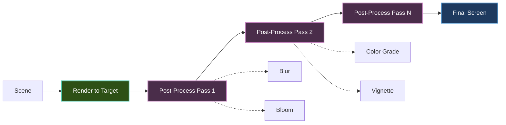

# Post-Processing Effects

Learn how to add cinematic screen-space effects to your Brine2D games using render targets.

## Overview

Post-processing effects are applied to the entire screen after the main scene is rendered:

- **Bloom** - Glowing light effects
- **Blur** - Motion blur, depth of field
- **Color Grading** - Color correction and filters
- **Vignette** - Darkened screen edges
- **Screen Shake** - Camera shake effects

**Powered by:** Render-to-texture pipeline with `IRenderTarget`

---

## Post-Processing Pipeline



**Process:**

1. Render scene to an off-screen render target
2. Apply post-processing effects in sequence
3. Draw the final result to the screen

---

## Setup

### Basic Render Target

Create a render target for post-processing using `CreateRenderTarget`:

```csharp
public class PostProcessScene : Scene
{
    private IRenderTarget? _offscreen;

    protected override async Task OnLoadAsync(CancellationToken ct, IProgress<float>? progress = null)
    {
        // CreateRenderTarget is synchronous
        _offscreen = Renderer.CreateRenderTarget(Renderer.Width, Renderer.Height);
    }

    protected override void OnRender(GameTime gameTime)
    {
        // Render scene to off-screen target
        Renderer.PushRenderTarget(_offscreen);
        Renderer.ClearColor = Color.Black;
        RenderScene(gameTime);
        Renderer.PopRenderTarget();

        // Draw the off-screen texture to the screen
        Renderer.DrawTexture(_offscreen!.Texture, 0, 0, Renderer.Width, Renderer.Height);
    }

    private void RenderScene(GameTime gameTime)
    {
        // Draw your game scene here
        Renderer.DrawRectangleFilled(100, 100, 200, 200, Color.Red);
        Renderer.DrawText("Hello!", 110, 110, Color.White);
    }

    protected override void OnExit()
    {
        _offscreen?.Dispose();
        _offscreen = null;
    }
}
```

!!! note "Key API differences"
    - `CreateRenderTarget(width, height)` is **synchronous** (not async)
    - Use `IRenderTarget` (not `ITexture`) for render targets
    - Access the drawable texture via `renderTarget.Texture`
    - Dispose render targets with `.Dispose()`, not an unload method

---

## Common Effects

### Grayscale Filter

Convert the scene to black and white:

```csharp
public class GrayscaleEffect
{
    public static void Apply(IDrawContext draw, IRenderTarget source,
        float x, float y, float width, float height)
    {
        // Note: Full grayscale requires shader support.
        // This draws the source texture - combine with a custom shader
        // for per-pixel color conversion.
        draw.DrawTexture(source.Texture, x, y, width, height);
    }
}
```

---

### Blur Effect

Apply Gaussian blur for depth of field or motion blur:

```csharp
public class BlurEffect
{
    private IRenderTarget? _tempTarget;

    public void Initialize(IRenderer renderer, int width, int height)
    {
        _tempTarget = renderer.CreateRenderTarget(width, height);
    }

    public void Apply(IRenderer renderer, IRenderTarget source, float strength = 1.0f)
    {
        // Two-pass Gaussian blur (horizontal + vertical)

        // Pass 1: Horizontal blur to temp target
        renderer.PushRenderTarget(_tempTarget);
        renderer.ClearColor = Color.Transparent;
        ApplyHorizontalBlur(renderer, source.Texture, strength);
        renderer.PopRenderTarget();

        // Pass 2: Vertical blur - draw temp back to source
        renderer.PushRenderTarget(source);
        renderer.ClearColor = Color.Transparent;
        ApplyVerticalBlur(renderer, _tempTarget!.Texture, strength);
        renderer.PopRenderTarget();
    }

    private void ApplyHorizontalBlur(IRenderer renderer, ITexture source, float strength)
    {
        // Implementation depends on shader support
        renderer.DrawTexture(source, 0, 0, source.Width, source.Height);
    }

    private void ApplyVerticalBlur(IRenderer renderer, ITexture source, float strength)
    {
        // Implementation depends on shader support
        renderer.DrawTexture(source, 0, 0, source.Width, source.Height);
    }

    public void Dispose() => _tempTarget?.Dispose();
}
```

---

### Bloom Effect

Combine bright-pass extraction with blur:

```csharp
public class BloomEffect
{
    private IRenderTarget? _brightPass;
    private IRenderTarget? _blurred;
    private readonly BlurEffect _blur = new();

    public void Initialize(IRenderer renderer, int width, int height)
    {
        _brightPass = renderer.CreateRenderTarget(width, height);
        _blurred = renderer.CreateRenderTarget(width, height);
        _blur.Initialize(renderer, width, height);
    }

    public void Apply(IRenderer renderer, IRenderTarget source,
        float threshold = 0.8f, float intensity = 1.0f)
    {
        // Step 1: Extract bright pixels
        renderer.PushRenderTarget(_brightPass);
        renderer.ClearColor = Color.Black;
        ExtractBrightPixels(renderer, source.Texture, threshold);
        renderer.PopRenderTarget();

        // Step 2: Blur bright pixels
        _blur.Apply(renderer, _brightPass!, strength: 2.0f);

        // Step 3: Draw bloom on top of scene (additive blend)
        renderer.SetBlendMode(BlendMode.Additive);
        renderer.DrawTexture(_brightPass!.Texture, 0, 0,
            source.Width, source.Height);
        renderer.SetBlendMode(BlendMode.Alpha);
    }

    private void ExtractBrightPixels(IRenderer renderer, ITexture source, float threshold)
    {
        // Requires shader support for brightness extraction
        renderer.DrawTexture(source, 0, 0, source.Width, source.Height);
    }

    public void Dispose()
    {
        _brightPass?.Dispose();
        _blurred?.Dispose();
        _blur.Dispose();
    }
}
```

---

### Vignette Effect

Darken screen edges using primitives:

```csharp
public class VignetteEffect
{
    public static void Apply(IDrawContext draw, int width, int height,
        float strength = 0.5f)
    {
        // Draw darkened borders using semi-transparent rectangles
        var alpha = (byte)(strength * 255);
        var edgeColor = new Color(0, 0, 0, alpha);
        var borderSize = Math.Min(width, height) * 0.15f;

        // Top
        draw.DrawRectangleFilled(0, 0, width, borderSize, edgeColor);
        // Bottom
        draw.DrawRectangleFilled(0, height - borderSize, width, borderSize, edgeColor);
        // Left
        draw.DrawRectangleFilled(0, 0, borderSize, height, edgeColor);
        // Right
        draw.DrawRectangleFilled(width - borderSize, 0, borderSize, height, edgeColor);
    }
}
```

---

### Color Grading

Adjust color temperature with tint overlays:

```csharp
public class ColorGradingEffect
{
    public static void Apply(IDrawContext draw, ITexture source,
        float width, float height, Color tint = default)
    {
        draw.DrawTexture(source, 0, 0, width, height);

        if (tint.A > 0)
        {
            draw.DrawRectangleFilled(0, 0, width, height, tint);
        }
    }

    public static void ApplySepia(IDrawContext draw, ITexture source,
        float width, float height)
    {
        Apply(draw, source, width, height,
            tint: new Color(255, 240, 200, 20));
    }
}
```

---

## Screen Shake

Camera shake effect without shaders:

```csharp
public class ScreenShake
{
    private float _trauma;
    private readonly Random _random = new();
    private const float TraumaDecay = 2.0f;
    private const float MaxShake = 10f;

    public void AddTrauma(float amount)
    {
        _trauma = Math.Clamp(_trauma + amount, 0f, 1f);
    }

    public void Update(GameTime gameTime)
    {
        var deltaTime = (float)gameTime.DeltaTime;
        _trauma = Math.Max(0f, _trauma - TraumaDecay * deltaTime);
    }

    public Vector2 GetOffset()
    {
        if (_trauma <= 0f) return Vector2.Zero;

        var shake = _trauma * _trauma; // Quadratic falloff
        var offsetX = (float)(_random.NextDouble() * 2 - 1) * MaxShake * shake;
        var offsetY = (float)(_random.NextDouble() * 2 - 1) * MaxShake * shake;

        return new Vector2(offsetX, offsetY);
    }
}

// Usage in a scene
public class GameScene : Scene
{
    private readonly ScreenShake _screenShake = new();

    protected override void OnUpdate(GameTime gameTime)
    {
        _screenShake.Update(gameTime);

        // Trigger on explosion
        if (_explosionOccurred)
            _screenShake.AddTrauma(0.5f);
    }

    protected override void OnRender(GameTime gameTime)
    {
        var offset = _screenShake.GetOffset();

        // Apply offset to camera or directly to draw positions
        if (Renderer.Camera is Camera2D cam)
        {
            cam.Position += offset;
        }

        RenderScene();
    }
}
```

---

## Multi-Pass Pipeline

Chain multiple effects using ping-pong render targets:

```csharp
public class PostProcessPipeline
{
    private readonly List<Action<IRenderer, IRenderTarget>> _effects = new();
    private IRenderTarget? _pingPong1;
    private IRenderTarget? _pingPong2;

    public void Initialize(IRenderer renderer, int width, int height)
    {
        _pingPong1 = renderer.CreateRenderTarget(width, height);
        _pingPong2 = renderer.CreateRenderTarget(width, height);
    }

    public void AddEffect(Action<IRenderer, IRenderTarget> effect)
    {
        _effects.Add(effect);
    }

    public void Process(IRenderer renderer, IRenderTarget source)
    {
        if (_effects.Count == 0) return;

        var targets = new[] { _pingPong1!, _pingPong2! };
        var current = source;

        for (int i = 0; i < _effects.Count; i++)
        {
            var target = targets[i % 2];

            renderer.PushRenderTarget(target);
            renderer.ClearColor = Color.Transparent;
            _effects[i](renderer, current);
            renderer.PopRenderTarget();

            current = target;
        }

        // Draw final result to screen
        renderer.DrawTexture(current.Texture, 0, 0,
            source.Width, source.Height);
    }

    public void Dispose()
    {
        _pingPong1?.Dispose();
        _pingPong2?.Dispose();
    }
}
```

**Usage:**

```csharp
public class GameScene : Scene
{
    private IRenderTarget? _sceneTarget;
    private PostProcessPipeline? _pipeline;

    protected override async Task OnLoadAsync(CancellationToken ct, IProgress<float>? progress = null)
    {
        _sceneTarget = Renderer.CreateRenderTarget(Renderer.Width, Renderer.Height);
        _pipeline = new PostProcessPipeline();
        _pipeline.Initialize(Renderer, Renderer.Width, Renderer.Height);

        // Add effects
        _pipeline.AddEffect((r, src) =>
        {
            r.DrawTexture(src.Texture, 0, 0, src.Width, src.Height);
            VignetteEffect.Apply(r, src.Width, src.Height, 0.4f);
        });
    }

    protected override void OnRender(GameTime gameTime)
    {
        // Render scene to off-screen target
        Renderer.PushRenderTarget(_sceneTarget);
        Renderer.ClearColor = Color.Black;
        RenderScene(gameTime);
        Renderer.PopRenderTarget();

        // Apply effects and draw to screen
        _pipeline!.Process(Renderer, _sceneTarget!);
    }

    protected override void OnExit()
    {
        _pipeline?.Dispose();
        _sceneTarget?.Dispose();
    }
}
```

---

## Performance Optimization

### Resolution Scaling

Render effects at lower resolution for better performance:

```csharp
const float ResolutionScale = 0.5f; // 50% resolution

var lowResWidth = (int)(Renderer.Width * ResolutionScale);
var lowResHeight = (int)(Renderer.Height * ResolutionScale);
var lowResTarget = Renderer.CreateRenderTarget(lowResWidth, lowResHeight);
```

### Quality Settings

Toggle effects based on hardware capability:

```csharp
public class PostProcessQuality
{
    public bool EnableBloom { get; set; } = true;
    public bool EnableVignette { get; set; } = true;
    public float ResolutionScale { get; set; } = 1.0f;

    public static PostProcessQuality Low => new()
    {
        EnableBloom = false,
        EnableVignette = true,
        ResolutionScale = 0.5f
    };

    public static PostProcessQuality High => new()
    {
        EnableBloom = true,
        EnableVignette = true,
        ResolutionScale = 1.0f
    };
}
```

---

## Troubleshooting

### Problem: Black screen after adding post-processing

**Solutions:**

1. **Ensure `PopRenderTarget` matches `PushRenderTarget`:**
   ```csharp
   Renderer.PushRenderTarget(_offscreen);
   DrawScene();
   Renderer.PopRenderTarget(); // Must pop!
   Renderer.DrawTexture(_offscreen.Texture, 0, 0, width, height);
   ```

2. **Draw the render target's Texture, not the target itself:**
   ```csharp
   // ✅ Correct
   Renderer.DrawTexture(_offscreen.Texture, 0, 0, width, height);
   ```

3. **Verify the render target was created successfully:**
   ```csharp
   if (_offscreen == null)
   {
       Logger.LogError("Render target not created!");
   }
   ```

---

### Problem: Poor performance

**Solutions:**

1. **Use lower resolution** for expensive effects (50% = 4× faster)
2. **Limit to 2–3 effect passes** maximum
3. **Toggle effects based on hardware** or user settings
4. **Minimize render target switches** - each switch flushes the sprite batch

---

### Problem: Visible artifacts

**Solutions:**

1. Use higher bit depth render targets for gradient-heavy effects
2. Add subtle noise (dithering) to break up banding
3. Increase blur sample count for smoother gradients

---

## Best Practices

| Practice | Why |
|----------|-----|
| ✅ Create render targets once in `OnLoadAsync` | Avoid per-frame allocation |
| ✅ Dispose render targets in `OnExit` | Prevent GPU memory leaks |
| ✅ Use `PushRenderTarget` / `PopRenderTarget` | Safer than manual Set/Get |
| ✅ Use lower resolution for expensive effects | Significant performance gain |
| ✅ Make effects toggleable | Let users control quality |
| ❌ Don't create render targets per frame | Major performance cost |
| ❌ Don't forget to pop render targets | Causes rendering to wrong target |
| ❌ Don't chain too many passes | Diminishing visual returns |

---

## Next Steps

- **[GPU Renderer](gpu-renderer.md)** - Render targets, scissor rects, blend modes
- **[Sprites](sprites.md)** - Sprite rendering basics
- **[Cameras](cameras.md)** - Camera effects and shake
- **[Performance](../performance/optimization.md)** - Optimize rendering

---

## Quick Reference

```csharp
// Create render targets (synchronous)
var offscreen = Renderer.CreateRenderTarget(1280, 720);

// Render to target (push/pop)
Renderer.PushRenderTarget(offscreen);
Renderer.ClearColor = Color.Black;
RenderScene();
Renderer.PopRenderTarget();

// Draw result to screen
Renderer.DrawTexture(offscreen.Texture, 0, 0, 1280, 720);

// Additive blend for bloom
Renderer.SetBlendMode(BlendMode.Additive);
Renderer.DrawTexture(bloomTexture, 0, 0, 1280, 720);
Renderer.SetBlendMode(BlendMode.Alpha); // Restore

// Dispose when done
offscreen.Dispose();
```
