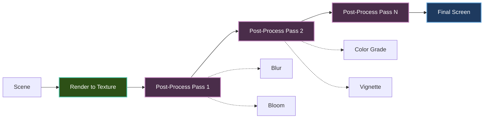

---
title: Post-Processing Effects
description: Add screen-space effects like bloom, blur, and color grading to your Brine2D games
---

# Post-Processing Effects

Learn how to add cinematic screen-space effects to your Brine2D games using render targets and shaders.

## Overview

Post-processing effects are applied to the entire screen after the main scene is rendered:

- **Bloom** - Glowing light effects
- **Blur** - Motion blur, depth of field
- **Color Grading** - Color correction and filters
- **Vignette** - Darkened screen edges
- **Chromatic Aberration** - Color fringing
- **Screen Shake** - Camera shake effects
- **Custom Shaders** - Unlimited possibilities

**Powered by:** Render-to-texture pipeline

---

## Post-Processing Pipeline



**Process:**

1. Render scene to off-screen texture
2. Apply post-processing effects in sequence
3. Display final result to screen

---

## Setup

### Basic Render Target

Create a render target for post-processing:

```csharp
using Brine2D.Core;
using Brine2D.Engine;
using Brine2D.Rendering;
using Microsoft.Extensions.Logging;

public class PostProcessScene : Scene
{
    private readonly IRenderer _renderer;
    private ITexture? _renderTarget;
    private readonly int _screenWidth = 1280;
    private readonly int _screenHeight = 720;

    public PostProcessScene(
        IRenderer renderer,
        ILogger<PostProcessScene> logger)
    {
        _renderer = renderer;
    }

    protected override async Task OnLoadAsync(CancellationToken ct)
    {
        // Create render target matching screen size
        _renderTarget = await _renderer.CreateRenderTargetAsync(
            _screenWidth,
            _screenHeight,
            ct);
    }

    protected override void OnRender(GameTime gameTime)
    {
        // Render scene to texture
        _renderer.SetRenderTarget(_renderTarget);
        _renderer.Clear(Color.Black);
        RenderScene(gameTime);
        
        // Apply post-processing and render to screen
        _renderer.SetRenderTarget(null);
        _renderer.Clear(Color.Black);
        _renderer.DrawTexture(_renderTarget, 0, 0, _screenWidth, _screenHeight);
    }
    
    private void RenderScene(GameTime gameTime)
    {
        // Draw your game scene here
    }

    protected override void OnDispose()
    {
        _renderer.UnloadTexture(_renderTarget);
    }
}
```

---

## Common Effects

### Grayscale Filter

Convert the scene to black and white:

```csharp
public class GrayscaleEffect
{
    public static void Apply(IRenderer renderer, ITexture source, 
        float x, float y, float width, float height)
    {
        // Note: This is conceptual - actual implementation depends on
        // shader support in your renderer
        
        // Grayscale formula: gray = 0.299*R + 0.587*G + 0.114*B
        // Applied per-pixel via shader or software
        
        renderer.DrawTexture(source, x, y, width, height);
    }
}
```

---

### Blur Effect

Apply Gaussian blur for depth of field or motion blur:

```csharp
public class BlurEffect
{
    private readonly IRenderer _renderer;
    private ITexture? _tempTarget;

    public async Task InitializeAsync(int width, int height, CancellationToken ct)
    {
        // Create temporary render target for two-pass blur
        _tempTarget = await _renderer.CreateRenderTargetAsync(width, height, ct);
    }

    public void Apply(ITexture source, ITexture destination, float strength = 1.0f)
    {
        // Two-pass Gaussian blur (horizontal + vertical)
        
        // Pass 1: Horizontal blur to temp target
        _renderer.SetRenderTarget(_tempTarget);
        _renderer.Clear(Color.Transparent);
        ApplyHorizontalBlur(source, strength);
        
        // Pass 2: Vertical blur to destination
        _renderer.SetRenderTarget(destination);
        _renderer.Clear(Color.Transparent);
        ApplyVerticalBlur(_tempTarget, strength);
    }
    
    private void ApplyHorizontalBlur(ITexture source, float strength)
    {
        // Apply horizontal blur pass
        // (Implementation depends on shader support)
        _renderer.DrawTexture(source, 0, 0, source.Width, source.Height);
    }
    
    private void ApplyVerticalBlur(ITexture source, float strength)
    {
        // Apply vertical blur pass
        // (Implementation depends on shader support)
        _renderer.DrawTexture(source, 0, 0, source.Width, source.Height);
    }
}
```

---

### Vignette Effect

Darken screen edges:

```csharp
public class VignetteEffect
{
    private readonly IRenderer _renderer;

    public VignetteEffect(IRenderer renderer)
    {
        _renderer = renderer;
    }

    public void Apply(ITexture source, float intensity = 0.5f, float softness = 0.5f)
    {
        // Draw original scene
        _renderer.DrawTexture(source, 0, 0, source.Width, source.Height);
        
        // Draw vignette overlay
        DrawVignette(source.Width, source.Height, intensity, softness);
    }
    
    private void DrawVignette(int width, int height, float intensity, float softness)
    {
        // Draw radial gradient from edges to center
        // Center is transparent, edges are dark
        
        var centerX = width / 2f;
        var centerY = height / 2f;
        var maxRadius = Math.Max(width, height) / 2f;
        
        // Draw darkened rectangle overlay with gradient
        // (Simplified - full implementation would use shader or multiple quads)
        var alpha = (byte)(255 * intensity);
        _renderer.DrawRectangleFilled(0, 0, width, height, new Color(0, 0, 0, alpha));
    }
}
```

---

### Bloom Effect

Add glowing highlights:

```csharp
public class BloomEffect
{
    private readonly IRenderer _renderer;
    private ITexture? _brightPass;
    private ITexture? _blurred;
    private readonly BlurEffect _blur;

    public BloomEffect(IRenderer renderer)
    {
        _renderer = renderer;
        _blur = new BlurEffect(renderer);
    }

    public async Task InitializeAsync(int width, int height, CancellationToken ct)
    {
        // Create render targets
        _brightPass = await _renderer.CreateRenderTargetAsync(width, height, ct);
        _blurred = await _renderer.CreateRenderTargetAsync(width, height, ct);
        await _blur.InitializeAsync(width, height, ct);
    }

    public void Apply(ITexture source, float threshold = 0.8f, float intensity = 1.0f)
    {
        // Step 1: Extract bright pixels
        _renderer.SetRenderTarget(_brightPass);
        _renderer.Clear(Color.Black);
        ExtractBrightPixels(source, threshold);
        
        // Step 2: Blur bright pixels
        _blur.Apply(_brightPass, _blurred, strength: 2.0f);
        
        // Step 3: Combine with original
        _renderer.SetRenderTarget(null);
        _renderer.Clear(Color.Black);
        
        // Draw original
        _renderer.DrawTexture(source, 0, 0, source.Width, source.Height);
        
        // Draw bloom on top (additive blend)
        // Note: Additive blending requires blend mode support
        _renderer.DrawTexture(_blurred, 0, 0, source.Width, source.Height);
    }
    
    private void ExtractBrightPixels(ITexture source, float threshold)
    {
        // Only render pixels brighter than threshold
        // (Requires shader support for brightness extraction)
        _renderer.DrawTexture(source, 0, 0, source.Width, source.Height);
    }
}
```

---

### Color Grading

Adjust color temperature and tint:

```csharp
public class ColorGradingEffect
{
    private readonly IRenderer _renderer;

    public ColorGradingEffect(IRenderer renderer)
    {
        _renderer = renderer;
    }

    public void Apply(ITexture source, 
        float brightness = 1.0f,
        float contrast = 1.0f,
        float saturation = 1.0f,
        Color tint = default)
    {
        // Draw source with color adjustments
        // (Requires shader support for per-pixel color math)
        
        // Simplified: Draw with tint overlay
        _renderer.DrawTexture(source, 0, 0, source.Width, source.Height);
        
        if (tint.A > 0)
        {
            // Apply tint overlay
            _renderer.DrawRectangleFilled(0, 0, source.Width, source.Height, tint);
        }
    }
    
    public void ApplySepia(ITexture source)
    {
        // Sepia tone effect
        Apply(source, 
            brightness: 1.1f,
            contrast: 1.0f,
            saturation: 0.5f,
            tint: new Color(255, 240, 200, 20));
    }
}
```

---

### Chromatic Aberration

Add color fringing for retro or damaged lens effect:

```csharp
public class ChromaticAberrationEffect
{
    private readonly IRenderer _renderer;

    public ChromaticAberrationEffect(IRenderer renderer)
    {
        _renderer = renderer;
    }

    public void Apply(ITexture source, float strength = 2.0f)
    {
        // Offset red, green, blue channels slightly
        var width = source.Width;
        var height = source.Height;
        var offset = strength;
        
        // Draw red channel offset left
        // Draw green channel centered
        // Draw blue channel offset right
        // (Requires shader support or multiple draw calls with blend modes)
        
        // Simplified: Draw with slight offset
        _renderer.DrawTexture(source, -offset, 0, width, height);
        _renderer.DrawTexture(source, 0, 0, width, height);
        _renderer.DrawTexture(source, offset, 0, width, height);
    }
}
```

---

## Screen Shake

Camera shake effect without shaders:

```csharp
public class ScreenShake
{
    private float _trauma = 0f;
    private readonly Random _random = new();
    private const float TraumaDecay = 2.0f;
    private const float MaxShake = 10f;

    public void AddTrauma(float amount)
    {
        _trauma = Math.Clamp(_trauma + amount, 0f, 1f);
    }

    public void Update(GameTime gameTime)
    {
        // Decay trauma over time
        var deltaTime = (float)gameTime.DeltaTime;
        _trauma = Math.Max(0f, _trauma - TraumaDecay * deltaTime);
    }

    public Vector2 GetOffset()
    {
        if (_trauma <= 0f)
            return Vector2.Zero;
        
        // Shake strength is trauma squared
        var shake = _trauma * _trauma;
        
        // Random offset
        var offsetX = (float)(_random.NextDouble() * 2 - 1) * MaxShake * shake;
        var offsetY = (float)(_random.NextDouble() * 2 - 1) * MaxShake * shake;
        
        return new Vector2(offsetX, offsetY);
    }
    
    public float GetRotation()
    {
        if (_trauma <= 0f)
            return 0f;
        
        var shake = _trauma * _trauma;
        return (float)(_random.NextDouble() * 2 - 1) * 5f * shake; // Max 5 degrees
    }
}

// Usage in scene
public class GameScene : Scene
{
    private readonly ScreenShake _screenShake = new();
    private ITexture? _renderTarget;

    protected override void OnUpdate(GameTime gameTime)
    {
        _screenShake.Update(gameTime);
        
        // Add trauma on events
        if (PlayerHit())
        {
            _screenShake.AddTrauma(0.5f);
        }
    }

    protected override void OnRender(GameTime gameTime)
    {
        // Render to texture
        _renderer.SetRenderTarget(_renderTarget);
        _renderer.Clear(Color.Black);
        RenderScene(gameTime);
        
        // Draw to screen with shake offset
        _renderer.SetRenderTarget(null);
        _renderer.Clear(Color.Black);
        
        var offset = _screenShake.GetOffset();
        _renderer.DrawTexture(_renderTarget, 
            offset.X, offset.Y,
            _screenWidth, _screenHeight);
    }
}
```

---

## Multi-Pass Effects

Combine multiple effects:

```csharp
public class PostProcessPipeline
{
    private readonly IRenderer _renderer;
    private readonly List<IPostProcessEffect> _effects = new();
    private readonly Queue<ITexture> _renderTargets = new();
    
    private ITexture? _pingPong1;
    private ITexture? _pingPong2;

    public PostProcessPipeline(IRenderer renderer)
    {
        _renderer = renderer;
    }

    public async Task InitializeAsync(int width, int height, CancellationToken ct)
    {
        // Create ping-pong buffers
        _pingPong1 = await _renderer.CreateRenderTargetAsync(width, height, ct);
        _pingPong2 = await _renderer.CreateRenderTargetAsync(width, height, ct);
        
        _renderTargets.Enqueue(_pingPong1);
        _renderTargets.Enqueue(_pingPong2);
    }

    public void AddEffect(IPostProcessEffect effect)
    {
        _effects.Add(effect);
    }

    public void Process(ITexture source, ITexture destination)
    {
        if (_effects.Count == 0)
        {
            // No effects, just copy source to destination
            _renderer.SetRenderTarget(destination);
            _renderer.Clear(Color.Black);
            _renderer.DrawTexture(source, 0, 0, source.Width, source.Height);
            return;
        }
        
        var current = source;
        
        // Apply each effect
        for (int i = 0; i < _effects.Count; i++)
        {
            var effect = _effects[i];
            var isLast = i == _effects.Count - 1;
            var target = isLast ? destination : GetNextRenderTarget();
            
            _renderer.SetRenderTarget(target);
            _renderer.Clear(Color.Transparent);
            effect.Apply(current);
            
            current = target;
        }
    }
    
    private ITexture GetNextRenderTarget()
    {
        // Ping-pong between buffers
        var target = _renderTargets.Dequeue();
        _renderTargets.Enqueue(target);
        return target;
    }
}

// Effect interface
public interface IPostProcessEffect
{
    void Apply(ITexture source);
}

// Example usage
public class GameScene : Scene
{
    private readonly PostProcessPipeline _pipeline;
    private ITexture? _sceneTarget;
    private ITexture? _finalTarget;

    protected override async Task OnLoadAsync(CancellationToken ct)
    {
        _sceneTarget = await _renderer.CreateRenderTargetAsync(1280, 720, ct);
        _finalTarget = await _renderer.CreateRenderTargetAsync(1280, 720, ct);
        
        await _pipeline.InitializeAsync(1280, 720, ct);
        
        // Add effects in order
        _pipeline.AddEffect(new BloomEffect(_renderer));
        _pipeline.AddEffect(new VignetteEffect(_renderer));
        _pipeline.AddEffect(new ColorGradingEffect(_renderer));
    }

    protected override void OnRender(GameTime gameTime)
    {
        // Render scene to texture
        _renderer.SetRenderTarget(_sceneTarget);
        _renderer.Clear(Color.Black);
        RenderScene(gameTime);
        
        // Apply post-processing
        _pipeline.Process(_sceneTarget, _finalTarget);
        
        // Draw final result to screen
        _renderer.SetRenderTarget(null);
        _renderer.Clear(Color.Black);
        _renderer.DrawTexture(_finalTarget, 0, 0, 1280, 720);
    }
}
```

---

## Performance Optimization

### Resolution Scaling

Render effects at lower resolution:

```csharp
public class PerformancePostProcess
{
    private readonly IRenderer _renderer;
    private ITexture? _lowResTarget;
    private const float ResolutionScale = 0.5f; // 50% resolution

    public async Task InitializeAsync(int screenWidth, int screenHeight, CancellationToken ct)
    {
        // Create lower resolution render target
        var lowResWidth = (int)(screenWidth * ResolutionScale);
        var lowResHeight = (int)(screenHeight * ResolutionScale);
        
        _lowResTarget = await _renderer.CreateRenderTargetAsync(
            lowResWidth, lowResHeight, ct);
    }

    public void ApplyBlur(ITexture source, ITexture destination)
    {
        // Step 1: Downsample to low res
        _renderer.SetRenderTarget(_lowResTarget);
        _renderer.Clear(Color.Black);
        _renderer.DrawTexture(source, 0, 0, 
            _lowResTarget.Width, _lowResTarget.Height);
        
        // Step 2: Apply blur at low resolution
        // (Much faster!)
        ApplyBlurEffect(_lowResTarget);
        
        // Step 3: Upsample to full resolution
        _renderer.SetRenderTarget(destination);
        _renderer.Clear(Color.Black);
        _renderer.DrawTexture(_lowResTarget, 0, 0,
            destination.Width, destination.Height);
    }
}
```

---

### Effect Toggle

Enable/disable effects dynamically:

```csharp
public class ConfigurablePostProcess
{
    public bool EnableBloom { get; set; } = true;
    public bool EnableVignette { get; set; } = true;
    public bool EnableColorGrading { get; set; } = true;
    
    private readonly BloomEffect _bloom;
    private readonly VignetteEffect _vignette;
    private readonly ColorGradingEffect _colorGrading;

    public void Apply(ITexture source)
    {
        var current = source;
        
        // Apply only enabled effects
        if (EnableBloom)
        {
            _bloom.Apply(current);
            current = _bloom.Output;
        }
        
        if (EnableVignette)
        {
            _vignette.Apply(current);
            current = _vignette.Output;
        }
        
        if (EnableColorGrading)
        {
            _colorGrading.Apply(current);
            current = _colorGrading.Output;
        }
    }
}

// Quality settings
public class PostProcessQuality
{
    public static PostProcessQuality Low => new()
    {
        EnableBloom = false,
        EnableVignette = true,
        EnableColorGrading = false,
        ResolutionScale = 0.5f
    };
    
    public static PostProcessQuality Medium => new()
    {
        EnableBloom = true,
        EnableVignette = true,
        EnableColorGrading = false,
        ResolutionScale = 0.75f
    };
    
    public static PostProcessQuality High => new()
    {
        EnableBloom = true,
        EnableVignette = true,
        EnableColorGrading = true,
        ResolutionScale = 1.0f
    };
    
    public bool EnableBloom { get; init; }
    public bool EnableVignette { get; init; }
    public bool EnableColorGrading { get; init; }
    public float ResolutionScale { get; init; }
}
```

---

## Complete Example

Full post-processing scene:

```csharp
using Brine2D.Core;
using Brine2D.Engine;
using Brine2D.Input;
using Brine2D.Rendering;
using Microsoft.Extensions.Logging;
using System.Numerics;

public class PostProcessDemoScene : Scene
{
    private readonly IRenderer _renderer;
    private readonly IInputContext _input;
    
    private ITexture? _sceneTarget;
    private ITexture? _finalTarget;
    
    private readonly ScreenShake _screenShake = new();
    private readonly List<Particle> _particles = new();
    
    private bool _enableVignette = true;
    private bool _enableScreenShake = true;
    private float _vignetteIntensity = 0.5f;

    public PostProcessDemoScene(
        IRenderer renderer,
        IInputContext input,
        ILogger<PostProcessDemoScene> logger)
    {
        _renderer = renderer;
        _input = input;
    }

    protected override async Task OnLoadAsync(CancellationToken ct)
    {
        // Create render targets
        _sceneTarget = await _renderer.CreateRenderTargetAsync(1280, 720, ct);
        _finalTarget = await _renderer.CreateRenderTargetAsync(1280, 720, ct);
        
        // Spawn some particles
        var random = new Random();
        for (int i = 0; i < 100; i++)
        {
            _particles.Add(new Particle
            {
                Position = new Vector2(
                    random.Next(0, 1280),
                    random.Next(0, 720)),
                Velocity = new Vector2(
                    (float)(random.NextDouble() * 100 - 50),
                    (float)(random.NextDouble() * 100 - 50)),
                Color = Color.White,
                Size = random.Next(2, 8)
            });
        }
    }

    protected override void OnUpdate(GameTime gameTime)
    {
        var deltaTime = (float)gameTime.DeltaTime;
        
        // Update screen shake
        if (_enableScreenShake)
        {
            _screenShake.Update(gameTime);
        }
        
        // Update particles
        foreach (var particle in _particles)
        {
            particle.Position += particle.Velocity * deltaTime;
            
            // Wrap around screen
            if (particle.Position.X < 0) particle.Position.X += 1280;
            if (particle.Position.X > 1280) particle.Position.X -= 1280;
            if (particle.Position.Y < 0) particle.Position.Y += 720;
            if (particle.Position.Y > 720) particle.Position.Y -= 720;
        }
        
        // Toggle effects
        if (_input.IsKeyPressed(Key.V))
        {
            _enableVignette = !_enableVignette;
            Logger.LogInformation("Vignette: {Status}", 
                _enableVignette ? "ON" : "OFF");
        }
        
        if (_input.IsKeyPressed(Key.S))
        {
            _enableScreenShake = !_enableScreenShake;
            Logger.LogInformation("Screen Shake: {Status}",
                _enableScreenShake ? "ON" : "OFF");
        }
        
        // Add trauma on space
        if (_input.IsKeyPressed(Key.Space))
        {
            _screenShake.AddTrauma(0.8f);
        }
        
        // Adjust vignette intensity
        if (_input.IsKeyDown(Key.Up))
        {
            _vignetteIntensity = Math.Min(1.0f, _vignetteIntensity + 0.01f);
        }
        if (_input.IsKeyDown(Key.Down))
        {
            _vignetteIntensity = Math.Max(0.0f, _vignetteIntensity - 0.01f);
        }
    }

    protected override void OnRender(GameTime gameTime)
    {
        // Step 1: Render scene to texture
        _renderer.SetRenderTarget(_sceneTarget);
        _renderer.Clear(new Color(10, 10, 20));
        RenderScene();
        
        // Step 2: Apply post-processing
        _renderer.SetRenderTarget(_finalTarget);
        _renderer.Clear(Color.Black);
        
        // Draw scene
        _renderer.DrawTexture(_sceneTarget, 0, 0, 1280, 720);
        
        // Apply vignette
        if (_enableVignette)
        {
            ApplyVignette(_vignetteIntensity);
        }
        
        // Step 3: Draw to screen with shake
        _renderer.SetRenderTarget(null);
        _renderer.Clear(Color.Black);
        
        var offset = _enableScreenShake ? _screenShake.GetOffset() : Vector2.Zero;
        _renderer.DrawTexture(_finalTarget,
            offset.X, offset.Y,
            1280, 720);
        
        // Draw UI (not affected by post-processing)
        DrawUI();
    }
    
    private void RenderScene()
    {
        // Draw particles
        foreach (var particle in _particles)
        {
            _renderer.DrawRectangleFilled(
                particle.Position.X - particle.Size / 2,
                particle.Position.Y - particle.Size / 2,
                particle.Size, particle.Size,
                particle.Color);
        }
    }
    
    private void ApplyVignette(float intensity)
    {
        // Draw radial gradient overlay
        var alpha = (byte)(255 * intensity);
        
        // Draw gradient quads from edges
        // (Simplified - full implementation would use many quads or shader)
        var edgeWidth = 200;
        
        // Left edge
        _renderer.DrawRectangleFilled(0, 0, edgeWidth, 720,
            new Color(0, 0, 0, alpha));
        
        // Right edge
        _renderer.DrawRectangleFilled(1280 - edgeWidth, 0, edgeWidth, 720,
            new Color(0, 0, 0, alpha));
        
        // Top edge
        _renderer.DrawRectangleFilled(0, 0, 1280, edgeWidth,
            new Color(0, 0, 0, alpha));
        
        // Bottom edge
        _renderer.DrawRectangleFilled(0, 720 - edgeWidth, 1280, edgeWidth,
            new Color(0, 0, 0, alpha));
    }
    
    private void DrawUI()
    {
        _renderer.DrawText("Post-Processing Demo", 10, 10, Color.White);
        _renderer.DrawText($"V: Toggle Vignette ({(_enableVignette ? "ON" : "OFF")})", 
            10, 30, Color.White);
        _renderer.DrawText($"S: Toggle Screen Shake ({(_enableScreenShake ? "ON" : "OFF")})", 
            10, 50, Color.White);
        _renderer.DrawText("Space: Trigger Shake", 10, 70, Color.White);
        _renderer.DrawText($"Up/Down: Vignette Intensity ({_vignetteIntensity:F2})", 
            10, 90, Color.White);
    }

    protected override void OnDispose()
    {
        _renderer.UnloadTexture(_sceneTarget);
        _renderer.UnloadTexture(_finalTarget);
    }
}

public class Particle
{
    public Vector2 Position { get; set; }
    public Vector2 Velocity { get; set; }
    public Color Color { get; set; }
    public int Size { get; set; }
}
```

---

## Best Practices

### DO

1. **Use render targets efficiently**
   ```csharp
   // ✅ Good - reuse render targets
   protected override async Task OnLoadAsync(CancellationToken ct)
   {
       _renderTarget = await _renderer.CreateRenderTargetAsync(1280, 720, ct);
   }
   ```

2. **Chain effects carefully**
   ```csharp
   // ✅ Good - minimize passes
   // Scene → Bloom → Vignette → Screen
   ```

3. **Optimize heavy effects**
   ```csharp
   // ✅ Good - lower resolution for blur
   var blurRes = screenRes * 0.5f;
   ```

4. **Make effects toggleable**
   ```csharp
   // ✅ Good - quality settings
   if (EnableBloom && qualitySetting >= Quality.Medium)
   {
       ApplyBloom();
   }
   ```

5. **Clean up render targets**
   ```csharp
   // ✅ Good - dispose properly
   protected override void OnDispose()
   {
       _renderer.UnloadTexture(_renderTarget);
   }
   ```

### DON'T

1. **Don't create render targets every frame**
   ```csharp
   // ❌ Bad - creates texture every frame!
   protected override void OnRender(GameTime gameTime)
   {
       var target = await _renderer.CreateRenderTargetAsync(1280, 720, ct);
   }
   
   // ✅ Good - create once in OnLoadAsync
   ```

2. **Don't apply too many passes**
   ```csharp
   // ❌ Bad - 10 post-processing passes!
   // Each pass has overhead
   
   // ✅ Good - 2-3 well-chosen effects
   ```

3. **Don't forget to reset render target**
   ```csharp
   // ❌ Bad - renders to wrong target
   _renderer.SetRenderTarget(_offscreen);
   DrawStuff();
   // Forgot to set back to null!
   
   // ✅ Good - always reset
   _renderer.SetRenderTarget(null);
   ```

4. **Don't use full resolution for all effects**
   ```csharp
   // ❌ Bad - blur at full 4K resolution
   
   // ✅ Good - blur at quarter resolution
   var blurWidth = screenWidth / 2;
   var blurHeight = screenHeight / 2;
   ```

---

## Troubleshooting

### Problem: Black screen

**Symptom:** Nothing renders after adding post-processing.

**Solutions:**

1. **Check render target is set back to null:**
   ```csharp
   _renderer.SetRenderTarget(_offscreen);
   DrawScene();
   _renderer.SetRenderTarget(null); // Must reset!
   DrawFinalImage();
   ```

2. **Verify render target is valid:**
   ```csharp
   if (_renderTarget == null)
   {
       Logger.LogError("Render target not created!");
   }
   ```

3. **Check texture is drawn to screen:**
   ```csharp
   _renderer.DrawTexture(_renderTarget, 0, 0, width, height);
   ```

---

### Problem: Poor performance

**Symptom:** FPS drops significantly with post-processing.

**Solutions:**

1. **Use lower resolution:**
   ```csharp
   // 50% resolution = 4x faster
   var width = screenWidth / 2;
   var height = screenHeight / 2;
   ```

2. **Reduce effect passes:**
   ```csharp
   // Limit to 2-3 effects maximum
   ```

3. **Toggle effects based on hardware:**
   ```csharp
   if (fps < 30)
   {
       DisableExpensiveEffects();
   }
   ```

---

### Problem: Visible artifacts

**Symptom:** Banding, aliasing, or other visual issues.

**Solutions:**

1. **Use higher bit depth:**
   - Ensure render targets use sufficient color depth

2. **Apply dithering:**
   - Add subtle noise to break up banding

3. **Increase blur samples:**
   - More samples = smoother gradients

---

## Summary

**Common effects:**

| Effect | Use Case | Performance |
|--------|----------|-------------|
| **Bloom** | Glow, HDR | Medium |
| **Blur** | DOF, motion | High |
| **Vignette** | Focus, style | Low |
| **Color Grade** | Mood, filters | Low |
| **Screen Shake** | Impact, juice | Very Low |

**Performance tips:**

| Technique | Impact | Difficulty |
|-----------|--------|------------|
| **Lower resolution** | 4x faster | Easy |
| **Fewer passes** | 2-3x faster | Easy |
| **Quality settings** | Variable | Medium |
| **Effect toggle** | User choice | Easy |

**Best practices:**

- ✅ Create render targets once
- ✅ Reset render target to null
- ✅ Use lower resolution for expensive effects
- ✅ Make effects toggleable
- ✅ Chain effects efficiently
- ❌ Don't create textures per frame
- ❌ Don't use too many passes
- ❌ Don't forget to dispose textures

---

## Next Steps

- **[GPU Renderer](gpu-renderer.md)** - Hardware acceleration
- **[Sprites](sprites.md)** - Sprite rendering basics
- **[Cameras](cameras.md)** - Camera effects
- **[Performance](../performance/optimization.md)** - Optimize rendering

---

## Quick Reference

```csharp
// Basic post-processing setup
public class PostProcessScene : Scene
{
    private ITexture? _renderTarget;

    protected override async Task OnLoadAsync(CancellationToken ct)
    {
        _renderTarget = await _renderer.CreateRenderTargetAsync(1280, 720, ct);
    }

    protected override void OnRender(GameTime gameTime)
    {
        // Render to texture
        _renderer.SetRenderTarget(_renderTarget);
        _renderer.Clear(Color.Black);
        RenderScene();
        
        // Apply effects and draw to screen
        _renderer.SetRenderTarget(null);
        _renderer.Clear(Color.Black);
        ApplyEffects(_renderTarget);
    }

    protected override void OnDispose()
    {
        _renderer.UnloadTexture(_renderTarget);
    }
}

// Screen shake
var screenShake = new ScreenShake();
screenShake.AddTrauma(0.5f);
screenShake.Update(gameTime);
var offset = screenShake.GetOffset();

// Multi-pass effects
_renderer.SetRenderTarget(_pass1);
ApplyEffect1();

_renderer.SetRenderTarget(_pass2);
ApplyEffect2();

_renderer.SetRenderTarget(null);
DrawFinal();

// Quality settings
var quality = PostProcessQuality.Medium;
if (quality.EnableBloom) ApplyBloom();
if (quality.EnableVignette) ApplyVignette();
```

---

Ready to optimize rendering performance? Check out [Performance Optimization](../performance/optimization.md)!