# Samples

Learn by example! The Brine2D samples demonstrate real-world usage of the engine's features. Each sample is a complete, runnable project that showcases specific functionality.

## Available Samples

### BasicGame

**Location:** `samples/BasicGame/`  
**Difficulty:** Beginner to Intermediate  
**Topics Covered:** Animation, Input, Collision, UI, Camera, Tilemaps

The BasicGame sample is your one-stop reference for learning Brine2D. It contains multiple demo scenes that demonstrate different engine features.

```mermaid
graph TD
    A["BasicGame Project"] --> B["AnimationDemoScene"]
    A --> C["CameraDemoScene"]
    A --> D["CollisionDemoScene"]
    A --> E["TilemapDemoScene"]
    
    B --> F["Sprite Sheets"]
    B --> G["Animation System"]
    
    C --> H["Camera2D"]
    C --> I["Camera Bounds"]
    C --> J["Smooth Following"]
    
    D --> K["Box Colliders"]
    D --> L["Circle Colliders"]
    D --> M["Collision Response"]
    D --> N["UI System"]
    
    E --> O["Tilemap Loading"]
    E --> P["Tile Rendering"]
    E --> Q["Collision Generation"]

    style A fill:#1e3a5f,stroke:#569cd6,stroke-width:2px,color:#fff
style B fill:#2d5016,stroke:#4ec9b0,stroke-width:2px,color:#fff
style C fill:#2d5016,stroke:#4ec9b0,stroke-width:2px,color:#fff
style D fill:#2d5016,stroke:#4ec9b0,stroke-width:2px,color:#fff
style E fill:#2d5016,stroke:#4ec9b0,stroke-width:2px,color:#fff
style F fill:#3d3d2a,stroke:#dcdcaa,stroke-width:2px,color:#fff
style G fill:#3d3d2a,stroke:#dcdcaa,stroke-width:2px,color:#fff
style H fill:#4a3d1f,stroke:#ce9178,stroke-width:2px,color:#fff
style I fill:#4a3d1f,stroke:#ce9178,stroke-width:2px,color:#fff
style J fill:#4a3d1f,stroke:#ce9178,stroke-width:2px,color:#fff
style K fill:#4a2d4a,stroke:#c586c0,stroke-width:2px,color:#fff
style L fill:#4a2d4a,stroke:#c586c0,stroke-width:2px,color:#fff
style M fill:#4a2d4a,stroke:#c586c0,stroke-width:2px,color:#fff
style N fill:#4a2d4a,stroke:#c586c0,stroke-width:2px,color:#fff
style O fill:#264f78,stroke:#4fc1ff,stroke-width:2px,color:#fff
style P fill:#264f78,stroke:#4fc1ff,stroke-width:2px,color:#fff
style Q fill:#264f78,stroke:#4fc1ff,stroke-width:2px,color:#fff
```




#### Demo Scenes

| Scene | Description | Key Features |
|-------|-------------|--------------|
| **AnimationDemoScene** | Sprite sheet animation system | 6 animations, pause/resume, frame-by-frame control |
| **CameraDemoScene** | 2D camera system | Zoom, smooth following, world bounds |
| **CollisionDemoScene** | Physics and collision detection | Box/circle colliders, UI components, input layers |
| **TilemapDemoScene** | Tilemap rendering and collision | Tiled (.tmj) format, auto-generated collision |

---

## Running the Samples

### Prerequisites

- .NET 10 SDK
- Visual Studio 2022 or VS Code
- SDL3 (auto-installed via NuGet)

### Option 1: Run from Visual Studio

1. Open `Brine2D.sln` in Visual Studio
2. Set `BasicGame` as startup project
3. Press **F5** to run

### Option 2: Run from Command Line

```bash
cd samples/BasicGame
dotnet run
```

### Switching Between Scenes

In `Program.cs`, change the scene parameter:

```csharp
// Run animation demo
await game.RunAsync<AnimationDemoScene>();

// Or run collision demo
await game.RunAsync<CollisionDemoScene>();

// Or run camera demo
await game.RunAsync<CameraDemoScene>();

// Or run tilemap demo
await game.RunAsync<TilemapDemoScene>();
```

---

## Sample Deep Dive

### 1. Animation Demo

**What it demonstrates:**
- Loading sprite sheets with `ITextureLoader`
- Creating animations with `AnimationClip.FromSpriteSheet()`
- Managing animations with `SpriteAnimator`
- Frame-by-frame animation control
- Pause/resume functionality

**Controls:**
- **WASD** - Move sprite
- **1-6** - Switch animations (walk, run, kick, hurt, crouch, sneak)
- **Space** - Pause/resume animation
- **ESC** - Exit

**Key Code:**

```csharp
// Creating an animation from a sprite sheet
var walkAnim = AnimationClip.FromSpriteSheet(
    name: "walk",
    frameWidth: 24,
    frameHeight: 24,
    frameCount: 4,
    columns: 24,
    frameDuration: 0.15f,
    loop: true
);

_animator.AddAnimation(walkAnim);
_animator.Play("walk");
```

---

### 2. Camera Demo

**What it demonstrates:**
- Creating a 2D camera with `Camera2D`
- Smooth camera following with `LerpTo()`
- Zoom control
- Camera bounds and clamping
- World-space rendering

**Controls:**
- **WASD** - Move player
- **Q/E** - Zoom out/in
- **R** - Reset camera
- **1-2** - Change animations
- **ESC** - Exit

**Key Code:**

```csharp
// Smooth camera following
_camera.LerpTo(_playerPosition, 5f * deltaTime);

// Constrain to world bounds
_camera.Position = _worldBounds.ClampPosition(_camera.Position, _camera);
```

---

### 3. Collision Demo

**What it demonstrates:**
- Box and circle colliders
- Collision detection with `CollisionSystem`
- Collision response (sliding along walls)
- Physics simulation (bouncing ball with gravity)
- Full UI system showcase:
  - Labels, buttons, sliders
  - Text input with validation
  - Progress bars, dropdowns
  - Radio buttons, checkboxes
  - Tab containers, scroll views
  - Tooltips, dialogs
- Input layer management (UI vs game input)
- Camera integration

**Controls:**
- **WASD** - Move player
- **Q/E** - Zoom out/in
- **R** - Reset camera
- **Mouse** - Interact with UI
- **ESC** - Show exit dialog

**Key Code:**

```csharp
// Add colliders to the system
_collisionSystem.AddShape(_playerCollider);

// Check for collisions
var collisions = _collisionSystem.GetCollisions(_playerCollider);

// Respond to collisions
if (collisions.Any(c => c is BoxCollider && _walls.Contains(c)))
{
    // Player hit a wall - handle sliding
}
```

**UI Features Demonstrated:**

| Component | Example Usage |
|-----------|---------------|
| `UILabel` | FPS counter, coin count |
| `UIButton` | Reset button with click events |
| `UISlider` | Speed control slider |
| `UITextInput` | Player name input with validation |
| `UIProgressBar` | Health bar display |
| `UIDropdown` | Graphics quality selector |
| `UIRadioButton` | Difficulty selection |
| `UITabContainer` | Settings panel organization |
| `UIScrollView` | Scrollable item list |
| `UIDialog` | Exit confirmation dialog |
| `UITooltip` | Hover tooltips on components |

---

### 4. Tilemap Demo

**What it demonstrates:**
- Loading tilemaps from Tiled (.tmj format)
- Rendering multiple tilemap layers
- Automatic collision generation from tiles
- Camera viewport culling (only render visible tiles)
- Tileset texture management

**Controls:**
- **Arrow Keys** - Move camera
- **Q/E** - Zoom out/in
- **ESC** - Exit

**Key Code:**

```csharp
// Load tilemap from Tiled JSON format
_tilemap = await _tilemapLoader.LoadAsync("assets/maps/level1.tmj", cancellationToken);

// Load tileset textures
await _tilemapRenderer.LoadTilesetAsync(_tilemap, _textureLoader, cancellationToken);

// Generate collision from tilemap layer
var colliders = _tilemap.GenerateColliders("gameplay");
foreach (var collider in colliders)
{
    _collisionSystem.AddShape(collider);
}

// Render tilemap
_tilemapRenderer.Render(_tilemap, _renderer, _camera);
```

---

## Project Structure

```
BasicGame/
├── AnimationDemoScene.cs      # Sprite animation demo
├── CameraDemoScene.cs          # Camera system demo
├── CollisionDemoScene.cs       # Collision & UI demo
├── TilemapDemoScene.cs         # Tilemap rendering demo
├── Program.cs                  # Entry point and DI configuration
├── gamesettings.json           # Configuration file
├── BasicGame.csproj            # Project file
└── assets/
    ├── sprites/
    │   └── character.png       # 576x24 sprite sheet (24 frames)
    ├── maps/
    │   └── level1.tmj          # Tiled tilemap JSON
    └── fonts/
        └── arial.ttf           # Font for UI rendering
```

---

## Configuration

The samples use `gamesettings.json` for configuration:

```json
{
  "Logging": {
    "LogLevel": {
      "Default": "Debug",
      "Brine2D.Audio.SDL": "Trace"
    }
  },
  "Rendering": {
    "WindowTitle": "Brine2D Samples",
    "WindowWidth": 1280,
    "WindowHeight": 720,
    "VSync": true
  }
}
```

---

## Dependency Injection Setup

The samples demonstrate ASP.NET-style DI configuration:

```csharp
var builder = GameApplication.CreateBuilder(args);

// Add SDL3 Input with input layer support
builder.Services.AddInputLayerManager().AddSDL3Input();

// Add SDL3 Audio
builder.Services.AddSDL3Audio();

// Configure rendering
builder.Services.AddSDL3Rendering(options =>
{
    builder.Configuration.GetSection("Rendering").Bind(options);
});

// Add tilemap support
builder.Services.AddTilemapServices();
builder.Services.AddTilemapRenderer();

// Add collision system
builder.Services.AddCollisionSystem();

// Add UI canvas
builder.Services.AddUICanvas();

// Register scenes
builder.Services.AddScene<AnimationDemoScene>();
builder.Services.AddScene<CameraDemoScene>();
builder.Services.AddScene<CollisionDemoScene>();
builder.Services.AddScene<TilemapDemoScene>();

var game = builder.Build();
await game.RunAsync<CollisionDemoScene>();
```

---

## Coming Soon

### PlatformerGame Sample
**Status:** In Development  
**Topics:** Gravity, jumping, platform collision, scrolling levels

### AdvancedGame Sample
**Status:** Planned  
**Topics:** State machines, advanced AI, particle systems, shaders

---

## Learning Path

We recommend exploring the samples in this order:

1. **[Animation Demo](animation-demo.md)** - Learn sprite animation basics
2. **[Camera Demo](camera-demo.md)** - Understand camera systems
3. **[Collision Demo](collision-demo.md)** - Master physics and UI
4. **[Tilemap Demo](tilemap-demo.md)** - Build tile-based worlds

After completing the samples, try the [Tutorials](../tutorials/index.md) for guided step-by-step learning!

---

## Using Samples as Templates

The sample code is designed to be copied and modified for your own projects:

1. **Copy a scene class** - Use as a starting point for your game
2. **Modify DI setup** - Add/remove services as needed
3. **Change assets** - Replace sprite sheets, maps, fonts
4. **Extend functionality** - Build on top of the examples

---

## Troubleshooting

### Assets not loading?
- Check that `assets/` folder is copied to output directory
- Verify paths in `.csproj`: `<CopyToOutputDirectory>PreserveNewest</CopyToOutputDirectory>`

### Scene not running?
- Make sure you registered the scene with `builder.Services.AddScene<YourScene>()`
- Check that you're calling `game.RunAsync<YourScene>()` with the correct type

### Performance issues?
- Enable VSync in `gamesettings.json`
- Check FPS counter in Collision Demo
- Review logging level (set to `Information` instead of `Debug`)

---

## Next Steps

- **[Tutorials](../tutorials/index.md)** - Build games step-by-step
- **[Guides](../guides/index.md)** - Deep dive into specific features
- **[API Reference](../api/index.md)** - Detailed API documentation

---

Ready to explore? Clone the repository and run the samples:

```bash
git clone https://github.com/CrazyPickleStudios/Brine2D.git
cd Brine2D/samples/BasicGame
dotnet run
```

Happy coding! 🎮