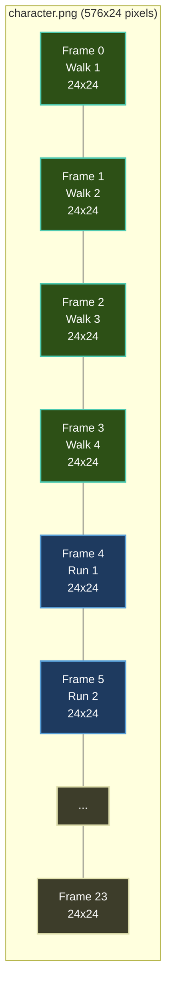
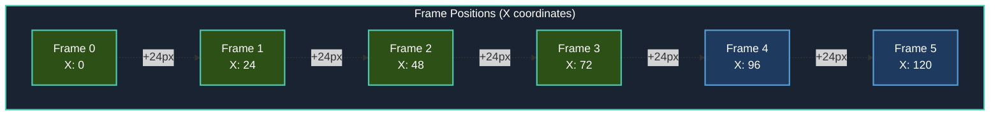
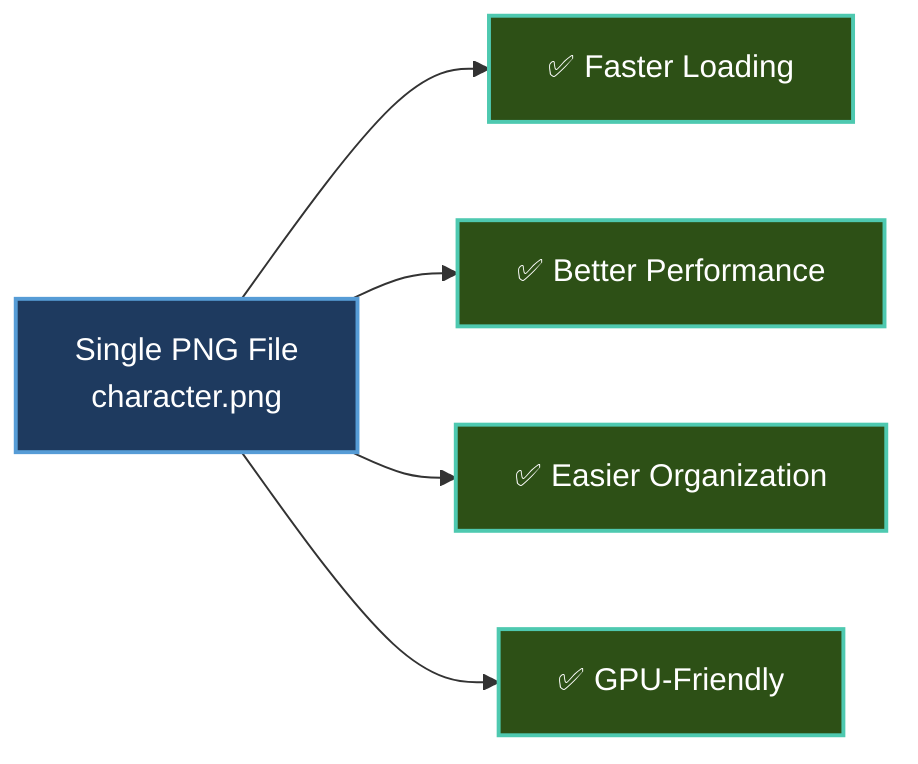

# Animation System

**Difficulty:** Beginner | **Time:** 20 minutes

Learn how to bring your sprites to life with Brine2D's animation system. By the end of this tutorial, you'll have a character with multiple animations (walk, run, jump) that you can switch between.

## What You'll Build

An animated character with:
- Multiple animation clips (walk, run, idle, jump)
- Smooth frame-by-frame animation
- Animation switching with keyboard input
- Pause/resume controls
- Configurable animation speeds

## Prerequisites

- Completed [Moving Sprites](moving-sprites.md) tutorial
- A sprite sheet image (or use placeholder)
- Understanding of sprite rendering and delta time

---

## Understanding Sprite Sheets

A **sprite sheet** is a single image containing multiple animation frames arranged in a grid.

### Visual Layout

Here's what a 576x24 pixel sprite sheet with 24 frames looks like:



Each frame is 24x24 pixels, arranged horizontally in one row.

### Frame Coordinates



### Frame to Rectangle Mapping

| Frame # | X Position | Y Position | Code |
|---------|------------|------------|------|
| 0 | 0 | 0 | `new Rectangle(0, 0, 24, 24)` |
| 1 | 24 | 0 | `new Rectangle(24, 0, 24, 24)` |
| 2 | 48 | 0 | `new Rectangle(48, 0, 24, 24)` |
| 3 | 72 | 0 | `new Rectangle(72, 0, 24, 24)` |
| 4 | 96 | 0 | `new Rectangle(96, 0, 24, 24)` |

### Why Use Sprite Sheets?



**Key Points:**
- ✅ One texture load instead of 24 separate files
- ✅ Fewer texture switches = better GPU performance
- ✅ All frames stay together = easier to manage
- ✅ Standard format used by game engines everywhere

### Example File Structure

```
YourProject/
├── assets/
│   └── sprites/
│       └── character.png    ← ONE PNG file (576x24 pixels)
│                               Contains all 24 frames
├── Program.cs
└── BasicGame.csproj
```

!!! tip "Creating Sprite Sheets"
    **Need a sprite sheet?** Here are some great resources:
    
    - **Free Assets**: [OpenGameArt.org](https://opengameart.org), [Kenney.nl](https://kenney.nl), [itch.io](https://itch.io/game-assets/free)
    - **Pixel Art Tools**: [Aseprite](https://www.aseprite.org/), [Piskel](https://www.piskelapp.com/) (free online)
    - **Sprite Sheet Packers**: [TexturePacker](https://www.codeandweb.com/texturepacker)

### In Code

You load **one PNG file** and tell the system which rectangular section to display:

```csharp
// Load the entire sprite sheet (one file)
_spriteSheet = await _textureLoader.LoadTextureAsync(
    "assets/sprites/character.png",  // ← Your single PNG
    TextureScaleMode.Nearest,
    cancellationToken
);

// Access individual frames by specifying rectangles
var frame0 = new Rectangle(0, 0, 24, 24);    // First frame
var frame1 = new Rectangle(24, 0, 24, 24);   // Second frame
var frame2 = new Rectangle(48, 0, 24, 24);   // Third frame
```

---

## Step 1: Project Setup

We'll build on the Moving Sprites scene.

### Create AnimatedSpriteScene

Create `AnimatedSpriteScene.cs`:

```csharp AnimatedSpriteScene.cs
using Brine2D.Core;
using Brine2D.Core.Animation;
using Brine2D.Input;
using Brine2D.Rendering;
using Microsoft.Extensions.Logging;
using System.Numerics;

namespace MyGame;

public class AnimatedSpriteScene : Scene
{
    private readonly IRenderer _renderer;
    private readonly IInputService _input;
    private readonly ITextureLoader _textureLoader;
    private readonly IGameContext _gameContext;
    private readonly ILoggerFactory _loggerFactory;

    public AnimatedSpriteScene(
        IRenderer renderer,
        IInputService input,
        ITextureLoader textureLoader,
        IGameContext gameContext,
        ILoggerFactory loggerFactory,
        ILogger<AnimatedSpriteScene> logger
    ) : base(logger)
    {
        _renderer = renderer;
        _input = input;
        _textureLoader = textureLoader;
        _gameContext = gameContext;
        _loggerFactory = loggerFactory;
    }

    protected override void OnInitialize()
    {
        Logger.LogInformation("Animated Sprite Scene initialized!");
    }
}
```

---

## Step 2: Loading a Sprite Sheet

Add fields for texture and animator:

```csharp
private ITexture? _spriteSheet;
private SpriteAnimator? _animator;
private Vector2 _position = new Vector2(640, 360);
private float _speed = 200f;
```

Load the sprite sheet in `OnLoadAsync`:

```csharp
protected override async Task OnLoadAsync(CancellationToken cancellationToken)
{
    Logger.LogInformation("Loading sprite sheet...");

    var spriteSheetPath = "assets/sprites/character.png";

    if (File.Exists(spriteSheetPath))
    {
        _spriteSheet = await _textureLoader.LoadTextureAsync(
            spriteSheetPath,
            TextureScaleMode.Nearest, // Important for pixel art!
            cancellationToken
        );
        
        Logger.LogInformation("Sprite sheet loaded: {Width}x{Height}",
            _spriteSheet.Width, _spriteSheet.Height);
    }
    else
    {
        Logger.LogWarning("Sprite sheet not found, using placeholder");
        // 576x24 = 24 frames at 24x24 each
        _spriteSheet = _textureLoader.CreateTexture(576, 24, TextureScaleMode.Nearest);
    }

    // Create the animator (we'll add animations next)
    _animator = new SpriteAnimator(_loggerFactory.CreateLogger<SpriteAnimator>());
}
```

---

## Step 3: Creating Animation Clips

An `AnimationClip` is a collection of frames that play in sequence.

### Method 1: Using FromSpriteSheet (Easy)

For uniform frame sizes:

```csharp
// Add after creating _animator
const int frameWidth = 24;
const int frameHeight = 24;
const int columns = 24;  // Number of frames per row

// Walk animation: frames 0-3 (first 4 frames)
var walkAnim = AnimationClip.FromSpriteSheet(
    name: "walk",
    frameWidth: frameWidth,
    frameHeight: frameHeight,
    frameCount: 4,           // Use 4 frames
    columns: columns,         // 24 frames per row
    frameDuration: 0.15f,    // Each frame lasts 0.15 seconds
    loop: true               // Loop the animation
);

_animator.AddAnimation(walkAnim);
```

**What's happening:**
- `FromSpriteSheet` automatically calculates frame positions
- Frames are read left-to-right, top-to-bottom
- Each frame displays for `frameDuration` seconds

### Method 2: Manual Frame Definition (Flexible)

For non-uniform animations or precise control:

```csharp
// Run animation: frames 4-9
var runAnim = new AnimationClip("run") { Loop = true };

for (int i = 4; i < 10; i++)
{
    var rect = new Rectangle(
        x: i * frameWidth,
        y: 0,
        width: frameWidth,
        height: frameHeight
    );
    
    runAnim.Frames.Add(new SpriteFrame(rect, duration: 0.08f));
}

_animator.AddAnimation(runAnim);
```

**Use manual method when:**
- Frames have different sizes
- You need variable frame durations
- Animation frames aren't in a simple grid

---

## Step 4: Creating Multiple Animations

Let's add a full set of animations:

```csharp
protected override async Task OnLoadAsync(CancellationToken cancellationToken)
{
    // ... sprite sheet loading code ...

    _animator = new SpriteAnimator(_loggerFactory.CreateLogger<SpriteAnimator>());

    const int frameWidth = 24;
    const int frameHeight = 24;
    const int columns = 24;

    // Walk: frames 0-3
    var walkAnim = AnimationClip.FromSpriteSheet(
        "walk", frameWidth, frameHeight, 4, columns, 0.15f, true);

    // Run: frames 4-9
    var runAnim = new AnimationClip("run") { Loop = true };
    for (int i = 4; i < 10; i++)
    {
        runAnim.Frames.Add(new SpriteFrame(
            new Rectangle(i * frameWidth, 0, frameWidth, frameHeight),
            0.08f));
    }

    // Jump: frames 10-12 (one-shot, doesn't loop)
    var jumpAnim = new AnimationClip("jump") { Loop = false };
    for (int i = 10; i < 13; i++)
    {
        jumpAnim.Frames.Add(new SpriteFrame(
            new Rectangle(i * frameWidth, 0, frameWidth, frameHeight),
            0.1f));
    }

    // Idle: single frame (frame 13)
    var idleAnim = new AnimationClip("idle") { Loop = true };
    idleAnim.Frames.Add(new SpriteFrame(
        new Rectangle(13 * frameWidth, 0, frameWidth, frameHeight),
        1.0f)); // Hold for 1 second

    // Add all animations to the animator
    _animator.AddAnimation(walkAnim);
    _animator.AddAnimation(runAnim);
    _animator.AddAnimation(jumpAnim);
    _animator.AddAnimation(idleAnim);

    // Start with idle animation
    _animator.Play("idle");

    Logger.LogInformation("Loaded {Count} animations", 4);
}
```

---

## Step 5: Playing Animations

Use `_animator.Play()` to switch animations:

```csharp
protected override void OnUpdate(GameTime gameTime)
{
    var deltaTime = (float)gameTime.DeltaTime;

    if (_input.IsKeyPressed(Keys.Escape))
    {
        _gameContext.RequestExit();
    }

    // Animation switching
    if (_input.IsKeyPressed(Keys.D1))
    {
        _animator?.Play("idle");
        Logger.LogInformation("Playing: idle");
    }
    if (_input.IsKeyPressed(Keys.D2))
    {
        _animator?.Play("walk");
        Logger.LogInformation("Playing: walk");
    }
    if (_input.IsKeyPressed(Keys.D3))
    {
        _animator?.Play("run");
        Logger.LogInformation("Playing: run");
    }
    if (_input.IsKeyPressed(Keys.D4))
    {
        _animator?.Play("jump");
        Logger.LogInformation("Playing: jump");
    }

    // Update the animator (CRITICAL!)
    _animator?.Update(deltaTime);
}
```

**Key Point:** You MUST call `_animator.Update(deltaTime)` every frame!

---

## Step 6: Rendering Animated Sprites

Now we draw the current animation frame:

```csharp
protected override void OnRender(GameTime gameTime)
{
    _renderer.Clear(new Color(40, 40, 40));
    _renderer.BeginFrame();

    if (_spriteSheet != null && _animator?.CurrentFrame != null)
    {
        var frame = _animator.CurrentFrame;
        var rect = frame.SourceRect;

        // Scale up for visibility (optional)
        var scale = 4.0f;
        var destWidth = rect.Width * scale;
        var destHeight = rect.Height * scale;

        var drawX = _position.X - (destWidth / 2);
        var drawY = _position.Y - (destHeight / 2);

        // Draw the current frame
        _renderer.DrawTexture(
            _spriteSheet,
            rect.X, rect.Y, rect.Width, rect.Height,  // Source rectangle
            drawX, drawY, destWidth, destHeight       // Destination rectangle
        );
    }

    _renderer.EndFrame();
}
```

**What's happening:**
- `_animator.CurrentFrame` gives us the current frame to display
- `frame.SourceRect` tells us where in the sprite sheet to read from
- We draw that portion of the texture to the screen

---

## Step 7: Animation Controls

Add pause/resume and speed controls:

```csharp
protected override void OnUpdate(GameTime gameTime)
{
    var deltaTime = (float)gameTime.DeltaTime;

    if (_input.IsKeyPressed(Keys.Escape))
    {
        _gameContext.RequestExit();
    }

    // Pause/Resume
    if (_input.IsKeyPressed(Keys.Space))
    {
        if (_animator?.IsPlaying == true)
        {
            _animator.Pause();
            Logger.LogInformation("Animation paused");
        }
        else
        {
            _animator?.Resume();
            Logger.LogInformation("Animation resumed");
        }
    }

    // Speed control
    if (_animator != null)
    {
        if (_input.IsKeyDown(Keys.LeftShift))
        {
            _animator.Speed = 2.0f; // 2x faster
        }
        else if (_input.IsKeyDown(Keys.LeftControl))
        {
            _animator.Speed = 0.5f; // Half speed (slow-mo)
        }
        else
        {
            _animator.Speed = 1.0f; // Normal speed
        }
    }

    // Animation switching (1-4 keys)
    if (_input.IsKeyPressed(Keys.D1)) _animator?.Play("idle");
    if (_input.IsKeyPressed(Keys.D2)) _animator?.Play("walk");
    if (_input.IsKeyPressed(Keys.D3)) _animator?.Play("run");
    if (_input.IsKeyPressed(Keys.D4)) _animator?.Play("jump");

    _animator?.Update(deltaTime);
}
```

---

## Step 8: Movement with Animation

Let's make the character move AND animate:

```csharp
protected override void OnUpdate(GameTime gameTime)
{
    var deltaTime = (float)gameTime.DeltaTime;

    if (_input.IsKeyPressed(Keys.Escape))
    {
        _gameContext.RequestExit();
    }

    // Calculate movement
    var movement = Vector2.Zero;
    if (_input.IsKeyDown(Keys.W)) movement.Y -= 1;
    if (_input.IsKeyDown(Keys.S)) movement.Y += 1;
    if (_input.IsKeyDown(Keys.A)) movement.X -= 1;
    if (_input.IsKeyDown(Keys.D)) movement.X += 1;

    // Choose animation based on movement
    if (movement != Vector2.Zero)
    {
        movement = Vector2.Normalize(movement);
        _position += movement * _speed * deltaTime;

        // Run if holding Shift, otherwise walk
        if (_input.IsKeyDown(Keys.LeftShift))
        {
            _animator?.Play("run");
        }
        else
        {
            _animator?.Play("walk");
        }
    }
    else
    {
        // Not moving, play idle
        _animator?.Play("idle");
    }

    // Jump animation (overrides movement)
    if (_input.IsKeyPressed(Keys.Space))
    {
        _animator?.Play("jump");
    }

    _animator?.Update(deltaTime);
}
```

---

## Complete Code

Here's the full `AnimatedSpriteScene.cs`:

```csharp AnimatedSpriteScene.cs
using Brine2D.Core;
using Brine2D.Core.Animation;
using Brine2D.Input;
using Brine2D.Rendering;
using Microsoft.Extensions.Logging;
using System.Numerics;

namespace MyGame;

public class AnimatedSpriteScene : Scene
{
    private readonly IRenderer _renderer;
    private readonly IInputService _input;
    private readonly ITextureLoader _textureLoader;
    private readonly IGameContext _gameContext;
    private readonly ILoggerFactory _loggerFactory;

    private ITexture? _spriteSheet;
    private SpriteAnimator? _animator;
    private Vector2 _position = new Vector2(640, 360);
    private float _speed = 200f;

    public AnimatedSpriteScene(
        IRenderer renderer,
        IInputService input,
        ITextureLoader textureLoader,
        IGameContext gameContext,
        ILoggerFactory loggerFactory,
        ILogger<AnimatedSpriteScene> logger
    ) : base(logger)
    {
        _renderer = renderer;
        _input = input;
        _textureLoader = textureLoader;
        _gameContext = gameContext;
        _loggerFactory = loggerFactory;
    }

    protected override void OnInitialize()
    {
        Logger.LogInformation("Animated Sprite Scene initialized!");
        Logger.LogInformation("Controls:");
        Logger.LogInformation("  WASD - Move");
        Logger.LogInformation("  Shift - Run");
        Logger.LogInformation("  Space - Jump");
        Logger.LogInformation("  1-4 - Manual animation select");
        Logger.LogInformation("  ESC - Exit");
    }

    protected override async Task OnLoadAsync(CancellationToken cancellationToken)
    {
        Logger.LogInformation("Loading sprite sheet...");

        var spriteSheetPath = "assets/sprites/character.png";

        if (File.Exists(spriteSheetPath))
        {
            _spriteSheet = await _textureLoader.LoadTextureAsync(
                spriteSheetPath,
                TextureScaleMode.Nearest,
                cancellationToken
            );
            
            Logger.LogInformation("Sprite sheet loaded: {Width}x{Height}",
                _spriteSheet.Width, _spriteSheet.Height);
        }
        else
        {
            Logger.LogWarning("Sprite sheet not found, using placeholder");
            _spriteSheet = _textureLoader.CreateTexture(576, 24, TextureScaleMode.Nearest);
        }

        _animator = new SpriteAnimator(_loggerFactory.CreateLogger<SpriteAnimator>());

        const int frameWidth = 24;
        const int frameHeight = 24;
        const int columns = 24;

        // Walk: frames 0-3
        var walkAnim = AnimationClip.FromSpriteSheet(
            "walk", frameWidth, frameHeight, 4, columns, 0.15f, true);

        // Run: frames 4-9
        var runAnim = new AnimationClip("run") { Loop = true };
        for (int i = 4; i < 10; i++)
        {
            runAnim.Frames.Add(new SpriteFrame(
                new Rectangle(i * frameWidth, 0, frameWidth, frameHeight),
                0.08f));
        }

        // Jump: frames 10-12
        var jumpAnim = new AnimationClip("jump") { Loop = false };
        for (int i = 10; i < 13; i++)
        {
            jumpAnim.Frames.Add(new SpriteFrame(
                new Rectangle(i * frameWidth, 0, frameWidth, frameHeight),
                0.1f));
        }

        // Idle: frame 13
        var idleAnim = new AnimationClip("idle") { Loop = true };
        idleAnim.Frames.Add(new SpriteFrame(
            new Rectangle(13 * frameWidth, 0, frameWidth, frameHeight),
            1.0f));

        _animator.AddAnimation(walkAnim);
        _animator.AddAnimation(runAnim);
        _animator.AddAnimation(jumpAnim);
        _animator.AddAnimation(idleAnim);

        _animator.Play("idle");

        Logger.LogInformation("Loaded {Count} animations", 4);
    }

    protected override void OnUpdate(GameTime gameTime)
    {
        var deltaTime = (float)gameTime.DeltaTime;

        if (_input.IsKeyPressed(Keys.Escape))
        {
            _gameContext.RequestExit();
        }

        // Manual animation selection (1-4 keys)
        if (_input.IsKeyPressed(Keys.D1)) _animator?.Play("idle");
        if (_input.IsKeyPressed(Keys.D2)) _animator?.Play("walk");
        if (_input.IsKeyPressed(Keys.D3)) _animator?.Play("run");
        if (_input.IsKeyPressed(Keys.D4)) _animator?.Play("jump");

        // Movement-based animation
        var movement = Vector2.Zero;
        if (_input.IsKeyDown(Keys.W)) movement.Y -= 1;
        if (_input.IsKeyDown(Keys.S)) movement.Y += 1;
        if (_input.IsKeyDown(Keys.A)) movement.X -= 1;
        if (_input.IsKeyDown(Keys.D)) movement.X += 1;

        if (movement != Vector2.Zero)
        {
            movement = Vector2.Normalize(movement);
            _position += movement * _speed * deltaTime;

            // Only auto-play movement animations if not manually selected
            if (!_input.IsKeyPressed(Keys.D1) && 
                !_input.IsKeyPressed(Keys.D2) && 
                !_input.IsKeyPressed(Keys.D3) && 
                !_input.IsKeyPressed(Keys.D4))
            {
                if (_input.IsKeyDown(Keys.LeftShift))
                {
                    _animator?.Play("run");
                }
                else
                {
                    _animator?.Play("walk");
                }
            }
        }
        else if (!_input.IsKeyPressed(Keys.D1) && 
                 !_input.IsKeyPressed(Keys.D2) && 
                 !_input.IsKeyPressed(Keys.D3) && 
                 !_input.IsKeyPressed(Keys.D4))
        {
            _animator?.Play("idle");
        }

        // Jump overrides other animations
        if (_input.IsKeyPressed(Keys.Space))
        {
            _animator?.Play("jump");
        }

        _animator?.Update(deltaTime);
    }

    protected override void OnRender(GameTime gameTime)
    {
        _renderer.Clear(new Color(40, 40, 40));
        _renderer.BeginFrame();

        if (_spriteSheet != null && _animator?.CurrentFrame != null)
        {
            var frame = _animator.CurrentFrame;
            var rect = frame.SourceRect;

            var scale = 4.0f;
            var destWidth = rect.Width * scale;
            var destHeight = rect.Height * scale;

            var drawX = _position.X - (destWidth / 2);
            var drawY = _position.Y - (destHeight / 2);

            _renderer.DrawTexture(
                _spriteSheet,
                rect.X, rect.Y, rect.Width, rect.Height,
                drawX, drawY, destWidth, destHeight);
        }

        _renderer.EndFrame();
    }

    protected override Task OnUnloadAsync(CancellationToken cancellationToken)
    {
        if (_spriteSheet != null)
        {
            _textureLoader.UnloadTexture(_spriteSheet);
        }

        return Task.CompletedTask;
    }
}
```

---

## Animation System Deep Dive

### How SpriteAnimator Works

1. **You add animations**: `_animator.AddAnimation(clip)`
2. **You play an animation**: `_animator.Play("walk")`
3. **Update advances frames**: `_animator.Update(deltaTime)`
4. **You render the current frame**: `_animator.CurrentFrame`

### Frame Timing

```csharp
// Each frame displays for its duration
frameTimer += deltaTime;

if (frameTimer >= currentFrame.Duration)
{
    frameTimer -= currentFrame.Duration;
    currentFrameIndex++;
}
```

### Loop vs One-Shot

```csharp
var loopingAnim = new AnimationClip("walk") { Loop = true };   // Repeats
var oneShotAnim = new AnimationClip("jump") { Loop = false };  // Plays once
```

When a one-shot animation finishes, `IsPlaying` becomes false.

---

## Challenges

### Easy
1. **More animations** - Add crouch, hurt, or attack animations
2. **Animation speed** - Experiment with different frame durations
3. **Direction flipping** - Flip the sprite horizontally when moving left

### Medium
4. **Animation events** - Trigger sound effects when certain frames play
5. **Blend animations** - Smoothly transition between animations
6. **Animation queuing** - Queue the next animation to play after current finishes

### Hard
7. **State machine** - Build a proper animation state machine with transitions
8. **Multi-layer animation** - Animate body and legs separately
9. **Procedural animation** - Generate animations at runtime

---

## What You Learned

✅ **Sprite sheets** - Organizing multiple frames in one texture  
✅ **AnimationClip** - Creating frame-based animations  
✅ **SpriteAnimator** - Managing and playing animations  
✅ **Frame timing** - Using delta time for smooth playback  
✅ **Animation control** - Play, pause, resume, speed control  
✅ **State-driven animation** - Choosing animations based on game state  
✅ **Loop vs one-shot** - Different animation behaviors

---

## Next Steps

Ready for more? Check out:

- **[Collision Detection](collision.md)** - Make your animated character interact with the world
- **[Building a Platformer](platformer.md)** - Combine movement, animation, and physics
- **[Animation Guide](../guides/rendering/animations.md)** - Advanced animation techniques
- **[Sprite Guide](../guides/rendering/sprites.md)** - More sprite rendering tricks

---

## Common Issues

### Animation not playing?
- Did you call `_animator.Update(deltaTime)` in `OnUpdate`?
- Check if the animation name is correct
- Verify frames were added to the clip

### Animation too fast/slow?
- Adjust `frameDuration` in each frame
- Or use `_animator.Speed` to change playback speed globally

### Wrong frames showing?
- Double-check your frame indices and sprite sheet layout
- Verify `frameWidth`, `frameHeight`, and `columns` are correct
- Use a sprite sheet viewer tool to confirm frame positions

### Animation stutters?
- Make sure you're using `deltaTime` correctly
- Check frame rate is consistent (enable VSync)
- Verify frame durations add up correctly

---

Great job! You've mastered sprite animation in Brine2D. Your characters are now ready to come alive!