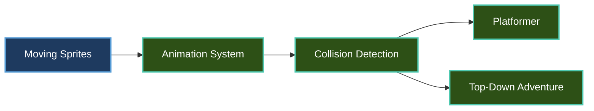

# Tutorials

Welcome to the Brine2D tutorials! These hands-on guides will take you from basic concepts to building complete game systems. Each tutorial includes working code examples and explains the "why" behind each step.

## Learning Path

We recommend following these tutorials in order, but feel free to jump to topics that interest you most.



---

## Available Tutorials

### [Moving Sprites](moving-sprites.md)
**Difficulty:** Beginner | **Time:** 15 minutes

Learn the fundamentals of sprite rendering in Brine2D. You'll load textures, draw sprites, and create smooth movement with delta time.

**What you'll learn:**

- Loading textures with `ITextureLoader`
- Drawing sprites at screen positions
- Handling keyboard input for movement
- Using delta time for frame-rate independent motion
- Working with `Vector2` for positions

**Prerequisites:** Completed [Quick Start](../getting-started/quickstart.md)

---

### [Animation System](animations.md)

**Difficulty:** Beginner | **Time:** 20 minutes

Master Brine2D's sprite animation system. Create walking, running, and action animations from sprite sheets.

**What you'll learn:**

- Loading sprite sheets
- Creating `AnimationClip` objects
- Using `SpriteAnimator` to play animations
- Switching between animations (walk, run, jump)
- Controlling animation speed and looping

**Prerequisites:** [Moving Sprites](moving-sprites.md)

**Key Concepts:**

- Sprite sheets and frame extraction
- Animation clips with multiple frames
- Frame duration and timing
- Looping vs one-shot animations

---

### [Collision Detection](collision.md)
**Difficulty:** Intermediate | **Time:** 30 minutes

Implement collision detection and response using Brine2D's collision system. Build interactive objects and solid walls.

**What you'll learn:**

- Understanding `CollisionSystem`
- Creating `BoxCollider` and `CircleCollider` shapes
- Detecting collisions between objects
- Implementing collision response (blocking, sliding)
- Building a coin collection system

**Prerequisites:** [Animation System](animations.md)

**Key Concepts:**

- Collision shapes (boxes and circles)
- Collision detection algorithms
- Separation and penetration
- Trigger vs solid collisions

---

### [Building a Platformer](platformer.md)
**Difficulty:** Intermediate | **Time:** 45 minutes

Create a complete 2D platformer with jumping, gravity, and platform collision. This tutorial combines everything you've learned.

**What you'll learn:**

- Implementing gravity and jumping
- Platform collision (top-only platforms)
- Tilemap loading with Tiled
- Camera following the player
- Parallax scrolling backgrounds
- Game state management (lives, score)

**Prerequisites:** [Collision Detection](collision.md)

**Covers:**

- Physics simulation (gravity, velocity, acceleration)
- Tilemap rendering and collision
- Camera systems with `Camera2D`
- Scene management for multiple levels

---

### [Top-Down Adventure](top-down.md)
**Difficulty:** Intermediate | **Time:** 45 minutes

Build a top-down adventure game with 8-directional movement, NPCs, and dialogue. Perfect for RPG-style games.

**What you'll learn:**

- 8-directional movement and animation
- NPC interaction system
- Dialogue boxes with text rendering
- Inventory management
- Tilemap-based world design
- Trigger zones and events

**Prerequisites:** [Collision Detection](collision.md)

**Covers:**

- Grid-based movement
- State machines for NPCs
- UI system for dialogue
- Event-driven interactions

---

## Tutorial Code

All tutorial code is available in the [samples/BasicGame](https://github.com/CrazyPickleStudios/Brine2D/tree/main/samples/BasicGame) directory:

- `AnimationDemoScene.cs` - Animation system demo
- `CameraDemoScene.cs` - Camera following and zoom
- `CollisionDemoScene.cs` - Collision detection and UI

You can run these demos to see the final results before starting each tutorial.

---

## Tips for Learning

### 1. **Run the Code First**
Before reading each tutorial, run the demo scene to see what you're building. Understanding the end goal helps you learn faster.

### 2. **Experiment and Break Things**
After completing a tutorial, modify the code:
- Change animation speeds
- Add more collision objects
- Adjust physics parameters

Breaking things teaches you how they work!

### 3. **Use the Logger**
Brine2D uses `ILogger<T>` for debugging. Add log messages to understand execution flow:

```csharp
Logger.LogInformation("Player collided with {Object}", collision.Name);
```

### 4. **Read the API Docs**
Each tutorial references API documentation. Open them side-by-side:
- [Core API](../api/core.md)
- [Rendering API](../api/rendering.md)
- [Input API](../api/input.md)

### 5. **Ask Questions**
Stuck? Check out:
- [Common Issues](../getting-started/troubleshooting.md)
- [GitHub Discussions](https://github.com/CrazyPickleStudios/Brine2D/discussions)
- [Discord Community](https://discord.gg/brine2d) *(coming soon)*

---

## After the Tutorials

Once you've completed these tutorials, you'll be ready to:

1. **Build Your Own Game** - You have all the tools!
2. **Explore Advanced Guides** - Check out [Guides](../guides/index.md) for deeper topics
3. **Study the Samples** - See [Samples](../samples/index.md) for complete game examples
4. **Contribute** - Help improve Brine2D! See [Contributing](../contributing/index.md)

---

## What's Included in Each Tutorial

Every tutorial follows the same structure:

| Section | Description |
|---------|-------------|
| **Overview** | What you'll build and why it matters |
| **Prerequisites** | What you need to know first |
| **Setup** | Project setup and dependencies |
| **Step-by-Step** | Guided implementation with explanations |
| **Complete Code** | Full working example |
| **Challenges** | Exercises to extend what you learned |
| **Next Steps** | Where to go from here |

---

## Ready to Start?

Jump into [Moving Sprites](moving-sprites.md) to begin your Brine2D journey, or pick any tutorial that interests you!

Happy game dev!